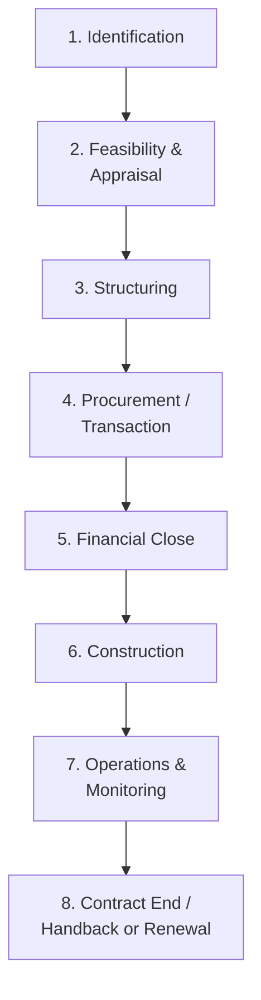
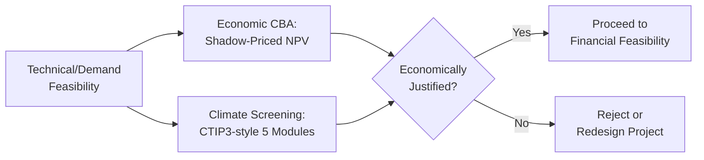
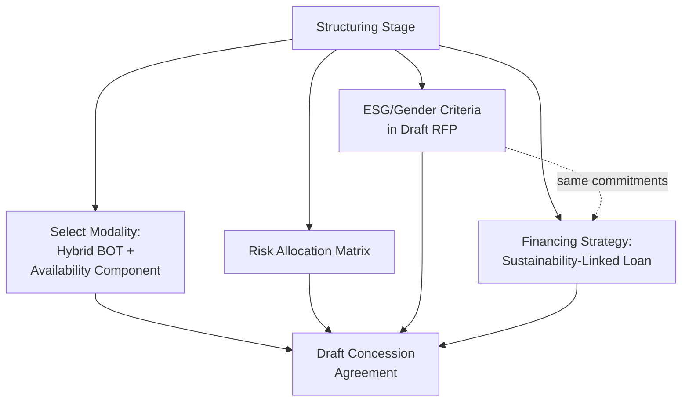
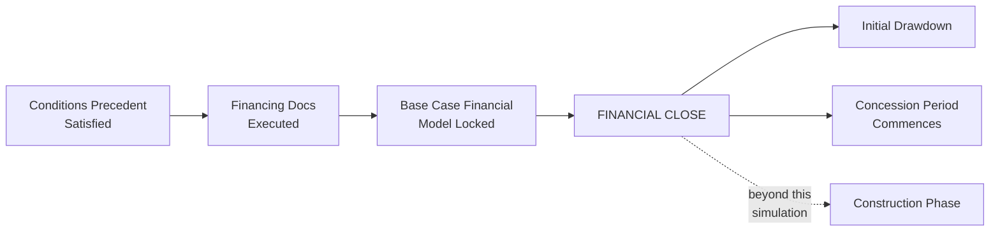

## End-to-End Case Simulation from Identification to Financial Close

### Overview

This item synthesizes the full Public-Private Partnership (PPP) project cycle into a single continuous worked case simulation, tracing one hypothetical project from initial concept through to financial close. Where prior chapter items addressed individual analytical techniques and thematic considerations (Cost-Benefit Analysis, Monte Carlo simulation, climate toolkits, ESG bid criteria, gender-informed design) in isolation, this simulation demonstrates how those techniques and considerations are sequenced, interact, and build upon one another within a single live transaction — showing where each prior topic's output becomes the next stage's input.

The case selected is a **municipal solid waste-to-energy (WtE) PPP** for a mid-sized city, chosen because it plausibly requires engagement with climate/emissions considerations, ESG bid criteria, quantitative appraisal, and standard risk-allocation and financing structuring — allowing the simulation to touch each thread from this syllabus.

### The Standard PPP Project Cycle (Reference Structure)

This simulation covers Stages 1 through 5 in detail, since financial close is the item's specified endpoint; construction and operations are referenced only where they inform decisions made in earlier stages.

### Stage 1 — Identification

**Scenario Setup**

The city government identifies that its existing open dumpsite will reach capacity within four years, current waste collection covers only 65% of generated municipal solid waste (MSW), and the national energy regulator has recently introduced a feed-in tariff for waste-to-energy generation. The city's Local Development Council places a WtE PPP on its Public Investment Program pipeline as a candidate project.

**Key Points**

- Identification requires a preliminary problem statement (dumpsite capacity, collection gap) and a preliminary rationale for PPP delivery specifically (the city's own capital budget cannot fund a WtE facility, and international WtE technology and operating expertise reside predominantly with specialized private operators) — establishing the PPP screening rationale before any detailed technical work begins.
- A preliminary sector and site scan is conducted at this stage: is there a technically credible site with adequate waste catchment, grid interconnection proximity, and community acceptance prospects? This scan draws on the same site-selection logic referenced under Just Transition Considerations in Energy PPPs, adapted here to a waste-sector rather than fossil-fuel-transition context.
- The project is registered with the national or provincial PPP center/authority (where such a body exists) as a preliminary step toward accessing project development facility support, since WtE feasibility studies of adequate technical rigor typically exceed what a mid-sized city's own budget can fund unassisted.

### Stage 2 — Feasibility and Appraisal

**2a. Technical and Demand Feasibility**

Engineering consultants assess waste composition (calorific value, moisture content) to confirm WtE technical viability, and project a 20-year waste generation forecast based on population growth and per-capita waste generation trends — explicitly building in an **optimism bias adjustment** to the demand forecast, consistent with the standard practice noted under Cost-Benefit Analysis and Shadow Pricing Techniques, given the historical tendency of infrastructure demand forecasts to run optimistic.

**2b. Economic Appraisal (Cost-Benefit Analysis)**

The economic team constructs a shadow-priced Cost-Benefit Analysis:

$$NPV_{economic} = \sum_{t=0}^{20} \frac{B_t - C_t}{(1+r)^t}$$

- **Costs** are shadow-priced: imported WtE turbine and boiler equipment (a tradable good) at border price with an appropriate conversion factor; local construction labor shadow-priced using a Shadow Wage Rate reflecting regional underemployment; local materials at the Standard Conversion Factor.
- **Benefits** are quantified as: avoided dumpsite externality costs (groundwater contamination, methane emissions, informal waste-picker health risk), avoided landfill airspace consumption value, electricity generation value at the shadow price of power, and avoided GHG emissions valued at the applicable Social Cost of Carbon.
- The economic discount rate applied follows the national planning authority's official Social Discount Rate (or, absent one, a standard MDB-convention rate), as discussed under Cost-Benefit Analysis and Shadow Pricing Techniques.

**2c. Climate Screening (CTIP3-Style Toolkit Application)**

Applying the Umbrella Toolkit logic from Climate Toolkits for Infrastructure and Adaptation Planning, the project team runs a five-module screening: policy alignment (does WtE align with the national waste and climate policy?), a preliminary GHG lifecycle assessment (net emissions from WtE combustion versus avoided landfill methane — a materially important calculation since the net climate benefit of WtE depends heavily on this comparison), climate risk and adaptation planning (flood exposure of the proposed site, given WtE facilities' sensitivity to flood-related equipment damage and service interruption), economic implications of resilience measures (elevated equipment platforms, backup drainage), and preliminary KPIs for future monitoring.

**2d. Financial Feasibility and Monte Carlo Risk Analysis**

A financial model is built projecting the Special Purpose Vehicle's (SPV) revenue (feed-in tariff payments plus a municipal tipping fee) against project costs, producing a base-case Equity IRR. Following the Monte Carlo Simulation methodology addressed elsewhere in this chapter, uncertain inputs — waste volume delivered (a PERT distribution reflecting collection-efficiency uncertainty), construction cost overrun, and feed-in tariff regulatory stability — are simulated across 10,000 iterations using Latin Hypercube Sampling, producing a probability distribution around the base-case Equity IRR and a calculated probability that the project falls below the sponsor's minimum hurdle rate. This simulation directly informs whether a Minimum Waste Delivery Guarantee from the city (addressing the demand-risk finding highlighted under Econometric Analysis of PPP Performance and Outcomes, where private retention of full demand risk has been associated with elevated renegotiation probability) should be built into the risk allocation.

**2e. Value for Money Test**

A Public Sector Comparator is constructed per the logic in Comparative Statistical Analysis of PPP versus Traditional Procurement Outcomes, modeling the risk-adjusted cost of the city procuring and operating a WtE facility directly, for comparison against the anticipated PPP structure's risk-adjusted cost, to test whether PPP delivery offers positive Value for Money before proceeding.

### Stage 3 — Structuring

**3a. Selecting the PPP Modality**

Given the revenue-generating nature of the asset (tariff and tipping fee income) combined with meaningful demand-risk sensitivity identified in the Monte Carlo analysis, the structuring team selects a **Build-Operate-Transfer (BOT)** concession with a partial availability-payment component (a fixed tipping fee per tonne regardless of energy output, layered with a variable feed-in tariff revenue stream) — a hybrid structure balancing full demand-risk transfer against the renegotiation risk that pure demand-risk transfer has been empirically associated with.

**3b. Risk Allocation Matrix**

A risk matrix is developed allocating: construction cost and schedule risk to the private concessionaire (subject to a defined force majeure carve-out); waste-composition risk partially retained by the city (with a defined calorific-value band outside of which tariff adjustment mechanisms apply); climate/flood risk mitigated through the resilience design measures identified in Stage 2c, with residual risk allocation negotiated based on which party can most cost-effectively insure or absorb it; and regulatory/tariff risk allocated to the government to the extent it involves the feed-in tariff framework the government itself controls.

**3c. Embedding ESG and Gender Criteria into Draft Tender Documents**

Following the Environmental, Social, and Governance Criteria in Bid Evaluation framework, the draft Request for Proposal (RFP) sets: a mandatory pass/fail ESG compliance threshold (IFC Performance Standards alignment, exclusion of prohibited waste-import practices), plus weighted scoring ($w_e = 0.15$ of total composite score) for above-threshold environmental performance (net GHG reduction beyond the regulatory minimum) and social commitments (local hiring, informal waste-picker livelihood transition support — directly analogous to the Just Transition worker-transition logic, applied here to informal waste-sector workers displaced by formalized WtE operations rather than fossil-fuel workers). Following Gender-Informed and Inclusive PPP Design, the RFP also requires a disaggregated baseline assessment of women's participation in the existing informal waste-picking economy and a contractual female-employment target in the formalized facility's workforce.

**3d. Financing Strategy**

The financial advisor recommends the SPV pursue senior debt structured as a **Sustainability-Linked Loan**, per the Green Bonds and Sustainability-Linked Financing framework, with Sustainability Performance Targets tied to net GHG emissions reduction relative to the avoided-landfill baseline and to the informal-worker transition employment target — creating financial-cost alignment with the same ESG and Just Transition commitments embedded in the tender documents, rather than treating financing terms and sustainability commitments as separate, disconnected tracks.

### Stage 4 — Procurement and Transaction

**4a. Market Sounding and RFQ**

A Request for Qualifications is issued to prequalify technically and financially capable bidders (WtE technology track record, minimum project finance experience), narrowing the field before the more resource-intensive RFP stage.

**4b. RFP Issuance and Bid Evaluation**

Prequalified bidders submit technical and financial proposals under a two-envelope system. The technical envelope is scored per the weighted formula from Environmental, Social, and Governance Criteria in Bid Evaluation:

$$\text{Total Score} = w_f \cdot S_f + w_t \cdot S_t + w_e \cdot S_e$$

with the ESG sub-score ($S_e$) further disaggregated across environmental, social (including gender and just-transition sub-elements), and governance criteria as detailed in Stage 3c. The independent evaluation committee includes dedicated environmental and social specialists, consistent with the anti-gaming safeguards discussed under the ESG bid-evaluation topic.

**4c. Preferred Bidder Selection and Negotiation**

The highest composite-scoring bidder is selected as Preferred Bidder, and final negotiation confirms that all winning ESG, gender, and Just Transition commitments scored during evaluation are transposed verbatim into the draft Concession Agreement's binding technical specifications and KPI schedule — directly applying the "convert commitments into enforceable obligations" safeguard emphasized in the ESG bid-evaluation topic, since an unenforced tender promise carries no practical value.

### Stage 5 — Financial Close

**5a. Conditions Precedent**

Standard conditions precedent are satisfied: final environmental and social impact assessment approval, all required permits (site, interconnection, waste-processing license), executed Concession Agreement, and executed financing documentation (loan agreements, equity subscription agreements, security documents).

**5b. Financing Documentation Execution**

The Sustainability-Linked Loan facility agreement is executed, with the agreed margin ratchet mechanism (as illustrated in Green Bonds and Sustainability-Linked Financing) formally incorporating the negotiated Sustainability Performance Targets and their independent verification protocol.

**5c. Final Model Sign-Off**

The financial model — incorporating the shadow-priced economic case, the Monte Carlo-tested financial case, and the finalized financing terms — is agreed and locked between sponsors and lenders as the base case financial model governing future covenant compliance testing (including the Minimum Debt Service Coverage Ratio monitoring framework referenced under Monte Carlo Simulation for Project Risk Modeling).

**5d. Financial Close**

All conditions precedent are satisfied, financing documentation becomes effective, initial drawdown occurs, and the concession period officially commences — marking the transition from transaction structuring into the construction phase, which lies beyond this simulation's specified endpoint.

### Cross-Referencing Summary: Where Each Prior Topic Enters the Simulation

| PPP Cycle Stage | Chapter Topics Applied |
| --- | --- |
| Identification | Preliminary sector/site screening logic (parallels Just Transition site-selection considerations) |
| Feasibility & Appraisal | Cost-Benefit Analysis and Shadow Pricing; Climate Toolkits (CTIP3-style screening); Monte Carlo Simulation; Comparative Statistical Analysis (PSC/VfM test) |
| Structuring | Risk allocation informed by Econometric Analysis findings on demand-risk/renegotiation; ESG Criteria in Bid Evaluation; Gender-Informed Design; Just Transition (informal-worker analogue); Green Bonds and Sustainability-Linked Financing |
| Procurement/Transaction | ESG-weighted bid evaluation formula; anti-gaming/verification safeguards |
| Financial Close | Sustainability-linked financing documentation; locked base-case model incorporating shadow-priced and simulated figures |

### Key Lessons from the Integrated Simulation

**Key Points**

- **Sequencing matters**: Climate screening and economic appraisal (Stage 2) must precede structuring (Stage 3), since the risk allocation and financing strategy decisions in Stage 3 are directly informed by the risk profile and climate exposure identified earlier — attempting to structure risk allocation before completing this upstream analysis risks misallocating risk to the wrong party or omitting a material risk entirely.
- **Bid-stage commitments are only as valuable as their contractual enforceability**: A recurring theme across ESG, gender, and Just Transition topics in this chapter is that scoring criteria at bid evaluation must convert into binding, monitored contract obligations at financial close — this simulation demonstrates that linkage concretely by tracing specific Stage 3c/4b commitments through to the Stage 5c locked base-case model and ongoing KPI framework.
- **Financing structure can reinforce, not just fund, sustainability commitments**: Selecting a Sustainability-Linked Loan with SPTs mirroring the tender's ESG and Just Transition commitments (rather than an unrelated generic KPI set) creates a coherent incentive structure across the contract and financing documents, rather than two independent and potentially misaligned commitment tracks.
- **Quantitative and qualitative analysis are interdependent, not sequential silos**: The Monte Carlo-simulated probability of hurdle-rate shortfall in Stage 2d directly shaped the Stage 3a modality choice (hybrid BOT rather than pure demand-risk BOT) — illustrating that quantitative risk analysis outputs are decision inputs for structuring choices, not a standalone reporting exercise disconnected from subsequent transaction design.

**[Inference]** Because this is a synthesized illustrative case rather than a documented real-world transaction, the specific figures, sequencing details, and structuring choices presented are a plausible composite constructed for pedagogical purposes; a genuine transaction's actual sequencing, risk allocation, and financing terms would need to be verified against that specific project's own feasibility study, transaction advisor recommendations, and negotiated contract documents rather than assumed to replicate this illustrative simulation.

**Next Steps**

- Construct a full worked financial model spreadsheet implementing the Stage 2b–2d calculations for a specific real or illustrative WtE project
- Draft sample RFP evaluation-criteria language and Concession Agreement KPI schedule clauses implementing the Stage 3c/4c commitments concretely
- Extend the simulation beyond financial close into the construction and operations monitoring stages to complete the full project cycle
- Apply the same end-to-end simulation structure to a different sector (e.g., a water utility or transport PPP) to test how sequencing and topic integration differs by sector
- Review a documented real-world WtE or comparable PPP transaction's actual feasibility study and financial close documentation as a benchmark against this illustrative simulation