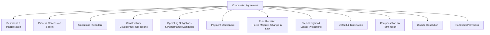
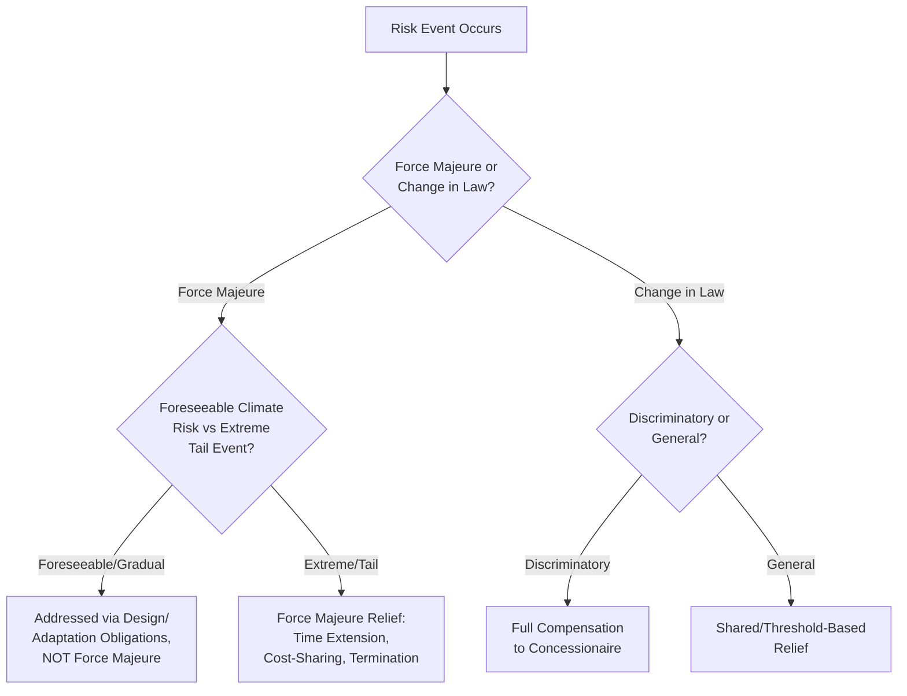

## Drafting Core Provisions of a Concession Agreement

### Overview

A Concession Agreement is the primary legal instrument governing a Public-Private Partnership (PPP), setting out the rights, obligations, risk allocation, and payment mechanisms binding the procuring authority (grantor) and the private party (concessionaire/Special Purpose Vehicle, or SPV) for the life of the contract. Where earlier chapter items addressed *what* substantive content should go into a PPP transaction (climate risk allocation, ESG commitments, financing structure, quantitative appraisal outputs), this topic addresses the specific legal drafting mechanics by which that substance is converted into enforceable contractual provisions — the direct implementation layer for commitments discussed throughout this syllabus.

This item does not provide legal advice or a jurisdiction-specific contract template; it surveys the standard core provisions found across most concession agreement precedents internationally, the drafting logic behind each, and common pitfalls, while noting that the enforceable legal form of any specific clause must be settled by qualified legal counsel under the governing law of the specific transaction.

### Standard Concession Agreement Architecture

### 1. Grant of Concession and Term

**Key Points**

- The grant clause is the operative provision conferring the concessionaire's right to finance, build (if applicable), operate, and derive revenue from the asset for a defined period — typically expressed as an exclusive or non-exclusive right, with exclusivity scope (geographic, sectoral) explicitly bounded to avoid ambiguity that could later trigger disputes over competing infrastructure.
- **Concession term length** must balance the concessionaire's need for sufficient time to recover capital investment and earn a reasonable return against the public interest in the asset reverting to public control or re-tender within a reasonable horizon; term length is frequently calibrated directly from the financial model's projected payback period plus a return-generating operating tail, linking this drafting decision back to the financial feasibility work discussed under Cost-Benefit Analysis and Monte Carlo Simulation elsewhere in this chapter.
- Some concession agreements include a **term extension or flexible-term mechanism** (e.g., a Least Present Value of Revenue, LPVR, structure) under which the term automatically adjusts based on actual realized revenue rather than being fixed ex-ante — a structural response to the demand-forecast uncertainty highlighted under both Cost-Benefit Analysis and Monte Carlo Simulation topics, since a flexible term can absorb demand risk without requiring contract renegotiation when forecasts prove inaccurate.

### 2. Conditions Precedent

Conditions precedent (CPs) are the enumerated requirements that must be satisfied before the concession agreement becomes binding or before financial close can occur, typically including: all required permits and licenses obtained; environmental and social impact assessment approval; executed financing documentation; equity subscription commitments confirmed; and, where applicable, resettlement or land-acquisition completion to an agreed threshold. A well-drafted CP schedule specifies a **long-stop date** — a deadline by which all CPs must be satisfied or the agreement automatically terminates without penalty to either party — protecting both sides from indefinite limbo while permits or financing remain pending.

### 3. Construction/Development Obligations

For greenfield or Build-Operate-Transfer (BOT)-style concessions, this section specifies: technical design and construction standards (often incorporating detailed technical schedules or referencing international engineering codes); a construction milestone schedule with defined completion dates; testing and commissioning procedures confirming the asset meets specified performance standards before entering the operations phase; and liquidated damages provisions for construction delay, typically expressed as a fixed sum per day of delay up to a specified cap, compensating the grantor for the delayed availability of public benefit without requiring proof of actual quantified loss for each day.

**Example**

A liquidated damages clause might read (in substance, not verbatim legal language): for each day of delay beyond the agreed Commercial Operations Date, the concessionaire pays a fixed daily sum reflecting the estimated public cost of delayed service availability, capped at a percentage of total project cost, with the cap calibrated to remain a genuine pre-estimate of loss rather than a punitive penalty — since many governing legal systems distinguish enforceable liquidated damages from unenforceable penalty clauses based on whether the sum represents a genuine pre-estimate of loss.

### 4. Operating Obligations and Performance Standards

**Key Points**

- This section establishes the **Key Performance Indicators (KPIs)** the concessionaire must meet during operations — service availability, quality standards, response times for defects, and, where applicable, the climate-resilience, ESG, and gender-related KPIs discussed under this syllabus's Climate Resilience and ESG chapter, which should be transposed here verbatim from whatever commitments were scored during bid evaluation.
- KPI schedules are typically structured with **tiered consequences**: minor, correctable non-compliance triggering a cure notice and remediation period; persistent or material non-compliance triggering financial deductions from the payment mechanism; and repeated or severe non-compliance potentially constituting a termination event under the default provisions discussed below.
- A **Monitoring and Reporting** sub-section specifies the concessionaire's reporting obligations (frequency, format, independent verification requirements) and the grantor's audit and inspection rights, establishing the practical mechanism by which KPI compliance is actually verified over the contract's life rather than merely stated as an aspiration.

### 5. Payment Mechanism

The payment mechanism translates the project's revenue model into contractual entitlement, and its structure varies by PPP type:

| Payment Mechanism Type | Structure | Typical Application |
| --- | --- | --- |
| User-pays / tariff-based | Concessionaire collects tariffs directly from end-users (tolls, water charges) | Toll roads, water utilities where direct user charging is feasible and politically acceptable |
| Availability payment | Grantor pays a periodic fee conditional on the asset being available and meeting KPIs, regardless of usage volume | Social infrastructure (hospitals, schools), or transport assets where direct user charging is impractical or undesirable |
| Hybrid / shadow toll | Grantor pays based on usage volume (a "shadow toll" per vehicle or user) without the end-user being directly charged | Transport assets where direct tolling is politically difficult but usage-based risk allocation is still desired |
| Output-based subsidy | Public payment tied to specific measurable outputs (connections made, population served) rather than availability or usage alone | Rural electrification, water access expansion PPPs |

**Key Points**

- The payment mechanism clause must specify precisely how KPI non-compliance translates into payment deductions — typically via a **performance points or deduction matrix** assigning a monetary or percentage deduction to each category and severity of non-compliance, aggregated periodically against the base payment due.
- Indexation provisions (linking payments or tariffs to inflation indices, exchange rate movements, or specified cost indices) should be drafted with precision regarding the specific index used, the adjustment frequency, and any caps or floors, since ambiguous indexation language is a recurring source of dispute over the contract's life.
- Where a hybrid structure (as in the Green Bonds and Sustainability-Linked Financing worked example, or the End-to-End Case Simulation's WtE tipping-fee-plus-tariff structure) combines multiple revenue streams, the agreement must specify clearly how each stream is calculated and whether they interact (e.g., whether a shortfall in one stream can be offset against a surplus in another).

### 6. Risk Allocation Provisions: Force Majeure and Change in Law

**Force Majeure** provisions define events beyond either party's reasonable control (natural disasters, war, pandemic) that excuse performance or trigger specific relief mechanisms (time extension, cost-sharing, or in severe cases, termination). A well-drafted force majeure clause should:

- Define the qualifying event categories with precision, distinguishing (where the drafting approach separates them) natural/political force majeure events from more specific climate-related events, since a growing practice — directly relevant to the Climate Toolkits for Infrastructure and Adaptation Planning topic — is to address foreseeable, gradually intensifying climate risk (e.g., increasing flood frequency in a defined risk zone) through *specific adaptation and design obligations* rather than through generic force majeure language, reserving force majeure treatment for genuinely extreme, low-probability tail events.
- Specify the relief available for a qualifying event (time extension without liquidated damages, cost-sharing formula for extraordinary reinstatement costs, or termination rights if the event persists beyond a defined threshold period).

**Change in Law** provisions address the risk that new legislation, regulation, or tax changes materially affect the concessionaire's costs or revenues after financial close. Standard drafting distinguishes:

- **Discriminatory or specific change in law** (targeting the project or sector specifically) — typically allocated to the grantor, with full compensation to the concessionaire.
- **General change in law** (affecting the broader economy) — often shared or allocated to the concessionaire up to a materiality threshold, above which relief mechanisms apply.

### 7. Step-In Rights and Lender Protections

Because PPPs are typically financed through project finance debt secured against the concession itself, lenders require contractual protections allowing them to intervene before a default escalates to termination — protecting their security interest in the underlying asset:

**Key Points**

- **Direct Agreement**: A separate tripartite agreement between the grantor, the concessionaire, and the senior lenders, granting lenders the right to be notified of concessionaire default and an opportunity to "step in" — substituting a replacement operator or curing the default — before the grantor can exercise termination rights.
- **Step-in period**: A defined window (commonly 30 to 180 days depending on the transaction and jurisdiction) during which lenders may exercise step-in rights, providing time to arrange a replacement operator or cure mechanism without the grantor unilaterally terminating and potentially disrupting essential service continuity.
- **Grantor's residual termination right**: Notwithstanding step-in rights, the direct agreement typically preserves the grantor's right to terminate if the default remains uncured beyond an extended outer deadline, or for specified severe defaults (persistent safety failures, insolvency without cure) that step-in cannot practically remedy.

### 8. Default and Termination Provisions

Termination events are typically categorized by triggering party and severity:

| Termination Category | Example Triggers | Typical Compensation Consequence |
| --- | --- | --- |
| Concessionaire Default | Persistent KPI non-compliance, insolvency, unauthorized transfer of concession rights, safety failures | Reduced compensation (often at or below outstanding senior debt, reflecting the defaulting party bearing consequence) |
| Grantor Default | Persistent payment failure, material breach of grantor obligations, unlawful expropriation | Full compensation (often including a return for equity, reflecting the non-defaulting concessionaire's position) |
| Force Majeure Termination | Force majeure event persisting beyond defined threshold period | Intermediate compensation, often covering outstanding debt and a partial equity return, reflecting shared responsibility for an event neither party caused |
| Voluntary/Political Termination (Termination for Convenience) | Grantor elects to terminate for policy reasons unrelated to default | Full compensation, typically including full debt repayment and a specified equity return, since the grantor is voluntarily ending a contract the concessionaire has not breached |

### 9. Compensation on Termination Formula

A standard termination compensation formula structure, varying by termination category per the table above, is commonly expressed as:

$$\text{Termination Payment} = \text{Outstanding Senior Debt} + \text{Equity Component} - \text{Deductions for Cause}$$

where the Equity Component varies from zero (in the most severe concessionaire-default scenarios in some drafting approaches) to a full return reflecting the equity holders' expected return had the concession run its full term (in grantor-default or termination-for-convenience scenarios), and Deductions for Cause capture any amounts owed by the concessionaire to the grantor at the point of termination (accrued liquidated damages, outstanding penalties).

**[Inference]** Because termination compensation formulas are highly negotiated, jurisdiction-specific, and sensitive to the particular transaction's financing structure and risk allocation, the general structure presented here should be understood as an illustrative framework rather than a specific formula appropriate for direct replication in any actual concession agreement without qualified legal and financial advisory input calibrated to that transaction.

### 10. Dispute Resolution

**Key Points**

- Most concession agreements specify a **tiered dispute resolution mechanism**: initial escalation to senior representatives of each party, followed by mediation or expert determination for technical disputes (particularly KPI compliance or valuation disputes), with arbitration (frequently under international rules such as ICC, UNCITRAL, or a specified regional arbitration institution) as the final binding mechanism for unresolved disputes, especially where the concessionaire or its lenders are foreign parties seeking a neutral forum outside the host country's domestic courts.
- **Governing law** and **seat of arbitration** clauses require careful drafting, since these choices materially affect enforceability, procedural rules, and the practical experience of any future dispute, and are frequently a significant negotiation point in transactions involving foreign private investors and sovereign or sub-national government counterparties.
- Where a treaty framework applies (e.g., a bilateral investment treaty between the concessionaire's home state and the host country), the concession agreement's dispute resolution clause should be drafted with awareness of how it interacts with any treaty-based investor-state dispute settlement rights, an area requiring specialized international investment law expertise beyond general contract drafting.

### 11. Handback Provisions

For concessions with a defined term (as opposed to indefinite divestiture structures), handback provisions specify the condition in which the asset must be returned to the grantor at contract expiry: minimum residual asset life or condition standards, a pre-expiry inspection and remediation process, and often a **handback reserve account** into which the concessionaire is contractually required to deposit funds during the later years of the concession, ensuring adequate capital is available for final-years maintenance and remediation rather than the concessionaire under-investing in asset condition as the term nears its end (a structural incentive problem sometimes called the "end-of-concession underinvestment" risk).

### Integration with Prior Syllabus Topics: Where Substantive Commitments Land in the Contract

| Substantive Commitment (from earlier topics) | Concession Agreement Section Where It Is Operationalized |
| --- | --- |
| Climate risk and adaptation measures (CTIP3-style screening) | Construction/Development Obligations (design standards); Force Majeure (climate risk carve-outs); Operating Obligations (resilience KPIs) |
| ESG bid-evaluation winning commitments | Operating Obligations and Performance Standards (KPI schedule) |
| Gender Action Plan commitments | Operating Obligations (disaggregated KPIs); Construction Obligations (workforce provisions) |
| Just Transition worker commitments | Construction/Operating Obligations (local/displaced-worker hiring quotas) |
| Sustainability-Linked Loan SPTs | Payment Mechanism (where SPT performance affects grantor-side incentives) and separately in the Direct Agreement/financing documents |
| Monte Carlo-identified demand risk mitigation | Payment Mechanism (minimum revenue guarantee structuring, if adopted) |

### Common Drafting Pitfalls

**Key Points**

- **Vague or unenforceable KPI language**: A KPI schedule using subjective terms ("adequate," "reasonable quality") without objective, measurable thresholds is difficult to enforce and invites dispute; KPIs should be drafted with specific, quantifiable metrics and clearly defined measurement methodology wherever feasible.
- **Inconsistency between the RFP, bid submission, and final contract**: Commitments scored during bid evaluation must be checked clause-by-clause against the final concession agreement text to confirm nothing was diluted or omitted during negotiation — a gap here directly undermines the enforceability safeguard emphasized under ESG Criteria in Bid Evaluation.
- **Force majeure clauses too broad or too narrow**: An overly broad force majeure definition can allow a concessionaire to avoid legitimate performance obligations under commercially foreseeable circumstances; an overly narrow definition can leave genuinely extraordinary risks unaddressed, creating pressure for contract renegotiation when such an event eventually occurs.
- **Termination compensation formulas that create perverse incentives**: A termination formula that pays a concessionaire more upon a certain default scenario than upon continued performance can create a perverse incentive to trigger termination rather than perform — compensation structures should be checked against this incentive-alignment test during drafting.
- **Silence on interaction between multiple risk-allocation clauses**: Where force majeure, change in law, and other relief provisions could plausibly overlap for a single triggering event, the contract should specify which provision governs to avoid ambiguity about which relief mechanism and compensation formula applies.

**Next Steps**

- Review a full illustrative or redacted real-world concession agreement precedent clause-by-clause against the structure outlined here
- Draft sample KPI schedule language with specific, measurable metrics for a chosen sector (transport, water, or energy)
- Study Direct Agreement structuring and step-in mechanics in greater technical depth, including the interplay with senior lender security documents
- Examine comparative termination compensation formula approaches across multiple jurisdictions' standard concession agreement precedents
- Connect this topic back to the End-to-End Case Simulation from Identification to Financial Close to see how the WtE case's Stage 3–5 commitments would be translated into specific clauses using this drafting framework