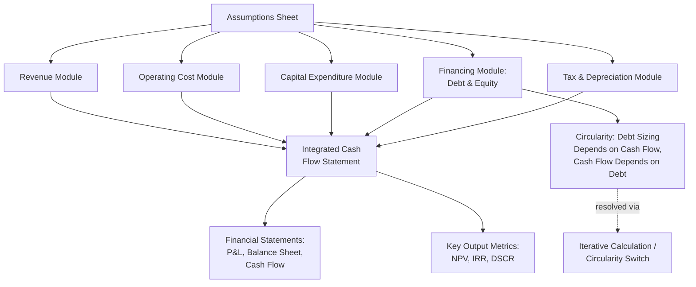
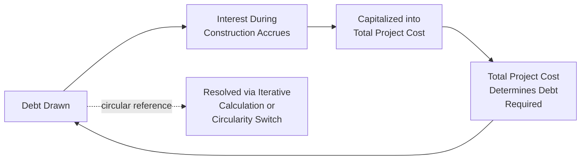
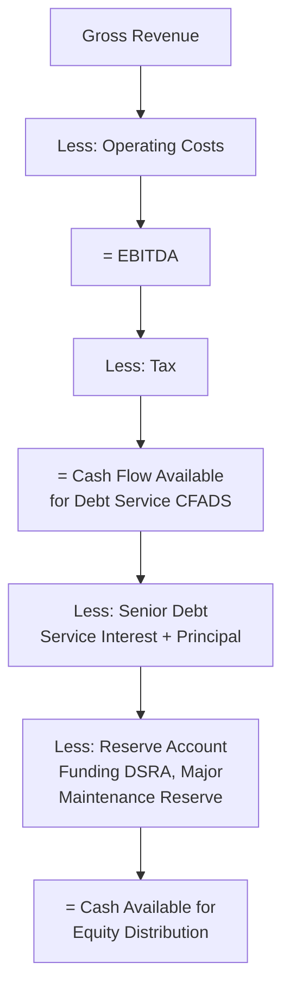
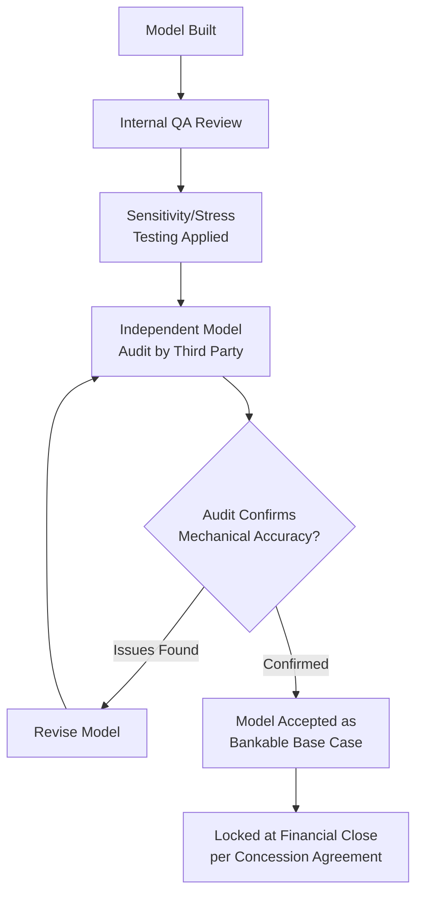

## Building a Bankable Financial Model from Assumptions to Outputs

### Overview

A bankable financial model is the quantitative engine of a Public-Private Partnership (PPP) transaction — a structured, auditable spreadsheet (or equivalent computational model) that translates a project's technical, commercial, and legal assumptions into projected cash flows, financing requirements, and the investment return and debt-serviceability metrics that lenders and sponsors rely upon to commit capital. "Bankable" specifically means the model meets the standard of rigor, transparency, and auditability that commercial lenders and their independent technical/financial advisors require before agreeing to finance the transaction — a materially higher bar than an internal feasibility-stage estimate.

Where Cost-Benefit Analysis and Shadow Pricing addressed the *economic* (societal welfare) appraisal of a project, and Monte Carlo Simulation addressed *probabilistic risk analysis* layered on top of a model, this topic addresses the foundational architecture of the *financial* model itself — the deterministic base-case structure that both of those other techniques are ultimately built upon or applied to.

### Core Financial Model Architecture

### Standard Modular Structure

**1. Assumptions Sheet (Input Layer)**

The assumptions sheet is the single, centralized location for every input variable driving the model, deliberately separated from calculation logic so that any input can be changed in one place and flow through consistently to all outputs. Standard categories include: macroeconomic assumptions (inflation, exchange rates, discount rates); construction assumptions (cost, duration, phasing/drawdown schedule); operating assumptions (demand/volume forecasts, tariff levels, operating cost escalation); financing assumptions (debt-to-equity ratio, interest rates, tenor, grace period); and tax and regulatory assumptions (corporate tax rate, depreciation method, any tax holidays or incentives).

**Key Points**

- **Hardcoded values should never appear buried within calculation formulas** — every assumption should trace back to a single, clearly labeled cell in the assumptions sheet, since a common cause of model error and a major red flag in lender due diligence is an assumption embedded invisibly inside a formula elsewhere in the model, undermining both transparency and auditability.
- Assumptions should be clearly sourced and referenced (e.g., "demand forecast per [Traffic Study, Consultant X, Date]," "construction cost per [Engineer's Estimate, Date]") so that reviewers can trace each number back to its supporting technical or market study rather than treating it as an unsupported model input.

**2. Revenue Module**

Builds the project's revenue projection based on the payment mechanism established in the concession structure (as discussed under Drafting Core Provisions of a Concession Agreement): user-pays tariff revenue (volume × tariff, with tariff escalation formulas), availability payment revenue (a formula linking periodic payment to asset availability and KPI compliance, with the deduction matrix logic reducing gross entitlement for non-compliance), or a hybrid combination, as illustrated in the End-to-End Case Simulation's tipping-fee-plus-feed-in-tariff structure.

**3. Operating Cost Module**

Projects ongoing operations and maintenance (O&M) costs, typically disaggregated into fixed costs (staffing, insurance, base maintenance), variable costs (scaling with volume/usage), and periodic major maintenance/lifecycle replacement costs (capital-intensive component replacement occurring at defined intervals over the asset's operating life, distinct from routine annual O&M and requiring its own reserve or financing treatment).

**4. Capital Expenditure (CapEx) Module**

Models construction-phase costs with a detailed drawdown schedule (the timing profile of capital spending across the construction period, not a single lump sum), since the drawdown schedule directly drives the construction-phase financing requirement and interest-during-construction calculation discussed below.

**5. Financing Module**

Models the debt and equity funding of the project's capital requirement, including: the debt-to-equity ratio (gearing) and its implications for both cash-flow leverage and equity return; the debt drawdown schedule (typically pari passu with equity, or following an agreed drawdown sequencing); interest rate assumptions (fixed, floating with a reference rate plus margin, or a blend); principal repayment profile (commonly structured to match projected cash flow availability — often a "sculpted" repayment profile rather than a flat annuity, sized to maintain a target Debt Service Coverage Ratio throughout the tenor); and any Debt Service Reserve Account (DSRA) sizing requirement.

**6. Tax and Depreciation Module**

Applies the project's tax regime — corporate income tax rate, depreciation method (straight-line or accelerated, per applicable tax law) and its effect on taxable income timing, and any specific tax incentives or holidays applicable to the sector or investment type — since tax treatment materially affects after-tax cash flow available for debt service and equity distribution, particularly in the early years of operation where accelerated depreciation can defer tax liability.

### The Interest During Construction (IDC) and Circularity Problem

**Key Points**

- **Interest During Construction (IDC)**: Interest accrues on drawn debt even during the construction period before the project generates revenue; this accrued interest is typically capitalized (added to the total project cost to be financed) rather than paid in cash during construction, since no revenue exists yet to service it.
- **Circularity**: A structural modeling challenge arises because the amount of debt drawn depends on total project cost (which includes capitalized IDC), while capitalized IDC itself depends on the amount of debt drawn and its timing — creating a circular reference where each variable depends on the other.
- **Resolution methods**: Financial models typically resolve this circularity either through (a) enabling iterative calculation settings in the spreadsheet software, allowing the circular formula chain to converge to a stable solution through repeated recalculation, or (b) inserting a manual "circularity breaker" or "circularity switch" — a toggle that can freeze circular formulas at their last calculated value, allowing the analyst to troubleshoot the model without formulas breaking into error states, a standard project finance modeling best practice given how disruptive uncontrolled circular reference errors can be to a live, actively-edited model.

### Building the Integrated Cash Flow Waterfall

A bankable model's cash flow statement typically follows a strict priority-of-payments "waterfall" structure, reflecting the contractual seniority of different claims on project cash flow:

$$\text{Cash Available for Distribution} = \text{Revenue} - \text{Operating Costs} - \text{Tax} - \text{Debt Service (Interest + Principal)} - \text{Reserve Account Funding}$$

Each layer of this waterfall corresponds to a specific stakeholder claim, and the model must calculate each layer sequentially and correctly to produce credible output metrics — an error introduced at any layer propagates through to every metric below it.

### Key Output Metrics

**1. Debt Service Coverage Ratio (DSCR)**

$$DSCR_t = \frac{\text{Cash Flow Available for Debt Service (CFADS)}_t}{\text{Debt Service (Interest + Principal)}_t}$$

Calculated for each period, DSCR is the primary metric lenders use to assess repayment safety margin; a minimum DSCR covenant (commonly requiring DSCR to remain above a specified threshold, such as 1.20x to 1.40x depending on sector risk and jurisdiction, in every period) is a standard loan covenant, and the Minimum DSCR across the full debt tenor is the single output figure most scrutinized in lender credit committee review.

**2. Loan Life Coverage Ratio (LLCR)**

$$LLCR = \frac{\text{NPV of CFADS over remaining debt tenor} + \text{DSRA balance}}{\text{Outstanding Debt Balance}}$$

LLCR provides a forward-looking, whole-tenor view of debt coverage (as opposed to DSCR's period-by-period view), useful for assessing whether the cash flow profile over the entire remaining loan life is sufficient to cover outstanding debt, not merely whether the next payment is covered.

**3. Project Life Coverage Ratio (PLCR)**

Similar to LLCR but calculated over the full remaining project/concession life rather than just the debt tenor, providing insight into the cushion available after debt is fully repaid.

**4. Equity Internal Rate of Return (Equity IRR)**

$$0 = \sum_{t=0}^{T} \frac{E_t}{(1+IRR_{equity})^t}$$

where $E_t$ represents net equity cash flows (equity contributions as negative outflows during construction, dividend distributions as positive inflows during operations). This is the primary return metric for project sponsors, distinct from the project-level Financial Internal Rate of Return (which measures return on total invested capital — debt plus equity — before financing structure effects) and from the Economic Internal Rate of Return discussed under Cost-Benefit Analysis and Shadow Pricing Techniques, which uses shadow-priced welfare cash flows rather than actual financial cash flows.

**5. Weighted Average Cost of Capital (WACC)**

$$WACC = \frac{E}{V}r_e + \frac{D}{V}r_d(1-T)$$

where $E$ and $D$ are equity and debt values, $V = E + D$, $r_e$ is the cost of equity, $r_d$ is the cost of debt, and $T$ is the corporate tax rate (reflecting the tax deductibility of interest expense). WACC is commonly used as the discount rate for calculating project-level Net Present Value at the financial (as opposed to economic) analysis level.

### Worked Example: Simplified Sculpted Debt Repayment

**Example**

A project's CFADS is projected at $18 million in Year 1 of operations, rising to $24 million by Year 5 as demand ramps up, then stabilizing around $25 million thereafter. Rather than a flat annuity repayment schedule that could breach the minimum DSCR covenant in the lower-cash-flow early years, the debt is "sculpted" — principal repayment is calibrated period-by-period so that DSCR remains constant at the target covenant level (e.g., 1.30x) across the tenor: lower principal repayment in Years 1–2 when CFADS is lower, rising principal repayment in later years as CFADS grows. This produces a repayment profile of, illustratively, $8 million in Year 1 rising to $14 million by Year 6, rather than a flat $11 million repayment every year — directly reflecting the underlying cash flow generation pattern instead of imposing an arbitrary uniform schedule that would either breach covenants early or leave excess uncalled debt capacity late in the tenor.

### Sensitivity Analysis and Stress Testing

**Key Points**

- Standard bankability due diligence requires the model to be stress-tested against defined downside scenarios: a construction cost overrun case, a demand/revenue downside case, an interest rate increase case, and often a combined "worst reasonable case" applying multiple downside assumptions simultaneously, to test Minimum DSCR resilience under each.
- Where the transaction's risk profile warrants deeper analysis, the deterministic sensitivity cases described above are supplemented (not replaced) by full Monte Carlo simulation, as discussed under Monte Carlo Simulation for Project Risk Modeling — the deterministic model built here is the computational engine that a Monte Carlo wrapper repeatedly re-runs across thousands of sampled input combinations.
- Lenders typically specify which sensitivity cases are mandatory for their internal credit approval process, and the model should be built with clearly switchable sensitivity toggles (allowing a reviewer to activate a specific downside case without manually re-entering dozens of individual assumption changes) as a standard usability and auditability feature.

### Model Auditability and Bankability Standards

**Key Points**

- **Single-source input discipline**: As noted above, every hardcoded number should live in the assumptions sheet, with all other cells containing formulas that reference those assumption cells — never a mix of hardcoded values scattered through calculation sheets.
- **Consistent formula direction and structure**: Bankable models typically follow conventions such as formulas flowing left-to-right and top-to-bottom consistently, with each row/column representing a consistent time period across the entire model, reducing the risk of misaligned references that are difficult to detect visually.
- **Clear color-coding conventions**: Widely adopted industry convention colors hardcoded inputs (typically blue font) distinctly from formula-calculated cells (typically black font) and links to other sheets (often green font), allowing a reviewer to instantly distinguish assumption inputs from calculated outputs during audit.
- **Independent Model Audit**: For most project finance transactions of material size, an independent third-party model auditor is engaged specifically to verify the model's mechanical accuracy, internal consistency, and correct implementation of the intended calculation logic — a standard bankability precondition for many lenders, distinct from (and in addition to) reviewing whether the underlying assumptions themselves are reasonable.
- **No broken links or external references at delivery**: A model intended for lender reliance should be self-contained, with all input data embedded directly (with clear sourcing documentation) rather than linked to external files that may not be available to, or may change independently for, the receiving party.

### Integration with the Concession Agreement and Broader Transaction

**Key Points**

- The financial model's output assumptions and structure should mirror the payment mechanism, KPI deduction matrix, and term length actually specified in the Concession Agreement (per Drafting Core Provisions of a Concession Agreement) — a mismatch between the model's assumed mechanics and the actual signed contract terms is a critical, sometimes transaction-threatening due diligence finding.
- The locked base-case model becomes the reference point for future covenant compliance testing throughout the operating life of the concession, as referenced in the End-to-End Case Simulation's Stage 5c, meaning the model's ongoing utility extends well beyond the appraisal and transaction stages into the full life of the asset.
- Where climate resilience measures, ESG commitments, or Just Transition obligations (from earlier chapter topics) carry cost implications, those costs must be explicitly reflected in the CapEx and O&M modules rather than treated as unfunded, off-model commitments — ensuring the "bankable" model genuinely reflects the full cost of the commitments made elsewhere in the transaction documentation.

### Common Pitfalls in Practice

**Key Points**

- **Inconsistent period conventions**: Mixing calendar-year and fiscal-year conventions, or inconsistent treatment of stub periods (partial first or last years), without clear documentation is a frequent source of model error that can materially misstate output metrics if undetected.
- **Circularity left unmanaged**: Failing to implement a circularity switch or robust iterative-calculation protocol can cause the model to intermittently break into error states during editing, undermining reviewer confidence and risking undetected calculation errors if the model is saved or shared in a broken state.
- **Overly optimistic ramp-up assumptions**: As discussed under Cost-Benefit Analysis and Econometric Analysis of PPP Performance and Outcomes elsewhere in this chapter, demand ramp-up profiles are a common source of optimism bias; a bankable model should reflect a realistically calibrated ramp-up curve, often benchmarked against comparable historical projects, rather than an idealized linear or immediate-full-capacity assumption.
- **Treating the model as static after financial close**: A bankable model is not a one-time deliverable but a living tool used throughout the concession's operating life for covenant testing, refinancing analysis, and dispute resolution reference — poor version control or failure to maintain the model's integrity post-close undermines its ongoing utility.

**Next Steps**

- Build a simplified worked financial model in spreadsheet form implementing the full waterfall structure described here for a specific illustrative project
- Study sculpted debt repayment mechanics and DSRA sizing methodology in greater technical depth
- Review independent model audit methodology and typical audit findings checklists used by project finance model auditors
- Connect this topic to Monte Carlo Simulation for Project Risk Modeling to explore how the deterministic model built here serves as the computational engine for probabilistic simulation
- Examine refinancing analysis techniques applied to an operating-phase model once construction-risk has passed, as referenced under Green Bonds and Sustainability-Linked Financing