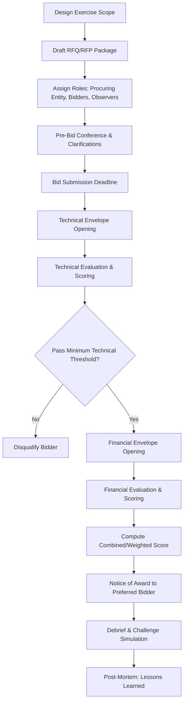

## Conducting a Mock Competitive Procurement Exercise

### Purpose and Learning Objectives

**Key Points**

- Simulates the end-to-end competitive selection phase of a PPP transaction, from Request for Qualifications (RFQ) through Financial Close negotiation readiness
- Builds practitioner fluency in evaluating technical and financial bids under a defined legal and evaluation framework
- Surfaces the tension between transparency/competition and confidentiality/commercial sensitivity that characterizes real procurements
- Trains participants to defend evaluation decisions against bidder challenges — a core skill given how frequently PPP awards are protested

A mock exercise typically compresses a procurement that runs 6–18 months in reality into a workshop of several hours to several days, using pre-built documentation and simplified financial models so the pedagogical focus stays on process integrity and evaluation judgment rather than on live drafting.

### Procurement Modalities to Simulate

| Modality | Description | When Used |
| --- | --- | --- |
| Single-stage, single-envelope | One submission containing technical and financial proposals together | Simple, well-defined scopes |
| Single-stage, two-envelope | Technical envelope opened and scored first; financial envelope opened only for technically qualified bidders | Most common for infrastructure PPPs |
| Two-stage (RFQ then RFP) | Prequalification (RFQ) narrows the field; shortlisted bidders receive a detailed Request for Proposals (RFP) | Complex, high-value, or novel transactions |
| Competitive dialogue / negotiated procedure | Iterative dialogue with bidders to refine technical solutions before final bids | Highly complex or innovative scopes (common in EU-influenced frameworks) |
| Swiss challenge | Unsolicited proposal published; competing bidders may match or beat it | Jurisdictions permitting unsolicited PPP proposals |

For a mock exercise, the **single-stage, two-envelope** format is most instructive because it forces a clean separation between technical merit and price, which is where most real-world evaluation disputes arise.

### Exercise Architecture

### Step 1 — Designing the Transaction Scenario

**Key Points**

- Choose a sector with clear, teachable risk allocation dynamics: toll roads (demand risk), water treatment (availability/performance risk), or a hospital (availability-based social infrastructure) are common choices
- Define the PPP structure being procured: BOT, DBFOM, availability payment concession, etc.
- Set a realistic but simplified project scope: capacity, capex range, concession term, and payment mechanism
- Pre-decide the "ground truth" — the instructor/facilitator should know in advance which bidder is designed to win and why, so scoring outcomes can be checked against the intended lesson

**Example**

A facilitator might specify: "40 km toll road, 25-year DBFOT concession, USD 220M capex, minimum revenue guarantee (MRG) floor at 70% of base case traffic, evaluated 70% technical / 30% financial (lowest levelized toll bid among qualified bidders)."

### Step 2 — Drafting the Procurement Documentation Set

The following documents should be prepared (abbreviated versions are acceptable for a mock exercise, but structure should mirror real documents):

- **Request for Qualification (RFQ)** — eligibility criteria, minimum experience/track record, financial capacity thresholds (net worth, annual turnover), litigation history disclosure
- **Request for Proposal (RFP) / Bid Data Sheet** — detailed scope of work, output specifications, evaluation criteria and weightings, bid bond/performance security requirements, submission format
- **Draft Concession Agreement (or PPP Contract)** — allocates risk (construction, demand, FX, force majeure, change in law), specifies payment mechanism, step-in rights, termination compensation formulas
- **Evaluation Criteria and Scoring Matrix** — explicit point allocation per criterion, minimum passing thresholds, tie-breaking rules
- **Instructions to Bidders (ITB)** — submission logistics, clarification process, bid validity period, disqualification grounds

**Next Steps** for the facilitator: pre-populate a "bidder response bank" — 3 to 5 pre-written bid packages of varying quality (one clearly strong, one clearly weak, two ambiguous/borderline) so evaluation teams face genuine judgment calls rather than trivial sorting.

### Step 3 — Role Assignment

| Role | Responsibilities | Typical Group Size |
| --- | --- | --- |
| Procuring Entity / PPP Unit | Issues documents, manages clarifications, chairs the Bid Evaluation Committee (BEC) | 1 facilitator + 2–3 participants |
| Bid Evaluation Committee (BEC) | Scores technical and financial submissions against the matrix | 3–5 participants (odd number recommended) |
| Bidding Consortia | Prepare and submit technical/financial proposals | 3–5 participants per consortium, 2–4 consortia |
| Independent Observer / Auditor | Monitors process integrity, flags conflicts of interest or procedural breaches | 1–2 participants |
| Legal/Probity Advisor | Rules on disputes, clarification requests, and challenge validity | 1 participant (can be facilitator) |

Rotating participants through both a bidder role and an evaluator role across multiple exercise cycles is pedagogically valuable — it builds appreciation for information asymmetry from both sides of the table.

### Step 4 — Pre-Bid Conference and Clarification Protocol

**Key Points**

- Simulate a formal query period: bidders submit written questions, procuring entity issues consolidated written responses to **all** bidders simultaneously (never bilaterally) to preserve a level playing field
- This step is often skipped in classroom settings but is one of the most instructive elements — it demonstrates the strict "equal treatment" doctrine underlying most public procurement law
- Facilitator should inject at least one ambiguous RFP clause deliberately, forcing bidders to raise a clarification request and the procuring entity to issue a formal amendment/addendum

### Step 5 — Bid Evaluation Mechanics

**Technical Evaluation**

Common scored criteria:

- Technical solution quality and compliance with output specifications
- Construction methodology and program (schedule realism)
- Key personnel experience and organizational capacity
- Environmental and social management approach
- Financial capacity and bankability of the sponsor consortium
- Track record on comparable projects

Scoring is typically normalized on a point scale (e.g., 0–100) with a minimum passing threshold (commonly 70–75%) below which a bid is disqualified regardless of price.

**Financial Evaluation**

Depending on the payment mechanism being procured, the evaluation variable differs:

| Payment Mechanism | Typical Bid Variable |
| --- | --- |
| User-pay / toll concession | Lowest toll rate, or shortest concession period, or highest upfront concession fee to government |
| Government-pay / availability payment | Lowest Net Present Value (NPV) of availability payments |
| Output-based subsidy (VGF) | Lowest Viability Gap Funding requested |
| Hybrid annuity | Lowest weighted annuity NPV |

**Combined scoring formula** (common in two-envelope systems):

$$S_i = w_T \cdot \frac{T_i}{T_{max}} + w_F \cdot \frac{F_{min}}{F_i}$$

Where $S_i$ is bidder $i$'s combined score, $T_i$ is the technical score, $T_{max}$ is the highest technical score among qualified bidders, $F_i$ is the financial bid value, $F_{min}$ is the lowest (most favorable) financial bid, and $w_T$, $w_F$ are the technical and financial weights ($w_T + w_F = 1$).

**Example**

With $w_T = 0.7$, $w_F = 0.3$: a bidder scoring 85/100 technical with a toll bid of $0.12/km, against a market-best toll bid of $0.10/km, computes as:

$$S = 0.7 \times \frac{85}{100} + 0.3 \times \frac{0.10}{0.12} = 0.595 + 0.25 = 0.845$$

### Step 6 — Notice of Award and Standstill Period

**Key Points**

- Simulate a "standstill" or "Alcatel" period (common in EU-derived frameworks) — a mandatory waiting period between award notification and contract signature, during which unsuccessful bidders may lodge a challenge
- Procuring entity should issue individualized debrief letters explaining each losing bidder's relative scoring — this is where facilitators can test whether participants understand the difference between transparency obligations and protecting commercially sensitive information from competitors

### Step 7 — Challenge/Protest Simulation

This is frequently the most valuable and most omitted component of mock exercises.

**Common grounds for simulated bid protests:**

- Alleged inconsistent application of evaluation criteria between bidders
- Alleged improper disqualification on a technical compliance technicality
- Alleged conflict of interest involving a BEC member
- Alleged failure to treat bidders equally during the clarification process

The facilitator (acting as adjudicator, or a separate probity panel) rules on the protest using only the documented evaluation record — reinforcing why **contemporaneous, well-documented evaluation notes** are a real-world procurement best practice, not bureaucratic overhead.

### Step 8 — Debrief and Post-Mortem

Structure the closing discussion around:

- Where did technical scoring diverge most between evaluators, and why?
- Did the winning bid actually represent best value, or merely lowest price/highest technical score in isolation?
- What documentation gaps would have been fatal in a real legal challenge?
- How did role (bidder vs. evaluator) change each participant's reading of the same clause?

### Common Pitfalls in Exercise Design

**Key Points**

- Making the "correct" winner too obvious removes the evaluative judgment the exercise is meant to train
- Omitting the clarification/addendum step removes the equal-treatment lesson entirely
- Using unrealistic evaluation weightings (e.g., 100% price) teaches a distorted view of how most modern PPP frameworks actually balance technical quality against cost
- Skipping the protest/challenge phase leaves participants unaware of how much evaluation documentation matters in practice [Inference: the magnitude of this effect will vary by jurisdiction and the litigiousness of the sector being simulated]

### Illustrative Evaluation Committee Workflow (svg_diagram)

<svg xmlns="http://www.w3.org/2000/svg" viewBox="0 0 760 300">
<text x="380" y="24" text-anchor="middle" font-size="15" font-weight="bold" fill="#1a1a1a">Bid Evaluation Committee Workflow (svg_diagram)</text>
<rect x="20" y="60" width="150" height="60" rx="6" fill="#eef4fb" stroke="#3b6ea5" />
<text x="95" y="85" text-anchor="middle" font-size="11" fill="#1a1a1a">Technical</text>
<text x="95" y="100" text-anchor="middle" font-size="11" fill="#1a1a1a">Envelope Opened</text>
<rect x="210" y="60" width="150" height="60" rx="6" fill="#eef4fb" stroke="#3b6ea5" />
<text x="285" y="85" text-anchor="middle" font-size="11" fill="#1a1a1a">Individual</text>
<text x="285" y="100" text-anchor="middle" font-size="11" fill="#1a1a1a">Scoring (blind)</text>
<rect x="400" y="60" width="150" height="60" rx="6" fill="#eef4fb" stroke="#3b6ea5" />
<text x="475" y="85" text-anchor="middle" font-size="11" fill="#1a1a1a">Consensus</text>
<text x="475" y="100" text-anchor="middle" font-size="11" fill="#1a1a1a">Scoring Meeting</text>
<rect x="590" y="60" width="150" height="60" rx="6" fill="#eef4fb" stroke="#3b6ea5" />
<text x="665" y="85" text-anchor="middle" font-size="11" fill="#1a1a1a">Threshold</text>
<text x="665" y="100" text-anchor="middle" font-size="11" fill="#1a1a1a">Pass/Fail Gate</text>
<rect x="400" y="180" width="150" height="60" rx="6" fill="#fbeeee" stroke="#a53b3b" />
<text x="475" y="205" text-anchor="middle" font-size="11" fill="#1a1a1a">Financial</text>
<text x="475" y="220" text-anchor="middle" font-size="11" fill="#1a1a1a">Envelope Opened</text>
<rect x="590" y="180" width="150" height="60" rx="6" fill="#fbeeee" stroke="#a53b3b" />
<text x="665" y="205" text-anchor="middle" font-size="11" fill="#1a1a1a">Combined Score</text>
<text x="665" y="220" text-anchor="middle" font-size="11" fill="#1a1a1a">&amp; Ranking</text>
<line x1="170" y1="90" x2="210" y2="90" stroke="#333" marker-end="url(#arrow)" />
<line x1="360" y1="90" x2="400" y2="90" stroke="#333" marker-end="url(#arrow)" />
<line x1="550" y1="90" x2="590" y2="90" stroke="#333" marker-end="url(#arrow)" />
<line x1="665" y1="120" x2="665" y2="150" stroke="#333" />
<line x1="665" y1="150" x2="475" y2="150" stroke="#333" />
<line x1="475" y1="150" x2="475" y2="180" stroke="#333" marker-end="url(#arrow)" />
<line x1="550" y1="210" x2="590" y2="210" stroke="#333" marker-end="url(#arrow)" />
</svg>

**Related Topics**

- Drafting a Bid Evaluation Criteria Matrix with Weighted Scoring
- Swiss Challenge Mechanism: Design and Fairness Safeguards
- Bid Bonds, Performance Security, and Bidder Default Consequences
- Managing Conflicts of Interest on Bid Evaluation Committees
- Debarment and Blacklisting Procedures in PPP Procurement
- Negotiated Procedures and Competitive Dialogue for Complex PPPs
- Post-Award Contract Negotiation and Conditions Precedent to Financial Close