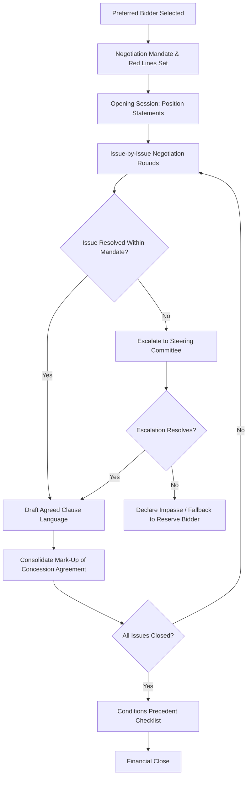

## Negotiation Simulation Between Public Authority and Bidder Consortium

### Purpose and Learning Objectives

**Key Points**

- Simulates the post-selection, pre-Financial Close negotiation phase where the preferred bidder and procuring authority finalize contract terms not fully resolved during bidding
- Distinguishes negotiation from procurement: negotiation in most legal frameworks may clarify, refine, or fill gaps but **cannot** alter the fundamental basis on which the competitive award was made, or it risks legal challenge from losing bidders
- Trains participants in balancing the authority's need to protect public interest and value-for-money against the sponsor consortium's need for bankable, financeable terms
- Builds fluency in the recurring flashpoints of PPP negotiations: risk allocation, termination compensation, step-in rights, and financial close conditions

### Legal Boundary of Post-Award Negotiation

**Key Points**

- Most PPP/public procurement frameworks (e.g., EU public procurement directives, World Bank PPP guidance, many national procurement laws) restrict post-award negotiation to prevent "bait and switch" tactics where a bidder wins on attractive terms then negotiates them away
- Permissible negotiation scope typically includes: clarifying ambiguous drafting, finalizing schedules/annexes, resolving financing structure details, and agreeing implementation mechanics
- Impermissible scope typically includes: changing the evaluated price, altering scope in ways that would have changed other bidders' proposals, or granting risk allocation materially more favorable than what was bid
- A well-designed simulation should include at least one negotiation ask from the consortium that the authority's team must correctly identify as **out of bounds** and reject on legal-integrity grounds

### Exercise Architecture

### Step 1 — Pre-Negotiation Preparation

**For the Public Authority Team**

- Establish a written negotiation mandate defining "red line" terms that cannot move, "amber" terms with limited flexibility, and "green" terms open to discussion
- Assign a single lead negotiator with clear authority limits, supported by legal, financial, and technical advisors
- Prepare a fallback position: what happens if negotiations fail — invite the reserve (second-ranked) bidder, or re-tender?
- Pre-calculate the fiscal impact of key concessions (e.g., what does a 1% shift in the discount rate for termination compensation cost the government over the concession term)

**For the Consortium Team**

- Prepare a term sheet identifying bankability conditions required by lenders (often informed by a term sheet or mandate letter from the arranging bank)
- Identify which clauses are genuinely deal-breakers for financing versus preferences
- Prepare fallback financing structures (e.g., alternate debt/equity ratios) if the authority resists specific protections

**Example**

A facilitator-issued negotiation brief might state: "The consortium's lenders require a minimum Debt Service Coverage Ratio (DSCR) covenant of 1.20x and step-in rights exercisable within 30 days of a payment default notice. The authority's red line is a maximum termination payment cap of 85% of outstanding senior debt on authority default."

### Step 2 — Core Negotiation Issues to Simulate

| Issue Area | Public Authority Position | Consortium/Lender Position |
| --- | --- | --- |
| Risk allocation (demand, FX, change in law) | Push risk to private party where it can be managed | Push risk back where uninsurable or unpriceable |
| Termination compensation | Minimize payout on private-party default; cap on authority-default payout | Maximize recovery on authority default; minimize haircut on private default |
| Step-in rights (lender) | Limit duration and scope of lender step-in | Broad, clearly defined step-in rights to protect debt service |
| Material Adverse Government Action (MAGA) / Change in Law | Narrow definition, discriminatory-only triggers | Broad definition covering general law changes affecting project economics |
| Refinancing gain share | Maximum share of refinancing upside to public sector | Minimum share threshold, clear calculation mechanism |
| Performance/availability deductions regime | Punitive enough to incentivize performance | Proportionate, avoids "double jeopardy" stacking of deductions |
| Insurance requirements | Comprehensive coverage minimizing contingent liability | Commercially available and affordably priced coverage only |
| Force majeure relief | Narrow definition, relief limited to time extension | Broader definition including compensation events |

### Step 3 — Termination Payment Mechanics (a Frequent Negotiation Flashpoint)

**Key Points**

- Termination compensation formulas differ by the party at fault and are almost always the most heavily negotiated clause in a PPP contract
- A well-designed simulation should require participants to actually calculate termination payments under 2–3 scenarios

Common formula structures:

$$TP_{authority\ default} = D_{outstanding} + E_{invested} \times f_{return} - I_{insurance}$$

$$TP_{private\ default} = \max\left(0,\ D_{outstanding} \times h - L_{losses\ incurred}\right)$$

Where $D_{outstanding}$ is outstanding senior debt, $E_{invested}$ is equity invested to date, $f_{return}$ is an agreed compensation factor for lost equity return, $I_{insurance}$ is applicable insurance proceeds, $h$ is a negotiated haircut factor (commonly 0.80–0.95), and $L_{losses\ incurred}$ represents authority losses attributable to the default.

**Example**

Authority-default termination with $D_{outstanding} = \$150M$, $E_{invested} = \$40M$, $f_{return} = 1.1$:

$$TP = 150M + (40M \times 1.1) = 150M + 44M = \$194M$$

[Inference: exact compensation factors and haircut conventions vary significantly by jurisdiction and standard-form contract (e.g., UK Standardisation of PF2 Contracts vs. multilateral development bank model concession agreements); the formulas above illustrate structure, not a universal standard.]

### Step 4 — Running the Negotiation Rounds

**Format A: Structured Issue-by-Issue**

Each negotiation session tackles one contract schedule or clause category (e.g., "Session 3: Insurance and Force Majeure"). This mirrors how real negotiation teams typically organize workstreams in parallel (legal, technical, financial sub-tracks).

**Format B: Full Mock Negotiation Meeting**

A single extended session simulating a real negotiation meeting, with a facilitator playing a "senior government official" who periodically intervenes to test participants' composure and adherence to mandate under pressure — useful for training negotiation *behavior*, not just substantive positions.

**Recommended time-boxing:**

| Segment | Duration (Half-Day Format) |
| --- | --- |
| Opening positions and mandate briefing | 20 minutes |
| Round 1 — Risk allocation issues | 45 minutes |
| Round 2 — Financial/termination issues | 45 minutes |
| Round 3 — Step-in rights and lender protections | 30 minutes |
| Escalation/impasse resolution | 20 minutes |
| Consolidation of mark-up | 30 minutes |
| Debrief | 30 minutes |

### Step 5 — Escalation and Impasse Protocols

**Key Points**

- Real negotiations use tiered escalation: negotiator → steering committee → ministerial or board-level sign-off
- Simulating escalation teaches participants when to hold a position at the working level versus when an issue genuinely requires principal-level intervention
- A facilitator can inject a simulated "impasse" on one issue (e.g., MAGA definition) to force participants to practice trade-off packaging — conceding on a lower-priority item in exchange for movement on a higher-priority one

### Step 6 — Documentation Discipline

**Key Points**

- Every simulated negotiation session should produce a **redline/mark-up** of the relevant concession agreement clause, not just verbal agreement — reinforces that verbal deals mean nothing without contractual capture
- Maintain a live **issues tracker** logging: issue, authority position, consortium position, agreed resolution (or escalation status), responsible party, and date closed
- This artifact doubles as an audit trail defensible against later challenge that negotiation exceeded permissible legal boundaries

### Step 7 — Conditions Precedent (CP) to Financial Close

Once substantive terms are agreed, simulate the CP checklist review — the final gate before Financial Close:

- Executed concession agreement and all schedules
- Financing agreements executed (senior debt, equity subscription, hedging)
- Government guarantees or comfort letters (if applicable) issued
- Land acquisition/right-of-way status confirmed
- Environmental and regulatory permits/consents obtained
- Insurance policies bound
- Legal opinions delivered (capacity, enforceability, security)
- Independent Engineer/Lender's Technical Advisor sign-off on base case financial model

### Step 8 — Debrief and Post-Mortem

Structure the closing discussion around:

- Which concessions were within mandate, and which (if any) crossed into legally risky territory relative to the original competitive basis?
- Where did the authority team correctly hold a red line under pressure, and where did they fold prematurely?
- How did the consortium team's fallback financing options change their negotiating leverage?
- What would a losing bidder's legal advisor flag if they reviewed the final negotiated concession agreement against the original RFP?

### Common Pitfalls in Exercise Design

**Key Points**

- Allowing "authority" teams to concede on price or scope teaches participants a legally incorrect model of what post-award negotiation permits
- Omitting a hard mandate/red-line brief removes the realistic constraint that real negotiators operate under principal-imposed limits, not unlimited discretion
- Skipping the termination payment calculation exercise leaves the financial stakes of contract drafting abstract rather than concrete
- Failing to simulate lender involvement (even indirectly, via a consortium team briefed on lender requirements) omits the reality that most substantive negotiation leverage in PPPs originates from financeability requirements, not government preference alone [Inference: the degree of lender-driven leverage varies by market maturity and depth of local project finance liquidity]

### Illustrative Negotiation Escalation Structure (svg_diagram)

<svg xmlns="http://www.w3.org/2000/svg" viewBox="0 0 760 260">
<text x="380" y="24" text-anchor="middle" font-size="15" font-weight="bold" fill="#1a1a1a">Negotiation Escalation Tiers (svg_diagram)</text>
<rect x="290" y="50" width="180" height="50" rx="6" fill="#eef4fb" stroke="#3b6ea5" />
<text x="380" y="80" text-anchor="middle" font-size="12" fill="#1a1a1a">Working-Level Negotiators</text>
<rect x="290" y="130" width="180" height="50" rx="6" fill="#fef6e6" stroke="#b8860b" />
<text x="380" y="160" text-anchor="middle" font-size="12" fill="#1a1a1a">Steering Committee</text>
<rect x="290" y="210" width="180" height="50" rx="6" fill="#fbeeee" stroke="#a53b3b" />
<text x="380" y="240" text-anchor="middle" font-size="12" fill="#1a1a1a">Principal / Ministerial Sign-off</text>
<line x1="380" y1="100" x2="380" y2="130" stroke="#333" marker-end="url(#arrow2)" />
<line x1="380" y1="180" x2="380" y2="210" stroke="#333" marker-end="url(#arrow2)" />
<text x="400" y="118" font-size="10" fill="#555">unresolved after 2 rounds</text>
<text x="400" y="198" font-size="10" fill="#555">material red-line dispute</text>
</svg>

**Related Topics**

- Structuring Termination Payment Formulas Across Default Scenarios
- Lender Step-In Rights and Direct Agreements in Project Finance
- Change in Law and Material Adverse Government Action Clauses
- Refinancing Gain-Share Mechanisms in PPP Contracts
- Conditions Precedent Checklists and Financial Close Readiness
- Legal Limits on Post-Award Negotiation Under Competitive Procurement Law
- Drafting the Direct Agreement Between Authority, Lenders, and Concessionaire