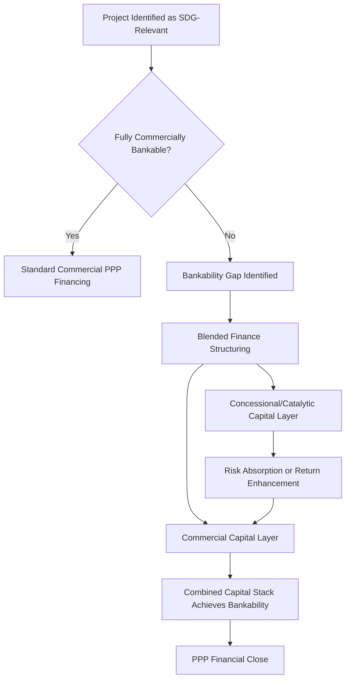
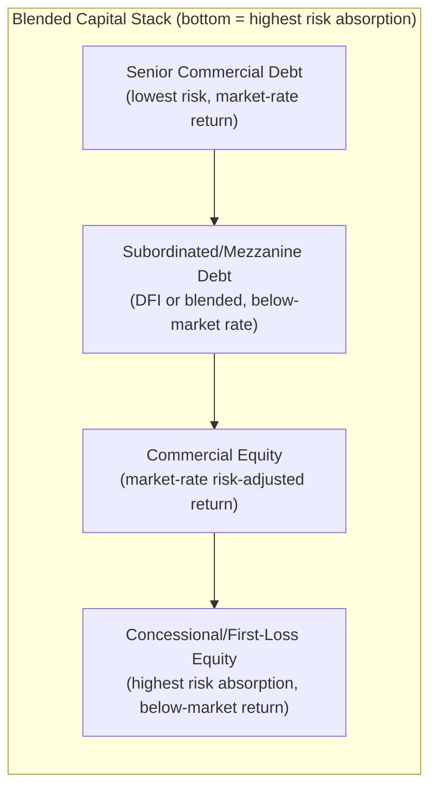

## Blended Finance and PPPs for the Sustainable Development Goals

### Definition and Conceptual Foundation

**Key Points**

- Blended finance is the strategic use of development finance and philanthropic capital to mobilize additional private capital flows toward sustainable development, typically by improving the risk-return profile of an investment to a level acceptable to commercial investors
- The OECD/DAC and the Blended Finance Taskforce define it around a core mechanic: concessional or catalytic capital absorbs a disproportionate share of risk (or subsidizes return) so that commercial capital can invest at market-rate risk-adjusted terms
- PPPs and blended finance are complementary but distinct: a PPP is a *contractual delivery structure* for an infrastructure or service project; blended finance is a *capital structuring approach* that can be layered into that PPP's financing to close a bankability gap
- The core rationale is addressing the SDG financing gap — commonly cited (pre-pandemic) at roughly $2.5 trillion annually in developing countries — where fully commercial PPP structures are not bankable on standalone market terms

### Where Blended Finance Intersects with PPP Structuring

### Core Blended Finance Instruments Used in PPP Capital Stacks

| Instrument | Mechanism | Typical Provider |
| --- | --- | --- |
| First-loss capital / junior tranche | Absorbs initial losses before senior/commercial investors are exposed | DFIs, philanthropic foundations, donor trust funds |
| Guarantees (partial risk / partial credit) | Covers specific risk events (e.g., political risk, government payment default) | MIGA, World Bank PRGs, regional DFIs, export credit agencies |
| Viability Gap Funding (VGF) | Direct capital grant closing the gap between commercially viable and socially optimal project cost | Government budgets, multilateral VGF facilities |
| Concessional/below-market debt | Senior or subordinated debt priced below market rate | DFIs (IFC, ADB, AfDB), bilateral development banks |
| Technical assistance grants | Funds project preparation, feasibility studies, transaction advisory | Donor-funded PPP facilities (e.g., PPIAF, GIF) |
| Results-based financing / outcome payments | Payment tied to verified development outcomes rather than inputs | Development impact bonds, outcome funds |
| Currency risk mitigation facilities | Hedges local-currency revenue against hard-currency debt | TCX Fund, regional currency risk facilities |

### The Capital Stack Model

A blended-finance PPP capital structure is typically layered by risk-return position, with concessional capital occupying the highest-risk tranches to "de-risk" the structure for commercial investors above it:

**Example**

A $100M water treatment PPP in a frontier market might structure: $50M senior commercial debt (8% target return), $20M DFI subordinated debt (6%, subordinated to senior), $20M commercial equity (16% target IRR), and $10M concessional first-loss equity from a donor-backed facility (targeting capital preservation, not market return) — the first-loss layer absorbing initial underperformance protects the commercial equity's return profile enough to attract it.

### The "Additionality" and "Crowding-In" Principles

**Key Points**

- **Additionality** — concessional capital should be deployed only where it demonstrably enables an investment that would not otherwise occur on commercial terms alone; deploying concessional capital into an already-bankable project is considered market distortion, not additionality
- **Crowding-in, not crowding-out** — blended structures should attract private capital that would not otherwise participate, not displace private capital that would have invested anyway on commercial terms
- **Minimum concessionality** — best practice (per DFI blended finance principles, e.g., the DFI Working Group's Blended Concessional Finance Principles) calls for using the minimum amount of concessional capital necessary to mobilize the commercial layer, to preserve scarce concessional resources for replication elsewhere

[Inference: In practice, measuring additionality and minimum concessionality rigorously is methodologically difficult and remains a live debate among DFIs and academic evaluators; claims of "leverage ratios" (private dollars mobilized per concessional dollar) should be treated cautiously given inconsistent measurement methodologies across institutions.]

### SDG-Alignment and Outcome Measurement

**Key Points**

- Blended finance PPPs targeting SDG outcomes typically require an explicit theory of change linking the project to specific SDG targets and indicators (e.g., SDG 6.1 — universal access to safe drinking water)
- Increasingly structured with measurable outcome metrics tied to disbursement or pricing (results-based blended finance), verified by independent verification agents
- Common frameworks referenced: IFC's Operating Principles for Impact Management, the Blended Finance Taskforce's principles, GIIN's IRIS+ metrics for impact measurement

**Example SDG-linked PPP structuring feature:** a water utility PPP concession agreement might include a step-down in the concessionaire's return-linked performance fee tied to achieving verified connection targets for low-income households (SDG 6 and SDG 1 alignment combined), monitored by an independent social auditor.

### Institutional Ecosystem

| Institution Type | Role |
| --- | --- |
| Multilateral Development Banks (World Bank, ADB, AfDB, IDB) | Provide concessional debt, guarantees, and technical assistance; often anchor blended structures |
| Bilateral DFIs (DFC, BII, FMO, DEG, Proparco) | Provide concessional or catalytic capital, often with mandate-driven development impact criteria |
| Multilateral guarantee agencies (MIGA) | Political risk insurance and credit enhancement |
| Donor-funded PPP preparation facilities (PPIAF, GIF, various bilateral facilities) | Fund upstream project preparation and transaction advisory, reducing pre-Financial-Close risk |
| Philanthropic foundations and blended finance funds | Provide first-loss/junior capital and grant funding for outcome verification |
| Commercial banks and institutional investors (pension funds, insurers) | Provide senior commercial capital once bankability is achieved |

### Common Structuring Challenges

**Key Points**

- **Scale mismatch** — many blended finance PPP deals are individually too small to attract large institutional investors (pension funds, insurers) seeking scale, motivating aggregation/platform approaches (portfolio bonds, project aggregation vehicles)
- **Currency risk** — local-currency revenues (tariffs, availability payments in local currency) against hard-currency-denominated concessional debt create FX mismatch risk, often requiring specialized hedging facilities that themselves add structuring cost
- **Coordination complexity** — blended structures often involve multiple concessional providers with differing mandates, reporting requirements, and approval timelines, extending transaction preparation periods significantly beyond standard PPPs
- **Measurement and reporting burden** — SDG-outcome-linked structures require robust monitoring and verification systems that add transaction cost, particularly challenging in weaker institutional capacity environments
- **Risk of concessionality creep** — political and institutional pressure can push concessional capital into projects that are marginally bankable anyway, undermining the additionality principle over time [Speculation: whether this represents a systemic pattern across the blended finance market or isolated cases is contested in current development finance literature]

### Illustrative Example: A Blended-Finance PPP in Practice

**Example**

A hypothetical off-grid renewable mini-grid PPP program structured as: (1) a Viability Gap Funding grant from a multilateral climate fund covering roughly 25% of connection capex, (2) a partial risk guarantee from a regional DFI covering government off-take payment risk, (3) concessional senior debt from a bilateral DFI at below-market tenor and rate, and (4) commercial equity from an infrastructure fund targeting a market-rate IRR enhanced by the de-risking effect of layers 1–3. The concessional layers are structured to step back (via a "graduation" clause reducing concessionality in future funding rounds) as the sector demonstrates track record and commercial capital becomes willing to enter on standalone terms.

### Distinguishing Blended Finance from Related Concepts

| Concept | Distinction from Blended Finance |
| --- | --- |
| Viability Gap Funding (VGF) alone | VGF is one specific instrument; blended finance is the broader structuring approach that may include VGF alongside guarantees, concessional debt, etc. |
| Impact investing | Impact investing describes an investor mandate/intent (seeking measurable impact plus return); blended finance describes a capital structuring technique that may or may not involve impact-mandated investors |
| Development finance institution (DFI) lending | Standard DFI lending can occur on fully commercial terms; blended finance specifically involves a concessional element structured to mobilize additional private capital |
| Public-Private Partnership (PPP) | PPP is the contractual/governance delivery model; blended finance is a capital-stack financing technique that can be applied within a PPP or outside one (e.g., pure private infrastructure funds) |

### Related Topics

- Designing Viability Gap Funding (VGF) Facilities and Eligibility Criteria
- Partial Risk and Partial Credit Guarantee Structuring by Multilateral Institutions
- Results-Based Financing and Development Impact Bonds in Infrastructure
- Currency Risk Mitigation Facilities for Emerging Market Project Finance
- Measuring Additionality and Leverage Ratios in Development Finance
- Aggregation Platforms and Portfolio Approaches for Scaling PPP Investment
- Impact Measurement Frameworks (IRIS+, Operating Principles for Impact Management) Applied to Infrastructure PPPs