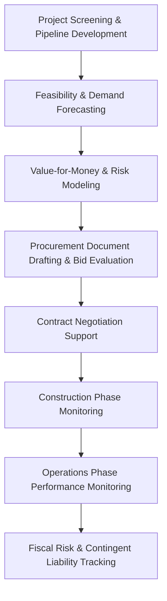

## Artificial Intelligence Applications in PPP Preparation and Monitoring

### Framing: State of Practice vs. Projected Application

**Key Points**

- Unlike the preceding chapter items, this topic does not correspond to an established, standardized body of institutional practice — there is no widely adopted "standard architecture" for AI in PPP transactions comparable to, say, standard-form concession agreements or PSC methodologies
- Available documented material is currently limited to academic literature (case studies, systematic reviews) and general project-management AI applications adapted conceptually to the PPP context, rather than a mature toolset with named platforms in routine institutional use [Unverified: broader adoption may exist within individual DFIs, PPP units, or advisory firms that has not been published in accessible literature]
- This content therefore separates clearly documented use cases from reasoned extrapolation of where AI application logic points, and labels the latter explicitly
- Treat this topic as an analytical/forward-looking area of PPP practice, not a settled technical reference

### Where AI Intersects the PPP Project Lifecycle

### Documented / Emerging Application Areas

**Key Points**

- **Climate and environmental risk management** — a documented research stream (systematic reviews) examines AI-supported monitoring of climate risk exposure across PPP infrastructure asset lifecycles, though this remains at the research/framework-proposal stage rather than deployed institutional practice with researchers recommending development of intelligently monitored systems and comprehensive databases to support climate risk management in PPP infrastructure [ResearchGate](https://www.researchgate.net/publication/375195285_A_systematic_review_of_Artificial_Intelligence_in_managing_climate_risks_of_PPP_infrastructure_projects)
- **AI-integrated financing model design** — at least one documented case study applies AI-technology integration to PPP financing model design for infrastructure construction (an industrial park context), analyzing the PPP financing model's application combined with AI technology and evaluating outcomes against value-for-money criteria, though the authors themselves note that more case studies are needed to establish AI's availability and reliability across the broader range of PPP construction contexts [PubMed Central](https://pmc.ncbi.nlm.nih.gov/articles/PMC9303115/)[Wiley Online Library](https://onlinelibrary.wiley.com/doi/10.1155/2022/6154885)
- **General project management augmentation** — broader (non-PPP-specific) research on AI in project management, surveying practitioner expectations across standard project management knowledge areas, indicates a general practitioner expectation that AI will become an integrated part of future project management practice and will affect project management knowledge areas — relevant as directional context but not PPP-specific evidence [ResearchGate](https://www.researchgate.net/publication/387029646_Examining_the_Security_of_Artificial_Intelligence_in_Project_Management_A_Case_Study_of_AI-driven_Project_Scheduling_and_Resource_Allocation_in_Information_Systems_Projects)
- **AIOps-style infrastructure monitoring** — architectures developed for IT/data-center infrastructure monitoring using machine learning demonstrate a transferable technical pattern (automated anomaly detection, operational monitoring pipelines) that is conceptually adjacent to physical infrastructure asset monitoring, though such working architectures are noted as not directly replicable across domains due to differing business scenarios and data characteristics — meaning direct transfer to PPP physical-asset monitoring should not be assumed without domain-specific validation [Inference] [ResearchGate](https://www.researchgate.net/publication/387029646_Examining_the_Security_of_Artificial_Intelligence_in_Project_Management_A_Case_Study_of_AI-driven_Project_Scheduling_and_Resource_Allocation_in_Information_Systems_Projects)

### Projected Application Areas by Lifecycle Stage

The following organizes plausible application logic by PPP lifecycle stage. These are **reasoned extrapolations from AI capabilities generally and adjacent-domain practice**, not documented PPP-sector deployments, and are labeled as such throughout.

| Lifecycle Stage | Projected AI Application | Basis |
| --- | --- | --- |
| Pipeline screening | Automated scanning of infrastructure needs data, demographic/economic indicators, and sector benchmarks to flag candidate PPP projects | [Speculation] — extrapolated from general data-analytics practice in infrastructure planning |
| Demand forecasting | Machine learning models supplementing traditional econometric traffic/demand forecasting with additional data sources (satellite imagery, mobile location data, economic nowcasting) | [Inference] — builds on documented ML forecasting practice in adjacent transport/utility analytics, not PPP-specific literature found in this search |
| VfM and risk modeling | Scenario simulation and Monte Carlo-style risk modeling enhanced by ML-based parameter estimation, replacing or supplementing manual sensitivity analysis | [Speculation] |
| Bid document review | Natural language processing to flag inconsistencies, compliance gaps, or ambiguous clauses across bid submissions or draft concession agreements | [Speculation] — plausible given general-purpose NLP contract-review tools in commercial legal tech, but no PPP-sector-specific case evidence found |
| Bid evaluation support | Automated first-pass scoring against defined technical criteria, with human evaluators retaining final judgment | [Speculation] — raises procurement-integrity questions requiring careful governance (see below) |
| Construction monitoring | Computer vision analysis of site imagery/drone footage for progress tracking against schedule baselines | [Inference] — this specific application is documented in general construction-management literature outside the PPP-specific search results returned here |
| Availability/performance monitoring | Automated anomaly detection on IoT/sensor data streams from operational assets (e.g., water quality sensors, traffic sensors) feeding into availability-payment deduction calculations | [Speculation] |
| Fiscal risk tracking | Dashboard aggregation and early-warning flagging of contingent liability exposure across a government's PPP portfolio | [Speculation] |

### Governance and Risk Considerations Specific to PPP Application

**Key Points**

- **Procurement integrity risk** — using AI to support or automate bid evaluation raises acute fairness and transparency concerns given the legal sensitivity of PPP procurement (see prior chapter items on competitive procurement and bid challenges); any AI-assisted scoring would need to be fully explainable and auditable to withstand a bid protest, which currently favors AI as a *decision-support* tool rather than an autonomous evaluator [Inference]
- **Model risk in demand forecasting** — PPP structures (particularly user-pay/demand-risk concessions) have a documented history of forecasting failure (optimism bias in traffic and demand studies is a long-standing, well-documented PPP risk independent of AI); introducing ML-based forecasting does not eliminate this risk and may obscure it behind reduced model interpretability if not carefully validated against traditional methods [Inference]
- **Data availability and quality constraints** — many jurisdictions procuring PPPs, particularly in developing economies, may lack the historical data density required to train reliable ML models for demand or risk forecasting, limiting near-term applicability outside data-rich markets [Inference]
- **Accountability for AI-informed contingent liability decisions** — if AI tools inform fiscal risk assessments feeding into approval memoranda (see prior chapter item), the same governance discipline requiring human-accountable, auditable decision trails applies; an AI-generated risk estimate does not reduce the approving body's need for a defensible, explainable rationale [Inference]

### A Note on Terminology Ambiguity

**Key Points**

- Published material in this space sometimes conflates several distinct concepts under "AI in PPP": (1) AI as a subject-matter of the PPP itself (e.g., a PPP to build AI/data-center infrastructure), (2) AI as a *tool* used by PPP practitioners during preparation/monitoring, and (3) AI-driven smart-city/smart-infrastructure systems operated *by* the PPP concessionaire as part of project scope
- This item concerns sense (2) — AI as a tool supporting the PPP transaction and contract management process — but readers should be alert to this ambiguity when reviewing source literature, since the documented case study found in this research (industrial park financing) leans more toward AI as project subject matter than as a preparation/monitoring tool

### Practical Guidance for Practitioners Evaluating AI Tools in This Space

**Next Steps**

- Treat vendor or consultant claims of "AI-powered PPP" tools with the same scrutiny applied to any unproven methodology in a legally and fiscally consequential transaction — request explainability documentation and a track record before relying on outputs for approval-memo-grade decisions
- Where AI tools are piloted (e.g., in demand forecasting or document review), run them in parallel with traditional methods initially, rather than as a replacement, to build a comparative evidence base specific to the practitioner's institutional context
- Monitor multilateral development bank and PPP knowledge-platform publications (e.g., World Bank PPP Knowledge Lab, GI Hub) for emerging institutional guidance, as formal institutional practice in this area is likely to develop faster than academic literature currently reflects [Unverified]

**Related Topics**

- Demand Forecasting Methodologies and Optimism Bias in User-Pay PPPs
- Data Governance and Explainability Requirements for AI in Public Sector Decision-Making
- Digital Twin and IoT-Based Performance Monitoring for Availability-Payment PPPs
- Legal and Procurement-Integrity Risks of Automated Bid Evaluation Tools
- Smart Infrastructure and AI-Enabled Assets as PPP Project Scope (distinct from AI-as-tool)
- Contingent Liability Dashboards and Portfolio-Level Fiscal Risk Monitoring