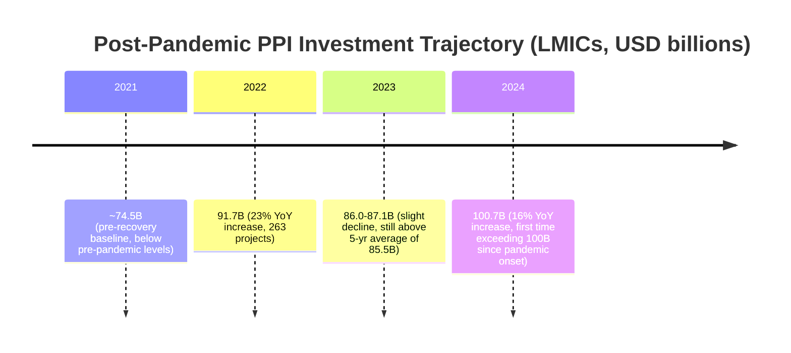

## Post-Pandemic Shifts in Global PPP Markets

### Overview

The COVID-19 pandemic (2020–2022) acted as a structural stress test for Public-Private Partnership (PPP) markets worldwide, exposing weaknesses in demand-risk allocation, contract flexibility, and fiscal capacity, while simultaneously accelerating certain trends already underway — digitalization, climate integration, and a search for alternative financing sources amid strained public balance sheets. The period since has been shaped less by the pandemic itself and more by its downstream macroeconomic consequences: a global inflation shock, a rapid rise in interest rates, tightened private financing conditions, and elevated sovereign debt distress in many emerging markets.

This topic surveys how PPP volumes, deal structures, sector composition, risk allocation practice, and institutional approaches have shifted from roughly 2020 through the most recent available market data (2024–2025).

### Phase 1: The Pandemic Shock (2020–2021)

**Key Points**

- **Collapse in demand-risk projects**: Toll roads, airports, and ports with demand-based revenue models suffered severe traffic and revenue declines, triggering widespread requests for relief, deferrals, and contract renegotiation.
- **Construction delays**: Lockdowns, labor shortages, and supply chain disruption delayed greenfield project completion across sectors.
- **Financing market freeze**: Institutional lenders and bond markets tightened during acute uncertainty in 2020, slowing financial close on projects in procurement.
- **Fiscal space contraction**: Governments diverted budgets to health response and stimulus, reducing near-term capacity to support new PPP pipelines or honor availability payment commitments at pre-pandemic levels.
- **Force majeure disputes**: Many existing concession contracts lacked clear pandemic/epidemic clauses, leading to prolonged disputes over whether COVID-19 qualified as a relief event.

**Example**

An airport PPP concession structured around passenger-volume-linked revenue saw traffic drop by over 90% in mid-2020. Absent a pandemic-specific relief clause, the concessionaire and grantor entered prolonged negotiation over debt service relief, extension of the concession term, and revised minimum revenue guarantees — a pattern repeated across transport PPPs globally.

### Phase 2: Recovery and Reallocation (2022–2023)

World Bank data found that private participation in infrastructure (PPI) commitments in low- and middle-income countries reached $91.7 billion across 263 projects in 2022, a 23% increase from 2021, though the total number of projects remained below pre-pandemic levels. This pattern — investment value recovering faster than deal count — became a defining feature of the recovery phase: **fewer but larger deals**, concentrated among more bankable projects and stronger sponsors. [worldbank](https://www.worldbank.org/en/news/press-release/2023/04/24/data-show-private-infrastructure-investment-continues-to-improve-following-pandemic-slump)[worldbank](https://www.worldbank.org/en/news/press-release/2023/04/24/data-show-private-infrastructure-investment-continues-to-improve-following-pandemic-slump)

**Key Points**

- **Uneven recovery by income level**: Global private investment in infrastructure in primary markets rose by 10% in nominal terms in 2023, with the majority of growth concentrated in developed markets, while low- and middle-income countries experienced a slight decline. [FNTP](https://www.fntp.fr/infrastructure-monitor-2023-global-trends-in-private-investment-in-infrastructure/)
- **Inflation and rate shock**: Global growth slowed amid high interest rates, with inflation pressures elevated across many economies, and in about a quarter of developing countries annual inflation was forecast to exceed 10% in 2024, directly affecting PPP construction costs, debt service, and tariff-setting mechanisms. [un](https://www.un.org/en/node/213647)[un](https://www.un.org/en/node/213647)
- **Real cost of delivery increased**: Infrastructure delivery costs rose significantly, potentially around 10 percentage points above general inflation based on construction cost indices across G20 countries, compressing project margins and requiring re-underwriting of previously approved feasibility studies. [FNTP](https://www.fntp.fr/infrastructure-monitor-2023-global-trends-in-private-investment-in-infrastructure/)
- **Secondary market slowdown**: Secondary market investment (asset transfers, refinancing, stake sales) declined by 17% in 2023, largely reflecting the effect of higher interest rates on asset valuations, reducing exit liquidity for early-stage infrastructure investors. [FNTP](https://www.fntp.fr/infrastructure-investment-outlook-2025/)

### Phase 3: Sectoral Reallocation Toward Green and Resilient Infrastructure

A defining post-pandemic shift has been the reweighting of PPP pipelines toward decarbonization-aligned sectors, driven by investor demand, DFI mandates, and net-zero policy commitments layered on top of pandemic-era stimulus packages (many of which were explicitly framed as "green recovery" programs).

**Key Points**

- In 2023, more than half of private investment in infrastructure projects globally was green investment, predominantly renewables but extending across other infrastructure sectors. [Global Infrastructure Hub](https://www.gihub.org/infrastructure-monitor/)
- Renewables investment more than doubled in 2023, including a surge in hydrogen projects, though wind and solar remained the most prevalent technologies. [Global Infrastructure Hub](https://www.gihub.org/infrastructure-monitor/)
- The distribution of new PPI project investments has structurally shifted toward low-carbon assets: prior to 2010 the split between conventional and low-carbon projects was roughly even, but after 2010 the number of new low-carbon projects more than doubled the number of conventional ones. [Worldbank](https://ppi.worldbank.org/en/ppi)
- This shift compounds a pre-pandemic trend rather than being solely pandemic-driven, but the post-2020 period saw it accelerate materially as climate finance and PPP pipelines converged (see also: *Integrating Climate Risk Screening into PPP Preparation*, *Green and Sustainability-Linked Financing Instruments for PPPs*).

### Phase 4: Institutional Investor Behavior and Financing Structures

**Key Points**

- **Continued institutional appetite despite higher rates**: Even as base rates rose, infrastructure retained appeal as an inflation-linked, long-duration asset class for pension funds and insurers, though deal-level economics tightened.
- **Fund-based capital mobilization**: Infrastructure funds — pooled vehicles mobilizing capital from public and private investors for defined purposes — became an increasingly popular financing instrument in the post-pandemic period. [Global Infrastructure Hub](https://www.gihub.org/infrastructure-monitor/)
- **Deal activity divergence from private equity**: Unlike the rebound seen in private equity buyouts, infrastructure deal activity saw further declines in both count and size through 2024 amid persistent financing challenges, despite investor expectations of a rebound following the sharp 2023 decline. [FNTP](https://www.fntp.fr/infrastructure-investment-outlook-2025/)
- **Record year in 2024**: PPI investment in developing countries reached $100.7 billion in 2024 — a 16% increase from 2023's $87.1 billion and 20% above the prior five-year average — marking the first time PPI investment exceeded $100 billion since the onset of the COVID-19 pandemic. [Inference — this figure reflects low- and middle-income country PPI specifically, per the World Bank's PPI Database methodology, not total global infrastructure investment, which is tracked separately by sources such as the Infrastructure Monitor.] [Worldbank](https://ppi.worldbank.org/en/ppi)

### Phase 5: Regional Divergence

**Key Points**

- **Advanced economies**: Recovery and growth in PPP/private infrastructure investment outpaced developing economies, aided by stronger fiscal capacity, deeper capital markets, and green-stimulus-linked pipelines.
- **Latin America and the Caribbean**: Investment in infrastructure PPPs increased by almost 14% across the region, with total project investment over 2014–2023 reaching approximately US$160 billion, and PPPs accounting for an average of 11% of total infrastructure spending over the most recent decade, up from 9% during 2011–2020. Brazil, Chile, and Colombia were identified as the region's best-performing markets, leading in financial maturity and regulatory/institutional strength, though the broader region still shows a long road ahead in project preparation support, sustainability criteria, risk management, and contract monitoring. [2023/24 Infrascope : Measuring the Enabling Environment for Public-Private Partnerships in Infrastructure in Latin America and the Caribbean - Fédération Nationale des Travaux Publics (FNTP) +2](https://www.fntp.fr/the-2021-22-infrascope-evaluating-the-environment-for-public-private-partnerships-in-latin-america-and-the-caribbean/)
- **Frontier and low-income markets**: These markets experienced the most pronounced pandemic-recovery lag, compounded by currency depreciation, debt distress, and reduced DFI risk appetite for non-investment-grade sovereigns.
- **Emerging market macro backdrop**: Eastern Europe, Latin America, and much of Africa faced a pronounced inflationary cycle following the pandemic, worsened by the war in Ukraine's disruption of food, energy, and commodity supply, which weakened domestic demand and forced aggressive central bank rate hikes to defend currencies — all of which fed directly into PPP financing costs and tariff-affordability constraints in these regions. [deloitte](https://www.deloitte.com/us/en/insights/topics/economy/emerging-markets-outlook-02-2023.html)

### Phase 6: Renegotiation as a Strategic Tool, Not Just a Crisis Response

One of the more structurally significant shifts is a changed attitude toward contract renegotiation — from a last-resort dispute mechanism to a deliberate tool for modernizing legacy concessions.

**Key Points**

- The post-COVID-19 environment presents an opportunity to adapt infrastructure assets to ensure they remain fit for the future, particularly by embedding sustainability into asset management to address both short- and long-term climate impacts. [International Institute for Sustainable Development](https://www.iisd.org/articles/deep-dive/reconsidering-ppps-developing-countries)
- A core challenge is that typical 25–30 year PPP contract periods do not reflect a rapidly changing world, prompting renewed interest in built-in flexibility mechanisms (review dates, re-openers, indexation adjustments) rather than static long-term terms. [International Institute for Sustainable Development](https://www.iisd.org/articles/deep-dive/reconsidering-ppps-developing-countries)
- Governments face a choice in renegotiation between approaching it adversarially — including the risk of nationalization and associated investment arbitration exposure — or collaboratively; since governments spent heavily on pandemic-era stimulus, they are generally in a weaker position to fund outright asset acquisition, while private sponsors require government cooperation to manage both reduced cash flow and future uncertainty. [International Institute for Sustainable Development](https://www.iisd.org/articles/deep-dive/reconsidering-ppps-developing-countries)[International Institute for Sustainable Development](https://www.iisd.org/articles/deep-dive/reconsidering-ppps-developing-countries)
- **Practical implication**: Renegotiation clauses, once viewed narrowly as dispute-resolution fallbacks, are increasingly drafted proactively as structured "asset modernization" mechanisms at defined intervals.

### Phase 7: Structural and Contractual Lessons Embedded into New PPP Design

**Key Points**

- **Broader force majeure/relief event definitions**: New contracts increasingly enumerate pandemics, epidemics, and public health emergencies explicitly, rather than relying on ambiguous "Act of God" language.
- **Reduced reliance on pure demand-risk models**: A shift toward availability-based payment mechanisms or hybrid structures (minimum revenue guarantees, revenue-sharing bands) for greenfield transport assets, reducing exposure to demand shocks.
- **Digital delivery and remote monitoring**: Accelerated adoption of digital construction management, remote asset monitoring, and e-procurement platforms — partly a pandemic-era necessity that persisted as an efficiency gain.
- **Greater emphasis on fiscal risk management tools**: Increased use of contingent liability registers and stress-testing government payment obligations under PPPs, given the fiscal pressure many governments experienced from pandemic-era contingent support.
- **Climate and ESG integration as standard practice**: What was an emerging consideration pre-pandemic became a mainstream due diligence and disclosure requirement for both public procuring authorities and private financiers post-pandemic.

### Synthesis: Structural Shift Summary Table

| Dimension | Pre-Pandemic Norm | Post-Pandemic Shift |
| --- | --- | --- |
| Deal volume vs. deal count | High volume, high count | Fewer, larger deals; concentration among strongest sponsors |
| Revenue risk model | Demand-risk common for transport | Shift toward availability-based/hybrid structures |
| Force majeure drafting | Vague "Act of God" language | Explicit pandemic/epidemic and climate-hazard clauses |
| Sector focus | Diversified, fossil-fuel-inclusive energy | Majority-green investment; renewables and hydrogen surge |
| Contract flexibility | Largely static long-term terms | Built-in review/re-opener mechanisms gaining favor |
| Regional distribution | More balanced growth across income levels | Developed markets recovering faster; EMDEs lagging, then rebounding by 2024 |
| Financing cost environment | Low-rate, abundant liquidity | Higher-for-longer rates, tighter financing conditions |
| ESG/climate role | Emerging, often voluntary | Mainstream, often mandatory for DFI-linked financing |

[Unverified — precise year-over-year percentage shifts in demand-risk vs. availability-payment structuring globally are not tracked in a single consolidated public dataset; this reflects an aggregated market-practice observation rather than a single-sourced statistic.]

### Outlook and Persistent Challenges

**Key Points**

- **Financing conditions remain a headwind**: Despite another challenging year for infrastructure investment in 2024 and a relatively soft start to 2025, investors remain cautiously optimistic about a recovery, suggesting the post-pandemic adjustment cycle has not fully resolved. [FNTP](https://www.fntp.fr/infrastructure-investment-outlook-2025/)
- **Debt distress overhang**: Developing countries, especially least developed countries and small island developing states, continue to be weighed down by heavy debt burdens, rising interest costs, weakening investment, and increasing climate-related vulnerabilities, constraining new PPP pipeline development in the most fiscally constrained markets. [un](https://www.un.org/en/node/213647)
- **Bifurcated market trajectory**: The data suggests an emerging two-speed global PPP market — a maturing, green-oriented, higher-value deal market in advanced and upper-middle-income economies, versus a slower, more constrained recovery in lower-income and highly indebted markets. [Inference — this framing synthesizes the cited investment and macroeconomic data into a market-structure interpretation rather than restating a single source's explicit conclusion.]

### Related Topics

- Contingent Liability Management for Governments in PPP Portfolios
- Renegotiation Frameworks and Re-Opener Clause Design in Long-Term Concessions
- Availability Payment vs. Demand-Risk Structuring: Post-Pandemic Design Choices
- Green and Sustainability-Linked Financing Instruments for PPPs
- Sovereign Debt Distress and Its Effect on PPP Pipeline Viability in Emerging Markets
- Infrastructure Funds as a Capital Mobilization Vehicle
- Digitalization of PPP Procurement and Asset Monitoring
- Regional PPP Market Maturity Benchmarking (e.g., Infrascope-style indices)