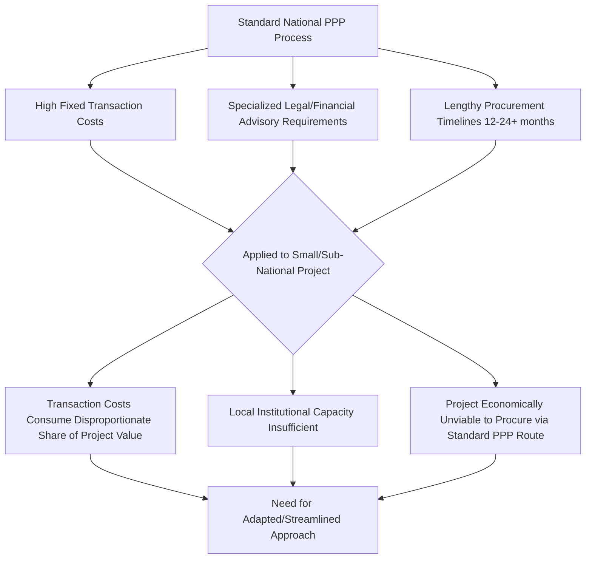
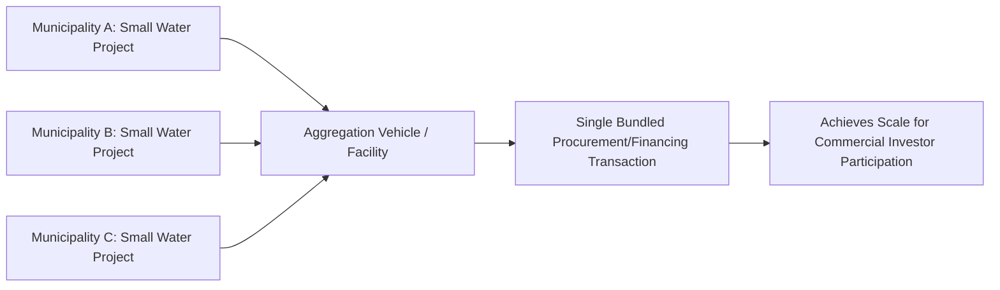

## Small-Scale and Sub-National PPP Innovations

### Definition and Scope

**Key Points**

- Small-scale PPPs are transactions sized below the threshold where traditional national PPP procurement, financing, and advisory infrastructure is economically justified — commonly cited working thresholds range from under $10M to under $50M depending on jurisdiction and sector, though no universal definition exists [Inference: thresholds vary by country PPP unit policy and are often defined administratively rather than economically]
- Sub-national PPPs are transactions procured and contracted by a government tier below national/central government — municipalities, provinces, states, regional authorities, or special-purpose local government entities
- The two categories overlap heavily but are analytically distinct: a sub-national government can procure a large PPP (e.g., a major state-level toll road), and a national government can procure a small PPP (e.g., a single rural health clinic); this topic addresses the intersection where small scale and sub-national capacity constraints compound each other
- This is a genuinely emerging area of PPP practice with active institutional experimentation (multilateral development banks, national PPP units, and municipal finance facilities are actively piloting adapted approaches) rather than a single settled methodology — the content below synthesizes documented approaches and reasoned adaptations of standard PPP practice, distinguished accordingly

### Why Standard PPP Practice Under-Serves This Segment

**Key Points**

- Transaction preparation and advisory costs for a standard PPP (legal, financial, technical advisory) are largely fixed regardless of project size, meaning they consume a much larger percentage of total project value on small transactions — commonly cited as a core structural barrier
- Sub-national governments frequently lack dedicated PPP units, specialized procurement staff, or repeat-transaction experience that national PPP units accumulate, creating a capacity gap independent of project size
- Standard PPP procurement timelines (often 12–24+ months from concept to Financial Close) are difficult to justify for smaller projects where the value of speed and simplicity outweighs the value of the exhaustive competitive process appropriate for major infrastructure

### Documented Adaptation Approaches

**Standardized/Templated Transaction Structures**

**Key Points**

- Development of standard-form contracts, model concession agreements, and pre-vetted risk allocation templates specific to common small-scale project types (e.g., streetlighting, small water systems, local health facilities, school infrastructure) to reduce bespoke legal drafting costs
- Templating works best where project types are highly replicable with limited site-specific variation — streetlighting and small solar/mini-grid concessions are commonly cited as strong candidates given their standardized technical and commercial structure

**Example**

A national PPP unit or municipal finance facility might publish a model concession agreement for municipal streetlighting PPPs with pre-agreed risk allocation, standard performance specifications, and a simplified procurement document set, allowing municipalities to adapt rather than draft from scratch — reducing legal advisory cost as a share of project value.

**Aggregation and Bundling**

**Key Points**

- Bundling multiple small, similar projects (across one or several sub-national jurisdictions) into a single procurement and financing transaction to achieve the scale needed to attract commercial financing and justify transaction costs
- Can occur within a single sub-national entity (bundling multiple small facilities into one concession) or across multiple sub-national entities (a regional or national facility aggregating municipal projects into a single bond issuance or portfolio financing)

**Example**

A regional municipal infrastructure facility might aggregate 15 small municipal solid waste management concessions across a province into a single portfolio financed via one bond issuance, spreading due diligence and legal costs across the aggregated portfolio rather than 15 separate small transactions.

**Sub-National Pooled Financing Facilities**

**Key Points**

- Specialized intermediary institutions (municipal development funds, sub-national pooled financing vehicles) that aggregate creditworthiness assessment, provide technical assistance, and access capital markets on behalf of multiple smaller sub-national borrowers
- Addresses the credit-rating and capital-market-access gap facing individual small municipalities that lack the scale or track record for direct capital market issuance
- Documented examples of the general model (pooled municipal financing, distinct from PPP-specific aggregation) exist in various forms across multiple countries' municipal finance systems [Inference: specific institutional structures vary significantly by country and are not detailed here to avoid presenting jurisdiction-specific mechanics as universal]

**Simplified/Streamlined Procurement Procedures**

**Key Points**

- Adapted procurement processes for small-value PPPs, such as single-stage (rather than two-stage) procurement, shortened bidding periods, simplified qualification criteria, and reduced documentation requirements calibrated to project value
- Some national PPP frameworks establish formal value-based thresholds triggering a lighter-touch procurement track for smaller transactions, distinct from the full-scale process used for major infrastructure
- Trade-off: simplified procedures reduce transaction cost and timeline but may also reduce the competitive tension and risk-allocation rigor that protects value-for-money on larger transactions — the appropriate simplification threshold is a live policy design question rather than a settled parameter [Inference]

**Capacity-Building and Shared Technical Assistance**

**Key Points**

- Centralized technical assistance facilities (often housed within national PPP units, regional development banks, or donor-funded programs) providing shared transaction advisory support to multiple sub-national governments, rather than each municipality procuring bespoke advisory services
- Secondment or rotation of experienced national PPP unit staff to support sub-national transactions, transferring institutional knowledge without requiring each sub-national entity to build standalone capacity
- Standardized training curricula and toolkits (screening checklists, template risk matrices, simplified financial model templates) distributed to sub-national procuring entities

### Financing Innovations for Small-Scale/Sub-National PPPs

| Innovation | Mechanism | Primary Constraint Addressed |
| --- | --- | --- |
| Municipal/sub-national bonds (including green/social bonds) | Direct capital market access by creditworthy sub-national entities | Reliance on bank debt or central government transfers |
| Credit enhancement/guarantees for sub-national borrowers | Partial guarantee improving sub-national credit profile to attract commercial lenders | Weak or unrated sub-national credit standing |
| Revenue intercept mechanisms | Structured mechanism allowing lenders recourse to sub-national government's intergovernmental transfer revenue in case of default | Limited direct revenue base of smaller sub-national entities |
| On-lending through national development banks | National DFI borrows at favorable terms and on-lends to sub-national entities for PPP-related capital needs | Sub-national entities' inability to access capital markets directly |
| Blended finance layering (see related chapter item) | Concessional capital de-risking smaller/sub-national transactions to attract commercial co-financing | Bankability gap disproportionately affecting smaller transactions |

### Risk Allocation Considerations Specific to This Segment

**Key Points**

- Sub-national governments frequently have weaker fiscal capacity and less diversified revenue bases than national governments, meaning risk allocation decisions that are manageable at national level (e.g., government payment obligations under availability payment structures) may create disproportionate fiscal stress at sub-national level
- Political risk and continuity risk can be more acute at sub-national level where electoral cycles, local political dynamics, or changes in local administration may threaten contract continuity in ways less pronounced nationally [Inference]
- National government backstops, guarantees, or co-signing arrangements are a common (though not universal) mechanism to address sub-national creditworthiness gaps, but introduce moral hazard and fiscal decentralization policy questions that vary by country's intergovernmental fiscal framework [Inference]

### Sector Patterns Where Small-Scale/Sub-National PPPs Are Most Common

| Sector | Typical Small-Scale Application |
| --- | --- |
| Water and sanitation | Small municipal water treatment systems, decentralized sanitation |
| Energy | Mini-grids, streetlighting, small solar installations |
| Social infrastructure | Single school facilities, primary health clinics, local government buildings |
| Solid waste management | Municipal waste collection and small-scale treatment/disposal facilities |
| Local transport | Municipal parking facilities, local bus terminals, non-motorized transport infrastructure |
| Digital infrastructure | Last-mile connectivity, local public Wi-Fi/digital access points |

### Common Implementation Challenges

**Key Points**

- Even with templated documents and streamlined procedures, sub-national governments often still lack the ongoing contract management capacity required to monitor performance and enforce PPP contracts over multi-year concession terms — front-loaded transaction support does not resolve back-end capacity gaps
- Aggregation and bundling introduce coordination complexity across multiple sub-national entities with potentially differing priorities, timelines, and political dynamics, which can offset some of the transaction-cost savings the approach is intended to achieve
- Standardization/templating risks producing a "one-size-fits-all" structure poorly suited to genuine local variation in project economics or community needs if applied too rigidly [Inference]
- Evidence base on long-term outcomes (post-Financial-Close performance, renegotiation rates, value-for-money realized) for small-scale and sub-national PPP innovations remains comparatively limited relative to the evidence base for large national PPPs, given the more recent and less standardized nature of these approaches [Unverified: this reflects the relative novelty and lower transaction volume of documented small-scale/sub-national cases rather than a confirmed finding of poorer performance]

### Illustrative Comparison: Standard vs. Adapted PPP Process (svg_diagram)

<svg xmlns="http://www.w3.org/2000/svg" viewBox="0 0 760 280">
<text x="380" y="24" text-anchor="middle" font-size="15" font-weight="bold" fill="#1a1a1a">Standard vs. Adapted Small-Scale PPP Process (svg_diagram)</text>
<text x="190" y="50" text-anchor="middle" font-size="12" font-weight="bold" fill="#3b6ea5">Standard National PPP</text>
<rect x="30" y="65" width="130" height="40" rx="5" fill="#eef4fb" stroke="#3b6ea5" />
<text x="95" y="89" text-anchor="middle" font-size="10" fill="#1a1a1a">Bespoke Legal Drafting</text>
<rect x="30" y="115" width="130" height="40" rx="5" fill="#eef4fb" stroke="#3b6ea5" />
<text x="95" y="139" text-anchor="middle" font-size="10" fill="#1a1a1a">Two-Stage Procurement</text>
<rect x="30" y="165" width="130" height="40" rx="5" fill="#eef4fb" stroke="#3b6ea5" />
<text x="95" y="189" text-anchor="middle" font-size="10" fill="#1a1a1a">Full Advisory Team</text>
<rect x="30" y="215" width="130" height="40" rx="5" fill="#eef4fb" stroke="#3b6ea5" />
<text x="95" y="239" text-anchor="middle" font-size="10" fill="#1a1a1a">12-24+ Month Timeline</text>

<text x="570" y="50" text-anchor="middle" font-size="12" font-weight="bold" fill="`#a53b3b`">Adapted Small-Scale Approach</text>

<rect x="500" y="65" width="140" height="40" rx="5" fill="`#fbeeee`" stroke="`#a53b3b`" />

<text x="570" y="89" text-anchor="middle" font-size="10" fill="`#1a1a1a`">Template Model Agreement</text>

<rect x="500" y="115" width="140" height="40" rx="5" fill="`#fbeeee`" stroke="`#a53b3b`" />

<text x="570" y="139" text-anchor="middle" font-size="10" fill="`#1a1a1a`">Single-Stage Simplified Process</text>

<rect x="500" y="165" width="140" height="40" rx="5" fill="`#fbeeee`" stroke="`#a53b3b`" />

<text x="570" y="189" text-anchor="middle" font-size="10" fill="`#1a1a1a`">Shared/Centralized Advisory</text>

<rect x="500" y="215" width="140" height="40" rx="5" fill="`#fbeeee`" stroke="`#a53b3b`" />

<text x="570" y="239" text-anchor="middle" font-size="10" fill="`#1a1a1a`">Compressed Timeline</text>

<line x1="160" y1="85" x2="500" y2="85" stroke="#999" stroke-dasharray="4" />
<line x1="160" y1="135" x2="500" y2="135" stroke="#999" stroke-dasharray="4" />
<line x1="160" y1="185" x2="500" y2="185" stroke="#999" stroke-dasharray="4" />
<line x1="160" y1="235" x2="500" y2="235" stroke="#999" stroke-dasharray="4" />
</svg>

**Related Topics**

- Municipal Creditworthiness Assessment and Sub-National Fiscal Capacity
- Pooled Financing Vehicles and Municipal Bond Market Development
- Blended Finance and PPPs for the Sustainable Development Goals (capital-stack de-risking applied to smaller transactions)
- Model Concession Agreements and Contract Standardization for Repeatable PPP Types
- Intergovernmental Fiscal Transfers and PPP Guarantee/Backstop Design
- Contract Management Capacity Building for Sub-National Procuring Entities
- Value-for-Money Assessment Calibration for Small-Value PPP Transactions