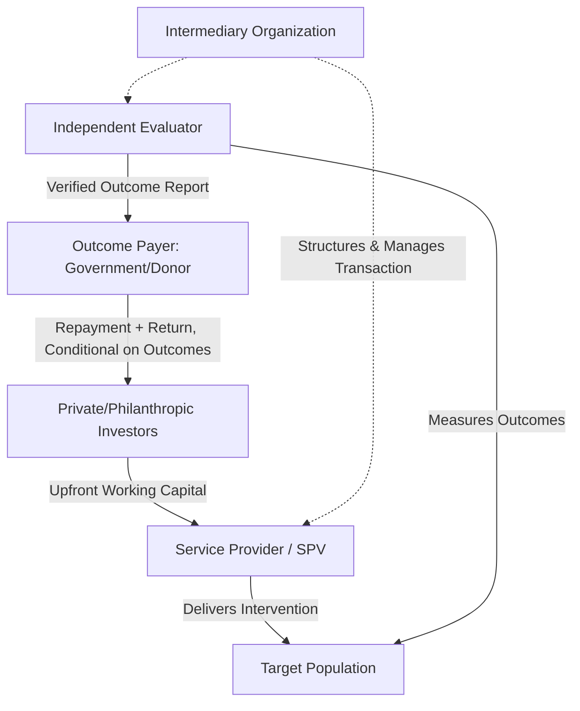

## Outcome-Based and Social Impact Bond Hybrids

### Definition and Conceptual Foundation

**Key Points**

- Outcome-based financing ties payment (in whole or part) to independently verified achievement of predefined results, rather than to inputs delivered or activities performed
- Social Impact Bonds (SIBs) — also called Pay-for-Success (PFS) contracts in some jurisdictions — are a specific outcome-based financing instrument where private/philanthropic investors provide upfront working capital to a service provider, and a government (or other outcome payer) repays investors with a return only if independently verified outcomes are achieved
- A "PPP hybrid" in this context refers to structures that combine traditional PPP infrastructure delivery and risk-allocation mechanics with outcome-based payment logic — moving PPP payment mechanisms beyond simple availability or output-specification compliance toward payment conditioned on verified social/development outcomes
- Despite the name, SIBs are technically neither bonds (no fixed coupon, principal-at-risk) nor guaranteed-return instruments — the terminology is a historical convention that persists despite being a source of frequent confusion

### Distinguishing the Core Instrument Family

| Instrument | Payment Trigger | Typical Application |
| --- | --- | --- |
| Traditional availability-payment PPP | Asset availability and output-specification compliance | Infrastructure (roads, hospitals, schools as buildings) |
| Performance-based PPP (standard) | Service-level compliance (response times, maintenance standards) | Infrastructure with an operations/maintenance component |
| Social Impact Bond (SIB) / Pay-for-Success | Independently verified social outcome achievement | Social service delivery (recidivism reduction, employment, early childhood) |
| Development Impact Bond (DIB) | Same as SIB, but outcome payer is a donor/multilateral rather than domestic government | Development contexts where government outcome-payer capacity is limited |
| Outcome-based PPP hybrid | Blend: infrastructure/service delivery payment partially or fully conditioned on outcome metrics beyond simple output compliance | Emerging structures in health, education, and social infrastructure PPPs |

### Standard SIB Structure (Foundational Mechanics)

**Key Points**

- The outcome payer (typically government, sometimes a multilateral/donor in the Development Impact Bond variant) only disburses funds if the independent evaluator verifies that agreed outcome thresholds were met
- Investors bear the performance risk that the traditional PPP structure would allocate to the public sector or service provider under an input/output-based contract — this is the core risk-transfer innovation of the model
- An intermediary organization typically structures the transaction, manages relationships between investors, service providers, evaluators, and the outcome payer, and often absorbs significant transaction cost given the complexity of outcome measurement design

### How Outcome-Based Logic Is Integrated Into PPP Structures

**Key Points**

- Rather than a full standalone SIB, many "PPP hybrids" layer an outcome-payment tranche on top of a standard availability or output-based PPP payment mechanism — the base payment covers asset availability/output compliance, while a smaller variable tranche is tied to verified outcome achievement
- This hybridization addresses a structural limitation of pure SIBs: they are difficult to apply to capital-intensive infrastructure delivery (construction risk, long asset life) because investors providing only working capital for service delivery cannot efficiently also underwrite construction/financing risk at PPP scale
- Common hybrid design: the infrastructure/construction/availability component follows standard PPP risk allocation and financing (senior debt, equity, standard termination provisions), while an overlaid outcome-payment mechanism affects only a discrete performance fee or bonus/penalty tranche

**Example**

A social infrastructure PPP for a network of vocational training centers might structure: (1) a standard availability payment covering facility construction and maintenance (paid regardless of training outcomes, standard PPP risk allocation), plus (2) an outcome-linked bonus payment tied to independently verified job placement rates of program graduates, funded partly by a philanthropic outcomes fund rather than solely government budget.

### Payment Mechanism Design

$$P_{total} = P_{availability} + P_{outcome}$$

$$P_{outcome} = \sum_{i=1}^{n} w_i \cdot f_i(O_i, T_i)$$

Where $P_{availability}$ is the base availability/output-compliance payment, $P_{outcome}$ is the aggregate outcome-linked payment, $w_i$ is the weight assigned to outcome metric $i$, $O_i$ is the verified achieved outcome value, $T_i$ is the target threshold, and $f_i$ is a payment function (commonly linear scaling between a minimum threshold and a maximum cap, or a step-function paying only above threshold).

**Example**

A simple linear outcome payment function for an employment-outcome metric might be structured as:

$$f_i(O_i, T_i) = \min\left(1,\ \max\left(0,\ \frac{O_i - T_{min}}{T_{max} - T_{min}}\right)\right) \times C_i$$

Where $T_{min}$ is the minimum threshold below which no outcome payment is made, $T_{max}$ is the threshold at which full outcome payment is triggered, and $C_i$ is the maximum outcome payment ceiling for that metric.

### Outcome Verification Architecture

**Key Points**

- Independent, third-party verification is the structural cornerstone distinguishing genuine outcome-based payment from self-reported performance metrics — without it, the risk-transfer logic of the model collapses since the payer would be relying on the paid party's own outcome claims
- Verification typically requires: a pre-agreed outcome measurement methodology (often requiring a comparison/control group or historical baseline to isolate the intervention's causal effect from other factors), an independent evaluator contractually separate from the service provider, and a defined data collection and audit protocol
- Establishing attribution (did the intervention cause the outcome, versus other factors) is frequently the most technically and methodologically contested element of outcome-based structures, particularly for social outcomes where randomized control is often impractical or ethically constrained [Inference: the rigor achievable varies substantially by outcome type — an infrastructure output like "km of road completed to specification" is verifiable with far less methodological contention than a social outcome like "improved employment prospects"]

### Risk Allocation Implications

| Risk | Traditional Availability PPP | Outcome-Based Hybrid |
| --- | --- | --- |
| Construction/completion risk | Private party (standard) | Private party (typically unchanged) |
| Availability/output compliance risk | Private party (standard) | Private party (typically unchanged for base tranche) |
| Service delivery *effectiveness* risk | Generally public sector or unallocated | Shifted toward investors/service provider via outcome tranche |
| Outcome measurement/attribution risk | Not applicable | Shared or negotiated — often a point of dispute given methodological complexity |
| Outcome payer fiscal risk | Fixed/predictable (availability payment schedule) | More variable — payment amount depends on outcome performance, complicating fiscal forecasting |

### Advantages and Rationale

**Key Points**

- Aligns payment with genuine public value delivered rather than mere activity or asset availability, addressing a long-standing critique of standard PPPs that output specifications can be met while underlying social objectives are not
- Transfers performance/effectiveness risk to parties (investors, service providers) potentially better positioned to manage delivery quality and innovate on service design to improve outcomes
- Can mobilize philanthropic or impact-oriented capital (as in blended finance structures — see related chapter item) that would not otherwise participate in standard infrastructure financing, particularly for the outcome-linked tranche
- Generates rigorous, independently verified outcome data that can inform future policy design regardless of the specific transaction's financial outcome

### Challenges and Critiques

**Key Points**

- **High transaction cost and complexity** — designing robust outcome metrics, securing independent evaluation capacity, and structuring the layered payment mechanism significantly increases transaction preparation cost and timeline relative to standard PPP structures, a challenge compounded when applied at small scale (see prior chapter item on small-scale PPP innovations)
- **Metric selection distortion risk** — service providers may optimize narrowly for the specific measured outcome metric in ways that do not reflect genuine broader program value ("teaching to the test" dynamics), a well-documented critique in outcome-based social program literature generally
- **Limited applicability to capital-intensive infrastructure** — the model's origins in social service delivery (where working capital needs are modest relative to infrastructure PPPs) mean pure outcome-payment logic is difficult to scale to major infrastructure financing without the hybridization approach described above
- **Evidence base still developing** — the global track record of SIBs and PPP-outcome hybrids, while growing, remains comparatively limited relative to standard PPP structures, and evaluations of long-term value-for-money and fiscal efficiency compared to conventional grant-funded or standard PPP delivery show mixed results across different programs and jurisdictions [Unverified: the balance of evidence on comparative cost-effectiveness is contested in the literature and depends heavily on program type, making a general verdict inappropriate]
- **Outcome payer fiscal predictability** — variable outcome-linked payments complicate government budget forecasting relative to the fixed, predictable payment schedules of standard availability PPPs, a genuine trade-off against the model's alignment benefits

### Illustrative Payment Flow Comparison (svg_diagram)

<svg xmlns="http://www.w3.org/2000/svg" viewBox="0 0 760 260">
<text x="380" y="24" text-anchor="middle" font-size="15" font-weight="bold" fill="#1a1a1a">Availability vs. Outcome-Linked Payment Tranches (svg_diagram)</text>
<text x="190" y="50" text-anchor="middle" font-size="12" font-weight="bold" fill="#3b6ea5">Base Tranche (Standard PPP)</text>
<rect x="40" y="65" width="300" height="45" rx="5" fill="#eef4fb" stroke="#3b6ea5" />
<text x="190" y="92" text-anchor="middle" font-size="11" fill="#1a1a1a">Availability / Output Compliance</text>
<text x="190" y="128" text-anchor="middle" font-size="10" fill="#555">Fixed schedule, predictable, risk allocated per standard PPP terms</text>

<text x="570" y="50" text-anchor="middle" font-size="12" font-weight="bold" fill="`#a53b3b`">Overlay Tranche (Outcome-Linked)</text>

<rect x="420" y="65" width="300" height="45" rx="5" fill="`#fbeeee`" stroke="`#a53b3b`" />

<text x="570" y="92" text-anchor="middle" font-size="11" fill="`#1a1a1a`">Verified Social Outcome Achievement</text>

<text x="570" y="128" text-anchor="middle" font-size="10" fill="#555">Variable, conditional on independent verification</text>

<rect x="230" y="170" width="300" height="50" rx="5" fill="#fef6e6" stroke="#b8860b" />
<text x="380" y="200" text-anchor="middle" font-size="11" fill="#1a1a1a">Combined Total Payment to Concessionaire/SPV</text>
<line x1="190" y1="110" x2="330" y2="170" stroke="#333" marker-end="url(#arrow4)" />
<line x1="570" y1="110" x2="430" y2="170" stroke="#333" marker-end="url(#arrow4)" />
</svg>

**Related Topics**

- Blended Finance and PPPs for the Sustainable Development Goals (capital layering logic shared with outcome-payment tranches)
- Independent Verification and Attribution Methodology in Outcome-Based Contracts
- Development Impact Bonds and Donor-Funded Outcome Payer Structures
- Performance-Based Payment Mechanisms in Availability PPPs
- Fiscal Forecasting Challenges Under Variable Outcome-Linked Government Payments
- Designing Outcome Metrics to Minimize Perverse Incentive/Metric Distortion Risk