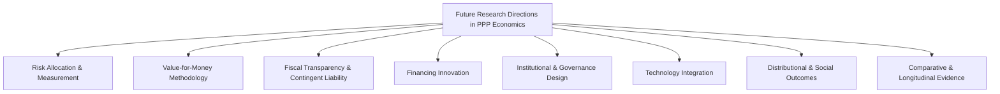

## Future Research Directions in PPP Economics

### Framing This Topic

**Key Points**

- This item differs from prior chapter items in kind: it surveys open questions and under-resolved debates in the field rather than documenting settled practice or mechanics
- Content is organized around genuinely contested or underdeveloped areas identifiable from the trajectory of topics covered across this course, distinguishing established critique (documented in PPP evaluation literature) from forward-looking research gaps [Inference: the specific framing and prioritization of research directions below reflects synthesis of recurring themes across the course rather than a single authoritative research agenda published by one institution]
- Intended use: as a orientation map for practitioners or researchers deciding where further inquiry would add the most value, not as a literature review of specific studies

### Map of Research Direction Clusters

### Cluster 1 — Risk Allocation and Measurement

**Key Points**

- Persistent gap between the theoretical principle that risk should be allocated to the party best able to manage it, and the practical difficulty of *quantifying* risk transfer to verify this principle is actually achieved in a given contract's pricing
- Open question: how should optimism bias in demand forecasts (a long-documented, recurring failure mode in user-pay PPPs) be systematically corrected for at the appraisal stage, and does correction methodology differ meaningfully across sectors and geographies?
- Under-researched: the actual realized risk allocation outcomes over full concession lifecycles (which risks materialized, who actually bore the cost) compared against the risk allocation *intended* at contract signing — most available evidence concentrates on ex-ante risk matrices rather than ex-post realization
- Research value: closing this gap would materially improve both PSC-based value-for-money analysis and termination payment formula design, both covered earlier in this course

### Cluster 2 — Value-for-Money Methodology

**Key Points**

- The Public Sector Comparator (PSC) methodology, while standard practice, rests on assumptions (discount rate selection, risk quantification technique, optimism bias adjustment) that are acknowledged even within mainstream practice to introduce significant result sensitivity — a persistent methodological research question is how to make VfM conclusions more robust to these assumption choices, or how to better communicate result sensitivity to approving bodies
- Open debate: whether purely quantitative VfM comparison adequately captures qualitative benefits of PPP delivery (innovation, whole-of-life asset management discipline, risk transfer behavioral effects) or systematically under- or over-states them relative to alternative delivery models
- Comparative methodology gap: limited cross-country standardization in VfM approach complicates international comparison of PPP performance and lesson transfer between jurisdictions [Inference]

### Cluster 3 — Fiscal Transparency and Contingent Liability

**Key Points**

- Continuing development need: standardized, internationally comparable public reporting frameworks for PPP contingent liabilities and off-balance-sheet fiscal exposure — practice varies significantly across countries in both disclosure requirements and statistical treatment
- Research question: how should fiscal risk ceilings and contingent liability caps (referenced in the approval memorandum item earlier in this course) be calibrated, and what is the appropriate balance between enabling productive PPP investment and protecting fiscal sustainability?
- Under-examined: aggregate portfolio-level fiscal risk across a government's full PPP program (rather than project-by-project analysis) and how correlated risk exposure across multiple concurrent PPP contracts (e.g., shared exposure to a common demand shock or currency movement) should be modeled

### Cluster 4 — Financing Innovation

**Key Points**

- Blended finance structures (covered earlier in this course) remain methodologically contested on the question of measuring genuine "additionality" and appropriate "minimum concessionality" — developing more rigorous, standardized measurement approaches is an active research need
- Outcome-based PPP hybrids (covered earlier in this course) require further evidence accumulation on comparative cost-effectiveness against standard delivery models, particularly for infrastructure-scale (versus pure social-service) applications
- Open question: how capital markets can be more effectively mobilized for small-scale and sub-national PPPs (covered earlier in this course) beyond aggregation and pooled financing — including whether structured securitization or specialized index products could deepen this market segment
- Emerging area: climate and resilience-linked financing instruments (sustainability-linked loans, green/climate bonds) as applied specifically to PPP capital structures, and how their pricing and covenant design should adapt to PPP-specific risk profiles [Inference: this is a rapidly evolving area where practice is likely outpacing published academic literature]

### Cluster 5 — Institutional and Governance Design

**Key Points**

- Comparative research gap on what institutional design features (centralized PPP unit structure, approval gate architecture, legal framework characteristics) most strongly predict successful PPP program outcomes, versus which are correlated but not causal
- Open question: how should procurement and negotiation frameworks (covered earlier in this course) be adapted for genuinely novel or complex project types where standard competitive procurement processes may be poorly suited (e.g., highly technically uncertain projects better suited to negotiated/competitive dialogue procedures)
- Under-researched: the long-term institutional capacity effects of sub-national PPP capacity-building initiatives — whether centralized technical assistance genuinely builds durable local capacity or creates ongoing dependency on centralized support

### Cluster 6 — Technology Integration

**Key Points**

- As covered earlier in this course, the evidence base on AI applications in PPP preparation and monitoring is genuinely nascent — a clear research need exists simply to document what is actually being piloted across PPP units and DFIs globally, since current academic literature substantially lags actual institutional experimentation [Inference]
- Open question: what governance and explainability standards should apply before AI-supported tools are relied upon in procurement-sensitive decisions (bid evaluation) or fiscally consequential decisions (approval memoranda, contingent liability estimation), given the legal and fiscal stakes involved
- Under-examined: digital infrastructure and IoT-based performance monitoring's actual effect on reducing information asymmetry between concessionaires and procuring authorities over the operations phase of a concession, and whether this measurably improves contract enforcement outcomes

### Cluster 7 — Distributional and Social Outcomes

**Key Points**

- Persistent research gap: systematic evidence on how PPP infrastructure delivery affects distributional outcomes — which populations bear tariff/user-pay costs versus which benefit from access improvements, and whether PPP delivery models systematically differ from public delivery on distributional equity
- Open question: how outcome-based and social-impact-linked payment structures (covered earlier in this course) could be extended to standard infrastructure PPPs to better capture distributional and access outcomes, not only technical/availability compliance
- Under-researched: the gender-differentiated impacts of PPP infrastructure projects (e.g., water/sanitation access effects, employment effects during construction and operations phases) remain comparatively underexamined relative to general PPP performance literature [Inference]

### Cluster 8 — Comparative and Longitudinal Evidence

**Key Points**

- The single most frequently cited structural gap across PPP research: limited longitudinal, comparative data tracking PPP performance across the *full* concession lifecycle (25–30+ years for many infrastructure concessions), since most available research concentrates on procurement-stage or early-operations-stage analysis
- Research value of renegotiation data: systematic study of PPP contract renegotiation patterns (frequency, terms, which risk allocations get renegotiated and why) would meaningfully inform both initial contract drafting practice and termination payment formula design
- Open question: how PPP performance compares against genuinely comparable counterfactual public-delivery projects (a persistent methodological challenge given the difficulty of constructing valid counterfactuals) rather than against theoretical PSC estimates alone

### Cross-Cutting Methodological Themes

**Key Points**

- **Data availability and standardization** — nearly every cluster above is constrained by inconsistent data collection, disclosure practices, and definitional standards across jurisdictions, making rigorous comparative research disproportionately difficult relative to the field's practical importance
- **Attribution and causality** — from demand forecasting to outcome-based payment verification to distributional impact assessment, establishing genuine causal attribution (versus correlation) remains a recurring methodological challenge across nearly all research clusters
- **Evidence lag behind practice** — technology integration and financing innovation areas in particular show academic literature meaningfully lagging actual institutional experimentation, suggesting practitioner-generated case documentation may be as valuable a research contribution as traditional academic study in the near term [Inference]

### Suggested Prioritization Framework for Researchers

**Next Steps**

- High-value, tractable near-term research: standardizing contingent liability disclosure methodology and building longitudinal renegotiation databases — both build on existing data collection practices and address widely acknowledged gaps
- High-value, methodologically challenging: rigorous counterfactual construction for PPP-versus-public-delivery comparison and outcome attribution in outcome-based structures — valuable but requires significant methodological innovation
- Emerging/fast-moving areas warranting close monitoring rather than premature synthesis: AI application in PPP processes and sustainability-linked financing instrument design, where practice is evolving faster than a stable research literature can currently characterize

**Related Topics**

- Value-for-Money Analysis and Public Sector Comparator Construction
- Contingent Liability Disclosure and Fiscal Risk Matrices for PPPs
- Blended Finance and PPPs for the Sustainable Development Goals
- Outcome-Based and Social Impact Bond Hybrids
- Small-Scale and Sub-National PPP Innovations
- Artificial Intelligence Applications in PPP Preparation and Monitoring
- Contract Renegotiation Patterns and Long-Term PPP Performance Evaluation