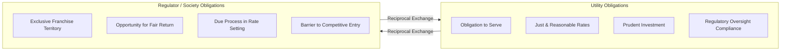

## Natural Monopoly Rationale and the Regulatory Compact

### Definition and Core Concept

A natural monopoly exists when a single firm can supply an entire market's demand at lower cost than two or more firms could, due to persistent economies of scale and/or scope. In public utility economics, this arises primarily in the network infrastructure segments of electricity, natural gas, water, and telecommunications — the wires, pipes, and physical distribution systems — rather than necessarily in generation or supply, which can be competitive.

The regulatory compact is the implicit and explicit bargain struck between government (through regulatory commissions) and utility investors: in exchange for accepting an exclusive franchise territory (freedom from competitive entry) and a legal obligation to serve all customers within that territory, the utility is granted the opportunity to earn a fair and reasonable return on its prudently invested capital, as determined through rate regulation rather than market competition.

### Economic Rationale for Natural Monopoly

**Key Points**

- Declining average cost curves: high fixed costs (poles, wires, pipes, substations) relative to low marginal costs of serving an additional customer mean average total cost falls as output rises across the relevant range of demand.
- Subadditivity of cost: a cost function $C(Q)$ is subadditive if for any split of total output $Q = q_1 + q_2$, $C(Q) < C(q_1) + C(q_2)$. This is the formal condition defining a natural monopoly — it is cheaper for one firm to produce the entire output than for multiple firms to split it.
- Duplication inefficiency: parallel distribution networks (redundant poles, trenches, pipes) waste capital and disrupt public rights-of-way, producing negative externalities beyond simple cost duplication.
- Network economies: value and efficiency of the system increase as more customers connect to a single integrated grid or pipeline network (positive network externalities).

The classic graphical representation shows a long-run average cost (LRAC) curve that continues declining well past the quantity demanded at any reasonable price, meaning the efficient market structure is a single supplier rather than several competing firms each operating at a suboptimal scale.

$$LRAC(Q) = \frac{FC + VC(Q)}{Q}$$

Where fixed cost $FC$ (sunk network infrastructure) dominates variable cost $VC(Q)$ across the observed range of $Q$, driving $LRAC$ downward as $Q$ increases.

### Market Failure Without Regulation

**Key Points**

- Unregulated monopoly problem: absent regulation, a franchised monopolist would set price at the profit-maximizing point where marginal revenue equals marginal cost ($MR = MC$), producing less output at a higher price than the competitive or efficient outcome, generating deadweight loss.
- Allocative inefficiency: the monopoly price exceeds marginal cost ($P > MC$), meaning some customers who value the service above its true cost of production are priced out.
- Ramsey pricing and second-best solutions are often invoked in rate design to approximate efficient outcomes when marginal-cost pricing would not allow full cost recovery (see related rate-design topics).
- Absent an obligation to serve, a monopolist could engage in discriminatory service refusal, cherry-picking profitable customers or areas (cream-skimming) and neglecting high-cost-to-serve territories.

### Elements of the Regulatory Compact

The regulatory compact is typically described as a reciprocal exchange with the following components:

**Utility Obligations**

- Obligation to serve: must connect and serve all customers within the franchise territory upon reasonable request, without unreasonable discrimination.
- Duty to provide safe, adequate, and reliable service.
- Duty to charge just and reasonable rates (no unjust discrimination among customer classes for similar service).
- Submission to comprehensive regulatory oversight of rates, accounting, financing, and service quality.
- Prudent investment standard: capital additions must be shown to be prudently incurred to be recovered in rates.

**Regulator/Society Obligations**

- Exclusive franchise (de jure or de facto monopoly territory), limiting or barring competitive entry.
- Opportunity (not guarantee) to earn a fair rate of return on prudently invested, used-and-useful capital.
- Rate-setting process that allows recovery of reasonable operating expenses plus a return sufficient to attract capital (see *Hope* and *Bluefield* constitutional standards below).
- Regulatory lag and due process protections against confiscatory ratemaking.

### Constitutional and Legal Foundations (U.S. Context)

Three landmark U.S. Supreme Court cases anchor the compact's legal architecture:

- ***Munn v. Illinois* (1877)**: established that private property "affected with a public interest" may be subject to public regulation, particularly where a business holds a virtual monopoly over an essential service (grain elevators, in that case).
- ***Smyth v. Ames* (1898)**: introduced the "fair value" rate base standard (later abandoned), requiring rates to be based on the fair present value of utility property, an approach later criticized as circular and volatile.
- ***Federal Power Commission v. Hope Natural Gas Co.* (1944)**: the controlling modern standard. The Court held that regulators need not use any single formula or method; the ultimate test is the reasonableness of the result, not the methodology — the "end result" doctrine. The return must be sufficient to (a) maintain the utility's credit, (b) attract capital, and (c) be commensurate with returns on investments of comparable risk.
- ***Bluefield Waterworks & Improvement Co. v. Public Service Commission* (1923)**: predates *Hope* but is frequently cited jointly; establishes that the utility is entitled to a return equal to that earned on investments of corresponding risk, sufficient to maintain financial soundness and attract capital under efficient management.

[Inference] Jurisdictions outside the U.S. (e.g., UK RPI-X regulation, EU unbundling regimes) frame the compact differently — often emphasizing price caps and structural separation of monopoly (network) from competitive (generation/retail) segments rather than a cost-of-service "fair return" doctrine — reflecting differing legal traditions rather than a universal standard.

### Erosion and Evolution of Natural Monopoly Scope

**Key Points**

- Technological change has narrowed the natural monopoly boundary over time: generation (via independent power producers and competitive wholesale markets), telecommunications long-distance and increasingly last-mile broadband, and natural gas production/marketing have been unbundled from the historically monopolized wires/pipes segment.
- Distributed energy resources (DERs) — rooftop solar, battery storage, demand response, microgrids — further pressure the traditional natural monopoly boundary by allowing partial customer self-supply, raising debates over utility business model reform (e.g., performance-based ratemaking, decoupling).
- The remaining "core" natural monopoly is generally the physical wires-and-pipes distribution/transmission network, where duplicative infrastructure remains economically and practically undesirable.
- [Unverified] The precise long-run trajectory of natural monopoly boundaries under continued DER and grid-edge technology adoption remains an active policy and academic debate rather than a settled matter.

### Contrast: Regulated Monopoly vs. Competitive Market Structures

| Dimension | Natural Monopoly (Regulated) | Competitive Market |
| --- | --- | --- |
| Entry | Restricted/exclusive franchise | Open entry |
| Price setting | Regulatory rate case (cost-of-service or incentive-based) | Market-clearing price |
| Efficiency driver | Regulatory oversight, benchmarking, performance incentives | Competitive pressure |
| Risk allocation | Substantial risk shifted to ratepayers via rate base recovery | Risk borne by firm/shareholders |
| Typical utility segment | Transmission & distribution (wires/pipes) | Generation, retail supply (in restructured markets) |

### Diagram: The Regulatory Compact Exchange

### Diagram: Declining Average Cost and Subadditivity (svg_diagram)

<svg xmlns="http://www.w3.org/2000/svg" viewBox="0 0 640 400">
<text x="320" y="28" text-anchor="middle" font-size="16" font-weight="bold" fill="#1a1a1a">Long-Run Average Cost Curve (svg_diagram)</text>
<line x1="70" y1="340" x2="600" y2="340" stroke="#333" stroke-width="2" />
<line x1="70" y1="340" x2="70" y2="50" stroke="#333" stroke-width="2" />
<text x="335" y="375" text-anchor="middle" font-size="13" fill="#333">Quantity (Q)</text>
<text x="30" y="195" text-anchor="middle" font-size="13" fill="#333" transform="rotate(-90 30 195)">Average Cost ($)</text>
<path d="M 90 70 C 200 140, 300 260, 580 320" fill="none" stroke="#1f6feb" stroke-width="3" />
<text x="470" y="290" font-size="13" fill="#1f6feb" font-weight="bold">LRAC(Q)</text>
<line x1="330" y1="340" x2="330" y2="200" stroke="#999" stroke-dasharray="4,4" />
<line x1="70" y1="200" x2="330" y2="200" stroke="#999" stroke-dasharray="4,4" />
<circle cx="330" cy="200" r="5" fill="#d1242f" />
<text x="340" y="195" font-size="12" fill="#d1242f">Market Demand Range</text>
<text x="100" y="365" font-size="11" fill="#555">Single-firm output efficient</text>
<text x="380" y="365" font-size="11" fill="#555">Two-firm split raises avg. cost</text>
</svg>

### Practical Example

**Example**

A regional electric distribution utility serves 500,000 customers across a fixed territory. Building the pole-and-wire network cost $2 billion (fixed, sunk cost). Marginal cost of connecting one additional customer to the existing grid is approximately $150/year in incremental maintenance and losses.

- If two competing distributors each built separate networks to serve half the territory, each would incur close to the full $2 billion fixed cost (duplicated rights-of-way, transformers, substations) while serving only half the customers — average cost per customer roughly doubles.
- Under the regulatory compact, the incumbent utility is granted exclusive franchise rights (barring the wasteful duplicate build), accepts the obligation to connect all 500,000 customers including costly-to-reach rural accounts, and in exchange is allowed to recover its $2 billion rate base plus operating costs and an authorized return (e.g., 9.5% ROE) through commission-approved rates.

### Rate Base and Return Linkage (Conceptual Preview)

The compact's "opportunity to earn a fair return" is operationalized through the cost-of-service rate formula, elaborated in later chapters:

$$Revenue\ Requirement = O\&M + Depreciation + Taxes + (RB \times r)$$

Where $RB$ is the rate base (net prudently invested, used-and-useful capital) and $r$ is the weighted average cost of capital (authorized rate of return). This formula is the mechanical expression of the *Hope*/*Bluefield* "fair return" doctrine and is developed fully under rate base determination and cost of capital topics.

### Common Criticisms and Tensions

**Key Points**

- Regulatory capture risk: prolonged, close relationships between commissions and incumbent utilities can bias outcomes toward utility interests (Stigler/Peltzman capture theory).
- Averch-Johnson effect: cost-of-service regulation with a guaranteed return on rate base can incentivize overcapitalization (gold-plating), since utilities earn a return only on capital investment, not on operating efficiency, absent countervailing performance-based mechanisms.
- Regulatory lag critique: the time delay between cost incursion and rate recovery can either penalize (under inflation) or asymmetrically reward (if costs fall) the utility, depending on direction.
- Debate over whether the compact remains justified for market segments where technology has eroded the natural monopoly characteristics (e.g., distributed generation, retail competition in restructured states).

### Related Topics

- Rate Base Determination and the Used-and-Useful Standard
- Cost of Capital and Authorized Return on Equity
- *Hope* and *Bluefield* Doctrine in Modern Rate Cases
- Cost-of-Service Regulation vs. Performance-Based Ratemaking (PBR)
- Averch-Johnson Effect and Overcapitalization Incentives
- Unbundling and Restructuring of Vertically Integrated Utilities
- Obligation to Serve and Universal Service Requirements
- Regulatory Lag and Its Asymmetric Effects on Utility Incentives
- Distributed Energy Resources and the Changing Utility Business Model
- Ramsey Pricing and Second-Best Rate Design