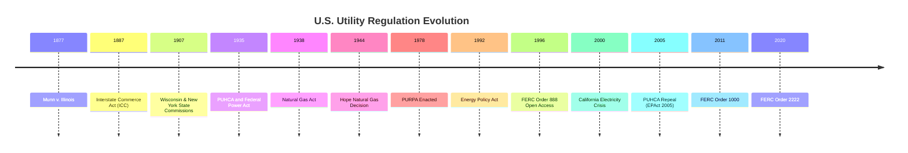

## History and Evolution of U.S. Utility Regulation

### Overview

U.S. utility regulation evolved through distinct eras, moving from unregulated private franchises through municipal and state regulatory commissions, federal expansion during the New Deal, post-war growth, market restructuring experiments, and into the current era of grid modernization and clean energy transition. Each era responded to specific market failures, technological shifts, or political pressures.

### Era 1: Unregulated Franchise Period (1800s–1880s)

**Key Points**

- Early gas (1810s–1850s) and electric (1880s onward) utilities operated under municipal franchise agreements, often non-exclusive, leading to destructive competition and duplicate infrastructure in some cities.
- Franchise agreements were typically negotiated contracts between municipalities and private companies, with widely varying terms, minimal technical oversight, and frequent corruption in franchise awards.
- Rate setting, where it existed, occurred through franchise contract terms rather than ongoing administrative regulation.
- Thomas Edison's Pearl Street Station (1882, New York) marked the beginning of centralized electric utility service, initially operating without meaningful economic regulation.

### Era 2: Rise of State Commission Regulation (1887–1920)

**Key Points**

- Railroad regulation preceded utility regulation: the Interstate Commerce Act (1887) created the Interstate Commerce Commission (ICC), establishing the template of an independent administrative commission regulating a network industry.
- Wisconsin and New York established the first comprehensive state public utility commissions in 1907, replacing municipal franchise regulation with state-level oversight of rates and service quality — a model that spread rapidly to other states over the following two decades.
- Samuel Insull, a central figure in the U.S. electric industry, advocated for regulated monopoly franchises as an alternative to destructive competition, helping popularize the natural monopoly rationale among policymakers and financiers.
- The shift to state commissions reflected recognition that municipal-level regulation was too fragmented, prone to capture at the local level, and technically under-resourced compared to state agencies.
- *Munn v. Illinois* (1877) and later *Smyth v. Ames* (1898) supplied the early constitutional framework for state ratemaking authority.

### Era 3: Holding Company Excess and New Deal Reform (1920s–1935)

**Key Points**

- The 1920s saw the proliferation of complex, multi-tiered electric and gas utility holding company pyramids, which obscured true ownership, enabled excessive leverage, and facilitated rate manipulation and securities abuses.
- The 1929 stock market crash and subsequent collapse of holding company pyramids (notably the Insull utility empire) caused massive investor losses and public outrage, directly motivating federal intervention.
- **Public Utility Holding Company Act of 1935 (PUHCA)**: required registration and SEC oversight of utility holding companies, restricted holding company structures to geographically and operationally integrated systems, and mandated simplification of corporate structures. [Largely repealed in 2005, discussed below.]
- **Federal Power Act of 1935**: established federal jurisdiction over wholesale electricity sales and transmission in interstate commerce, administered initially by the Federal Power Commission (FPC), while retail sales remained under state jurisdiction — creating the enduring federal/state jurisdictional divide.
- **Natural Gas Act of 1938**: extended similar federal jurisdiction to interstate natural gas transportation and wholesale sales.

### Era 4: Post-War Cost-of-Service Regulation Matures (1945–1970s)

**Key Points**

- *Federal Power Commission v. Hope Natural Gas Co.* (1944) cemented the "end result" doctrine as the controlling standard for rate reasonableness, giving regulators flexibility in ratemaking methodology.
- This period saw steady electrification, declining real electricity prices (due to genuine economies of scale in generation technology), and relatively stable, formulaic cost-of-service rate cases — often described as a "golden age" of utility regulation characterized by predictable growth and utility/regulator cooperation.
- Vertically integrated utility monopolies (generation, transmission, distribution all owned by one company) were the dominant model, justified by the natural monopoly rationale extending across the full value chain at the time.

### Era 5: Oil Shocks, Inflation, and Regulatory Strain (1970s–1980s)

**Key Points**

- The 1973 and 1979 oil shocks, combined with high inflation and rising interest rates, ended the era of declining utility costs; nuclear plant cost overruns (many plants cancelled mid-construction) created major rate-base and prudence-review controversies.
- **PURPA (Public Utility Regulatory Policies Act, 1978)**: a landmark statute requiring utilities to purchase power from qualifying facilities (QFs) — cogenerators and renewable/small power producers — at "avoided cost" rates, opening the first crack in vertically integrated monopoly generation and seeding the eventual independent power producer (IPP) industry.
- Regulatory lag became a major point of contention as utilities sought more frequent rate adjustments (fuel adjustment clauses, formula rates) to cope with volatile fuel costs.
- Prudence review disputes intensified: commissions increasingly disallowed cost recovery for cancelled or over-budget nuclear plants, testing the limits of the "used and useful" and prudent investment standards.

### Era 6: Wholesale Competition and Restructuring (1990s–2000s)

**Key Points**

- **Energy Policy Act of 1992**: created "exempt wholesale generators" and directed FERC to order transmission access for wholesale transactions, further opening generation to competition.
- **FERC Order 888 (1996)**: mandated open-access, non-discriminatory transmission tariffs and functional unbundling of generation from transmission services by vertically integrated utilities, a foundational step toward competitive wholesale markets.
- **FERC Order 889**: required creation of Open Access Same-Time Information Systems (OASIS) for transmission capacity transparency, paired with Order 888.
- Numerous states (California, Texas, New York, Illinois, Pennsylvania, and others) enacted retail restructuring legislation in the late 1990s, allowing customer choice of electricity supplier while distribution remained regulated monopoly service — a structural unbundling of the natural monopoly (wires) from the competitive segment (generation/supply).
- The 2000–2001 California electricity crisis (market manipulation, price spikes, rolling blackouts) became a cautionary case study, prompting several states to pause or reverse restructuring plans and leading to major market design reforms.
- Regional Transmission Organizations (RTOs) and Independent System Operators (ISOs) — e.g., PJM, ISO-NE, NYISO, MISO, CAISO, ERCOT, SPP — were established or expanded to operate wholesale markets and manage transmission on a regional basis, per FERC Order 2000 (1999).

### Era 7: Modern Reform and Federal Realignment (2000s–2010s)

**Key Points**

- **Energy Policy Act of 2005**: repealed most of PUHCA 1935 (replaced with a lighter-touch PUHCA 2005 under FERC/state joint oversight), reflecting the judgment that holding company abuses of the 1920s type were adequately addressed by modern securities and accounting regulation.
- **FERC Order 890 (2007)**: strengthened Order 888 by addressing undue discrimination in transmission planning and requiring coordinated, open transmission planning processes.
- **FERC Order 1000 (2011)**: required regional and interregional transmission planning and established cost-allocation principles for new transmission facilities, aimed at facilitating renewable energy integration and reducing barriers to competitive transmission development.
- State-level renewable portfolio standards (RPS) proliferated during the 2000s–2010s, layering clean-energy policy mandates onto traditional rate regulation.
- Smart grid investment accelerated following the American Recovery and Reinvestment Act (2009), introducing advanced metering infrastructure (AMI) and associated new rate base categories and cost-recovery mechanisms.

### Era 8: Grid Modernization, DERs, and Performance-Based Regulation (2010s–Present)

**Key Points**

- Growth of distributed energy resources (rooftop solar, battery storage, electric vehicles, demand response) has pressured traditional volumetric rate design and cost-of-service ratemaking, prompting debates over net metering reform, fixed charges, and utility revenue decoupling.
- **Performance-Based Ratemaking (PBR)** and multi-year rate plans have gained adoption in states such as New York (Reforming the Energy Vision, REV), Hawaii, and the UK-influenced RIIO framework internationally, shifting emphasis from pure cost recovery toward outcome-based incentives (reliability, customer satisfaction, decarbonization metrics).
- **FERC Order 2222 (2020)**: required RTOs/ISOs to allow distributed energy resource aggregations to participate directly in wholesale capacity, energy, and ancillary services markets — extending competitive market access below the transmission level for the first time.
- Increasing climate policy integration: state clean energy mandates, utility integrated resource planning (IRP) requirements, and federal incentives (Inflation Reduction Act, 2022) have reshaped rate base composition toward renewable generation, transmission for clean energy access, and grid resilience/hardening investments.
- [Inference] The long-term trajectory appears to be toward hybrid regulatory models blending traditional cost-of-service ratemaking for core "poles and wires" monopoly functions with performance incentives and competitive market mechanisms for generation, DERs, and grid services — though the pace and final form of this shift varies substantially by state and remains politically contested.

### Timeline Diagram

### Federal vs. State Jurisdictional Divide (Summary Table)

| Function | Primary Jurisdiction | Key Statute |
| --- | --- | --- |
| Retail electric/gas rates | State commissions | State PUC statutes |
| Wholesale electric sales, interstate transmission | FERC | Federal Power Act (1935) |
| Interstate natural gas transport/wholesale | FERC | Natural Gas Act (1938) |
| Utility holding company structure | FERC / state (light-touch) | PUHCA 2005 (post-2005) |
| Nuclear safety | Federal (NRC) | Atomic Energy Act |
| Environmental compliance | Federal (EPA) / state | Clean Air Act, Clean Water Act |

### Practical Example

**Example**

A vertically integrated utility operating in a traditionally regulated (non-restructured) state, such as many in the Southeast, continues to own generation, transmission, and distribution assets, recovering costs through state-commission-approved cost-of-service rates under a framework tracing directly back to the *Hope* decision. By contrast, a distribution utility in a restructured state like Illinois or Texas owns only the distribution wires; generation is supplied competitively by independent retail electricity suppliers, and wholesale transactions clear through an RTO market (PJM or ERCOT) under FERC-jurisdictional tariffs stemming from Order 888 and Order 2000 — illustrating how the same historical regulatory lineage produced two structurally different modern outcomes.

### Related Topics

- Natural Monopoly Rationale and the Regulatory Compact
- Federal vs. State Jurisdiction (FERC and State PUCs)
- PURPA and the Rise of Independent Power Producers
- Restructuring, Retail Choice, and RTO/ISO Market Design
- FERC Order 888, 1000, and 2222 in Depth
- Performance-Based Ratemaking and Multi-Year Rate Plans
- Prudence Review and Disallowed Plant Costs
- Integrated Resource Planning (IRP) Requirements
- Net Metering and Distributed Energy Resource Compensation