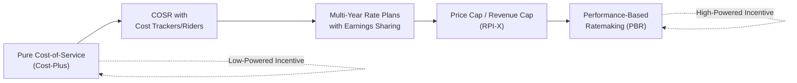

## Cost-of-Service vs. Incentive Regulation Overview

### Overview

Cost-of-service regulation (COSR) and incentive regulation represent two distinct philosophies for setting utility rates and governing utility behavior between rate cases. COSR ties revenue closely to actual, verified costs on a recurring basis; incentive regulation deliberately decouples revenue from cost in the short run to create stronger efficiency incentives, at the cost of greater forecasting risk and regulatory design complexity. Most modern regulatory regimes blend elements of both.

### Cost-of-Service Regulation (COSR): Core Mechanics

**Key Points**

- Revenue requirement is calculated from a test year's verified costs using the standard formula:

$$RR = O\&M + D + T + (RB \times r)$$

Where $O\&M$ is operating and maintenance expense, $D$ is depreciation expense, $T$ is taxes, $RB$ is the rate base, and $r$ is the authorized rate of return.

- Rates are reset periodically through a formal rate case, in which the utility files testimony and cost data, intervenors (consumer advocates, industrial customer groups, staff) challenge specific cost items, and the commission issues an order setting new rates based on a fully litigated record.
- Between rate cases, the utility generally retains any cost savings achieved (until the next rate case resets rates to reflect the new lower embedded costs) and bears the risk of cost overruns not deemed prudent.
- The prudent investment standard governs which costs enter the rate base; the "used and useful" standard historically governed whether plant qualifies for rate base inclusion (varies by jurisdiction and has evolved, particularly for renewable and grid-modernization assets).

### Incentive Regulation: Core Mechanics

**Key Points**

- Breaks the direct link between allowed revenue and actual embedded cost for the duration of the plan (typically 3–5+ years), instead setting a revenue or price trajectory in advance, often indexed to inflation and offset by an expected productivity improvement.
- **Price cap regulation**: caps the price per unit of service, commonly using an RPI-X (or CPI-X) formula:

$$P_t = P_{t-1} \times (1 + RPI - X)$$

Where $RPI$ is a general inflation index and $X$ is an administratively determined productivity offset factor, reflecting expected efficiency gains the utility is expected to capture.

- **Revenue cap regulation**: caps total allowed revenue rather than per-unit price, insulating the utility from volume/weather risk but requiring a separate true-up or decoupling mechanism to reconcile actual revenue collected against the cap.
- **Earnings sharing mechanisms (ESM)**: allow the utility to retain extra profit above the authorized return up to a threshold, with excess earnings shared with ratepayers beyond that threshold — a hybrid device to limit windfall gains under incentive plans while preserving some efficiency incentive.
- **Performance-Based Ratemaking (PBR)**: a broader umbrella incorporating price/revenue caps plus explicit performance metrics and financial rewards/penalties tied to outcomes such as reliability (SAIDI/SAIFI), customer satisfaction, interconnection timeliness, or decarbonization targets, rather than cost inputs alone.

### Incentive Intensity Spectrum

**Key Points**

- Regulatory economics frames COSR and incentive regulation as endpoints on a spectrum of "high-powered" vs. "low-powered" incentive contracts (Laffont-Tirole framework), trading off efficiency incentives against the utility's exposure to cost risk.
- Pure cost-of-service ("cost-plus") regulation is the lowest-powered incentive scheme: the utility bears little cost risk (costs are passed through) but also has weak incentive to minimize costs beyond the prudence review threshold.
- Pure fixed-price/price-cap regulation is the highest-powered scheme: the utility retains 100% of savings from cost reductions between resets, maximizing efficiency incentive but exposing the utility (and potentially ratepayers via required returns) to greater risk if costs diverge unpredictably from the forecast trajectory.
- Most real-world PBR designs sit between these poles via earnings sharing mechanisms, cost trackers/riders for specific volatile cost categories (fuel, pension), and multi-year rate plans with limited true-ups — deliberately calibrated incentive intensity rather than a pure form of either extreme.

### Comparative Table

| Dimension | Cost-of-Service Regulation | Incentive Regulation (Price/Revenue Cap, PBR) |
| --- | --- | --- |
| Revenue-cost linkage | Tight, recalculated at each rate case | Loosened for the plan duration |
| Efficiency incentive strength | Weak between rate cases (cost pass-through) | Strong (utility retains savings) |
| Utility cost-overrun risk | Limited (subject to prudence review) | Higher (fixed trajectory regardless of actual cost) |
| Administrative burden | High per rate case (detailed cost audit) | High in initial plan design; lower ongoing |
| Rate case frequency | Frequent, often annual/multi-year cycles | Less frequent (multi-year plans, e.g., 3–5 years) |
| Overcapitalization risk (Averch-Johnson) | More pronounced | Reduced (return not directly tied to rate base growth) |
| Regulatory lag exposure | Higher | Managed via indexing/trackers |
| Typical use case | Traditional vertically integrated utilities, U.S. norm historically | UK (RIIO), several U.S. states (NY REV, Hawaii), international jurisdictions |

### The RIIO Framework (UK) as an International Reference

**Key Points**

- Ofgem's RIIO framework (Revenue = Incentives + Innovation + Outputs) is a widely cited international incentive regulation model applied to UK electricity and gas networks, combining a multi-year revenue cap (typically 5 years) with explicit output-based performance categories: safety, reliability, customer satisfaction, environmental impact, and connections.
- RIIO includes an innovation funding mechanism, encouraging network companies to pilot new technologies (smart grid, storage integration) with cost recovery outside the standard revenue cap, addressing the dynamic-efficiency weakness sometimes associated with high-powered incentive regulation.
- [Unverified] Specific numerical parameters (X-factors, incentive rates, current RIIO iteration details such as RIIO-3) change with each regulatory period and should be verified against current Ofgem publications rather than treated as fixed figures.

### Diagram: Regulatory Spectrum

### Practical Example

**Example**

A gas distribution utility files a traditional rate case under COSR: it documents $500 million in prudent rate base, $80 million in O&M, and requests a 9.75% ROE. The commission reviews every major cost category, adjusts several disallowed items, and sets rates to recover the approved revenue requirement — repeated roughly every 2–3 years as costs drift.

Contrast with a comparable utility under a 5-year performance-based plan: the commission approves an initial revenue requirement plus an annual inflation escalator minus a 0.75% productivity factor (X-factor), along with a reliability performance metric (SAIDI target) carrying a ±$2 million annual penalty/reward band. The utility now has a direct financial incentive to reduce costs faster than the built-in productivity factor (retaining the difference) while maintaining reliability performance, without a new full rate case each year — but also bears the risk if unexpected cost inflation outpaces the plan's escalator.

### Common Criticisms and Design Challenges

**Key Points**

- Setting the productivity offset ($X$-factor) or initial revenue baseline accurately is difficult and consequential — too aggressive an $X$-factor can undermine utility financial health and service quality; too lenient allows excess profit retention.
- Multi-year plans reduce regulatory oversight granularity between resets, raising information asymmetry concerns addressed partially through interim reporting requirements and performance metric monitoring.
- Transition costs and design complexity of moving from COSR to PBR can be substantial, requiring new metrics, baseline-setting methodologies, and stakeholder negotiation.
- [Inference] Empirical evidence on whether incentive regulation produces measurably lower costs than well-administered COSR is mixed across studies and jurisdictions, and results likely depend heavily on the specific plan design and regulatory capacity for oversight, rather than incentive regulation being unambiguously superior in all contexts.

### Related Topics

- Natural Monopoly Rationale and the Regulatory Compact
- Rate Base Determination and the Used-and-Useful Standard
- Multi-Year Rate Plans and Revenue Decoupling Mechanisms
- Earnings Sharing Mechanisms and Symmetric/Asymmetric Sharing Bands
- RIIO Framework and International Incentive Regulation Models
- Averch-Johnson Effect and Overcapitalization Incentives
- Performance Metrics: SAIDI/SAIFI and Reliability-Based Incentives
- Revenue Decoupling and Weather Normalization Adjustments