## Investor-Owned, Municipal, and Cooperative Utility Structures

### Overview

U.S. electric and gas utilities operate under three principal ownership models — investor-owned utilities (IOUs), municipal utilities (munis), and electric cooperatives (co-ops) — plus federal power authorities as a smaller fourth category. Each structure differs fundamentally in ownership, governance, regulatory oversight, capital access, and financial objectives, which in turn shapes how rate-basing and cost recovery function within each model.

### Investor-Owned Utilities (IOUs)

**Key Points**

- Ownership: publicly traded or privately held corporations owned by shareholders, operated for profit.
- Governance: managed by a board of directors and executive management accountable to shareholders; subject to SEC disclosure requirements if publicly traded.
- Regulatory oversight: comprehensive state public utility commission (PUC/PSC) jurisdiction over retail rates, plus FERC jurisdiction over wholesale transactions and interstate transmission; full application of cost-of-service or incentive rate regulation as discussed in the compact.
- Capital structure: access to public equity and debt markets; rate base earns a commission-authorized weighted average cost of capital (WACC) blending debt cost and authorized ROE.
- Serve the majority of U.S. electricity customers by volume (though a minority by count of individual utility entities) — IOUs include most of the largest, most well-known U.S. utilities.
- Profit motive is explicit and central: shareholders expect competitive risk-adjusted returns, which is precisely what the regulatory compact's "fair return" standard is designed to provide while constraining monopoly pricing power.

### Municipal Utilities

**Key Points**

- Ownership: owned by the municipality (city or town) itself, operated as a government enterprise rather than a private, profit-seeking entity.
- Governance: typically overseen by an elected city council, a utility board (elected or appointed), or a public utility board with varying degrees of independence from general city government.
- Regulatory oversight: generally **not** subject to state PUC rate regulation for retail rates (a key structural distinction) — rates are set by the municipal governing body itself, subject to local political accountability (public meetings, elections) rather than formal administrative rate cases. [Note: state-specific exceptions exist; some states impose limited oversight on municipal utilities.]
- Capital structure: financed primarily through tax-exempt municipal bonds, generally at lower borrowing costs than IOU corporate debt, but without access to equity markets; no shareholder profit requirement — revenue in excess of costs may fund infrastructure reserves, general municipal budget transfers (payment in lieu of taxes, PILOT), or rate reductions.
- No "fair return on equity" concept applies in the IOU sense, since there are no shareholders; the cost-of-service framework still applies operationally (recovering O&M, debt service, depreciation) but without an authorized ROE component analogous to IOU ratemaking.
- Examples include large municipal utilities such as the Los Angeles Department of Water and Power (LADWP) and Sacramento Municipal Utility District (SMUD), alongside thousands of smaller municipal electric and water utilities nationwide.

### Electric Cooperatives

**Key Points**

- Ownership: owned by their customers ("members"), operated on a not-for-profit basis under cooperative principles (one member, one vote governance, regardless of usage volume).
- Governance: elected member board of directors; many cooperatives return excess margins to members as "capital credits" or "patronage dividends" rather than retaining them as profit.
- Origin: the majority of U.S. electric cooperatives trace their founding to the Rural Electrification Administration (REA), established under the Rural Electrification Act of 1936, which provided low-cost federal loans to extend electric service to rural areas IOUs found unprofitable to serve at the time.
- Two primary types: **distribution cooperatives** (serve end-use retail members directly) and **generation and transmission (G&T) cooperatives** (wholesale entities owned by multiple distribution co-ops, providing bulk power supply).
- Regulatory oversight: varies significantly by state — some states subject cooperatives to full state PUC rate regulation, others provide limited or no PUC oversight (reflecting the member-owned, not-for-profit governance structure as an alternative accountability mechanism), and G&T cooperatives may have FERC jurisdiction for wholesale transactions.
- Capital structure: historically reliant on low-cost federal financing via USDA Rural Utilities Service (successor to REA) and the National Rural Utilities Cooperative Finance Corporation (CFC), a cooperative-owned finance entity; increasingly supplemented with commercial debt and, in limited cases, tax-equity partnerships for renewable projects.
- Typically serve lower customer density (rural) territories, resulting in structurally higher cost-to-serve per customer than urban IOU or municipal territories, historically offset by federal financing support and, in some cases, state/federal subsidy mechanisms.

### Federal Power Marketing Administrations (Supplementary Category)

**Key Points**

- Federal entities such as the Bonneville Power Administration (BPA), Tennessee Valley Authority (TVA), Western Area Power Administration (WAPA), and Southeastern Power Administration (SEPA) market power primarily from federal hydroelectric dams, generally at cost-based rates without a profit motive, often preferentially to public power entities (munis and co-ops).
- TVA is a unique hybrid — a federal corporation that owns generation and transmission and effectively operates as a vertically integrated utility across a multi-state region, self-financing through revenue rather than congressional appropriation for operations.
- Rate-setting for federal power marketing administrations generally follows statutory cost-recovery mandates rather than state PUC or FERC full ratemaking jurisdiction, though some FERC review applies in specific contexts.

### Comparative Table

| Dimension | Investor-Owned (IOU) | Municipal | Cooperative |
| --- | --- | --- | --- |
| Ownership | Shareholders | Municipality (public) | Members (customers) |
| Profit motive | Yes — for shareholders | No (public enterprise) | No (not-for-profit) |
| Primary regulator | State PUC + FERC | Local governing body (limited/no PUC) | Varies — state PUC, limited oversight, or self-governed |
| Capital source | Public equity + corporate debt | Tax-exempt municipal bonds | Federal/RUS loans, CFC, commercial debt |
| Rate-setting body | State commission (rate case) | City council / utility board | Member board / varies by state |
| Return concept | Authorized ROE on rate base | None (cost recovery only) | None (margins returned as capital credits) |
| Typical service territory | Urban/suburban, high density | City/municipal boundaries | Rural, lower density |
| Approx. share of U.S. customers | Majority by volume served | ~2,000 utilities, smaller aggregate share | ~900 co-ops, significant rural land area coverage |

### Diagram: Ownership and Oversight Structure

```mermaid
flowchart TD
    subgraph IOU["Investor-Owned Utility"]
        I1[Shareholders] --> I2[Board of Directors]
        I2 --> I3[Utility Operations]
        I3 --> I4["State PUC Rate Case<br/>(Authorized ROE on Rate Base)"]
    end

    subgraph MUNI["Municipal Utility"]
        M1[City Residents/Taxpayers] --> M2["City Council /<br/>Utility Board"]
        M2 --> M3[Utility Operations]
        M3 --> M4["Locally Set Rates<br/>(Cost Recovery, No ROE)"]
    end

    subgraph COOP["Electric Cooperative"]
        C1[Member-Customers] --> C2["Elected Member<br/>Board"]
        C2 --> C3[Utility Operations]
        C3 --> C4["Member-Set/Variable Oversight<br/>(Capital Credits Returned)"]
    end
```

### Rate-Basing Implications Across Structures

**Key Points**

- IOU rate base calculations directly determine shareholder return via the $RB \times r$ term in the revenue requirement formula; rate base classification disputes (used-and-useful, prudence) are financially consequential for both ratepayers and investors.
- Municipal utility "rate base" concepts, where used internally for planning, typically inform debt service coverage and capital reserve targets rather than an ROE calculation, since there is no equity return to authorize.
- Cooperative capital credit systems function as a quasi-equity mechanism: members effectively contribute capital through rates that includes a margin above cost, which is later "retired" (returned) to members, often over a period of years, distinguishing it from both IOU permanent equity and pure municipal cost-recovery.
- [Inference] Because munis and co-ops lack a profit motive and often lower financing costs, their retail rates are frequently — though not universally — lower than comparable IOU rates in the same region; this varies significantly based on service territory density, generation mix, legacy debt, and local cost factors, so it should not be treated as a fixed rule.

### Practical Example

**Example**

Three adjacent utilities serving different parts of the same state illustrate the contrast:

- An IOU serving the state's largest metro area files a rate case requesting a $500 million rate base recovery at a 9.6% authorized ROE, litigated before the state PUC with intervenors challenging specific cost items.
- The state capital's municipal utility, serving city residents only, sets rates through city council approval after a public hearing, targeting sufficient revenue to cover O&M, municipal bond debt service, and a modest reserve contribution — no ROE component and no state PUC rate case required.
- A rural electric cooperative serving surrounding farmland finances new distribution infrastructure through an RUS loan, sets rates via its member-elected board, and returns any annual margin above costs to members as capital credits over a multi-year rotation — with limited or no formal state PUC rate review depending on state law.

### Related Topics

- Natural Monopoly Rationale and the Regulatory Compact
- Rate Base Determination and the Used-and-Useful Standard
- Cost of Capital and Authorized Return on Equity (IOU-Specific)
- Rural Electrification Act and Federal Utility Financing Programs
- Federal Power Marketing Administrations and TVA Structure
- Capital Credits and Patronage Dividend Mechanisms
- Municipal Bond Financing for Public Power Utilities
- State-by-State Variation in Cooperative and Municipal Oversight