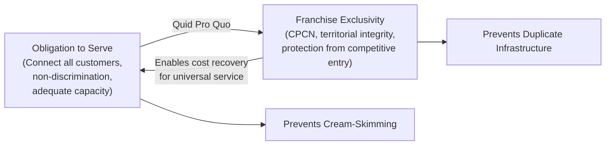

## The Obligation to Serve and Franchise Exclusivity

### Definition and Core Concept

The obligation to serve is the legal duty imposed on a regulated public utility to provide service to all customers within its designated territory upon reasonable request, without unreasonable discrimination, and to maintain adequate capacity to meet current and reasonably foreseeable future demand. Franchise exclusivity is the corresponding grant — statutory, contractual, or de facto — of a protected service territory in which the utility faces no (or limited) competitive entry. Together these form the two halves of the reciprocal exchange at the heart of the regulatory compact (see related topic).

### Elements of the Obligation to Serve

**Key Points**

- **Duty to connect**: the utility must extend service to any customer within its certificated territory who requests it and meets reasonable technical and payment conditions, subject to established extension policies (e.g., customer-paid line extension charges beyond a standard allowance).
- **Duty of adequacy**: service must be sufficient in capacity and reliability to meet demand, requiring forward-looking capacity planning (generation adequacy, distribution capacity planning, integrated resource planning).
- **Duty of non-discrimination**: rates and service terms must not unreasonably discriminate among similarly situated customers; differential treatment must be based on cost-justified or otherwise reasonable classifications (e.g., customer class, voltage level, load factor) rather than arbitrary distinction.
- **Duty of continuity**: the utility generally cannot unilaterally terminate service to a territory or abandon facilities without regulatory approval, distinguishing utility service from an ordinary commercial relationship terminable at will.
- **Duty of safety and reasonable service quality**: encompasses compliance with engineering and safety codes, minimum reliability standards, and responsiveness to outages and emergencies.

### Legal and Doctrinal Basis

**Key Points**

- Rooted in common-law "public callings" doctrine predating modern utility regulation — certain businesses affected with a public interest (originally ferries, inns, common carriers) were held to owe a duty to serve all comers at reasonable rates.
- *Munn v. Illinois* (1877) extended this doctrine to businesses "affected with a public interest," providing the constitutional foundation for imposing both the obligation to serve and rate regulation on such enterprises.
- State public utility statutes codify the obligation to serve explicitly, typically as a condition attached to the certificate of public convenience and necessity (CPCN) or equivalent franchise authorization.
- The obligation is generally enforceable by the state PUC and, in many jurisdictions, by private right of action for wrongful refusal of service or unreasonable discrimination.

### Franchise Exclusivity Mechanisms

**Key Points**

- **Certificate of Public Convenience and Necessity (CPCN)**: the principal legal instrument in most U.S. states granting a utility the exclusive (or primary) right to serve a defined territory, typically requiring a showing that the proposed service is needed and that the applicant is fit, willing, and able to provide it.
- **Territorial integrity/assigned service area statutes**: many states, particularly for electric and gas distribution, have statutory territorial allocation schemes preventing overlapping service or "duplicate certification," assigning exclusive territories to specific utilities (IOU, municipal, or cooperative) to prevent destructive duplication.
- **Municipal franchise agreements**: at the local level, cities may grant franchise rights to use public rights-of-way for utility infrastructure, sometimes for a defined term and often accompanied by franchise fees paid to the municipality.
- Exclusivity is rarely absolute: many states allow limited competitive exceptions (e.g., large industrial customers self-generating or self-supplying, municipal annexation disputes, or contestable territory at municipal boundary edges) subject to specific statutory procedures.

### Rationale: Why Exclusivity Accompanies the Obligation

**Key Points**

- Exclusivity is the *quid pro quo* for the obligation to serve: a utility required to serve all customers, including high-cost-to-serve ones, needs protection from competitors "cream-skimming" the profitable, low-cost segments of its territory, which would undermine its ability to cross-subsidize universal service.
- Without exclusivity, a competitor could enter only the most profitable areas/customer segments, leaving the incumbent utility with a residual customer base skewed toward higher-cost service obligations without corresponding revenue support — a classic cream-skimming/cherry-picking market failure.
- Exclusivity also prevents the duplicative-infrastructure inefficiency central to the natural monopoly rationale (redundant poles, wires, or pipes serving the same territory).
- In exchange for bearing universal-service and non-discrimination burdens, the utility receives protection from competitive entry and the opportunity (via regulated rates) to recover the costs of serving its full obligation, including less profitable segments.

### Boundaries and Limits of the Obligation

**Key Points**

- The obligation to serve is not unconditional: utilities can generally refuse or discontinue service for non-payment (subject to consumer protection procedures), unsafe conditions, or when extension costs are unreasonable relative to anticipated revenue (subject to line-extension policies allocating incremental cost to the requesting customer).
- Emergency curtailment: utilities may be permitted or required to curtail service during genuine capacity shortages under approved emergency protocols (e.g., rotating outages, interruptible service agreements), without violating the general obligation to serve.
- Franchise territories can be modified through regulatory processes — territorial disputes, municipal annexation, or legislative reallocation — though generally not through unilateral competitive entry.
- Consumer protection regulations (deposit requirements, disconnection notice periods, low-income assistance programs, moratoria during extreme weather) further shape and constrain how the obligation to serve operates in practice, particularly regarding non-payment disconnection.

### Interaction with Restructuring and Competitive Markets

**Key Points**

- In restructured states, the obligation to serve bifurcates: the distribution utility retains the obligation to serve for delivery service (wires) and typically for default/standard offer supply service for customers who do not choose a competitive retail supplier, while competitive retail suppliers have no comparable universal obligation and can decline to serve unprofitable customers.
- **Provider of Last Resort (POLR)** obligations are the mechanism used in restructured markets to preserve continuity of supply: the incumbent utility (or a designated default supplier) must stand ready to serve any customer whose competitive supplier fails to deliver or who chooses not to shop, ensuring no customer is left without service.
- This bifurcation illustrates how the obligation-to-serve/exclusivity pairing persists specifically for the natural monopoly (wires) segment even where the competitive (supply) segment has been opened to market entry.

### Diagram: Obligation-Exclusivity Exchange

### Practical Example

**Example**

A rural residential customer requests electric service at a remote homestead located 3 miles from the nearest existing distribution line. The certificated utility for that territory cannot refuse the request outright due to the obligation to serve, but under its commission-approved line extension policy, it may require the customer to pay some or all of the incremental construction cost beyond a standard free allowance (e.g., the first 300 feet), since extending 3 miles of line for one customer would otherwise impose a cost burden on the broader ratepayer base disproportionate to the revenue the new customer generates. This illustrates how the obligation to serve is real but bounded by reasonable cost-allocation mechanisms rather than requiring unlimited utility expenditure regardless of cost.

**Example**

In a restructured retail electricity state, a residential customer's chosen competitive supplier goes bankrupt mid-contract. Under the state's POLR framework, the incumbent distribution utility automatically resumes supplying that customer at a standard default rate without interruption of service, fulfilling the residual obligation to serve even though the utility itself does not compete for retail supply customers under normal circumstances.

### Related Topics

- Natural Monopoly Rationale and the Regulatory Compact
- Certificate of Public Convenience and Necessity (CPCN) Process
- Territorial Integrity Statutes and Utility Boundary Disputes
- Provider of Last Resort (POLR) Obligations in Restructured Markets
- Line Extension Policies and Cost Allocation for New Customers
- Consumer Protection: Disconnection Rules and Low-Income Programs
- Cream-Skimming and Cross-Subsidization in Rate Design