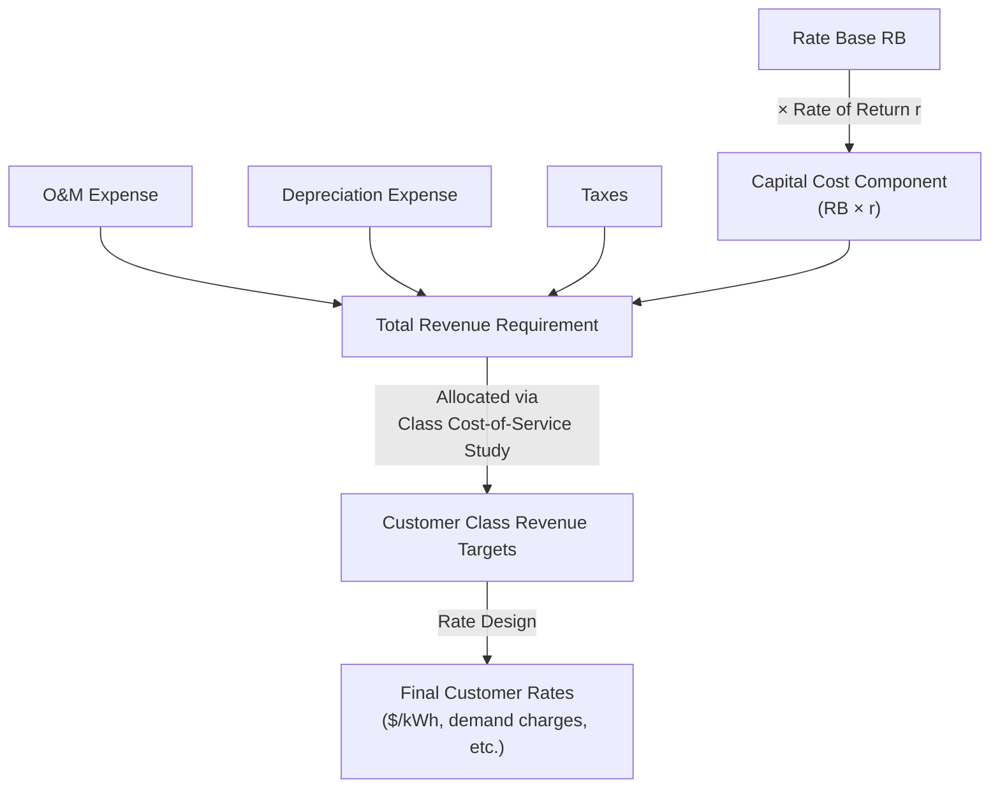

## Introduction to the Revenue Requirement Concept

### Definition and Core Concept

The revenue requirement is the total amount of revenue a regulated utility must be authorized to collect from ratepayers over a given period (typically a test year) to cover all reasonable costs of providing service, including a fair return on invested capital. It is the central output of a rate case and the foundation from which individual customer rates are subsequently derived through the rate design process. The revenue requirement operationalizes the "fair return" standard established in *Hope* and *Bluefield* into a concrete dollar figure.

### The Standard Revenue Requirement Formula

**Key Points**

- The canonical cost-of-service formula expresses the revenue requirement as the sum of operating costs plus a capital return component:

$$RR = O\&M + D + T + (RB \times r)$$

Where:

- $RR$ = Revenue Requirement (total dollars to be recovered)
- $O\&M$ = Operating and Maintenance expenses
- $D$ = Depreciation expense
- $T$ = Taxes (income taxes, property taxes, other applicable taxes)
- $RB$ = Rate Base (net investment in used-and-useful plant)
- $r$ = Authorized rate of return (weighted average cost of capital)
- The term $(RB \times r)$ is often called the **capital cost** or **return** component, representing the dollar amount the utility is authorized to earn on its invested capital — this is the mechanism through which shareholders (for IOUs) receive compensation for capital at risk.
- $O\&M + D + T$ collectively represent the **operating cost** component, reflecting pass-through recovery of the cost of actually running the utility, independent of the capital structure.

### Component Breakdown

**Key Points**

- **O&M (Operating and Maintenance)**: includes fuel costs (for generation), purchased power, labor, materials, vegetation management, customer service, administrative and general expenses. Subject to prudence review — costs must be reasonable and reasonably incurred to be recoverable.
- **Depreciation**: the systematic allocation of the original cost of long-lived plant assets over their useful life, both an expense recovered in the revenue requirement and a reduction to the rate base over time (accumulated depreciation) as detailed under rate base topics.
- **Taxes**: includes current income tax expense (federal and state, reflecting book/tax timing differences via deferred tax accounting), property taxes, payroll taxes, and other applicable levies; income tax treatment is a frequently litigated and technically complex rate case component due to interactions with accelerated tax depreciation and deferred tax liabilities.
- **Rate Base**: the net value of prudently invested, used-and-useful capital on which the utility is permitted to earn a return — treated fully in a dedicated related topic given its complexity (gross plant, accumulated depreciation, working capital, deferred taxes, construction work in progress treatment).
- **Rate of Return**: the weighted average cost of capital, blending the authorized cost of debt (embedded/actual) and authorized cost of equity (ROE, typically determined via DCF, CAPM, or comparable earnings analyses) weighted by the utility's approved capital structure (debt/equity ratio).

$$r = \left(\frac{D}{D+E}\right) \times r_d \times (1 - t) + \left(\frac{E}{D+E}\right) \times r_e$$

Where $D$ and $E$ are debt and equity components of the capital structure, $r_d$ is the cost of debt, $t$ is the effective tax rate (debt interest is tax-deductible, hence the after-tax adjustment), and $r_e$ is the authorized cost of equity (ROE).

### The Test Year Concept

**Key Points**

- The revenue requirement is calculated using a **test year** — a representative 12-month period (historical, partially projected/"future," or fully forward-looking, depending on jurisdiction) used as the basis for all cost and rate base figures in the rate case.
- **Historical test year**: based on actual recorded costs from a completed period, sometimes adjusted ("normalized") for known and measurable changes expected to persist into the rate-effective period.
- **Future/forecast test year**: based on projected costs for a period after the rate case concludes, used in jurisdictions expecting rapid cost growth (e.g., significant capital investment programs) where a historical test year would understate the utility's true forward cost structure.
- **Fully forecasted vs. historical-with-adjustments** approaches carry different regulatory lag implications — forecast test years reduce lag but increase forecasting risk and scrutiny; historical test years are more verifiable but may embed stale cost assumptions.
- Normalizing adjustments remove non-recurring or unusual items (e.g., one-time storm costs, unusual weather effects on sales volume) to produce a representative ongoing cost level.

### From Revenue Requirement to Customer Rates

**Key Points**

- Once the total revenue requirement is approved, it must be **allocated** across customer classes (residential, commercial, industrial) through a cost allocation/class cost-of-service study, and then **designed** into specific rate structures (volumetric charges, fixed customer charges, demand charges) — these are distinct downstream steps covered in dedicated rate design topics.
- The revenue requirement represents the *aggregate* dollar target; how that target translates into a $/kWh or $/therm charge for a specific customer depends on allocated cost causation and adopted rate design principles (e.g., Ramsey pricing considerations, embedded cost vs. marginal cost allocation methods).

### Regulatory Process Context

**Key Points**

- The revenue requirement is established through a formal rate case: the utility files testimony and supporting cost studies proposing a revenue requirement increase (or decrease); commission staff, consumer advocates, and other intervenors file responsive testimony challenging specific components; the case may proceed to hearings, and the commission issues a final order setting the approved revenue requirement.
- **Regulatory lag** is inherent in this process — the gap between when costs are actually incurred and when a revised revenue requirement takes effect in rates — creating financial risk (or benefit) for the utility discussed under incentive regulation and COSR topics.
- Between full rate cases, various **cost trackers, riders, and adjustment clauses** (fuel cost adjustment clauses, infrastructure replacement riders, decoupling mechanisms) may adjust specific revenue requirement components without a full base rate case, a practice that has grown substantially as a partial substitute for frequent full rate cases.

### Diagram: Revenue Requirement Build-Up

### Practical Example

**Example**

A gas distribution utility's rate case filing includes the following test-year figures:

| Component | Amount |
| --- | --- |
| O&M expense | $120,000,000 |
| Depreciation expense | $45,000,000 |
| Taxes | $35,000,000 |
| Rate Base | $800,000,000 |
| Authorized rate of return ($r$) | 7.2% |

Capital cost component: $800{,}000{,}000 \times 0.072 = \$57{,}600{,}000$

$$RR = 120{,}000{,}000 + 45{,}000{,}000 + 35{,}000{,}000 + 57{,}600{,}000 = \$257{,}600{,}000$$

This $257.6 million becomes the target total revenue the utility is authorized to collect from all customers combined over the test year, which is then allocated across customer classes and translated into specific per-unit and fixed charges through the rate design process.

### Common Points of Contention in Rate Cases

**Key Points**

- Disputes over whether specific O&M costs were prudently incurred (e.g., executive compensation, advertising expense, affiliate transaction pricing).
- Disagreement over appropriate rate base inclusions (construction work in progress treatment, plant retirement timing, cost of removal).
- Contested rate of return — particularly authorized ROE, often the single most litigated figure in a rate case given its direct impact on both shareholder return and customer bills.
- Test year selection (historical vs. forecast) and the propriety of specific normalizing adjustments.
- [Inference] The relative weight given to each disputed component varies significantly by jurisdiction, case complexity, and intervenor resources, and no universal pattern determines which issues will be most contested in a given case.

### Related Topics

- Rate Base Determination and the Used-and-Useful Standard
- Cost of Capital and Authorized Return on Equity
- Test Year Selection: Historical vs. Forecast Methodologies
- Class Cost-of-Service Allocation Studies
- Rate Design: Volumetric, Fixed, and Demand Charge Structures
- Cost Trackers, Riders, and Adjustment Clauses
- Regulatory Lag and Its Effects on Utility Financial Performance
- Deferred Tax Accounting in Utility Ratemaking