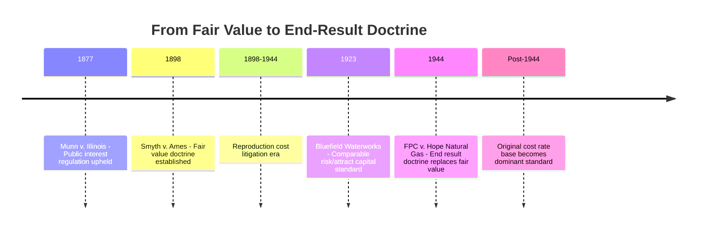

## Smyth v. Ames and the Fair Value Doctrine

### Case Background

*Smyth v. Ames*, 169 U.S. 466 (1898), was a U.S. Supreme Court decision arising from a challenge to a Nebraska statute setting maximum railroad freight rates. Railroads argued the mandated rates were confiscatory, depriving them of property without due process of law in violation of the Fourteenth Amendment. The case became the foundational — and eventually much-criticized — precedent for how "fair value" and reasonable rates were determined in U.S. utility and railroad regulation for nearly half a century.

### The Fair Value Standard Established

**Key Points**

- The Court held that a utility (or railroad) is constitutionally entitled to earn a return based on the **"fair value" of the property being used for public service** at the time it is being used for the public, not merely its original historical cost.
- This established that rates must allow a return sufficient to compensate the fair value of the investment, articulating what became known as the **fair value rule** or **fair value doctrine**.
- The decision listed multiple factors regulators should consider in determining fair value, including: original cost of construction, amount expended in permanent improvements, current cost of reproduction (reproduction cost new), the market value of stocks and bonds, probable earning capacity, and operating expenses — with no single factor given controlling weight.

### The Reproduction Cost Problem

**Key Points**

- In practice, "fair value" determination became dominated by **reproduction cost new** — an estimate of what it would cost to rebuild the utility's entire physical plant at *current* prices, as opposed to the *actual historical* dollars originally invested.
- This created a fundamental valuation instability: during inflationary periods, reproduction cost estimates rose, inflating the rate base and (all else equal) increasing allowable revenue; during deflationary periods, the reverse occurred, shrinking the rate base and allowable revenue regardless of the utility's actual embedded financial obligations (bonds, dividends) which were fixed in historical dollar terms.
- Utilities and regulators found themselves engaged in extraordinarily complex, expensive, and contentious litigation over reproduction cost estimates in nearly every rate case, since small changes in the reproduction cost assumption could swing the rate base — and therefore the revenue requirement — substantially.
- The standard also created a mismatch between the rate base used for ratemaking and the utility's actual capital structure and embedded financing costs, which are inherently tied to historical dollars raised, not current reproduction value.

### Circularity Critique

**Key Points**

- A core economic critique, most influentially articulated in later legal and economic commentary, was that the fair value/reproduction cost approach was fundamentally **circular**: the market value of a utility's securities (stocks and bonds) was itself partly a function of the earnings the utility was permitted to generate through rates, yet security market value was simultaneously used as an input to determine the "fair value" on which those very earnings were based.
- This circularity meant the fair value standard did not provide an independent, objective check on rates — it could, in principle, validate whatever earnings level was already being generated, undermining its function as a meaningful constraint on utility pricing power.
- [Inference] This circularity critique is widely credited by legal and regulatory economics scholars as the primary intellectual argument that ultimately discredited the *Smyth v. Ames* approach, though the practical administrative burden of reproduction cost litigation was likely an equally significant practical driver of its abandonment.

### Administrative and Litigation Burden

**Key Points**

- Reproduction cost determination required extensive, expert-driven engineering and appraisal testimony to estimate what current construction of the entire utility system would cost — a highly technical, expensive, and inherently uncertain exercise repeated in essentially every significant rate case for decades.
- The volatility and expense of fair value litigation was a major driver of dissatisfaction with the standard among regulators, utilities, and courts alike, as rate cases became increasingly protracted, technical battles over valuation methodology rather than focused reviews of prudent cost and reasonable return.

### Abandonment: Federal Power Commission v. Hope Natural Gas Co. (1944)

**Key Points**

- The fair value doctrine was effectively abandoned by the Supreme Court in *Federal Power Commission v. Hope Natural Gas Co.*, 320 U.S. 591 (1944), which shifted the constitutional inquiry from *methodology* to *result*.
- Under *Hope*, regulators are not constitutionally required to use any particular valuation method (including reproduction cost fair value) — the relevant constitutional question is whether the **end result** of the rate order is reasonable, not whether any specific formula was applied.
- This "end result" doctrine gave regulators substantially greater methodological flexibility, and in practice led to the widespread adoption of **original cost (historical cost) rate base** methodologies — a stable, verifiable, and comparatively litigation-efficient standard — rather than the fluctuating and contentious reproduction cost approach of the *Smyth v. Ames* era.
- Original cost rate base remains the dominant U.S. ratemaking standard today, directly attributable to the *Hope* decision's rejection of the mandatory fair value approach.

### Comparative Table: Fair Value vs. Original Cost Standards

| Dimension | Fair Value Doctrine (*Smyth v. Ames*, 1898–1944) | Original Cost Standard (Post-*Hope*, 1944–present) |
| --- | --- | --- |
| Rate base basis | Reproduction cost new, blended with other factors | Historical/original cost of investment, less depreciation |
| Stability over time | Volatile — tracks inflation/deflation cycles | Stable — fixed to actual dollars invested |
| Litigation burden | High — extensive appraisal/engineering testimony required each case | Lower — verifiable from accounting records |
| Match to capital structure | Poor — reproduction cost detached from actual embedded financing costs | Strong — matches actual invested capital and debt/equity obligations |
| Constitutional test | Specific valuation methodology mandated | "End result" reasonableness test; methodology flexible |
| Circularity concern | Yes — security market value used as both input and output | Not applicable — based on verifiable historical cost data |

### Diagram: Doctrinal Evolution

### Practical Example

**Example**

Consider a water utility that built its treatment plant in 1910 for $2 million (historical cost). By 1935, due to inflation and rising construction costs, the estimated reproduction cost of an equivalent plant built new was $6 million.

- Under the *Smyth v. Ames* fair value approach, the utility could argue its rate base should reflect something closer to the $6 million reproduction cost figure, substantially increasing the capital cost component of its revenue requirement (and thus customer rates) relative to its actual original investment.
- Under the post-*Hope* original cost standard, the same utility's rate base would be based on the $2 million actually invested (less accumulated depreciation), producing a materially lower and more stable — but also more predictable and litigation-efficient — revenue requirement, better matched to the utility's actual embedded debt and equity obligations incurred to finance that original $2 million investment.

This example illustrates why the shift from fair value to original cost had direct, substantial financial consequences for both utility shareholders and ratepayers, not merely a technical accounting distinction.

### Related Topics

- Federal Power Commission v. Hope Natural Gas Co. and the End-Result Doctrine
- Bluefield Waterworks and the Comparable Risk Standard
- Rate Base Determination and the Used-and-Useful Standard
- Original Cost vs. Reproduction Cost Rate Base Methodologies
- Constitutional Foundations: Munn v. Illinois and Public Interest Doctrine
- Trended Original Cost and Other Alternative Valuation Approaches