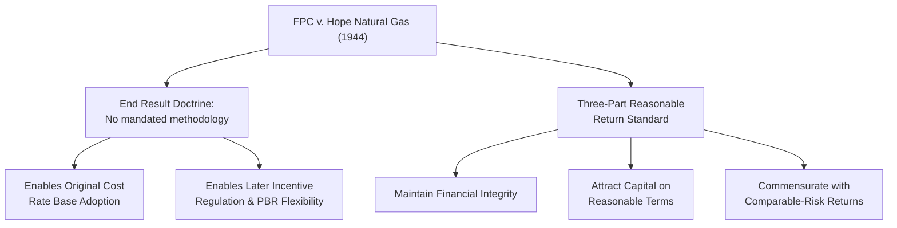

## Federal Power Commission v. Hope Natural Gas Co.

### Case Background

*Federal Power Commission v. Hope Natural Gas Co.*, 320 U.S. 591 (1944), is the single most important U.S. Supreme Court decision governing modern utility ratemaking. The case arose from the Federal Power Commission's (FPC) reduction of Hope Natural Gas Company's rates for interstate wholesale natural gas sales under the Natural Gas Act of 1938. Hope Natural Gas challenged the FPC's rate order, arguing the resulting rates were confiscatory and that the Commission had improperly relied on original cost rather than the fair value/reproduction cost methodology established under *Smyth v. Ames* (1898).

### Procedural History

**Key Points**

- The FPC based its rate order on the original cost of Hope's natural gas properties rather than reproduction cost or other fair-value factors, resulting in a lower rate base and lower authorized rates than Hope Natural Gas sought.
- The Fourth Circuit Court of Appeals ruled against the FPC, holding that the Commission had improperly departed from the fair value standard the courts believed *Smyth v. Ames* required.
- The Supreme Court granted certiorari and reversed the Fourth Circuit, upholding the FPC's original cost approach and, in doing so, fundamentally recast the constitutional test for utility rate reasonableness.

### The "End Result" Doctrine

**Key Points**

- The Court's central holding is that regulators are **not constitutionally bound to any single ratemaking formula or methodology**. The relevant constitutional inquiry is not *how* a rate was calculated, but whether the **end result** reached is reasonable.
- This directly rejected the notion — which had dominated ratemaking since *Smyth v. Ames* — that reproduction cost or "fair value" was a constitutionally mandated input to rate base calculation.
- The Court explicitly stated that if the total effect of a rate order cannot be said to be unjust or unreasonable, judicial inquiry ends; the method employed to reach that result is not itself subject to constitutional challenge, even if a different method might have produced a different outcome.
- This shift gave regulatory commissions — state PUCs and the FPC (later FERC) alike — substantially greater methodological discretion, enabling the widespread adoption of the more stable, verifiable **original cost** rate base standard in place of the volatile, litigation-heavy fair value approach.

### The Three-Part Reasonable Return Standard

**Key Points**

- *Hope* articulated the substantive standard for what constitutes a constitutionally adequate return, building on and refining the earlier *Bluefield Waterworks* (1923) standard. A reasonable authorized return must be sufficient to:
  1. **Maintain the utility's financial integrity** — enabling the utility to meet its financial obligations (debt service, operational solvency).
  2. **Attract capital on reasonable terms** — enabling the utility to raise new debt and equity capital needed for continued investment in service.
  3. **Be commensurate with returns on investments in other enterprises having corresponding risks** — ensuring the utility's authorized return is competitive with what investors could earn on alternative investments of comparable risk, consistent with basic capital market principles.
- This three-part test remains the substantive constitutional benchmark applied (directly or via state-law equivalents) in essentially all U.S. utility rate cases today, cited alongside or interchangeably with *Bluefield*.

### Key Quoted Principles (Paraphrased)

**Key Points**

- The Court emphasized that the fixing of rates involves a balancing of the investor and consumer interests — rates must be sufficient to assure confidence in the utility's financial integrity while also being just and reasonable to the consuming public.
- The Court rejected the idea that any particular theory of valuation (including fair value) has constitutional sanctity; what matters is the reasonableness of the impact of the rate order taken as a whole, not the reasonableness of each individual component or step in the calculation.
- [Note: due to copyright constraints on reproducing court opinion text, the above reflects paraphrased doctrinal summary rather than direct quotation; primary source review of the opinion is recommended for exact language in academic or legal work.]

### Practical Impact on Ratemaking Methodology

**Key Points**

- Enabled the shift from reproduction-cost-driven fair value ratemaking to **original cost rate base** as the dominant U.S. standard, since original cost is verifiable from accounting records, stable over time, and better matched to a utility's actual embedded capital structure.
- Gave state and federal regulators flexibility to adopt varied ratemaking approaches — including, in later decades, incentive regulation, price caps, and performance-based ratemaking — without those departures from strict cost-of-service methodology being constitutionally suspect, so long as the end result remains reasonable.
- Established the enduring framework within which subsequent rate case litigation operates: challenges to specific rate orders generally focus on whether the *overall* revenue requirement and resulting rates are reasonable (financial integrity, capital attraction, comparable risk-adjusted return), not on relitigating the constitutional validity of the chosen methodology itself.
- Frequently cited jointly with *Bluefield Waterworks* as the "*Hope*/*Bluefield* standard" in modern rate case testimony, briefs, and commission orders when addressing the constitutional adequacy of an authorized rate of return.

### Comparative Table: Pre- and Post-*Hope* Ratemaking

| Dimension | Pre-*Hope* (*Smyth v. Ames* era) | Post-*Hope* (1944–present) |
| --- | --- | --- |
| Constitutional test | Specific valuation methodology (fair value) required | End-result reasonableness only |
| Rate base methodology | Reproduction cost / fair value (multi-factor) | Original cost (historical), now dominant |
| Regulatory flexibility | Low — courts scrutinized valuation method | High — commissions choose methodology |
| Focus of judicial review | Component-level (was the *valuation* correct?) | Aggregate-level (is the *end result* reasonable?) |
| Enabled later innovations | N/A | Incentive regulation, price caps, PBR |

### Diagram: Hope's Doctrinal Structure

### Practical Example

**Example**

In a modern state rate case, a utility's authorized ROE is challenged by a consumer advocate group as excessive. Rather than arguing about which valuation methodology (reproduction cost vs. original cost) should apply — a *Smyth v. Ames*-era dispute — the litigation instead focuses squarely on *Hope*/*Bluefield* factors: expert witnesses present DCF, CAPM, and comparable earnings analyses to establish what return is commensurate with the risk of comparable investments, and testimony addresses whether the utility's proposed return level is necessary to maintain its credit rating and continue attracting capital for planned infrastructure investment. The commission's final order is then judicially reviewable primarily on whether the *overall* authorized return meets the three-part *Hope* standard, not on whether any single input (e.g., beta estimate, growth rate assumption) was the "correct" constitutional choice in isolation.

### Related Topics

- Smyth v. Ames and the Fair Value Doctrine
- Bluefield Waterworks and the Comparable Risk Standard
- Original Cost vs. Reproduction Cost Rate Base Methodologies
- Cost of Capital and Authorized Return on Equity (DCF, CAPM, Comparable Earnings)
- Rate Base Determination and the Used-and-Useful Standard
- Judicial Review Standards in Utility Rate Case Appeals
- Cost-of-Service vs. Incentive Regulation Overview