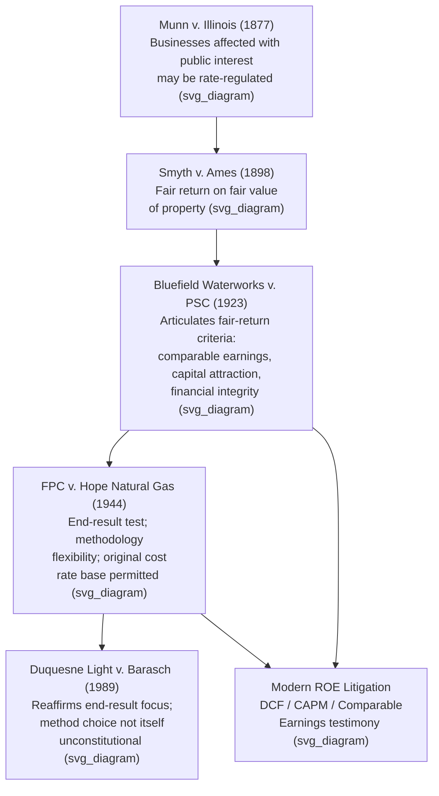

## Bluefield Waterworks v. Public Service Commission

### Citation and Procedural Posture

*Bluefield Water Works & Improvement Co. v. Public Service Commission of West Virginia*, 262 U.S. 679 (1923), is a decision of the Supreme Court of the United States. The case arose after the Public Service Commission of West Virginia set rates for the Bluefield Water Works & Improvement Company that the utility argued were confiscatory — that is, too low to permit a fair return, in violation of the Due Process Clause of the Fourteenth Amendment. The West Virginia Supreme Court of Appeals affirmed the Commission's order, and the utility appealed to the U.S. Supreme Court. Justice Pierce Butler delivered the opinion for a unanimous Court, reversing the state court and Commission.

### Historical and Legal Context

The case sits within the line of rate regulation jurisprudence descending from *Munn v. Illinois*, 94 U.S. 113 (1877), which established that businesses "affected with a public interest" may be subject to rate regulation, and *Smyth v. Ames*, 169 U.S. 466 (1898), which held that a utility is constitutionally entitled to a "fair return" on the "fair value" of the property used in public service. By the 1920s, courts and commissions were struggling with how to calculate that fair value — particularly the tension between historical (original) cost and current reproduction cost, in a period of significant price inflation following World War I. *Bluefield* was the Supreme Court's attempt to articulate operative standards for both the valuation base and the required rate of return.

### The Rate Base Question

**[Inference]** The utility's central complaint concerned how its property had been valued for ratemaking purposes; the Commission's valuation, and the deflated allowance built on it, are what the utility challenged as confiscatory.

The Court's articulation of the "fair value" rate base standard is the most frequently cited holding from the case. The Court held that the value of the utility's property for ratemaking is to be ascertained as of the time it is being used for the public, and that relevant considerations include:

- Original cost of construction
- Present (reproduction) cost of construction
- Amount and market value of outstanding bonds and stock
- The utility's earning capacity under current rates
- Operating expenses
- Any increase or decrease in value due to changed conditions since original construction

The Court emphasized that reproduction cost is entitled to consideration, particularly where price levels have changed materially since the property was built, though it did not mandate any single formula for combining these factors. This "fair value" doctrine required regulators to conduct fact-intensive, often duplicative valuations for every rate case, and became a major point of practical difficulty in utility regulation.

**[Unverified]** The precise weighting the Commission gave to original versus reproduction cost in the underlying record is not fully recoverable from the opinion's text alone without consulting the full case record; the opinion's discussion focuses on the legal standard rather than a line-item recalculation.

### The Fair Return Standard

The second, and arguably more durable, holding of *Bluefield* concerns the rate of return itself. The Court articulated what is now known as the **Bluefield fair return standard**:

> A public utility is entitled to such rates as will permit it to earn a return on the value of the property it employs for the convenience of the public equal to that generally being made at the same time and in the same general part of the country on investments in other business undertakings which are attended by corresponding risks and uncertainties, but it has no constitutional right to profits such as are realized or anticipated in highly profitable enterprises or speculative ventures. The return should be reasonably sufficient to assure confidence in the financial soundness of the utility, and should be adequate, under efficient and economical management, to maintain and support its credit, and enable it to raise money necessary for the proper discharge of its public duties.

This passage establishes several distinct sub-requirements that remain the doctrinal core of rate-of-return regulation today:

1. **Comparable earnings** — the return should be commensurate with returns on investments of corresponding risk in the same general region and time period.
2. **Capital attraction** — the return must be sufficient to attract capital on reasonable terms.
3. **Financial integrity** — the return must maintain the utility's credit and financial soundness.
4. **No guarantee of speculative profit** — the utility is not entitled to the returns of a high-risk speculative venture merely because it faces some risk.

### Relationship to Hope Natural Gas

**[Inference]** *Bluefield* is almost always read together with *FPC v. Hope Natural Gas Co.*, 320 U.S. 591 (1944), which is generally treated by courts and commentators as refining rather than overturning it.

*Hope Natural Gas* shifted emphasis from the specific "fair value" rate base methodology toward an "end result" test: the Court there held that it is the overall reasonableness of the result reached, not the method employed, that is controlling, and that regulators are not bound to any single formula in setting rates. Hope also relaxed the *Smyth v. Ames* reproduction-cost requirement, permitting reliance on original cost (rate base) methods. However, Hope explicitly preserved and reaffirmed the *Bluefield* fair-return language (comparable earnings, capital attraction, financial integrity) as the substantive constitutional floor. As a result, contemporary rate-of-return analysis is typically described as operating under the "Bluefield-Hope standard," combining Bluefield's substantive fair-return criteria with Hope's procedural flexibility as to methodology.

### Application in Modern Rate Cases

**[Inference]** Because Bluefield's specific rate-base valuation methodology (weighing reproduction cost against original cost) has been superseded in practice by original cost rate base methods sanctioned in Hope and widely adopted by state statute or commission practice, most contemporary citations to Bluefield are for its fair-return-standard language rather than its rate-base valuation holding.

In modern proceedings before state public utility commissions and FERC, expert witnesses testifying on cost of capital and return on equity (ROE) routinely invoke the Bluefield standard as one of the touchstones for evaluating whether a proposed or adopted ROE is constitutionally adequate. Analysts typically test a recommended ROE against the three Bluefield/Hope criteria:

- **Comparable Earnings Test**: benchmarking the utility's authorized ROE against returns earned by a proxy group of comparable-risk companies.
- **Capital Attraction Test**: assessing whether the ROE is adequate to attract equity capital under prevailing market conditions, often via Discounted Cash Flow (DCF), Capital Asset Pricing Model (CAPM), and risk premium analyses.
- **Financial Integrity Test**: evaluating whether the ROE supports investment-grade credit metrics (e.g., funds-from-operations-to-debt ratios reviewed by rating agencies such as Moody's and S&P).

### Illustrative Example

**Example**: A state commission is reviewing a water utility's request for a 10.5% authorized ROE. Commission staff and the utility's witness each perform:

1. A DCF analysis on a proxy group of publicly traded water utilities, yielding an estimated cost of equity range of 9.2%–9.8%.
2. A CAPM analysis using the utility's estimated beta, a risk-free rate proxy (e.g., long-term Treasury yield), and an equity risk premium, yielding a range of 9.0%–10.0%.
3. A risk premium/comparable earnings check against similarly situated utilities' authorized ROEs in the same region.

Under the Bluefield standard, the commission would ask whether the utility's requested 10.5% is commensurate with these comparable-risk benchmarks (comparable earnings prong), sufficient to attract equity investment at reasonable cost (capital attraction prong), and adequate to preserve investment-grade credit metrics (financial integrity prong). **[Inference]** A commission relying on this framework would typically authorize an ROE within or near the overlapping range suggested by these models (e.g., approximately 9.5%–9.8%) rather than at either extreme, though the actual outcome in any specific proceeding depends on the full record and the commission's own methodology, which varies by jurisdiction.

### Constitutional Status: Takings and Due Process

Bluefield was decided under the Due Process Clause of the Fourteenth Amendment, on a theory that confiscatory rates — those failing to allow a fair return — effect a deprivation of property without due process. **[Inference]** Later takings-and-ratemaking jurisprudence, particularly *Duquesne Light Co. v. Barasch*, 488 U.S. 299 (1989), is generally understood to have reinforced the Hope "end result" approach, holding that a rate order does not become unconstitutional simply because it employs a disfavored valuation method, so long as the end result is not confiscatory. This further cemented the practical primacy of Bluefield's substantive fair-return criteria over its original rate-base valuation methodology.

### Key Points

- Bluefield established the constitutional requirement that authorized utility returns be comparable to returns on similarly risky enterprises, sufficient to attract capital, and adequate to maintain financial integrity.
- Bluefield's original rate-base valuation guidance (weighing reproduction cost against original cost) has been substantially superseded by Hope Natural Gas's "end result" test and by widespread adoption of original cost rate base methods.
- The "Bluefield-Hope standard" is the composite doctrinal framework courts and commissions still apply when reviewing the constitutional adequacy of authorized rates of return.
- The standard is applied primarily through cost-of-capital analyses (DCF, CAPM, comparable earnings, risk premium) presented as expert testimony in rate cases.

### Diagram: Doctrinal Lineage (svg_diagram)

### Next Steps

- **FPC v. Hope Natural Gas Co. (1944)** — the "end result" test and its relationship to Bluefield
- **Duquesne Light Co. v. Barasch (1989)** — modern reaffirmation of end-result review
- **Smyth v. Ames (1898)** — origin of the "fair value" rate base doctrine
- **Rate Base Valuation Methods** — original cost vs. reproduction cost vs. fair value
- **Cost of Capital Estimation Methods** — DCF, CAPM, risk premium, comparable earnings
- **Regulatory Lag and Test Year Methodology**
- **Used and Useful Doctrine** in rate base inclusion
- **Attrition Relief and Rate Case Frequency**