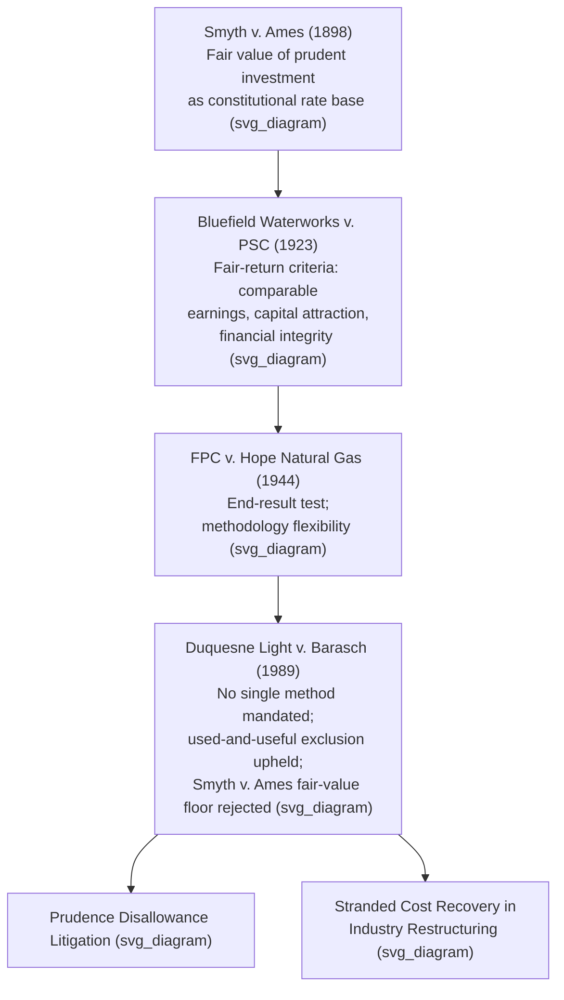

## Duquesne Light Co. v. Barasch

### Citation and Procedural Posture

*Duquesne Light Co. v. Barasch*, 488 U.S. 299 (1989), is a decision of the Supreme Court of the United States. The case arose out of Pennsylvania Public Utility Commission proceedings involving Duquesne Light Company and Pennsylvania Power Company, both of which had participated in the construction of nuclear generating units that were ultimately canceled before completion. The utilities sought to recover the costs sunk into the canceled plants through rates. Pennsylvania's Public Utility Code contained a provision (§ 1315) barring recovery, through rate base or expenses, of the cost of any facility not "used and useful" in service to the public — meaning the utilities could not include the canceled plants' costs in rate base at all, though a separate statutory mechanism permitted limited amortized recovery of prudently incurred costs outside rate base. The Commission applied § 1315 and denied a rate-base return on the canceled-plant investment; the utilities challenged this as an unconstitutional taking. The Pennsylvania Supreme Court upheld the statute and the Commission's order, and the Supreme Court granted certiorari. Justice William Rehnquist wrote for a unanimous Court, affirming.

### The Core Question Presented

The utilities argued that the Constitution requires rate regulators to compensate a utility for all prudently incurred investment, including investment in plants later abandoned or canceled, and that a flat statutory bar on including such costs in rate base was per se confiscatory regardless of the reasonableness of the utilities' decisions to build. The question presented was whether a state's use of a particular valuation method (here, "used and useful" rate basing that categorically excludes prudent but unproductive investment) violates the Takings Clause and Due Process Clause, independent of whether the overall rates produced are otherwise adequate.

### Holding: The "End Result" Reaffirmed

**[Inference]** The Court's holding is most accurately described as a reaffirmation and clarification of *FPC v. Hope Natural Gas Co.*, 320 U.S. 591 (1944), rather than as a novel doctrinal departure, since the opinion explicitly frames its analysis around Hope's methodology-neutral, end-result test.

The Court held that the Constitution does not bind ratemaking bodies to any single ratesetting methodology, and that a rate order is not rendered unconstitutional merely because it employs a valuation method — such as a strict "used and useful" test excluding prudent but canceled investment — that a utility finds disadvantageous. The relevant constitutional inquiry, per *Hope*, focuses on the reasonableness of the end result, not on the reasonableness of each component of the ratesetting methodology. If the overall impact of a rate order is not unjust or unreasonable — that is, if it does not jeopardize the utility's financial integrity, deny it a reasonable return on prudent investment overall, or impair its ability to raise capital — no constitutional violation occurs, even if some prudently incurred costs go unrecovered.

The Court expressly declined to elevate the "prudent investment" rule to a constitutional mandate. It rejected the argument that the Due Process Clause requires compensation for the "fair value" of all prudent investment in the *Smyth v. Ames*, 169 U.S. 466 (1898), sense, further diminishing the practical relevance of Smyth v. Ames-style fair-value analysis first narrowed by Hope. The Court also rejected the argument that a "used and useful" test is inherently confiscatory, noting that focusing on whether property is presently rendering service to the public is one of several permissible methodologies previously endorsed by the Court, including in *Bluefield Waterworks & Improvement Co. v. Public Service Commission*, 262 U.S. 679 (1923), and in the historical antecedent *Smyth v. Ames*.

### Reasoning: No Single Constitutionally Mandated Method

The Court's reasoning proceeds along several lines:

1. **Methodology is a matter for regulators and legislatures, not constitutional command.** The Constitution does not, per Hope, protect any particular rate methodology; it protects against the arbitrary or unreasonable end result of the regulatory process taken as a whole.
2. **"Used and useful" is a permissible risk-allocation choice.** By assigning the risk of plant cancellation to investors rather than ratepayers, a state legislature makes a policy judgment about how imprudence, market risk, and business risk are allocated as between investors and consumers; that choice does not, standing alone, offend the Constitution.
3. **The takings inquiry looks to overall effect, not line-item treatment.** Because the statute allowed some amortized recovery of prudent cancellation costs (just not rate-base treatment with a return), and because the utilities did not show that the overall rate of return authorized on their remaining, in-service investment was inadequate under the Bluefield/Hope fair-return criteria, no confiscation was shown.
4. **A single disadvantageous ruling does not equal confiscation.** The Court emphasized that isolating one component of a rate order (denial of a return on canceled-plant investment) and evaluating it in isolation is the wrong frame; the correct frame evaluates whether the utility, taken as a whole, retains a reasonable opportunity to earn a fair return on its used and useful investment.

### Relationship to Bluefield and Hope

**Duquesne** occupies the endpoint of a doctrinal sequence that begins with *Smyth v. Ames* (fair value of prudent investment as the constitutional rate base standard), continues through *Bluefield* (articulating the substantive fair-return criteria of comparable earnings, capital attraction, and financial integrity), and *Hope Natural Gas* (introducing the "end result" test and permitting original cost methodologies). Duquesne completes this trajectory by explicitly rejecting any residual notion that *Smyth v. Ames* imposes an independent constitutional floor requiring compensation for all prudent investment. **[Inference]** Duquesne is therefore commonly read as foreclosing constitutional (as opposed to state-statutory or state-common-law) challenges to used-and-useful exclusions, prudence disallowances, and similar rate-base limitations, so long as the utility's overall authorized return satisfies the Bluefield-Hope fair-return standard.

### Practical Significance: Stranded Cost and Prudence Disallowance Litigation

**[Inference]** Duquesne is frequently cited in later prudence-review and stranded-cost litigation because it establishes that regulators may disallow recovery of imprudently or unproductively incurred costs — including costs from canceled construction projects — without triggering a takings violation, provided the utility's rates as a whole remain compensatory.

This holding has been particularly significant in:

- **Nuclear plant cancellation and cost-recovery disputes** of the 1980s–1990s, where multiple utilities sought recovery of costs sunk into abandoned nuclear projects.
- **Stranded cost recovery during electric industry restructuring** in the late 1990s and 2000s, where state commissions denied or limited recovery of costs associated with generation assets rendered uneconomic by competitive markets.
- **Prudence disallowance cases generally**, where commissions exclude imprudently incurred costs from rate base; Duquesne supports the proposition that such disallowances, even when costly to the utility, do not by themselves violate the Constitution.

### Illustrative Example

**Example**: A vertically integrated electric utility spends $800 million constructing a coal plant that is later canceled at 60% completion due to a shift in state energy policy. The utility seeks to recover the $800 million in rate base with a full return on equity. The state commission finds the initial decision to build was prudent given information available at the time, but applies a "used and useful" limitation and permits only amortized recovery of the sunk cost (without equity return) over 15 years, while allowing full rate-base treatment and a fair return on the utility's remaining, operating generation fleet.

Under *Duquesne*, this treatment does not, by itself, constitute a taking. **[Inference]** A reviewing court applying Duquesne would likely ask whether the utility's overall rate of return — considering both the amortized recovery on the canceled asset and the full return on the operating fleet — meets the Bluefield/Hope fair-return criteria (comparable earnings, capital attraction, financial integrity), rather than whether the canceled plant specifically received a return; if the aggregate return is adequate, the exclusion of a return component on the canceled asset would not independently establish confiscation. The specific outcome would still depend on the full evidentiary record in any actual case.

### Key Points

- Duquesne holds that no single ratesetting methodology is constitutionally mandated; the relevant test is whether the end result of a rate order is unjust or unreasonable.
- A "used and useful" exclusion of canceled or non-productive investment from rate base is a permissible methodology and does not, by itself, constitute a taking.
- The proper constitutional inquiry evaluates the utility's overall financial position and authorized return, not the treatment of any single cost item in isolation.
- Duquesne effectively closes off "fair value" (Smyth v. Ames)-style arguments as an independent federal constitutional requirement, cementing Hope's end-result approach as controlling.
- The decision remains a foundational citation in prudence disallowance and stranded cost recovery litigation.

### Diagram: Doctrinal Sequence and Duquesne's Position (svg_diagram)

### Next Steps

- **FPC v. Hope Natural Gas Co. (1944)** — origin of the "end result" test applied in Duquesne
- **Used and Useful Doctrine** — scope and application across jurisdictions
- **Prudence Review Standard** in rate case cost disallowances
- **Stranded Cost Recovery Mechanisms** in restructured electricity markets
- **Market Street Railway Co. v. Railroad Commission (1945)** — related confiscation/inadequate-return doctrine
- **Regulatory Asset Treatment** for canceled or abandoned plant costs
- **Attrition and Regulatory Lag** in the context of return adequacy