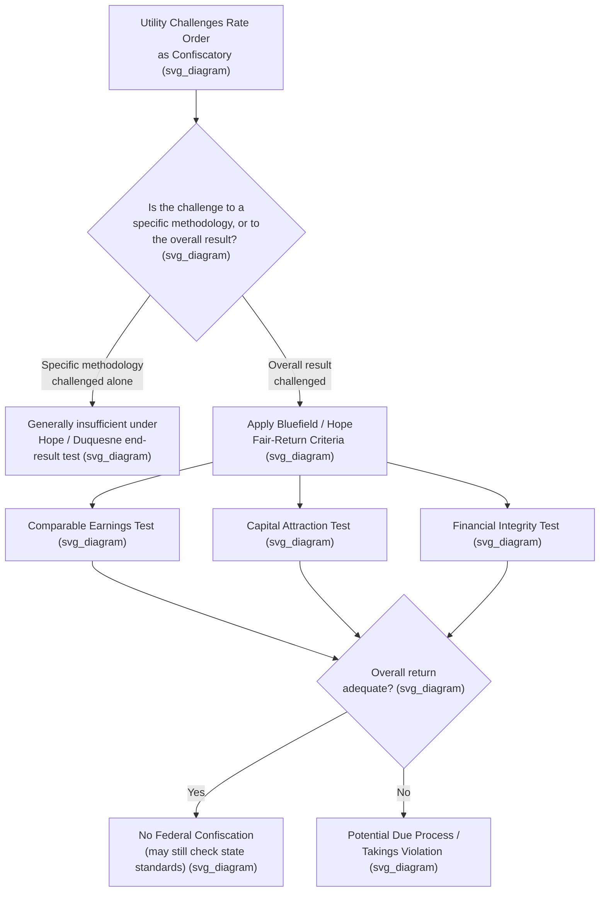

## Regulatory Takings and Due Process Limits

### Constitutional Foundations

Utility rate regulation operates under the shadow of two overlapping constitutional constraints: the Takings Clause of the Fifth Amendment (applied to the states via the Fourteenth Amendment) and the Due Process Clause of the Fourteenth Amendment. Both doctrines converge in ratemaking on a single functional question: has the state, through its regulation of rates, deprived a utility of its property without just compensation or without due process of law? Historically, courts have treated confiscatory ratemaking as implicating both theories somewhat interchangeably, though modern doctrine has increasingly organized the inquiry around Due Process's "reasonableness of the end result" framework rather than classical per se takings analysis.

### Doctrinal Lineage

The constitutional law of ratemaking developed through a sequence of Supreme Court decisions, each responding to and refining the last:

- **Munn v. Illinois**, 94 U.S. 113 (1877) — established that property "affected with a public interest" may be subjected to rate regulation without violating due process, laying the predicate for utility regulation generally.
- **Smyth v. Ames**, 169 U.S. 466 (1898) — held that a utility is constitutionally entitled to a "fair return" on the "fair value" of its property, requiring valuation based on a mix of original cost, reproduction cost, market value of securities, and earning capacity. This created decades of contentious, fact-intensive valuation litigation.
- **Bluefield Waterworks & Improvement Co. v. Public Service Commission**, 262 U.S. 679 (1923) — articulated the substantive fair-return criteria still cited today: comparable earnings, capital attraction, and financial integrity.
- **FPC v. Hope Natural Gas Co.**, 320 U.S. 591 (1944) — shifted the constitutional inquiry to an "end result" test, holding that no single ratesetting methodology is constitutionally required and that original cost rate base is permissible.
- **Duquesne Light Co. v. Barasch**, 488 U.S. 299 (1989) — reaffirmed Hope, holding that a "used and useful" exclusion of canceled or unproductive investment from rate base does not, by itself, constitute a taking, and rejected any residual constitutional mandate to compensate all prudent investment as in Smyth v. Ames.

### The Modern "End Result" Test

**[Inference]** Under current doctrine, the predominant framework for evaluating whether a rate order is confiscatory is the Hope/Duquesne "end result" test, since these are the most recent controlling Supreme Court authorities directly on point and have not been overruled.

Under this test, courts do not scrutinize the individual components of a ratesetting methodology (how depreciation is calculated, whether original cost or fair value is used, how a specific cost item is treated) in isolation. Instead, courts ask whether the **aggregate, overall impact** of a rate order is unjust or unreasonable, measured against three substantive touchstones drawn from Bluefield and Hope:

1. **Comparable earnings** — is the authorized return commensurate with returns available on investments of corresponding risk?
2. **Capital attraction** — is the return sufficient to attract capital on reasonable terms?
3. **Financial integrity** — does the return maintain the utility's credit and overall financial soundness?

If these substantive conditions are met, the rate order will not be found confiscatory merely because it employs a methodology unfavorable to the utility on some particular point (e.g., prudence disallowances, used-and-useful exclusions, disallowed rate base items, or specific depreciation conventions).

### Takings Clause Analysis in Ratemaking

**[Inference]** Although rate cases are more commonly litigated as due process confiscation claims, some analysts and litigants frame the same substantive question in Takings Clause terms, since a rate order that permanently prevents any possibility of a reasonable return functions similarly to a taking of the utility's property without compensation.

When framed as a Takings Clause matter, courts historically applied something resembling the *Penn Central Transportation Co. v. City of New York*, 438 U.S. 104 (1978), multi-factor balancing test used in regulatory takings generally: (1) the economic impact of the regulation on the claimant, (2) the extent of interference with investment-backed expectations, and (3) the character of the governmental action. **[Inference]** In practice, however, ratemaking-specific doctrine (Hope/Duquesne) has generally displaced free-standing Penn Central analysis in utility rate cases, because the Supreme Court has treated ratemaking as a specialized due process inquiry with its own settled framework rather than as an instance of general regulatory takings law.

### Substantive vs. Procedural Due Process in Ratemaking

Two distinct due process strands are relevant to utility regulation:

- **Substantive due process** addresses whether the *outcome* of a rate order (the rate level itself) is confiscatory — this is the Bluefield/Hope/Duquesne line of cases.
- **Procedural due process** addresses whether the *process* by which a rate order was reached (notice, hearing rights, evidentiary record, opportunity to be heard) was constitutionally adequate. A rate order can be procedurally fair and still substantively confiscatory, or vice versa; the two inquiries are analytically separate, though a badly flawed process can undermine the reliability of the record needed to assess substantive adequacy.

### Elements of a Confiscation Claim

**[Inference]** Drawing on Bluefield, Hope, and Duquesne, a utility asserting that a rate order is unconstitutionally confiscatory generally must show, as a practical litigation matter, several things, though courts differ in how they frame the precise burden:

1. The rate order, considered in its totality (not any single component), fails to allow a reasonable opportunity to earn a fair return.
2. The shortfall is attributable to the regulatory action itself rather than to market conditions, mismanagement, or ordinary business risk.
3. The effect is not merely a reduced profit but a return so inadequate as to threaten the utility's financial integrity, ability to attract capital, or ability to maintain service.

Courts have historically been reluctant to find confiscation, reflecting substantial deference to state and federal regulatory bodies' technical ratemaking judgments.

### Illustrative Example

**Example**: A state commission denies a utility's requested 10.2% ROE and instead authorizes 8.5%, while simultaneously disallowing certain contested operating expenses as imprudent and applying accelerated depreciation to a subset of plant. The utility sues, alleging confiscation.

Under the end-result test, a reviewing court would **not** separately evaluate whether the depreciation convention was appropriate or whether each disallowed expense was correctly excluded. Instead, it would examine:

- Whether the resulting 8.5% ROE, given contemporaneous capital market conditions, is comparable to returns on similarly risky investments (comparable earnings prong).
- Whether 8.5% is adequate to allow the utility to raise debt and equity capital on reasonable terms (capital attraction prong).
- Whether the utility's credit ratings and coverage ratios remain investment-grade under the order (financial integrity prong).

**[Inference]** If the utility can show, for example through credit rating agency commentary or bond covenant metrics, that the authorized return has caused or threatens a credit downgrade or an inability to finance planned capital expenditures, this would support a confiscation claim; a request court would weigh such evidence, but the outcome in any specific case depends heavily on the full record and is not automatic even where some financial stress is shown.

### Interaction with State Constitutional and Statutory Standards

**[Inference]** Many state constitutions and public utility statutes impose their own "just and reasonable rate" standards that may be more protective of utility interests than the federal constitutional floor established by Hope and Duquesne, since states remain free to grant greater substantive or procedural protections than the U.S. Constitution requires as a floor.

As a result, utility counsel in a given rate case often must analyze both:

- The **federal constitutional floor** (Hope/Duquesne end-result test) — a demanding threshold that regulators rarely violate.
- The **state statutory/constitutional standard** — which may provide an independent and more readily available basis for challenging a rate order, even where no federal confiscation is shown.

### Key Points

- Confiscatory ratemaking claims sound primarily in Due Process, with the Takings Clause serving a secondary, often overlapping role.
- The controlling modern framework is the Hope/Duquesne "end result" test: courts assess the overall reasonableness of a rate order's impact, not the propriety of individual methodological choices.
- Bluefield's fair-return criteria (comparable earnings, capital attraction, financial integrity) remain the substantive benchmarks used within the end-result framework.
- Duquesne forecloses arguments that any specific valuation or cost-recovery methodology (such as used-and-useful exclusions) is independently unconstitutional.
- State statutory and constitutional standards may offer protections beyond the federal constitutional floor and are frequently the more practically significant avenue for utility challenges to unfavorable rate orders.

### Diagram: Confiscation Claim Analytical Flow (svg_diagram)

### Related Topics

- **Bluefield Waterworks v. Public Service Commission** — origin of the fair-return substantive criteria
- **FPC v. Hope Natural Gas Co.** — the "end result" test
- **Duquesne Light Co. v. Barasch** — used-and-useful exclusions and rejection of the Smyth v. Ames floor
- **Penn Central Transportation Co. v. City of New York** — general regulatory takings balancing test
- **Procedural Due Process in Administrative Ratemaking** — notice, hearing, and record requirements
- **State Public Utility Statutes and "Just and Reasonable" Standards**
- **Credit Metrics and Financial Integrity Analysis** in rate of return proceedings
- **Regulatory Compact Theory** and its relationship to constitutional protections