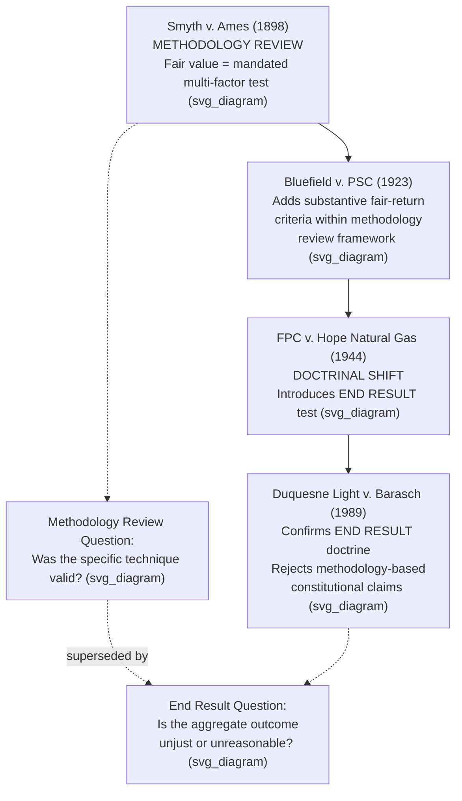

## The End Result Doctrine vs. Methodology Review

### Framing the Distinction

Constitutional review of utility rate orders has historically oscillated between two competing analytical postures: **methodology review**, in which a reviewing court scrutinizes and validates or invalidates the specific ratesetting techniques a regulator used, and the **end result doctrine**, in which a court instead asks only whether the overall outcome produced by those techniques is constitutionally adequate, regardless of which techniques were used to get there. The tension between these postures, and the Supreme Court's eventual choice of the latter, is one of the defining developments in the constitutional law of ratemaking.

### The Methodology Review Era: Smyth v. Ames

The methodology-review approach traces to **Smyth v. Ames**, 169 U.S. 466 (1898), which held that a utility was constitutionally entitled to a "fair return" on the "fair value" of its property and directed courts and commissions to determine that fair value by weighing a specified list of factors — original cost, reproduction cost, market value of outstanding securities, earning capacity, and operating expenses. Because the Court treated the *valuation methodology itself* as constitutionally mandated, litigants had strong incentive to challenge a commission's ratesetting order by attacking its particular valuation inputs: Did it correctly weigh reproduction cost against original cost? Did it use the right depreciation schedule? Did it correctly measure "used and useful" property?

**[Inference]** This methodology-centered approach is generally understood to have produced substantial practical difficulties, since it invited relitigation of technical valuation questions in every rate case and created significant uncertainty for regulators, given that reproduction cost estimates fluctuate with commodity and construction prices and are inherently contestable.

**Bluefield Waterworks & Improvement Co. v. Public Service Commission**, 262 U.S. 679 (1923), operated within this methodology-oriented framework, still directing attention to how fair value should be computed, while also introducing the substantive fair-return criteria (comparable earnings, capital attraction, financial integrity) that would later survive the shift away from Smyth v. Ames.

### The Shift: FPC v. Hope Natural Gas Co.

**FPC v. Hope Natural Gas Co.**, 320 U.S. 591 (1944), reoriented the inquiry. The Court held that:

- The Constitution does not bind ratemaking bodies to any single methodology.
- Original cost rate base is a permissible alternative to Smyth v. Ames-style fair value.
- The controlling constitutional question is whether "the total effect of the rate order cannot be said to be unjust or unreasonable" — the **end result**.

This was a deliberate rejection of methodology review as the touchstone. Under Hope, a commission's choice of valuation method, depreciation convention, test year, or capital structure imputation is treated as a matter of regulatory discretion and administrative expertise, not a matter of independent constitutional command. The reviewing court's role contracts substantially: rather than auditing each methodological choice, it examines only the aggregate financial outcome for the utility.

### Duquesne Light Co. v. Barasch: Confirming and Extending the End Result Doctrine

**Duquesne Light Co. v. Barasch**, 488 U.S. 299 (1989), applied and extended Hope's end-result logic to a particularly sharp methodological dispute: Pennsylvania's statutory "used and useful" rule, which categorically excluded canceled nuclear plant investment from rate base. The utilities argued the exclusion of admittedly prudent investment was itself unconstitutional. The Court rejected this framing, holding that isolating a single methodological choice (the used-and-useful exclusion) and testing it against a constitutional standard was the wrong approach; the correct approach evaluates the utility's overall rate of return across its entire rate base and expense structure.

**[Inference]** Duquesne is generally read as closing off any residual methodology-based constitutional argument, since it explicitly declined to treat Smyth v. Ames's prudent-investment principle as an independent federal constitutional floor, leaving the end-result inquiry as the sole framework for confiscation claims at the U.S. Supreme Court level.

### Comparative Analysis: Methodology Review vs. End Result Doctrine

| Dimension | Methodology Review (Smyth v. Ames era) | End Result Doctrine (Hope/Duquesne) |
| --- | --- | --- |
| Focus of judicial scrutiny | Specific valuation/ratesetting techniques | Aggregate financial outcome for the utility |
| Constitutionally mandated method | Yes — fair value based on multiple weighted factors | No — any rational method is permissible |
| Reproduction cost treatment | Required consideration | Optional; original cost is sufficient |
| Litigation focus | Technical valuation disputes (appraisal-style) | Overall rate of return adequacy (comparable earnings, capital attraction, financial integrity) |
| Judicial deference to regulators | Lower — courts second-guess valuation inputs | Higher — courts defer to regulatory expertise on methodology |
| Practical predictability for regulators | Lower — outcomes contestable on many technical fronts | Higher — regulators have wide methodological latitude |
| Governing case | Smyth v. Ames (1898) | Hope Natural Gas (1944); Duquesne (1989) |

### Why the Shift Occurred

**[Inference]** Several factors are commonly cited by courts and commentators as driving the shift from methodology review to the end-result doctrine, though the relative weight given to each varies:

1. **Administrative burden** — methodology review required commissions and courts to conduct exhaustive, duplicative valuations in nearly every rate case, particularly burdensome given fluctuating reproduction cost estimates during and after periods of significant price inflation.
2. **Judicial competence concerns** — courts are generally not well positioned to second-guess the technical ratemaking judgments (depreciation schedules, cost allocation, capital structure) that fall within regulatory commissions' specialized expertise.
3. **Regulatory flexibility** — an end-result standard allows regulators to adapt methodology to changing economic conditions, industry structures, and policy priorities (e.g., transitioning from cost-of-service to incentive or performance-based ratemaking) without constant constitutional relitigation.
4. **Focus on the constitutionally relevant harm** — the underlying constitutional concern is that a utility not be deprived of a reasonable opportunity to earn a fair return; that concern is fully addressed by evaluating the aggregate outcome, making scrutiny of individual methodological inputs unnecessary to protect the underlying right.

### Practical Implications for Litigants

**[Inference]** Under the current end-result framework, a utility (or intervenor) challenging a rate order as confiscatory faces a substantially different litigation strategy than would have been available under Smyth v. Ames-style methodology review:

- **Ineffective argument**: "The commission used the wrong depreciation method" or "the commission should have given more weight to reproduction cost," standing alone.
- **Effective argument (in principle)**: "The aggregate rate of return authorized by this order, considering all rate base and expense treatment together, fails to meet the comparable earnings, capital attraction, or financial integrity criteria of Bluefield and Hope."

**[Inference]** This does not mean methodology is irrelevant to rate case litigation generally — parties still vigorously contest methodological choices before commissions and on appeal under state administrative law and state constitutional or statutory standards — but it does mean that methodology, standing alone, is not typically a winning *federal constitutional* argument after Hope and Duquesne.

### Illustrative Example

**Example**: A commission switches a utility's depreciation methodology from straight-line to a different accepted convention, reducing the utility's near-term cash recovery of capital costs, while simultaneously authorizing a higher ROE that offsets the timing effect. The utility challenges the depreciation switch as confiscatory.

Under a pure methodology-review approach (pre-Hope), a court might scrutinize whether the new depreciation convention was itself an appropriate valuation technique. Under the end-result doctrine (post-Hope/Duquesne), a court instead asks: **[Inference]** taking the depreciation change and the ROE increase together, does the utility retain a reasonable opportunity to earn a fair return, attract capital, and maintain financial integrity? If so, the depreciation methodology change, considered in isolation, would not support a confiscation claim — the two elements must be evaluated as a package, and the specific outcome would depend on the full quantitative record in an actual proceeding.

### Key Points

- Smyth v. Ames represents the high-water mark of methodology review, mandating a specific multi-factor fair-value valuation approach as a constitutional requirement.
- Hope Natural Gas replaced methodology review with the end-result doctrine: any rational ratesetting method is permissible so long as the aggregate outcome is not unjust or unreasonable.
- Duquesne extended and confirmed the end-result doctrine, rejecting the argument that a specific methodological choice (used-and-useful exclusion) is independently unconstitutional.
- Under current doctrine, confiscation challenges must be framed at the level of aggregate financial outcome, not individual methodological components.
- The shift significantly increased regulatory flexibility and judicial deference on technical ratemaking questions, while preserving Bluefield's substantive fair-return criteria as the outcome-level benchmark.

### Diagram: Methodology Review vs. End Result Doctrine (svg_diagram)

### Related Topics

- **Smyth v. Ames** — the original methodology-review "fair value" standard
- **FPC v. Hope Natural Gas Co.** — origin of the end-result test
- **Duquesne Light Co. v. Barasch** — application to used-and-useful exclusions
- **Bluefield Waterworks v. Public Service Commission** — substantive fair-return criteria retained under the end-result doctrine
- **Cost of Service Ratemaking Methodology** — the technical inputs still contested at the administrative/state level
- **Performance-Based and Incentive Ratemaking** — how methodological flexibility enables alternative ratemaking models
- **State Administrative Law Standards of Review** for methodological challenges outside the federal constitutional context