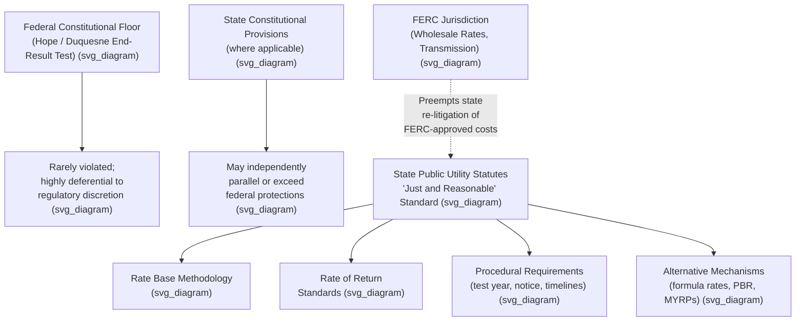

## State Constitutional and Statutory Ratemaking Standards

### Overview and Relationship to Federal Doctrine

While *FPC v. Hope Natural Gas Co.*, 320 U.S. 591 (1944), and *Duquesne Light Co. v. Barasch*, 488 U.S. 299 (1989), establish the federal constitutional *floor* below which a rate order becomes confiscatory, states remain free to impose more protective, more specific, or differently structured standards through their own constitutions, statutes, and administrative codes. **[Inference]** Because the federal end-result test is deliberately deferential and rarely provides a successful avenue for utility challenges, state constitutional and statutory standards are, in practice, the dominant source of substantive ratemaking law actually litigated and applied in the large majority of rate cases, with federal constitutional claims typically arising only as a backstop argument.

State ratemaking law generally operates on two distinct tracks:

1. **State constitutional provisions** — some state constitutions contain due process or takings clauses that parallel, and are sometimes construed independently of, their federal counterparts; a few states have specific constitutional provisions addressing utility regulation or public service commissions.
2. **State statutes and administrative codes** — the primary source of operative ratemaking standards, typically codified in a state's Public Utility Code (or equivalent), which authorizes the state commission, defines "just and reasonable" rates, specifies ratemaking methodology defaults, and establishes procedural requirements.

### The "Just and Reasonable" Standard

Most state public utility statutes require that rates be "just and reasonable" — language that echoes, but is not identical to, the federal constitutional standard. **[Inference]** Because "just and reasonable" is a broad, largely undefined statutory phrase, state courts and commissions have developed extensive body of state-specific case law interpreting it, meaning the practical content of the standard varies meaningfully from state to state even though the statutory language is often similar or identical.

Typical elements incorporated into state "just and reasonable" analysis include:

- Adequacy of the rate of return for investors (paralleling Bluefield's fair-return criteria)
- Fairness of the rate structure and cost allocation as among customer classes
- Reasonableness of the utility's expenses and capital expenditures (prudence review)
- Non-discrimination among similarly situated customers
- Alignment of rates with the cost of providing service (cost-causation principles)

### Rate Base Valuation: State-Level Choices

Following *Hope Natural Gas*'s abandonment of a constitutionally mandated valuation method, individual states became free to select their own rate base methodology by statute or commission practice. The dominant approaches found across states include:

- **Original cost rate base** — the most common approach nationally, valuing rate base at the historical cost of the utility's used-and-useful plant, less accumulated depreciation, adjusted for working capital and deferred taxes.
- **Fair value rate base** — a small number of states retain fair-value-influenced approaches, blending original cost with reproduction cost or trended original cost, though this is now a minority practice.
- **Used and useful limitations** — nearly universal in some form; the specific scope of what counts as "used and useful" (e.g., treatment of construction work in progress, canceled plants, excess capacity) varies significantly by state statute and commission precedent, as illustrated by the Pennsylvania statute at issue in Duquesne.

### Rate of Return Standards at the State Level

State commissions apply the substantive Bluefield/Hope fair-return criteria (comparable earnings, capital attraction, financial integrity) as a matter of both federal constitutional compliance and, frequently, incorporated state statutory or common-law standard. **[Inference]** In practice, state commissions typically rely on expert testimony applying DCF, CAPM, risk premium, and comparable earnings models to select a specific authorized ROE within a "zone of reasonableness" bounded by these methodologies, since this is the standard evidentiary approach used across most state ratemaking proceedings, though the specific weight given to each model varies by commission and by case.

### Procedural Standards: State Administrative Procedure Acts

Beyond substantive rate-of-return and rate-base standards, state law typically imposes procedural requirements governing how rate cases must be conducted, generally including:

- **Notice and hearing requirements** — formal notice to affected customers and interested parties, and an evidentiary hearing before an administrative law judge or the commission itself.
- **Test year requirements** — specification of whether a historical, projected (future), or hybrid test year is used as the basis for setting rates, and rules for post-test-year adjustments (known and measurable changes).
- **Burden of proof allocation** — typically placing the burden on the utility to justify a requested rate increase.
- **Rate case timelines and suspension periods** — statutory deadlines within which a commission must act on a filed rate case, often coupled with provisions allowing rates to go into effect subject to refund if the commission does not act within the statutory period.
- **Intervention rights** — procedures allowing consumer advocates, industrial customer groups, environmental organizations, and other stakeholders to participate in rate proceedings.

### Illustrative Example: Divergence Between Federal Floor and State Standard

**Example**: Suppose a state commission authorizes a utility an ROE of 9.0%, which comfortably satisfies the federal Hope/Duquesne end-result test (the utility maintains investment-grade credit metrics and can access capital markets, if less favorably than it would prefer). However, the state's public utility statute requires the commission to also make an explicit finding that the authorized ROE is within the range produced by at least two independent cost-of-capital models (e.g., DCF and CAPM) presented in the record, and the commission's order relies on only one model without addressing the other.

**[Inference]** In this scenario, the utility would have essentially no viable federal constitutional claim, since the end-result test is satisfied, but could have a strong state-law claim that the commission's order is legally deficient for failing to comply with the state's specific statutory findings requirement, illustrating how the state statutory standard functions independently of, and often more restrictively than, the federal constitutional floor.

### State Variation in Rate Case Procedures: Representative Comparison

| Dimension | Typical State Approach A | Typical State Approach B |
| --- | --- | --- |
| Test year | Historical test year with known/measurable adjustments | Fully projected (future) test year |
| Rate base | Original cost | Original cost with limited CWIP inclusion |
| Suspension period | 6-9 months statutory suspension | 9-12 months statutory suspension |
| Interim rate relief | Rates effective subject to refund after suspension period | No interim relief; rates effective only upon final order |
| ROE-setting method | Commission discretion within "zone of reasonableness" | Statutory formula or index-based mechanism |

**[Unverified]** The specific suspension periods, test year rules, and ROE-setting mechanisms vary considerably across individual states and are subject to legislative amendment; a reader needing the current rule for a specific jurisdiction should consult that state's public utility code and recent commission orders directly rather than relying on generalized categories.

### Alternative and Modernized Ratemaking Mechanisms Under State Law

Many states have supplemented traditional cost-of-service ratemaking with statutory mechanisms addressing regulatory lag, capital-intensive infrastructure investment, and policy goals such as decarbonization or grid modernization:

- **Formula rate plans** — periodic (often annual) rate adjustments based on a pre-approved formula, reducing the need for full base rate cases.
- **Riders and trackers** — mechanisms allowing pass-through or accelerated recovery of specific cost categories (fuel costs, infrastructure replacement, storm restoration, energy efficiency programs) outside a full rate case.
- **Performance-based ratemaking (PBR)** — ties utility revenue or allowed return to performance metrics (reliability, customer satisfaction, decarbonization progress) rather than solely to cost recovery.
- **Multi-year rate plans (MYRPs)** — set rates for a period of several years based on projected costs, often with true-up mechanisms.

**[Inference]** These mechanisms are creatures of state statute and commission policy rather than federal constitutional requirements, and their availability, structure, and mandatory or optional character differ substantially from state to state.

### Interaction with Federal Preemption

**[Inference]** State ratemaking authority is generally understood to be bounded by federal law in specific areas, most notably where the Federal Power Act and Natural Gas Act allocate wholesale rate jurisdiction to FERC, since the filed rate doctrine and related preemption principles limit states to retail ratemaking and bar states from effectively second-guessing FERC-approved wholesale rates when setting retail rates that pass through those costs.

This jurisdictional division means that a state commission setting retail rates for a utility that purchases wholesale power or transmission service under FERC-jurisdictional tariffs must generally treat those FERC-approved costs as a pass-through, without independently re-litigating their reasonableness at the state level.

### Key Points

- State constitutional and statutory standards, not the federal constitutional floor, are the primary operative law in the overwhelming majority of rate cases.
- The "just and reasonable" standard is nearly universal in state public utility statutes but is given varying specific content by state case law and commission precedent.
- States have wide latitude, post-Hope, to select rate base methodology (predominantly original cost), used-and-useful limitations, test year rules, and procedural requirements.
- State law frequently imposes more specific and demanding requirements (e.g., explicit findings, formula constraints, procedural timelines) than the deferential federal end-result test.
- Federal preemption principles limit state ratemaking authority with respect to FERC-jurisdictional wholesale rates and transmission costs.

### Diagram: Federal Floor vs. State Standards (svg_diagram)

### Related Topics

- **FPC v. Hope Natural Gas Co.** — the federal end-result floor states build upon
- **Duquesne Light Co. v. Barasch** — used-and-useful and prudence review at the state level
- **Formula Rate Plans and Multi-Year Rate Plans** — modernized state ratemaking mechanisms
- **Performance-Based Ratemaking (PBR)** — state-level policy-driven ratemaking reform
- **Federal Power Act and Filed Rate Doctrine** — federal preemption boundaries
- **Test Year Methodology** — historical, future, and hybrid approaches
- **Cost Allocation and Rate Design** — translating revenue requirement into customer class rates
- **Prudence Review Standards** at the state commission level