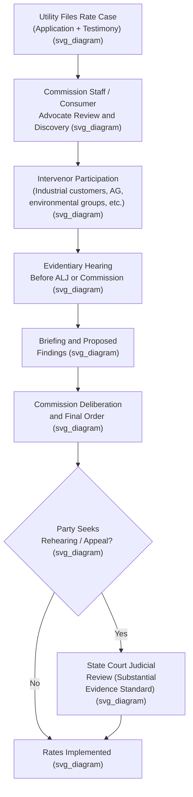

## State Public Utility Commissions and Their Authority

### Institutional Overview

State Public Utility Commissions (PUCs) — variously named Public Service Commissions (PSCs), Corporation Commissions, or similar titles depending on the state — are the primary administrative bodies responsible for regulating investor-owned utilities (IOUs) providing electricity, natural gas, water, telecommunications, and in some states, other services within their jurisdiction. **[Inference]** These commissions are generally understood as exercising a blend of legislative, executive, and judicial functions, since they promulgate rules (legislative-like), investigate and enforce compliance (executive-like), and adjudicate contested rate cases and complaints (judicial-like), a characteristic shared broadly across independent regulatory agencies at the state and federal level.

### Origins and Constitutional Basis

State commissions derive their authority from state legislative enactments (public utility codes), which in turn rest on the states' general police power to regulate businesses affected with a public interest, as recognized in *Munn v. Illinois*, 94 U.S. 113 (1877). Most current-form state commissions trace their institutional origins to the Progressive Era (roughly 1907–1920), when a wave of states created centralized regulatory bodies to replace the prior, less effective system of municipal franchise regulation and judicial rate review. **[Unverified]** The precise founding date and structural details vary by state and would need to be confirmed against the specific state's utility code for accuracy in any given jurisdiction.

### Commissioner Structure and Selection

State commissions are typically composed of three to seven commissioners (three or five being most common), selected through one of two primary methods:

- **Gubernatorial appointment**, often subject to state senate confirmation, with staggered terms designed to insulate the commission from any single election cycle.
- **Direct election** by the state's voters, used in a minority of states.

**[Inference]** The selection method is often discussed in the regulatory economics literature as bearing on commissioner independence and susceptibility to political or short-term pressures, though the empirical relationship between selection method and regulatory outcomes is contested and is not a settled, uniformly agreed-upon finding.

### Core Jurisdictional Authority

State commissions typically exercise authority over the following domains with respect to utilities operating within their state:

1. **Rate regulation** — setting and approving retail rates and tariffs for regulated services, including base rate cases, rate riders, and formula rate mechanisms.
2. **Certification and entry** — issuing Certificates of Public Convenience and Necessity (CPCNs or CCNs) authorizing a utility to serve a given territory or to construct specific facilities (generation plants, transmission lines, pipelines).
3. **Service quality and reliability oversight** — establishing and enforcing service quality standards, reliability metrics (e.g., SAIDI/SAIFI for electric utilities), and customer service requirements.
4. **Financial oversight** — reviewing utility capital structure, debt issuances, affiliate transactions, and in some states, mergers and acquisitions involving regulated utilities.
5. **Safety regulation** — for gas and, in some states, electric utilities, enforcing pipeline safety and electrical safety codes, often in coordination with or under standards set by federal agencies (e.g., PHMSA for gas pipeline safety).
6. **Consumer protection** — handling customer complaints, enforcing billing and disconnection rules, and administering low-income and vulnerable customer protection programs.
7. **Resource planning oversight** — in many states, reviewing and approving Integrated Resource Plans (IRPs) that describe a utility's long-term generation, transmission, and demand-side resource plans.

### The Ratemaking Process: Institutional Workflow

**[Inference]** Although specific procedural rules vary by state, the general institutional workflow for a contested rate case follows a broadly similar pattern across most state commissions, reflecting common administrative law principles applied to utility regulation.

### Standard of Judicial Review

State court review of commission rate orders is generally deferential, applying a **substantial evidence** or **arbitrary and capricious** standard rather than reweighing the evidence de novo. **[Inference]** This deference reflects the general administrative law principle that specialized agencies possess technical expertise (in valuation, cost of capital, engineering, and accounting) that courts are not well positioned to second-guess, a rationale closely related to the deference rationale underlying the federal end-result doctrine established in *FPC v. Hope Natural Gas Co.*, 320 U.S. 591 (1944).

### Commission Staff and Independent Advocacy Functions

Most state commissions operate alongside, or contain internally, functionally distinct units that participate in rate cases as parties with interests potentially adverse to the utility:

- **Commission Staff** — technical staff (accountants, engineers, financial analysts) who conduct independent review of a utility's rate case filing and often sponsor their own testimony and revenue requirement recommendations.
- **Office of Consumer Advocate / Public Counsel** — in many states, a separate state agency (sometimes housed within the Attorney General's office, sometimes independent) statutorily charged with representing residential and small consumer interests in rate proceedings, distinct from the commission itself.
- **Independent Intervenors** — industrial and large commercial customer groups, environmental and clean energy organizations, low-income advocacy groups, and competitive market participants, each of which may formally intervene and sponsor testimony.

### Jurisdictional Boundaries: State vs. Federal Authority

State commission authority is bounded by federal jurisdiction in specific areas, most significantly:

- **Wholesale electricity and natural gas sales and transmission/pipeline transportation rates** — jurisdiction over these areas is allocated to the Federal Energy Regulatory Commission (FERC) under the Federal Power Act and Natural Gas Act, respectively; state commissions retain jurisdiction over retail sales and distribution.
- **Interstate telecommunications** — jurisdiction is divided between the Federal Communications Commission (FCC) for interstate services and state commissions for intrastate services, though this division has been substantially reshaped by federal deregulation of telecommunications over recent decades.
- **Nuclear safety** — exclusively federal, under the Nuclear Regulatory Commission (NRC); state commissions may still review the prudence of nuclear-related costs for ratemaking purposes (as illustrated in *Duquesne Light Co. v. Barasch*, 488 U.S. 299 (1989)) without displacing NRC safety jurisdiction.
- **Interstate gas pipeline certification** — FERC-jurisdictional under the Natural Gas Act, distinct from state distribution utility regulation.

**[Inference]** This state/federal division of authority is generally organized around a wholesale/retail (or interstate/intrastate) distinction, though the precise boundary has been the subject of extensive litigation, particularly as electricity and gas markets have restructured and as new technologies (distributed energy resources, demand response aggregation) create ambiguous jurisdictional questions not clearly anticipated by the original statutory frameworks.

### Illustrative Example: Multi-Party Rate Case Dynamics

**Example**: An electric utility files a base rate case requesting a $150 million annual revenue increase and a 10.5% ROE. In the resulting proceeding:

- **Commission Staff** independently audits the utility's cost of service and recommends a $95 million increase with a 9.6% ROE.
- **The Office of Consumer Advocate** sponsors testimony arguing for an $80 million increase and a 9.3% ROE, emphasizing affordability and challenging specific expense items as imprudent.
- **An industrial customer group** intervenes to argue for rate design changes shifting a greater share of any increase onto residential customers, based on cost-of-service and demand characteristics.
- **An environmental organization** intervenes to argue for specific ratemaking treatment of energy efficiency program costs and performance incentives.

**[Inference]** After a contested evidentiary hearing incorporating all parties' testimony, the commission's final order might settle on an outcome between the extremes proposed — for example, roughly a $100–110 million increase and a 9.4%–9.7% ROE — though the actual outcome in any specific case depends entirely on the evidentiary record, the commission's own analytical approach, and applicable state statutory constraints, and no generalized pattern reliably predicts the specific result.

### Key Points

- State PUCs are the primary regulators of retail utility service, deriving authority from state public utility statutes grounded in the states' police power.
- Core commission functions include rate regulation, certification, service quality oversight, financial oversight, safety regulation, consumer protection, and resource planning review.
- Commission orders are typically reviewed by state courts under a deferential substantial-evidence standard, paralleling the deference rationale of the federal end-result doctrine.
- Commission Staff, Consumer Advocates, and various intervenors function as distinct, often adversarial parties within the ratemaking process, not merely commentators.
- State commission jurisdiction is bounded by federal authority over wholesale energy transactions, interstate telecommunications, and nuclear safety.

### Related Topics

- **FPC v. Hope Natural Gas Co.** — the deference rationale underlying judicial review of commission orders
- **Federal Energy Regulatory Commission (FERC) Jurisdiction and the Filed Rate Doctrine**
- **Certificate of Public Convenience and Necessity (CPCN) Proceedings**
- **Integrated Resource Planning (IRP) Requirements**
- **Office of Consumer Advocate / Public Counsel Functions**
- **Rate Case Procedure and Test Year Methodology**
- **Performance-Based Regulation and Alternative Ratemaking Frameworks**
- **Service Quality Metrics and Reliability Standards (SAIDI/SAIFI)**