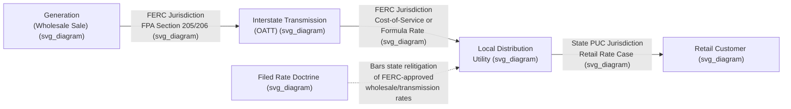

## FERC Jurisdiction over Wholesale and Transmission Rates

### Institutional Overview

The Federal Energy Regulatory Commission (FERC) is an independent federal agency responsible for regulating the interstate transmission and wholesale sale of electricity, the interstate transportation and wholesale sale of natural gas, and the licensing of non-federal hydropower projects. FERC is composed of up to five commissioners appointed by the President and confirmed by the Senate, serving staggered five-year terms, with no more than three commissioners from the same political party. FERC's jurisdiction over electricity derives principally from the **Federal Power Act (FPA)**, and its jurisdiction over natural gas derives principally from the **Natural Gas Act (NGA)**, both of which pre-date and were substantially shaped by the constitutional ratemaking doctrine discussed in *FPC v. Hope Natural Gas Co.*, 320 U.S. 591 (1944) — a case that itself arose from FERC's predecessor agency, the Federal Power Commission.

### Statutory Jurisdictional Basis

The core jurisdictional allocation under the Federal Power Act (Section 201) and Natural Gas Act rests on a **wholesale/retail** (or **interstate/intrastate**) distinction:

- **FERC jurisdiction**: sales of electric energy at wholesale in interstate commerce, and transmission of electric energy in interstate commerce (FPA); transportation of natural gas in interstate commerce and sales of natural gas for resale in interstate commerce (NGA).
- **State commission jurisdiction**: retail sales of electricity and gas directly to end-use consumers, and local distribution facilities.

**[Inference]** This statutory division is generally understood as reflecting a Depression-era Congressional judgment (embodied in the original Federal Power Act of 1935 and Natural Gas Act of 1938) that interstate wholesale transactions, occurring across state lines and thus outside the reach of any single state's regulatory authority, required federal oversight to fill a regulatory gap that existed following certain Supreme Court decisions limiting state authority over interstate utility transactions under the dormant Commerce Clause.

### The Filed Rate Doctrine

A central operational principle of FERC-jurisdictional ratemaking is the **filed rate doctrine**, which holds that a rate filed with and approved by FERC (or, historically, its predecessor) is the only lawful rate that may be charged, and that neither courts nor state commissions may engage in retroactive re-litigation of the reasonableness of a FERC-approved wholesale rate. This doctrine, most prominently articulated in *Montana-Dakota Utilities Co. v. Northwestern Public Service Co.*, 341 U.S. 246 (1951), and later reaffirmed in cases such as *Mississippi Power & Light Co. v. Mississippi ex rel. Moore*, 487 U.S. 354 (1988), has significant practical consequences for state ratemaking: a state commission setting retail rates for a utility that purchases FERC-jurisdictional wholesale power or transmission service must generally treat those costs as a pass-through, without independently second-guessing their prudence or reasonableness at the state level, since doing so would effectively override FERC's exclusive rate-setting authority.

### Wholesale Electricity Rate Regulation

FERC's approach to wholesale electricity ratemaking has evolved substantially, particularly with the restructuring of electricity markets beginning in the 1990s:

- **Cost-of-service rates** — traditional rate regulation for wholesale sales by vertically integrated utilities not participating in organized markets, following cost-of-service principles broadly analogous to state retail ratemaking (revenue requirement, rate base, allowed ROE determined via comparable earnings/DCF/CAPM analyses consistent with Bluefield/Hope criteria).
- **Market-based rate authority (MBRA)** — since the 1990s, FERC has authorized many wholesale sellers to charge market-based rather than cost-based rates, subject to a market power screening analysis, reflecting a policy judgment that competitive wholesale markets can produce just and reasonable rates without traditional cost-of-service regulation.
- **Organized wholesale markets (RTOs/ISOs)** — in regions served by Regional Transmission Organizations or Independent System Operators (e.g., PJM, MISO, ERCOT [not FERC-jurisdictional], CAISO, ISO-NE, NYISO, SPP), FERC approves the RTO/ISO's tariff governing energy, capacity, and ancillary services markets, effectively regulating wholesale prices through market design and market monitoring rather than case-by-case cost-of-service review.

### Transmission Rate Regulation

FERC regulates the rates, terms, and conditions of interstate electric transmission service under the FPA, with several major policy developments shaping the current framework:

- **Order No. 888 (1996)** — required functional unbundling of wholesale generation and transmission services and established open-access, non-discriminatory transmission tariffs (Open Access Transmission Tariffs, or OATTs).
- **Order No. 2000 (1999)** — encouraged (though did not mandate) the formation of RTOs to independently operate transmission systems and administer open-access tariffs.
- **Order No. 1000 (2011)** — established requirements for regional and interregional transmission planning and cost allocation, addressing how the costs of new transmission facilities are allocated among beneficiaries.
- **[Unverified]** More recent transmission planning and cost allocation reforms, if any, postdating these major orders would need to be separately verified against current FERC rulemakings, as transmission policy in this area has continued to evolve.

Transmission rates are typically set using cost-of-service ratemaking similar in structure to retail utility ratemaking, applying a revenue requirement built from rate base (transmission plant), operating expenses, depreciation, taxes, and an allowed ROE — with the same Bluefield/Hope fair-return criteria applied by FERC as by state commissions, since Hope itself was a FERC-predecessor case.

### Natural Gas Pipeline Regulation

FERC regulates interstate natural gas pipeline transportation and storage rates under the Natural Gas Act, using a broadly similar cost-of-service framework:

- **Certificate of Public Convenience and Necessity** — FERC approval is required before construction or operation of interstate pipeline facilities, under NGA Section 7.
- **Cost-of-service rate design** — interstate pipeline transportation rates are generally set using a revenue requirement methodology, though FERC has increasingly permitted negotiated rates and various rate design alternatives (e.g., straight fixed-variable rate design) subject to FERC approval.
- **Open access transportation** — since **Order No. 636 (1992)**, interstate pipelines have been required to provide open-access transportation service, unbundled from the pipeline's own gas sales function, analogous in concept to electric transmission open access under Order No. 888.

### Illustrative Example: Jurisdictional Interaction

**Example**: A vertically integrated electric utility purchases power at wholesale from an independent generator under a FERC-approved market-based rate tariff, transmits that power over FERC-jurisdictional transmission facilities under an OATT, and then distributes it to retail customers under rates set by the state public utility commission.

In this scenario:

- FERC has exclusive jurisdiction over the wholesale power purchase rate and the transmission rate — the state commission cannot independently determine that the wholesale purchase price was imprudent or unreasonable, under the filed rate doctrine.
- The state commission retains jurisdiction over how the utility recovers those wholesale and transmission costs, along with its own distribution costs, from retail customers, and may review whether the utility's *procurement practices* (e.g., whether it prudently managed its wholesale purchasing strategy) were reasonable, even though it cannot relitigate the FERC-approved rate itself.
- **[Inference]** This distinction between "reviewing the prudence of the decision to purchase" versus "relitigating the reasonableness of the FERC-approved rate itself" is a commonly invoked line separating permissible state prudence review from impermissible collateral attack on FERC jurisdiction, though the precise boundary has been contested in specific cases and depends on how a given state frames its review.

### Diagram: Jurisdictional Flow from Generation to Retail Customer (svg_diagram)

### Key Points

- FERC's jurisdiction over wholesale electric sales, interstate transmission, and interstate gas pipeline transportation derives from the Federal Power Act and Natural Gas Act, drawing a wholesale/retail jurisdictional line with state commissions.
- The filed rate doctrine bars courts and state commissions from re-litigating the reasonableness of a FERC-approved wholesale or transmission rate.
- FERC applies both traditional cost-of-service ratemaking and market-based rate authority, with organized RTO/ISO markets representing a significant departure from case-by-case cost-of-service regulation.
- FERC's transmission and pipeline ratemaking apply the same Bluefield/Hope fair-return criteria used in state retail ratemaking, reflecting Hope's own origin as a federal wholesale gas rate case.
- State commissions retain authority to review the prudence of a utility's wholesale procurement decisions even though they cannot directly challenge the FERC-approved rate itself.

### Next Steps

- **Federal Power Act and Natural Gas Act** — detailed statutory framework
- **Filed Rate Doctrine** — Montana-Dakota Utilities and Mississippi Power & Light
- **Order No. 888, 2000, and 1000** — transmission open access and planning reform
- **RTOs and ISOs** — organized wholesale market structure and governance
- **Market-Based Rate Authority and Market Power Screening**
- **Prudence Review of Wholesale Procurement Costs** at the state level
- **Order No. 636** — natural gas pipeline unbundling and open access
- **Cost Allocation in Regional Transmission Planning**