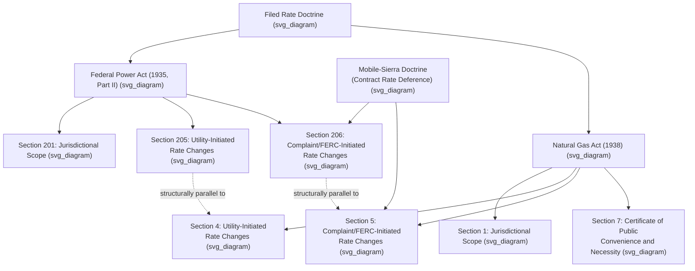

## The Federal Power Act and Natural Gas Act

### Statutory Overview

The **Federal Power Act (FPA)**, originally enacted as Part I in 1920 (licensing of hydroelectric projects) and substantially expanded by Part II in 1935 to cover federal regulation of interstate electricity sales and transmission, and the **Natural Gas Act (NGA)**, enacted in 1938, together form the foundational federal statutory framework for energy utility regulation in the United States. Both statutes emerged from a similar historical and constitutional impetus: the recognition that a regulatory gap existed for interstate utility transactions that individual states could not effectively reach, following Supreme Court decisions applying the dormant Commerce Clause to limit state authority over transactions crossing state lines. **[Inference]** Congress is generally understood to have modeled the Natural Gas Act closely on the electric provisions of the Federal Power Act, given the substantial structural and textual parallels between the two statutes' core jurisdictional and ratemaking provisions.

### The Federal Power Act: Structure and Key Provisions

The FPA is organized into several parts, with Part II containing the core ratemaking and jurisdictional provisions most relevant to utility regulation:

- **Part I (Sections 1–30)** — governs licensing of non-federal hydroelectric projects, administered by FERC, including license terms, relicensing, and environmental and recreational conditions.
- **Part II (Sections 201–214)** — the core federal electricity regulation provisions:
  - **Section 201** — establishes FERC jurisdiction over the transmission of electric energy in interstate commerce and the sale of electric energy at wholesale in interstate commerce, while expressly reserving to the states jurisdiction over facilities used for the generation of electric energy and over retail sales.
  - **Section 205** — requires that all rates and charges for FERC-jurisdictional transmission or wholesale sales be "just and reasonable" and not unduly discriminatory or preferential, and requires utilities to file rate schedules (tariffs) with FERC. Utility-initiated rate changes proceed under Section 205.
  - **Section 206** — authorizes FERC, on its own motion or upon complaint, to find an existing rate unjust, unreasonable, unduly discriminatory, or preferential, and to establish a just and reasonable rate going forward. Complaint-initiated or FERC-initiated rate changes proceed under Section 206, and this provision places the burden of proof on the party seeking to change the existing rate (as opposed to Section 205, where the utility bears the burden of justifying its own proposed change).
  - **Section 210, 211, 212** — provisions concerning interconnection and wheeling (transmission access) authority, substantially amended by later legislation such as the Energy Policy Act of 1992 and 2005.
- **Part III (Sections 301–318)** — miscellaneous provisions, including accounting, records, and enforcement authority.

### The Natural Gas Act: Structure and Key Provisions

The NGA similarly establishes FERC jurisdiction (originally Federal Power Commission jurisdiction) over interstate natural gas transactions:

- **Section 1** — jurisdictional scope, covering the transportation of natural gas in interstate commerce and the sale in interstate commerce of natural gas for resale, while reserving to the states jurisdiction over production, gathering, and local distribution.
- **Section 4** — the NGA analog to FPA Section 205: requires just and reasonable rates for jurisdictional sales and transportation, and requires filing of rate schedules; utility-initiated rate changes proceed under Section 4, with the pipeline bearing the burden of justifying a proposed increase.
- **Section 5** — the NGA analog to FPA Section 206: authorizes FERC to investigate and correct rates found to be unjust or unreasonable, upon complaint or its own motion.
- **Section 7** — requires FERC certification (Certificate of Public Convenience and Necessity) before construction, extension, acquisition, or abandonment of interstate pipeline facilities or service, incorporating public convenience and necessity findings, including consideration of need and, per subsequent case law and FERC policy, environmental impacts under the National Environmental Policy Act (NEPA).

### Parallel Structure: Section 205/206 (FPA) and Section 4/5 (NGA)

**[Inference]** The parallel two-track rate-change structure — utility-initiated changes under FPA Section 205 / NGA Section 4, and FERC- or complaint-initiated changes under FPA Section 206 / NGA Section 5 — is one of the most functionally significant features of both statutes, since the burden of proof differs materially between the two tracks, with substantial practical consequences for litigation strategy.

| Feature | FPA § 205 / NGA § 4 (Utility-Initiated) | FPA § 206 / NGA § 5 (Complaint/FERC-Initiated) |
| --- | --- | --- |
| Who initiates | The utility/pipeline itself | FERC, or a third-party complainant |
| Burden of proof | On the utility to justify the proposed new rate | On FERC/complainant to show the existing rate is unjust/unreasonable |
| Typical use | Rate increases, new tariff provisions | Rate decreases, challenges to existing rates, market power remedies |
| Rates effective pending decision | May go into effect (often suspended up to 5 months for FPA, subject to refund) | Prior rate remains in effect during proceeding; new rate is prospective only upon a finding |

### The Filed Rate Doctrine Under Both Statutes

Both the FPA and NGA embody the **filed rate doctrine**, under which the only lawful rate is the rate on file with FERC, and neither courts nor state commissions may award relief inconsistent with a filed and approved rate — including retroactive refunds beyond what the statutory framework itself provides for. This principle, developed through cases such as *Montana-Dakota Utilities Co. v. Northwestern Public Service Co.*, 341 U.S. 246 (1951) (arising under the FPA), reinforces FERC's exclusive primary jurisdiction over jurisdictional rates and prevents collateral state or judicial re-litigation of rate reasonableness.

### The Mobile-Sierra Doctrine

A significant judicial gloss on both statutes' "just and reasonable" standard is the **Mobile-Sierra doctrine**, derived from *United Gas Pipe Line Co. v. Mobile Gas Service Corp.*, 350 U.S. 332 (1956), and *FPC v. Sierra Pacific Power Co.*, 350 U.S. 348 (1956). Under this doctrine, where a rate has been set by a freely negotiated contract between sophisticated parties, FERC's review of that rate under Section 206/Section 5 is more deferential than its review of a unilaterally filed tariff rate: FERC may only modify or abrogate a Mobile-Sierra contract rate upon a finding that the rate seriously harms the public interest, not merely that it fails to meet the ordinary "zone of reasonableness" applied to non-contract rates. **[Inference]** This doctrine is frequently invoked in the context of long-term power purchase agreements and other negotiated wholesale contracts, since it substantially raises the bar for a party seeking to escape or modify an unfavorable freely negotiated contract rate after the fact.

### Reserved State Jurisdiction

Both statutes contain explicit jurisdictional reservations preserving state authority:

- **FPA Section 201(b)** reserves to the states jurisdiction over facilities used for generation of electric energy (except for federal licensing of hydroelectric facilities under Part I) and over rates for retail sales.
- **NGA Section 1(b)** reserves to the states jurisdiction over the production and gathering of natural gas, and over local distribution.

**[Inference]** These reservations are the textual anchor for the wholesale/retail (or interstate/intrastate) jurisdictional split discussed generally in FERC jurisdiction analysis, and have been the subject of extensive litigation as electricity and gas markets have evolved in ways not clearly anticipated by the original 1930s statutory text — for example, disputes over demand response compensation, capacity market design, and state clean energy programs that interact with wholesale market rules.

### Major Amendments and Related Legislation

Both statutes have been substantially amended and supplemented over time:

- **Public Utility Regulatory Policies Act (PURPA) of 1978** — required utilities to purchase power from qualifying cogeneration and small renewable facilities, significantly amending the FPA's interconnection and purchase obligation framework.
- **Energy Policy Act of 1992** — expanded FERC's authority to order transmission access (wheeling) and contributed to the development of wholesale competition.
- **Energy Policy Act of 2005** — added significant new provisions, including electric reliability standards enforcement (creating the framework under which the North American Electric Reliability Corporation, NERC, operates as the FERC-certified Electric Reliability Organization), repeal of the Public Utility Holding Company Act of 1935 (replaced with more limited FERC/state access-to-books authority under new PUHCA provisions), and market manipulation prohibitions modeled on securities law concepts.

### Illustrative Example: Section 205 vs. Section 206 in Practice

**Example**: An interstate pipeline wishes to increase its transportation rates to reflect increased costs of service. It files a Section 4 (NGA) rate case, bearing the burden of demonstrating that its proposed new rate is just and reasonable, supported by a cost-of-service study. FERC may suspend the proposed rate for up to five months, after which it takes effect subject to refund pending final resolution.

By contrast, if a group of pipeline customers believes an existing, already-effective rate has become unjust and unreasonable — for example, because the pipeline's actual costs have declined significantly since the rate was last set — those customers would need to file a Section 5 complaint, bearing the burden of demonstrating that the existing rate is no longer just and reasonable. **[Inference]** This asymmetry means that, absent a triggering event such as a scheduled rate case or a successful complaint, rates can in principle remain in effect for extended periods even after underlying costs change, since neither the pipeline (satisfied with current revenue) nor FERC (absent a showing of unreasonableness) has an automatic obligation to revisit them.

### Key Points

- The Federal Power Act (electricity) and Natural Gas Act (natural gas) are structurally parallel statutes establishing FERC jurisdiction over interstate wholesale sales and transmission/transportation, while reserving retail sales and generation/production to the states.
- Both statutes require "just and reasonable" rates and employ a two-track rate-change structure: utility-initiated changes (FPA § 205 / NGA § 4) place the burden on the utility, while complaint or FERC-initiated changes (FPA § 206 / NGA § 5) place the burden on the party seeking to change the existing rate.
- The filed rate doctrine, developed under both statutes, bars collateral relitigation of FERC-approved rates.
- The Mobile-Sierra doctrine provides heightened protection for freely negotiated contract rates against subsequent FERC modification.
- Both statutes have been substantially amended by subsequent legislation, including PURPA, the Energy Policy Acts of 1992 and 2005, and repeal/replacement of PUHCA.

### Diagram: FPA and NGA Parallel Structure (svg_diagram)

### Next Steps

- **Filed Rate Doctrine** — Montana-Dakota Utilities and progeny
- **Mobile-Sierra Doctrine** — United Gas Pipe Line v. Mobile Gas; FPC v. Sierra Pacific Power
- **FERC Jurisdiction over Wholesale and Transmission Rates** — practical application of FPA/NGA authority
- **PURPA (1978)** — qualifying facilities and purchase obligations
- **Energy Policy Act of 2005** — reliability standards, PUHCA reform, market manipulation rules
- **Certificate of Public Convenience and Necessity (NGA Section 7) Proceedings**
- **State Reserved Jurisdiction and Emerging Boundary Disputes** (demand response, capacity markets, state clean energy programs)