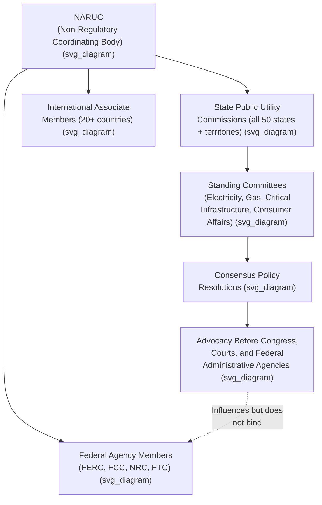

## NARUC and Interstate Regulatory Coordination

### Institutional Overview

The **National Association of Regulatory Utility Commissioners (NARUC)** is a non-profit trade association founded in 1889 and dedicated to representing the state public service commissions that regulate utilities providing essential services such as energy, telecommunications, power, water, and transportation. NARUC is headquartered in Washington, D.C. at 1101 Vermont Avenue, NW, Suite 200. Unlike FERC or a state PUC, NARUC has no regulatory or adjudicatory authority of its own — it is not a regulator but a **coordinating, advocacy, and educational body** that represents the collective interests and shares best practices among the individual commissions that do hold regulatory authority. [naruc](https://www.naruc.org/about-naruc/our-mission/history-background)[wikipedia](https://wikipedia.com/wiki/NARUC)

### Membership Structure

NARUC's members include all 50 states, the District of Columbia, Puerto Rico, and the Virgin Islands. NARUC also has associate members in over 20 countries, reflecting an international as well as domestic coordinating function. Notably, membership extends beyond state commissions to relevant **federal regulatory agencies**: NARUC extends membership to federal agencies such as the Federal Communications Commission, the Federal Energy Regulatory Commission, the Nuclear Regulatory Commission, the Federal Trade Commission, and others. **[Inference]** This joint state-federal membership structure is a distinctive institutional feature, since it positions NARUC as a forum where state regulators and the federal agencies whose jurisdiction they interact with (particularly FERC, given the wholesale/retail jurisdictional split under the Federal Power Act and Natural Gas Act) can engage directly, rather than functioning purely as a state-only lobbying body. [About NARUC +2](https://www.naruc.org/about-naruc/our-mission/history-background)

Most state commissioners are appointed to their positions by their governor or legislature, whereas commissioners in 11 states are elected by the public and in two states by the general assembly. The average tenure of a utility commissioner is approximately 3.5 years, which underscores one of NARUC's core practical functions: NARUC offers educational opportunities for its members, with topics ranging from rate-case basics to ethical considerations, helping new commissioners learn their challenging jobs in an expedited manner. [About NARUC +2](https://www.naruc.org/about-naruc/our-mission/history-background)

### Core Functions

NARUC's primary functions are education, information sharing, and advocacy. These break down into several concrete institutional activities: [4cleanair](https://4cleanair.org/wp-content/uploads/2022-NARUC-PPT-on-PUCs-NACAA-presentation.pdf)

1. **Policy development by consensus** — policy positions are developed by consensus resolutions, adopted through NARUC's committee structure and membership votes at its meetings, rather than through any binding regulatory process. [4cleanair](https://4cleanair.org/wp-content/uploads/2022-NARUC-PPT-on-PUCs-NACAA-presentation.pdf)
2. **Committee-based technical work** — NARUC uses committees for educating members and developing policy positions, including committees on Electricity, Gas, Critical Infrastructure, and Energy Resources and Environment, alongside other standing committees; NARUC has eight standing committees that propose policies for NARUC to support on federal and state issues. [4cleanair](https://4cleanair.org/wp-content/uploads/2022-NARUC-PPT-on-PUCs-NACAA-presentation.pdf)[Wikipedia](https://en.wikipedia.org/wiki/National_Association_of_Regulatory_Utility_Commissioners)
3. **Federal advocacy and monitoring** — NARUC tracks Congressional bills of regulatory interest and presents the views of the Association on matters of particular interest, and provides members with timely updates on legislation and regulatory activities affecting state regulatory policies, including frequent updates on FERC and FCC decisions. [naruc](https://www.naruc.org/resources/member-benefits/naruc-services-to-members/)
4. **Representation before all three branches of the federal government** — NARUC represents the interests of state public utility commissions before the three branches of the federal government, including leading the Association before Congress, the courts, and administrative agencies. [nd](https://psc.nd.gov/public/newsroom/2010/docs/111710_leadership_clark_rt.pdf)[nd](https://psc.nd.gov/public/newsroom/2010/docs/111710_leadership_clark_rt.pdf)
5. **Consumer protection coordination** — the Consumer Affairs Committee examines how state commissions protect consumer interests as it relates to industries including telecommunications and energy, with major issues including "slamming," information protection, and consumer education. [Wikipedia](https://en.wikipedia.org/wiki/National_Association_of_Regulatory_Utility_Commissioners)
6. **Critical infrastructure and security coordination** — a committee created after the September 11, 2001 terrorist attacks focuses on security concerns surrounding utility infrastructure, helping state regulators share best practices and collaborate on security. [Wikipedia](https://en.wikipedia.org/wiki/National_Association_of_Regulatory_Utility_Commissioners)
7. **International outreach** — as energy market development expands overseas, several countries have sought help and best practices from their American counterparts, and NARUC's International Committee manages the Association's outreach activities across the international regulatory community. [Wikipedia](https://en.wikipedia.org/wiki/National_Association_of_Regulatory_Utility_Commissioners)

### Amicus and Judicial Advocacy Role

**[Inference]** Beyond legislative and administrative advocacy, NARUC is widely understood to participate as amicus curiae in significant federal appellate and Supreme Court litigation affecting state utility regulatory jurisdiction — such as cases addressing the boundary between FERC and state authority — since representing state commission interests before the courts is an explicitly stated part of its institutional advocacy function. **[Unverified]** Specific case-by-case amicus filings would need to be independently verified against the litigation record for any particular case, as this level of detail was not confirmed in available sources for this response.

### Illustrative Function: Bridging Jurisdictional Coordination

**Example**: When FERC undertakes a major rulemaking affecting the state/federal jurisdictional boundary — for instance, a rule addressing wholesale market participation of distributed energy resources or demand response, which implicates both FERC's wholesale jurisdiction under FPA Section 201 and states' reserved authority over retail service and distribution facilities — NARUC's relevant standing committees (e.g., Electricity) would typically develop a consensus position representing the collective views of state commissioners, which NARUC then communicates to FERC through comments in the rulemaking docket and through direct engagement given FERC's own NARUC membership. **[Inference]** This process allows state regulators, who might otherwise engage with FERC only individually or through ad hoc coalitions, to present a more unified and resourced voice on jurisdictionally sensitive issues, though the actual influence of any specific NARUC position on a FERC rulemaking outcome depends on the substance of the issue and cannot be generalized.

### NARUC's Non-Regulatory Character: Key Distinction

**[Inference]** It is important to distinguish NARUC's coordinating and advocacy role from actual regulatory authority: NARUC does not set rates, does not adjudicate rate cases, and cannot bind any individual state commission's decisions, since its policy positions are adopted by consensus resolution among voluntary members rather than through any statutory grant of regulatory power. This distinguishes NARUC categorically from FERC (a federal regulatory agency with binding statutory authority under the FPA/NGA) and from individual state PUCs (state regulatory agencies with binding statutory authority under state public utility codes).

### Comparative Summary: NARUC vs. Regulatory Bodies

| Feature | NARUC | State PUC | FERC |
| --- | --- | --- | --- |
| Regulatory authority | None (advocacy/coordination) | Yes (state statutory authority) | Yes (federal statutory authority under FPA/NGA) |
| Membership | State commissions + federal agencies + international associates | Commissioners appointed/elected per state law | Presidentially appointed commissioners |
| Founded | 1889 | Varies by state (largely Progressive Era) | 1977 (as successor to Federal Power Commission) |
| Core function | Education, information sharing, advocacy | Rate setting, certification, consumer protection | Wholesale/interstate rate and transmission regulation |
| Binding output | Consensus resolutions (non-binding) | Commission orders (binding, subject to judicial review) | Commission orders (binding, subject to judicial review) |

### Key Points

- NARUC is a non-profit trade association, not a regulatory body; it holds no independent authority to set rates or adjudicate cases.
- Its membership uniquely spans all state utility commissions alongside relevant federal agencies (FERC, FCC, NRC, FTC) and international associate members.
- Core functions are education, information sharing, and advocacy, carried out through standing committees and consensus policy resolutions.
- NARUC plays a significant coordinating role at the state/federal jurisdictional interface, given its dual state-and-federal-agency membership and its stated role representing state commission interests before Congress, the courts, and federal administrative agencies.
- NARUC's educational functions are particularly significant given the relatively short average tenure of individual commissioners, helping maintain institutional expertise and consistency across state regulatory practice.

### Diagram: NARUC's Coordinating Position (svg_diagram)

### Related Topics

- **State Public Utility Commissions and Their Authority** — the individual regulatory bodies NARUC represents
- **FERC Jurisdiction over Wholesale and Transmission Rates** — the federal counterpart engaged through NARUC's federal membership
- **The Federal Power Act and Natural Gas Act** — statutory backdrop for state/federal jurisdictional coordination
- **Rate Design and Net Metering Policy** — a recurring subject of NARUC committee work
- **Critical Infrastructure Protection in Utility Regulation**
- **Amicus Curiae Practice in Utility Regulatory Litigation**
- **International Regulatory Cooperation and Best-Practice Sharing**