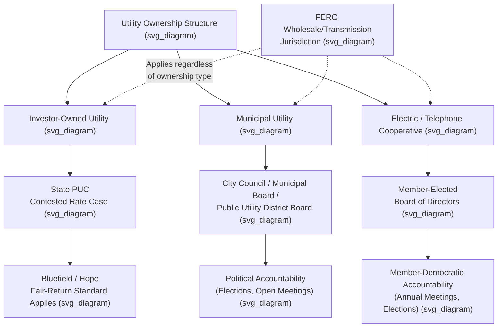

## Municipal and Cooperative Rate Setting Bodies

### Overview: Non-Investor-Owned Utility Governance

Not all utility rates in the United States are set through traditional state public utility commission (PUC) proceedings. Two major categories of utility ownership — **municipal utilities** and **electric/telephone cooperatives** — generally fall outside, or only partially within, traditional PUC cost-of-service ratemaking jurisdiction, and instead rely on distinct governance structures for setting rates. **[Inference]** This distinction matters significantly for the constitutional and administrative law framework discussed elsewhere in ratemaking doctrine, since much of the Bluefield/Hope/Duquesne constitutional confiscation jurisprudence developed specifically in the context of investor-owned utilities (IOUs) subject to traditional commission ratemaking, and the applicability of that framework to municipal and cooperative utilities is considerably more limited or contested.

### Municipal Utilities: Governance Structure

Municipal utilities ("munis" or "public power" utilities) are owned and operated by a local government entity — a city, county, or a special-purpose public power district — rather than by private investors. Rate-setting authority for municipal utilities is typically vested in one of the following bodies, depending on the specific enabling statute and local charter:

- **The municipal governing body itself** — the city council or county board directly sets utility rates, often as part of the municipal budget process, in many smaller municipal utilities.
- **A separately constituted municipal utility board or commission** — many larger municipal utilities are governed by an appointed or elected board with delegated authority to set rates somewhat independently of direct city council control, intended to provide some insulation from short-term political pressures analogous (though generally weaker) to the independence sought in state PUC design.
- **A special-purpose public utility district (PUD)** — an independent local government entity created specifically to provide utility service, governed by its own elected or appointed board, common in some states for larger regional public power systems.

**[Inference]** Because municipal utilities are governmental entities accountable through political processes (elected officials, public budget hearings, open meetings requirements) rather than through adversarial administrative rate case litigation, their ratemaking process is generally understood to be structurally and procedurally quite different from investor-owned utility ratemaking, even though many municipal utilities voluntarily apply cost-of-service principles similar to those used by PUC-regulated utilities for internal rate design purposes.

### Municipal Utilities: Jurisdictional Status

**[Inference]** In most states, municipal utilities are exempt from state PUC rate regulation, since state public utility statutes typically define "public utility" in a manner that excludes government-owned utilities, reflecting a legislative judgment that direct political accountability to local voters and elected officials serves an analogous rate-reasonableness-protecting function to commission regulation. However, this is a matter of significant state-by-state variation, and a subset of states do subject municipal utilities to some degree of PUC oversight (for example, limited review of rates charged to customers outside the municipal boundary, or safety and reliability oversight even where rate-level review is exempted).

**[Unverified]** The specific scope of any state PUC jurisdiction over municipal utility rates varies considerably and would need to be confirmed against the specific state's public utility code, since there is no single uniform national rule and generalized statements risk being inaccurate for any particular state.

Where a municipal utility engages in **wholesale power transactions** or interstate transmission that fall within FERC's Federal Power Act jurisdiction, FERC retains jurisdiction over those specific transactions notwithstanding the utility's public ownership, since the FPA's jurisdictional test turns on the nature of the transaction (wholesale/interstate) rather than on the ownership structure of the seller.

### Electric and Telephone Cooperatives: Governance Structure

Electric and telephone cooperatives are member-owned, not-for-profit entities, typically formed to provide utility service in rural areas historically underserved by investor-owned utilities — a structure whose expansion in the electricity sector was substantially driven by federal financing support under the Rural Electrification Administration (REA), established in 1935 and now succeeded by the Rural Utilities Service (RUS) within the U.S. Department of Agriculture.

Cooperative governance and rate-setting rest on a member-democracy model:

- **Member-elected board of directors** — cooperative members (typically customers who receive service) elect a board of directors, usually from among the membership itself, who hold ultimate governance authority including rate-setting.
- **Annual or periodic member meetings** — cooperatives typically hold annual meetings at which members may vote on board elections and, depending on the cooperative's bylaws, certain major policy or rate matters.
- **Not-for-profit, cost-based operation** — because cooperatives operate on a not-for-profit, member-owned basis, rates are designed to recover the cooperative's cost of service (including debt service on RUS or other financing) rather than to produce a market rate of return for outside investors, structurally reducing (though not eliminating) some of the rate-of-return tension central to IOU ratemaking under Bluefield/Hope.

### Cooperatives: Jurisdictional Status

**[Inference]** Similar to municipal utilities, electric cooperatives are generally exempt from traditional state PUC rate regulation in many, though not all, states, since state public utility statutes frequently exclude member-owned cooperatives from the statutory definition of "public utility" subject to commission ratemaking jurisdiction, on a rationale that member-elected governance provides an analogous check on unreasonable rates. However, a meaningful number of states do subject cooperatives to at least some PUC oversight — commonly regarding service territory disputes, safety standards, or limited rate review — and this varies significantly by state.

**[Unverified]** As with municipal utilities, the precise scope of state jurisdiction over cooperative rates is state-specific and would require verification against the applicable state's utility code for any particular jurisdiction.

Generation and Transmission (G&T) cooperatives — wholesale entities owned by multiple distribution cooperatives that provide bulk power supply to their member-owner distribution cooperatives — are generally subject to FERC jurisdiction to the extent they engage in FERC-jurisdictional wholesale sales or interstate transmission, on the same wholesale/retail jurisdictional logic applicable to investor-owned utilities.

### Comparative Structure: IOU, Municipal, and Cooperative Ratemaking

| Feature | Investor-Owned Utility (IOU) | Municipal Utility | Electric Cooperative |
| --- | --- | --- | --- |
| Ownership | Private shareholders | Local government | Member-customers |
| Primary rate-setting body | State PUC (contested case) | City council / municipal board / PUD board | Member-elected board of directors |
| Rate-of-return requirement | Yes — Bluefield/Hope fair-return standard applies | No — not operated for shareholder profit | No — not-for-profit, cost-based |
| Typical accountability mechanism | Administrative litigation, judicial review | Elections, open meetings, budget process | Member elections, annual meetings |
| State PUC jurisdiction | Full (in most states) | Often exempt or limited | Often exempt or limited |
| FERC wholesale jurisdiction | Applies to jurisdictional transactions | Applies to jurisdictional transactions | Applies to jurisdictional transactions (esp. G&T co-ops) |

### Illustrative Example

**Example**: A rural electric cooperative serving a multi-county area needs to increase rates to fund a substation upgrade and cover rising wholesale power costs from its G&T cooperative supplier. Rather than filing a contested rate case before a state PUC with intervenor testimony and an evidentiary hearing (as an IOU would), the cooperative's management typically presents a proposed rate schedule and supporting cost justification to its member-elected board of directors, which reviews and votes on the increase, potentially informing the broader membership at the cooperative's annual meeting.

**[Inference]** If the cooperative operates in a state where cooperatives are statutorily exempt from state PUC rate jurisdiction, this board-approval process would be the operative and final rate-setting mechanism, with member recourse limited to board elections and any internal governance rights under the cooperative's bylaws rather than administrative appeal to the state commission; however, if the specific state does subject cooperatives to some PUC oversight, an additional layer of commission review could apply, and this would need to be confirmed against that state's specific statutory framework.

### Key Points

- Municipal utilities and cooperatives generally fall outside traditional investor-owned utility ratemaking, relying instead on political (municipal) or member-democratic (cooperative) accountability mechanisms.
- Many, but not all, states exempt municipal utilities and cooperatives from state PUC rate jurisdiction; the scope of any such exemption is state-specific and must be verified against the applicable state code.
- The Bluefield/Hope fair-return standard, developed in the investor-owned utility context, has limited direct application to not-for-profit municipal and cooperative ratemaking, since these entities are not designed to earn a market rate of return for outside investors.
- FERC wholesale and interstate transmission jurisdiction under the Federal Power Act applies to municipal utilities and cooperatives (including G&T cooperatives) engaging in jurisdictional transactions, regardless of ownership structure.
- Cooperative governance rests on a member-elected board of directors model, historically tied to federal rural electrification financing through the Rural Electrification Administration and its successor, the Rural Utilities Service.

### Diagram: Rate-Setting Governance by Ownership Type (svg_diagram)

### Related Topics

- **State Public Utility Commissions and Their Authority** — the contrasting IOU regulatory framework
- **FERC Jurisdiction over Wholesale and Transmission Rates** — applicable to municipal and cooperative wholesale transactions
- **Bluefield Waterworks v. Public Service Commission** — fair-return doctrine and its limited applicability outside IOU ratemaking
- **Rural Electrification Administration and Rural Utilities Service** — federal financing history behind cooperative formation
- **Generation and Transmission (G&T) Cooperative Structures**
- **Public Power District Formation and Governance**
- **Not-for-Profit Cost-of-Service Rate Design**