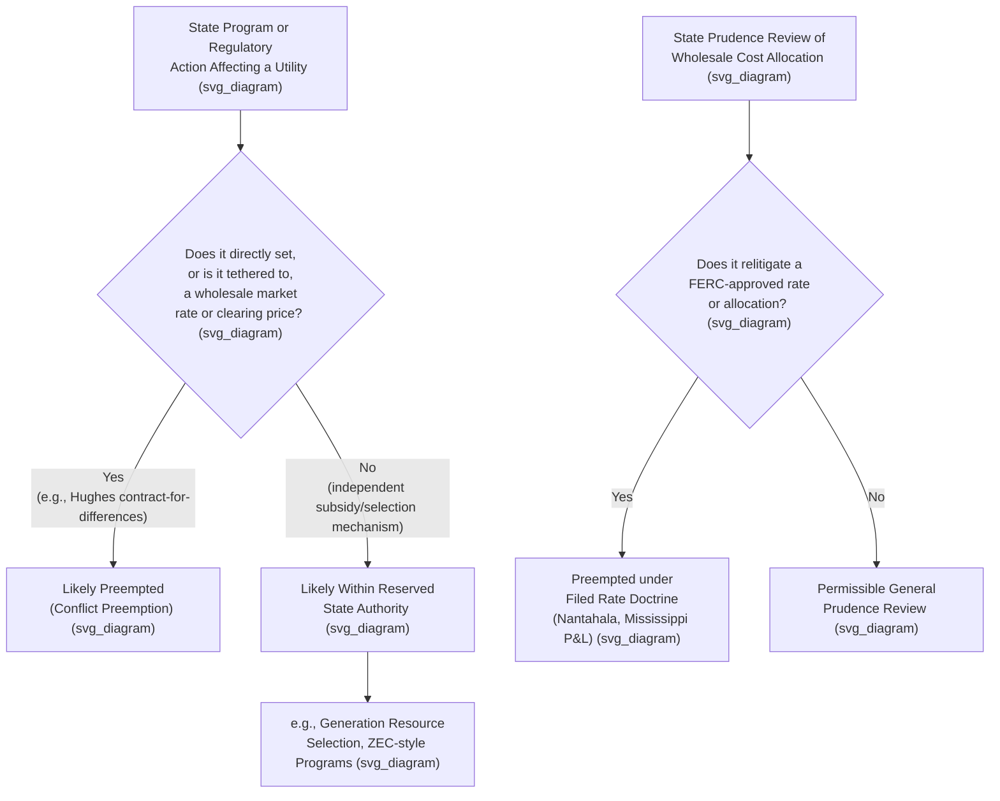

## Federal State Jurisdictional Boundaries and Preemption

### Framing the Doctrinal Problem

Utility regulation in the United States is divided between state and federal authority along lines drawn primarily by the Federal Power Act (FPA) and Natural Gas Act (NGA), but the precise boundary has never been self-executing or free of dispute. Preemption doctrine in this area addresses the recurring question: when does federal statutory authority over wholesale and interstate transactions displace, limit, or otherwise interact with a state's exercise of its reserved retail ratemaking authority? This question has generated a substantial and evolving body of Supreme Court and lower court case law, particularly as electricity and gas markets have restructured in ways not clearly anticipated by the original 1930s statutory framework.

### The Foundational Jurisdictional Split

As discussed in connection with the FPA and NGA, both statutes draw jurisdiction along a wholesale/retail (interstate/intrastate) line:

- **FPA Section 201(b)** grants FERC jurisdiction over interstate wholesale electricity sales and transmission, while reserving to the states jurisdiction over facilities used for generation and over retail sales.
- **NGA Section 1(b)** grants FERC jurisdiction over interstate gas transportation and wholesale sales for resale, while reserving to the states jurisdiction over production, gathering, and local distribution.

**[Inference]** This split is often summarized as a "bright line," but is more accurately understood as a starting framework that has required extensive judicial elaboration, since numerous transactions and regulatory activities do not fall neatly into either category (e.g., demand response, distributed generation, capacity markets, and retail rate designs that incorporate wholesale market price signals).

### Field Preemption vs. Conflict Preemption

Federal preemption of state utility regulation can operate through two general doctrinal channels, both grounded in the Supremacy Clause:

1. **Field preemption** — where Congress has occupied an entire regulatory field, leaving no room for state regulation even on matters not directly addressed by federal rules. Courts have generally found only limited field preemption in this area, given the explicit statutory reservations of state retail jurisdiction in both the FPA and NGA.
2. **Conflict preemption** — where a specific state regulatory action directly conflicts with, or stands as an obstacle to, a specific federal rate, rule, or policy — even without wholesale field occupation. Most significant utility preemption litigation in recent decades has proceeded on conflict preemption theories, particularly where a state action has the practical effect of setting or influencing a wholesale rate.

### Key Supreme Court Preemption Cases

**Nantahala Power & Light Co. v. Thornburg**, 476 U.S. 953 (1986), held that once FERC has set a wholesale rate (including the allocation of power among a utility's various sources, an "all-requirements" allocation), a state commission may not, in setting retail rates, conduct its own prudence review that effectively second-guesses or recalculates the FERC-approved wholesale allocation — the filed rate doctrine requires the state to treat the FERC-jurisdictional allocation as a given input.

**Mississippi Power & Light Co. v. Mississippi ex rel. Moore**, 487 U.S. 354 (1988), reinforced this principle, holding that a state could not, through its own prudence review of a utility's decision to purchase power from an affiliated nuclear plant, effectively relitigate the reasonableness of a FERC-allocated wholesale rate; the state remained free to review the utility's management prudence more generally, but not to second-guess the FERC-approved cost allocation itself.

**FERC v. Electric Power Supply Association (EPSA)**, 577 U.S. 260 (2016), addressed FERC's jurisdiction over wholesale demand response compensation (Order No. 745), upholding FERC's authority to regulate demand response bidding into wholesale capacity and energy markets, even though demand response inherently involves retail customers, because the rule directly affected wholesale market rates — the Court held that FERC's rule was a permissible regulation of a practice "directly affecting" wholesale rates rather than an impermissible incursion into retail regulation, emphasizing that FERC's authority extends to rules and practices affecting wholesale rates even where retail-side entities are involved, so long as the rule does not directly set retail rates.

**Hughes v. Talen Energy Marketing, LLC**, 578 U.S. 150 (2016), held that a Maryland program providing a state-subsidized contract for differences to a new generator, tied to that generator's participation in the PJM capacity market, was preempted because it set an effective price for a wholesale transaction, intruding on FERC's exclusive rate-setting jurisdiction — the Court emphasized that a state program tethered to a wholesale market clearing price crosses into FERC's exclusive domain, while suggesting (in narrower language addressed by later cases) that states retain authority over generation facility selection and resource decisions generally, so long as they do not condition compensation on wholesale market participation in a manner that sets the effective wholesale price.

### Recent Developments: State Clean Energy Programs and Capacity Markets

**[Inference]** Following Hughes, a significant body of subsequent litigation has addressed the preemption status of various state policies designed to support preferred generation resources (nuclear, renewable, or other zero-carbon generation) — such as New York's and Illinois's Zero Emission Credit (ZEC) programs — with courts generally distinguishing these programs from the invalidated Maryland program in Hughes on the ground that ZEC programs are not conditioned on or tied to wholesale market participation or clearing prices, but rather are structured as separate, independent state subsidies that do not set an effective wholesale price. **[Unverified]** The current state of this litigation continues to develop, and the specific status of any given state program should be verified against current appellate case law, since this remains an active area of doctrinal development.

### FERC's Minimum Offer Price Rule (MOPR) Controversy

**[Unverified]** FERC's treatment of state-subsidized resources within PJM's capacity market, through the Minimum Offer Price Rule, has been the subject of significant regulatory and litigation activity in recent years, and the current status of MOPR-related rules should be verified through current search given the fast-moving and politically contested nature of this specific regulatory area; this response does not attempt to state the current rule's precise status without such verification.

### Preemption in Natural Gas Pipeline Siting

A related preemption question arises in natural gas pipeline certification: under NGA Section 7, FERC's certification of an interstate pipeline project generally preempts conflicting state and local land use and siting authority, though states retain certain authorities preserved by other federal statutes — most notably, state water quality certification authority under Section 401 of the Clean Water Act, which has itself been the subject of significant litigation regarding the scope and timing limits of state authority to condition or deny certification for FERC-approved pipeline projects.

### Illustrative Example: Applying the Preemption Framework

**Example**: Suppose a state legislature enacts a program requiring the state's utilities to enter into long-term contracts with a specific renewable generation project, with the contract price set through a state-administered bidding process independent of any wholesale market clearing mechanism, and the generation project separately participates in the regional RTO's wholesale energy and capacity markets on its own terms.

**[Inference]** Applying the Hughes framework, such a program would likely be analyzed by asking whether the state's contract price is tethered to or conditioned on the resource's wholesale market participation or clearing price (which would suggest preemption, as in Hughes) or whether it functions as an independent state resource-selection and subsidy mechanism that operates alongside, rather than by reference to, the wholesale market (which would suggest the program falls within the state's reserved generation-facility-selection authority). The specific outcome in any actual case would depend heavily on the precise statutory design and would require analysis of the specific program's mechanics against the current body of post-Hughes case law.

### Key Points

- Federal preemption in utility regulation operates primarily through conflict preemption rather than broad field preemption, given explicit statutory reservations of state retail authority in the FPA and NGA.
- The filed rate doctrine, reinforced in Nantahala and Mississippi Power & Light, bars states from using prudence review to effectively relitigate FERC-approved wholesale rate allocations.
- EPSA (2016) upheld FERC's authority to regulate practices, like demand response, that directly affect wholesale rates even where retail-side actors are involved.
- Hughes (2016) established that state programs tethering compensation to wholesale market participation or clearing prices are preempted, while suggesting states retain broader authority over generation resource selection when not so tethered.
- The preemption boundary remains an active and evolving area of litigation, particularly regarding state clean energy subsidy programs and their interaction with FERC-jurisdictional capacity markets.

### Diagram: Preemption Analysis Framework (svg_diagram)

### Related Topics

- **The Federal Power Act and Natural Gas Act** — statutory basis for the jurisdictional split
- **FERC Jurisdiction over Wholesale and Transmission Rates** — the federal side of the boundary
- **Filed Rate Doctrine** — Montana-Dakota Utilities and its extension in Nantahala/Mississippi P&L
- **Hughes v. Talen Energy Marketing** and **FERC v. EPSA** — modern preemption case law
- **State Clean Energy Subsidy Programs** (ZEC, contracts for differences) and capacity market interaction
- **Minimum Offer Price Rule (MOPR)** and state resource subsidization in PJM
- **Natural Gas Act Section 7 Certification and Clean Water Act Section 401 Interaction**