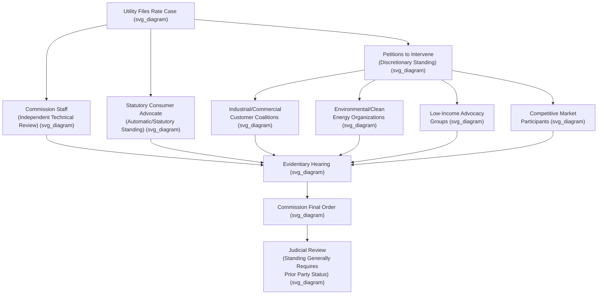

## Consumer Advocate Offices and Intervenor Standing

### Institutional Overview

Rate cases before state public utility commissions are structured as adversarial administrative proceedings, and the utility filing for a rate change is rarely the only active party. Two related but distinct institutional mechanisms ensure that interests other than the utility's are represented: **statutory consumer advocate offices**, which are dedicated government entities charged by statute with representing consumer interests, and **intervenor standing**, the procedural mechanism by which any interested party — statutory advocate or otherwise — gains formal party status in a commission proceeding.

### Statutory Consumer Advocate Offices: Structure and Variation

Most states have created a dedicated office, separate from the public utility commission itself, whose statutory mission is to represent the interests of residential and/or small commercial ratepayers in utility regulatory proceedings. These offices go by varying names across states — Office of Consumer Advocate, Public Counsel, Ratepayer Advocate, Office of Public Advocacy, Citizens Utility Board (in some contexts a distinct nonprofit structure rather than a state office — see below), among others.

**[Inference]** The structural placement of these offices varies meaningfully by state and carries practical implications for their independence and resourcing, generally following one of a few patterns:

- **Independent standalone agency** — a freestanding state agency with its own director (often gubernatorially appointed) and budget, organizationally separate from both the PUC and the state Attorney General.
- **Division within the Attorney General's office** — a specialized unit housed within the state AG's office, leveraging the AG's litigation resources and staff while focused specifically on utility ratepayer representation.
- **Legislatively created and funded office** — an office created directly by statute with dedicated funding (sometimes via a small surcharge on utility bills) specifically to fund ratepayer advocacy, intended to ensure adequate resources to litigate against well-resourced utility parties.

**[Unverified]** The specific structure, name, and statutory authority of the consumer advocate office (if any) varies by state and should be verified against that state's specific statute for any particular jurisdiction, since there is no single uniform national model.

### Statutory Mission and Scope of Representation

Consumer advocate offices are typically charged with representing the interests of residential ratepayers (and sometimes small commercial customers) as a class, distinct from:

- **Commission Staff**, whose role is to provide independent technical analysis to the commission itself, and who may or may not align with the consumer advocate's position in any given case.
- **The Attorney General's general consumer protection functions**, which may address fraud, deceptive practices, or other consumer law matters distinct from utility rate-setting specifically (even where the advocate's office is housed within the AG's office).
- **Large industrial or commercial customer intervenors**, whose interests (rate design, cost allocation between customer classes) frequently diverge from residential ratepayer interests even though both may oppose aspects of a utility's rate request.

**[Inference]** Because residential ratepayers are individually too small, numerous, and diffuse to efficiently organize and fund their own litigation in a rate case, the consumer advocate office functions as a mechanism to overcome this collective action problem, since without a dedicated statutory representative, the interests of millions of individually small ratepayers would likely be systematically underrepresented relative to the utility's concentrated financial interest in the case outcome.

### Intervenor Standing: General Framework

Beyond a dedicated statutory consumer advocate, state administrative procedure generally allows a broader range of parties to seek **intervenor status** in a contested rate case, granting them the right to conduct discovery, sponsor testimony, cross-examine witnesses, and participate in briefing — rights beyond mere public comment.

Typical categories of parties seeking intervention in utility rate cases include:

1. **Large industrial and commercial customer groups** — often organized as ad hoc coalitions or through trade associations, focused primarily on cost allocation and rate design issues affecting large-volume customers.
2. **Environmental and clean energy organizations** — focused on issues such as renewable energy procurement, energy efficiency program design, rate treatment of distributed generation, and decarbonization-related ratemaking.
3. **Low-income and vulnerable customer advocacy groups** — focused on affordability, low-income rate assistance programs, and disconnection/collections policy.
4. **Competitive market participants** — independent power producers, competitive retail suppliers, or demand response aggregators with interests in specific tariff provisions affecting market access or compensation.
5. **Local governments** — municipalities or counties with interests in franchise agreements, service territory, or rates affecting municipal facilities.
6. **Labor organizations** — representing utility employees with interests in workforce, safety, or cost allocation issues affecting employment.

### Standing Requirements for Intervention

**[Inference]** Most state administrative procedure acts and commission procedural rules require a prospective intervenor to demonstrate some form of **particularized interest** in the proceeding — typically that the party's rights, duties, or interests will be substantially affected by the proceeding's outcome — though the specific standard and the degree of rigor with which it is applied vary by state and often by the individual presiding officer or commission.

Common procedural elements of the intervention process include:

- **Petition to intervene** — a formal filing, typically due within a specified early period after a rate case is filed, identifying the petitioner's interest and the basis for intervention.
- **Opposition and ruling** — other parties (typically the utility) may oppose intervention, and the presiding administrative law judge or the commission rules on the petition.
- **Scope limitations** — a commission may grant intervention but limit a party's participation to specific issues relevant to its demonstrated interest (for example, limiting an industrial customer group's participation to rate design issues rather than allowing full participation on cost-of-capital questions).
- **Permissive vs. mandatory intervention** — some interested parties (often the consumer advocate office, by statute) have a statutory right to participate without needing to satisfy a discretionary standing test, while other intervenors must satisfy the commission's discretionary intervention standard.

### Illustrative Example: Multi-Party Intervention Dynamics

**Example**: An electric utility files a rate case seeking a $120 million revenue increase. Within the intervention period, the following parties petition to intervene:

- The state's **Office of Consumer Advocate**, with statutory standing to represent residential ratepayers, sponsoring cost-of-capital and revenue requirement testimony arguing for a smaller increase and lower ROE.
- A coalition of **large industrial customers**, granted intervention limited to rate design and cost allocation issues, arguing that a disproportionate share of any increase should fall on residential rather than industrial rate classes based on cost-of-service studies.
- A **solar industry trade association**, granted intervention limited to net metering and interconnection tariff provisions, opposing a proposed change to the utility's distributed generation compensation methodology.
- A **low-income advocacy organization**, granted intervention on issues related to the utility's low-income rate assistance program design and funding level.

**[Inference]** In this configuration, the Consumer Advocate and the low-income advocacy group might align on some issues (overall rate level, affordability) while diverging from the industrial coalition on cost allocation (since a lower allocation to industrial customers generally implies a higher allocation to residential customers, all else equal), illustrating that intervenor interests are not uniformly aligned against the utility but instead form a multi-dimensional set of overlapping and sometimes competing positions that the commission must weigh in reaching a final order.

### Consumer Advocate and Intervenor Role in Judicial Review

**[Inference]** Because standing to seek judicial review of a commission's final order in state court generally requires that a party have been a participant in the underlying administrative proceeding (having exhausted administrative remedies and demonstrated a sufficient stake in the outcome), intervenor status obtained during the rate case itself typically also establishes the foundation for that party's standing to appeal an adverse commission decision, making the intervention decision consequential not only for participation in the rate case itself but for any subsequent appellate rights.

### Comparative Table: Consumer Advocate vs. General Intervenors

| Feature | Statutory Consumer Advocate | General Intervenors |
| --- | --- | --- |
| Basis for participation | Statutory mandate (often automatic party status) | Discretionary intervention petition |
| Constituency represented | Residential (sometimes small commercial) ratepayers as a class | Specific interest group (industrial, environmental, low-income, competitive market, etc.) |
| Funding source | State budget appropriation or dedicated utility bill surcharge | Self-funded by the intervenor or its members |
| Typical scope of participation | Full participation on all revenue requirement and rate design issues | Often limited to issues relevant to the intervenor's demonstrated interest |
| Independence from PUC | Organizationally separate from the commission | N/A — external party |

### Key Points

- Statutory consumer advocate offices are dedicated government entities, organizationally distinct from the PUC and often from the Attorney General's general functions, created specifically to represent residential ratepayer interests in utility proceedings.
- These offices address the collective action problem inherent in representing numerous, individually small residential ratepayers against a well-resourced utility party.
- Intervenor standing more broadly allows industrial customers, environmental groups, low-income advocates, competitive market participants, and others to become formal parties, subject to a particularized-interest standard that varies by state.
- Intervention may be granted with scope limitations tied to the intervenor's specific demonstrated interest rather than full participation rights on every issue in the case.
- Intervenor status obtained during a rate case is typically foundational to that party's standing to seek judicial review of an adverse commission order.

### Diagram: Multi-Party Rate Case Structure (svg_diagram)

### Related Topics

- **State Public Utility Commissions and Their Authority** — the institutional context for intervention
- **Rate Case Procedure and Test Year Methodology** — the procedural stages in which intervenors participate
- **Cost Allocation and Rate Design** — the frequent focus of industrial and residential intervenor disputes
- **Low-Income Rate Assistance Programs** — a common subject of dedicated intervenor advocacy
- **Judicial Review of Commission Orders** — standing and exhaustion requirements
- **Net Metering and Distributed Generation Tariffs** — a common subject of clean energy intervenor participation
- **Administrative Procedure Act Standards for Agency Adjudication**