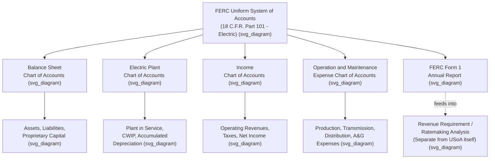

## The FERC Uniform System of Accounts (USoA)

### Regulatory and Statutory Basis

The **Uniform System of Accounts (USoA)** is the accounting framework prescribed by the Federal Energy Regulatory Commission (FERC) governing how public utilities, licensees, and natural gas companies subject to FERC's jurisdiction under the Federal Power Act and Natural Gas Act must record their financial transactions. The USoA for electric utilities is codified at 18 C.F.R. Part 101, titled **Uniform System of Accounts Prescribed for Public Utilities and Licensees Subject to the Provisions of the Federal Power Act**. Parallel systems of accounts exist for natural gas companies (18 C.F.R. Part 201) and oil pipelines (18 C.F.R. Part 352), and a separate, somewhat abbreviated version applies to smaller ("Class C and D") utilities and licensees under 18 C.F.R. Part 104. The regulation itself dates to Order No. 218, originally published in 1960, with numerous subsequent amendments.

### Purpose and Function

**[Inference]** The USoA serves a dual function that is important to distinguish clearly, since conflating the two is a common source of confusion: it is fundamentally an *accounting* classification system, not a *ratemaking* methodology. Accounting pursuant to the USoA does have ratemaking implications, since the account balances feed directly into revenue requirement calculations, but the uniform accounting system does not itself dictate FERC's ratemaking policies, and courts have recognized this distinction. In other words, the USoA tells a utility *how to classify and record* a transaction (which account it belongs in, how to treat capital versus expense items, depreciation conventions for accounting purposes), while separate ratemaking principles (informed by Bluefield/Hope fair-return doctrine, prudence review, and used-and-useful analysis) determine *whether and how* the resulting account balances are recoverable in rates.

### Structural Organization

The USoA organizes accounts into several major chart-of-account subdivisions. Almost 1,000 specific accounts are systematically organized in the major subdivisions of the USOA: the balance sheet chart of accounts, the electric plant chart of accounts, the income chart of accounts, and the operation and maintenance expense chart of accounts. The USOA also provides detailed explanatory information, and FERC's occasional orders adopting or modifying portions of the accounts often include interpretative provisions clarifying how specific transactions should be classified.

### Major Account Categories

**[Inference]** Based on the structure described in FERC's regulatory text and standard utility accounting practice, the principal account groupings can be summarized as follows, though the precise numbering and current content of any individual account should be verified against the current text of 18 C.F.R. Part 101 for authoritative detail:

| Account Range (Approximate) | Category | Description |
| --- | --- | --- |
| 100–199 | Utility Plant / Assets | Electric plant in service, plant held for future use, construction work in progress, accumulated depreciation |
| 200–299 | Proprietary Capital | Common and preferred stock, retained earnings, other paid-in capital |
| 200s–200s (Long-Term Debt) | Long-Term Debt | Bonds, other long-term debt instruments |
| 300–399 | Current and Accrued Assets/Liabilities | Cash, receivables, materials and supplies, accrued taxes and interest |
| 400–432 | Income Accounts | Operating revenues, operating expenses, taxes, interest expense, net income |
| 440–459 | Revenue Accounts | Sales of electricity by customer class, other operating revenues |
| 500–599 | Operation and Maintenance Expense — Production | Fuel, steam power generation, other power supply expenses |
| 560–599 | Operation and Maintenance Expense — Transmission | Transmission operation and maintenance |
| 580–598 | Operation and Maintenance Expense — Distribution | Distribution operation and maintenance |
| 900–935 | Administrative and General Expenses | A&G salaries, office supplies, outside services, regulatory commission expenses |

**Example**: Utility plant in service — major electric plant accounts — is recorded at Account 101, "Electric Plant in Service (Major Only)." Preliminary survey and investigation charges are recorded at Account 183, "Preliminary Survey and Investigation Charges (Major Only)." A more specialized account, Account 182.2, "Unrecovered Plant and Regulatory Study Costs," addresses treatment of costs associated with plant investigations that a utility does not ultimately capitalize into rate base — an account with obvious relevance to prudence and cancellation issues of the kind at stake in *Duquesne Light Co. v. Barasch*, 488 U.S. 299 (1989).

### Definitions and General Instructions

Part 101 begins with a series of numbered **Definitions** governing terms used throughout the system of accounts — for example, defining what "actually issued" means as applied to securities issued or assumed by the utility, and defining "accounts" to mean the accounts prescribed in the system itself. These definitions are followed by **General Instructions** — numbered provisions addressing cross-cutting accounting principles applicable across multiple accounts, such as treatment of retirements, depreciation accounting, and allocation of costs between capital and expense. **[Unverified]** The specific numbered definitions and general instructions have been amended multiple times since 1960 (for example, amendments effective in 1993 added new accounts and definitions), so the current text should be consulted directly via the Code of Federal Regulations for precise, up-to-date language on any specific provision.

### Relationship to FERC Form 1 and Regulatory Reporting

The USoA's account structure is the foundation for FERC's annual financial and operational reporting requirements. Electric utilities meeting FERC's jurisdictional thresholds are required to file the **FERC Form 1** ("Annual Report of Major Electric Utilities, Licensees, and Others") annually, which is structured around, and populated directly from, USoA account balances. A parallel report, **FERC Form 6**, applies to oil pipeline companies, designed to collect financial and operational information reporting the carrier's financial position and operating performance, again structured around the corresponding uniform system of accounts for that industry. These annual reports are the primary vehicle through which FERC, state commissions, financial analysts, and other stakeholders obtain standardized, comparable financial data across jurisdictional utilities.

### Adoption by State Commissions

**[Inference]** Because the USoA provides a standardized, well-developed accounting framework, many state public utility commissions have adopted the FERC USoA, in whole or with state-specific modifications, as the required accounting system for utilities under their own jurisdiction, even for activities (retail operations) that are not themselves FERC-jurisdictional. As an illustrative example, one state commission adopted FERC's USoA to provide consistency with FERC accounting practices, pursuant to its own state Public Utilities Code provision. **[Unverified]** The specific adoption status and any state-specific modifications vary by state and should be verified against that state's own accounting rules for utilities, since adoption is a matter of individual state regulatory choice rather than a federal mandate on state retail accounting.

### Practical Significance for Ratemaking

**[Inference]** The USoA's account classifications matter significantly for ratemaking practice because the classification of a given cost (capital versus expense, which specific plant account, which O&M expense category) can materially affect how that cost is treated in a revenue requirement calculation — for example, whether a cost is capitalized into rate base (and thus earns a return over its depreciable life) or expensed in the current period (and thus recovered dollar-for-dollar in the test year, without an associated return). Because of this, classification disputes — whether a given expenditure should have been recorded in one USoA account versus another — frequently arise as a significant technical issue within contested rate cases, argued by accounting expert witnesses on behalf of the utility, commission staff, and intervenors.

### Recent Developments

**[Unverified]** FERC has periodically updated the USoA to address new categories of utility investment not contemplated by the original 1960s-era account structure — for example, accounts addressing renewable generation and energy storage assets have reportedly been added or modified in more recent FERC rulemaking activity. Given the pace of change in this area and the significance of getting current account numbers and definitions right for any practitioner-facing application, the current text of 18 C.F.R. Part 101 and any recent FERC orders modifying it should be independently verified rather than relied upon from general background knowledge.

### Illustrative Example: Classification Dispute

**Example**: A utility incurs $5 million in costs studying the feasibility of a new transmission line that is ultimately not built. Under the USoA, the utility must determine whether these costs belong in Account 183 (Preliminary Survey and Investigation Charges) pending a final decision on the project, and if the project is abandoned, whether the costs should be written off as an expense or, in some circumstances, recorded in a specialized account addressing unrecovered plant and regulatory study costs. **[Inference]** The USoA classification decision (which account, and whether costs are written off immediately or deferred for possible regulatory asset treatment) is analytically separate from — but directly feeds into — the subsequent ratemaking question of whether and how those costs may be recovered from ratepayers, illustrating the accounting/ratemaking distinction discussed above; the ratemaking outcome would ultimately depend on prudence review and applicable state or FERC ratemaking policy, not on the USoA classification alone.

### Key Points

- The USoA is FERC's prescribed accounting classification system, codified at 18 C.F.R. Part 101 (electric), with parallel systems for natural gas and oil pipeline companies.
- It organizes utility financial data into balance sheet, electric plant, income, and O&M expense chart-of-accounts subdivisions, comprising nearly 1,000 specific accounts.
- The USoA is an accounting framework, not a ratemaking methodology — courts have recognized that accounting classification under the USoA does not itself dictate ratemaking treatment or outcomes.
- The USoA underlies FERC's standardized annual reporting requirements, including FERC Form 1 for electric utilities and FERC Form 6 for oil pipelines.
- Many state commissions have independently adopted the FERC USoA (in whole or modified form) for state retail accounting purposes, though this varies by state and should be verified individually.

### Diagram: USoA Structural Overview (svg_diagram)

### Next Steps

- **Revenue Requirement Calculation Methodology** — how USoA account balances feed into rate base and O&M expense
- **FERC Form 1 and Form 6 Reporting Requirements**
- **Capitalization vs. Expense Classification Disputes** in rate case litigation
- **Depreciation Accounting Under the USoA** — accounting depreciation vs. ratemaking depreciation
- **State Adoption and Modification of the USoA**
- **Regulatory Assets and Liabilities** — accounting treatment under ASC 980 (formerly SFAS 71) alongside USoA classification
- **FERC Order Amendments to the USoA** — recent account additions (e.g., renewable and storage assets)