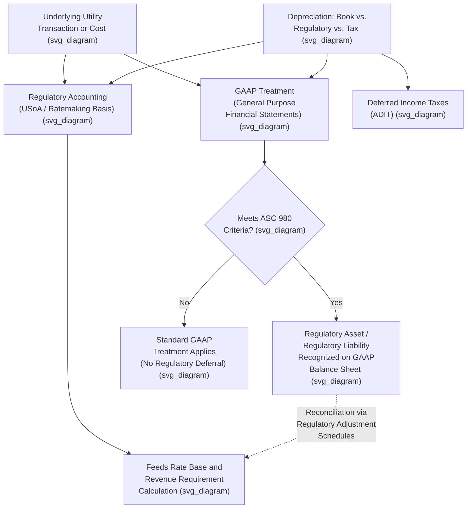

## Regulatory Accounting vs. GAAP Differences

### Framing the Distinction

Rate-regulated utilities operate under two parallel, and sometimes materially divergent, accounting frameworks: **Generally Accepted Accounting Principles (GAAP)**, applicable to general-purpose financial statements filed with the SEC and used by investors generally, and **regulatory accounting**, governed by FERC's Uniform System of Accounts (USoA) and by individual state commission accounting orders, used to determine cost recovery in rates. **[Inference]** These two frameworks serve fundamentally different purposes — GAAP aims to fairly present a company's financial position and results to investors and creditors under a framework designed for general commercial enterprises, while regulatory accounting aims to determine the appropriate basis for cost recovery from ratepayers under a framework shaped by the specific economics of rate-of-return regulation — and this difference in purpose is the root cause of most specific divergences between the two.

### The Bridge: ASC 980 (Regulatory Accounting)

The primary mechanism reconciling GAAP with rate-regulated industry economics is **Accounting Standards Codification Topic 980, Regulated Operations** (formerly Statement of Financial Accounting Standards No. 71, "Accounting for the Effects of Certain Types of Regulation," commonly still referred to as **SFAS 71**). ASC 980 permits a rate-regulated entity meeting specified criteria to depart from the accounting treatment that would otherwise apply under general GAAP, specifically to reflect the economic effects of rate regulation — most notably, by allowing the utility to recognize **regulatory assets** and **regulatory liabilities** on its GAAP balance sheet.

**[Inference]** Without ASC 980, many core features of rate-regulated utility accounting would not be GAAP-compliant, since general GAAP for a non-regulated commercial entity generally does not allow deferral of costs onto the balance sheet based on an expectation of future ratemaking recovery, or deferral of amounts collected from customers in advance of the corresponding cost being incurred — treatments that are central to how regulated utility accounting actually operates.

### Criteria for ASC 980 Applicability

**[Inference]** Under ASC 980, an entity's operations must generally meet several conditions for regulatory accounting treatment to apply to a given transaction:

1. **Rates are established by, or subject to approval of, an independent third-party regulator** (a state PUC or FERC).
2. **Rates are designed to recover the specific entity's cost of providing service** — i.e., cost-of-service-based ratemaking, as opposed to rates set purely by market forces or unrelated to the specific entity's costs.
3. **It is probable that rates can be charged to and collected from customers sufficient to recover the costs** — meaning the regulator's actions must make it probable that a deferred cost will actually be recovered in future rates, not merely possible or speculative.

If these criteria are not met — for example, if a jurisdiction has moved to a form of ratemaking sufficiently decoupled from individual entity costs, or if regulatory action creates significant doubt about cost recovery — a utility may be required to **discontinue application of ASC 980** for some or all of its operations, triggering potentially significant one-time write-offs of previously recorded regulatory assets.

### Regulatory Assets and Regulatory Liabilities

The core substantive difference ASC 980 introduces relative to general GAAP is the recognition of:

- **Regulatory assets** — costs that would normally be expensed as incurred under general GAAP, but which a utility defers on its balance sheet because it is probable that the regulator will allow future rate recovery of those costs. Examples commonly include certain deferred fuel costs, storm restoration costs pending a future recovery mechanism, deferred income taxes related to specific ratemaking conventions, and certain pension or postretirement benefit costs subject to regulatory deferral.
- **Regulatory liabilities** — amounts a utility has collected from customers (or accrued) in excess of costs actually incurred, or amounts that will need to be returned to or credited to customers in future rates, such as over-collected fuel costs, deferred tax liabilities related to accelerated tax depreciation in excess of book depreciation (a very common and large regulatory liability), or amounts collected for future decommissioning or removal costs.

### Illustrative Example: Regulatory Asset Recognition

**Example**: A utility incurs $40 million in storm restoration costs following a major hurricane, an amount well above its normal annual operating expense budget for such costs. Under general (non-regulated) GAAP, this cost would typically be expensed entirely in the period incurred, potentially causing a significant one-time hit to reported earnings. However, if the state commission has a track record of authorizing recovery of prudently incurred storm costs through a dedicated rider or amortization mechanism over a period of years, and it is probable that the commission will approve such recovery for this specific event, the utility may instead record a $40 million regulatory asset on its balance sheet and amortize the cost to expense over the multi-year recovery period authorized by the commission, matching the expense recognition pattern to the rate recovery pattern rather than to the period the cost was actually incurred.

**[Inference]** This treatment produces smoother, more predictable reported earnings relative to the alternative of full immediate expensing, which is one reason ASC 980 regulatory asset accounting is often viewed favorably by utility management and credit rating agencies, since it reduces earnings volatility tied to large, infrequent cost events — though it also means that reported GAAP earnings for a rate-regulated utility can diverge meaningfully from the cash economics of the underlying period.

### Depreciation: Book vs. Tax vs. Regulatory

One of the most persistent and financially significant areas of divergence involves **depreciation**, where up to three distinct depreciation calculations may coexist for the same utility plant asset:

| Depreciation Type | Purpose | Typical Method |
| --- | --- | --- |
| **GAAP (book) depreciation** | Financial statement reporting | Straight-line, based on estimated useful life determined via depreciation studies |
| **Regulatory (ratemaking) depreciation** | Rate base and revenue requirement calculation | Often straight-line, but rates and useful lives are subject to commission approval and may differ from book estimates; may include componentized or group depreciation conventions |
| **Tax depreciation** | Federal and state income tax liability calculation | Accelerated methods (e.g., MACRS under the U.S. tax code), generally producing faster write-off than book/regulatory depreciation |

**[Inference]** The difference between accelerated tax depreciation and straight-line book/regulatory depreciation creates **deferred income taxes**, one of the largest and most consequential items on a regulated utility's balance sheet, since utilities are highly capital-intensive and the depreciation timing difference compounds over the extended useful lives typical of utility plant. This deferred tax liability is itself subject to specific regulatory accounting and ratemaking treatment (addressed further under Accumulated Deferred Income Taxes, ADIT, as a rate base offset), illustrating how regulatory accounting interacts directly with, but is not identical to, both GAAP and tax accounting treatments of the same underlying asset.

### Revenue Recognition Differences

**[Inference]** General GAAP revenue recognition (currently governed by ASC 606, Revenue from Contracts with Customers) can, in some circumstances, diverge from the revenue reflected in a utility's regulatory cost-of-service model, particularly regarding the timing of recognition for certain riders, trackers, and true-up mechanisms, since ASC 606's contract-based revenue recognition framework was not designed with cost-of-service utility ratemaking mechanisms specifically in mind. **[Unverified]** The precise interaction between ASC 606 and specific utility revenue mechanisms (decoupling mechanisms, revenue trackers, formula rate true-ups) can be technically intricate and jurisdiction/mechanism-specific, and a definitive general statement would require examination of the specific mechanism and applicable accounting guidance rather than a categorical rule.

### Capitalization Policy Differences

Regulatory accounting under the USoA often prescribes specific capitalization thresholds and treatment for costs such as Allowance for Funds Used During Construction (AFUDC) — a mechanism, discussed extensively in ratemaking practice, allowing a utility to capitalize a cost-of-capital-based carrying charge on construction work in progress rather than expensing that carrying cost currently. **[Inference]** AFUDC, while it has a GAAP analog (capitalized interest under general GAAP), is calculated in the regulatory context using a specific FERC- or state-commission-prescribed rate formula tied to the utility's actual cost of capital, which can differ in both rate and scope from the capitalized interest calculation that would apply to non-regulated construction projects under general GAAP interest capitalization rules.

### Practical Consequences: Reconciling the Two Frameworks

**[Inference]** Because GAAP financial statements (used by investors, rating agencies, and for SEC reporting) and regulatory/ratemaking financial schedules (used to set rates) are prepared under different rules, utility financial analysts and regulatory accountants must routinely reconcile between the two, commonly through:

- **Regulatory adjustment schedules** filed in rate cases, converting GAAP-basis financial statements into the ratemaking basis required by the applicable jurisdiction's rules (e.g., removing non-utility or non-jurisdictional items, adjusting for pro forma and known/measurable changes, applying rate base offsets not reflected in GAAP).
- **FERC Form 1 filings**, prepared on a USoA basis, which may require separate reconciling schedules to GAAP-basis SEC filings for utilities that are also SEC registrants or subsidiaries of SEC registrants.
- **Credit rating agency adjustments**, where agencies such as Moody's and S&P apply their own analytical adjustments to a utility's GAAP financial statements (for example, treating certain purchased power agreements as debt-like obligations) that differ from both GAAP and regulatory accounting treatment.

### Key Points

- ASC 980 (formerly SFAS 71) is the GAAP standard permitting regulated entities to depart from general GAAP to reflect the economic effects of cost-of-service rate regulation, primarily through regulatory asset and regulatory liability recognition.
- Applicability of ASC 980 depends on rates being cost-of-service-based, regulator-approved, and probable of recovery; failure to meet these criteria can require discontinuation of regulatory accounting and associated write-offs.
- Depreciation is a central area of divergence, with GAAP/book, regulatory/ratemaking, and tax depreciation often differing, generating significant deferred tax balances.
- Regulatory accounting and GAAP serve different purposes (investor reporting vs. cost recovery determination), and reconciliation between the two is a routine and necessary function in utility rate case practice and financial reporting.
- AFUDC and other capitalization conventions illustrate how regulatory-specific formulas can produce results distinct from general GAAP treatment of analogous costs.

### Diagram: GAAP vs. Regulatory Accounting Divergence (svg_diagram)

### Related Topics

- **The FERC Uniform System of Accounts (USoA)** — the primary regulatory accounting framework
- **ASC 980 / SFAS 71 Criteria and Discontinuation Events**
- **Accumulated Deferred Income Taxes (ADIT)** as a rate base offset
- **Allowance for Funds Used During Construction (AFUDC)**
- **Regulatory Asset and Liability Treatment in Rate Cases**
- **Credit Rating Agency Adjustments to Utility Financial Statements**
- **Storm Cost Recovery Mechanisms and Securitization**