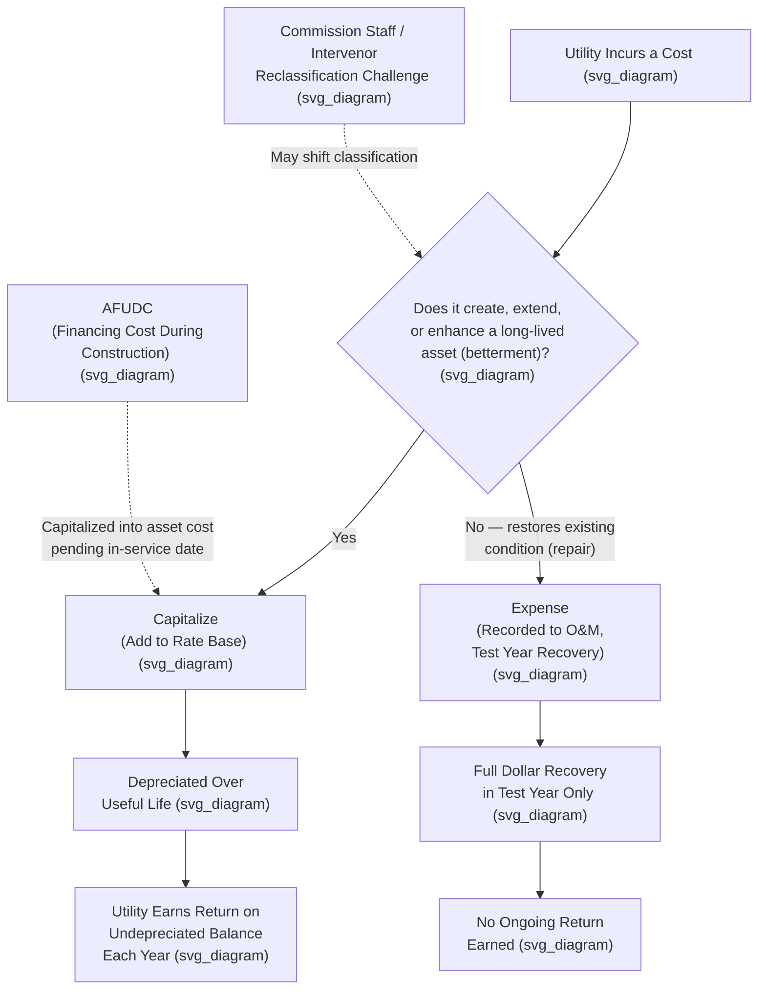

## Capitalization Policy: Capital vs. Expense

### The Central Distinction

The classification of a cost as **capital** (recorded on the balance sheet as an asset and recovered over time through depreciation, with an accompanying return on the unrecovered balance) versus **expense** (recorded on the income statement in the period incurred and recovered dollar-for-dollar in that period's rates) is among the most consequential accounting-adjacent decisions in utility ratemaking. **[Inference]** This distinction matters enormously to both utility shareholders and ratepayers because it directly determines the *timing* and *magnitude* of cost recovery, and because capital treatment — unlike expense treatment — generates an ongoing revenue stream (depreciation plus return on rate base) that continues for the life of the asset, materially affecting both current and future rates.

### Why Classification Matters: The Economics

| Dimension | Capitalized Cost | Expensed Cost |
| --- | --- | --- |
| Balance sheet treatment | Recorded as an asset, added to rate base | Not recorded as an asset; flows through the income statement |
| Rate recovery pattern | Recovered gradually via depreciation over the asset's useful life | Recovered in full in the test year in which it is incurred |
| Return earned | Utility earns a return (ROE/ROR) on the undepreciated balance each year | No return is earned; only a one-time expense recovery |
| Impact on current rates | Lower immediate rate impact; cost spread over many years | Higher immediate rate impact; full cost recovered at once |
| Impact on rate base and future ROE opportunity | Increases rate base, providing an earning opportunity for the utility over time | No rate base impact |
| Typical utility management incentive | Some incentive to capitalize where accounting policy allows discretion, since capitalization creates an ongoing earning opportunity | Preference to expense where doing so accelerates cost recovery, particularly under regulatory lag concerns |

**[Inference]** Because capitalized costs generate an ongoing return for the utility while expensed costs do not, capitalization policy is a recurring subject of scrutiny by commission staff, consumer advocates, and auditors — not because capitalizing costs is inherently improper, but because the classification decision has real economic stakes for both the utility's earning opportunity and the timing of the burden placed on ratepayers.

### General Capitalization Criteria

**[Inference]** Under both general accounting principles and the FERC Uniform System of Accounts (USoA) framework, a cost is generally capitalized (rather than expensed) when it meets criteria along these lines, though the specific threshold and application details vary by utility accounting policy and jurisdiction:

1. **The expenditure creates or enhances a long-lived asset** — new plant, a betterment or improvement extending an asset's useful life or increasing its capacity, as opposed to routine maintenance that merely restores an asset to its original operating condition.
2. **The cost is directly attributable to bringing the asset to its intended condition and location for use** — including direct labor, materials, contractor costs, and certain overhead and financing costs (such as AFUDC) allocable to construction.
3. **The cost exceeds a capitalization threshold** — many utilities apply a minimum dollar threshold below which even qualifying costs are expensed for practical/administrative simplicity, consistent with general accounting materiality conventions.
4. **The expenditure is not a routine repair or maintenance item** — costs that merely maintain an asset in its normal operating condition, without extending its life or increasing its capacity or efficiency, are generally expensed as incurred (typically recorded to Operation and Maintenance, or "O&M," expense accounts under the USoA).

### The Repair vs. Betterment Distinction

**[Inference]** One of the most frequently litigated classification questions in utility ratemaking is the **repair versus betterment (or replacement)** distinction, since this line is inherently judgment-laden and can be characterized differently depending on the specific facts of a given capital program:

- **Repair (expense)**: work that restores an asset to its previous operating condition without materially extending its useful life, increasing its capacity, or improving its efficiency — for example, patching a section of damaged pipeline or replacing a failed component with an equivalent part.
- **Betterment or replacement (capital)**: work that extends useful life, increases capacity, improves efficiency, or replaces a substantial portion of an asset — for example, replacing an entire aging pipeline segment with new pipe of greater capacity, or a major overhaul that extends a generating unit's expected remaining life by a decade.

**Example**: A gas distribution utility undertakes a large-scale pipe replacement program, replacing aging cast-iron mains with modern polyethylene pipe as part of a system-wide safety and reliability initiative. **[Inference]** Even though the individual replacement work superficially resembles "repair" in the sense of fixing an aging asset, such large-scale, planned replacement programs are typically classified as capital expenditures rather than expense, since the work replaces (rather than merely repairs) the asset, generally extends useful life significantly, and often involves increased pipe capacity and improved safety characteristics — though the specific classification would depend on the utility's capitalization policy and the specific facts of the work performed, and disputes over the boundary in specific rate cases are common.

### Overhead and Indirect Cost Capitalization

A related and frequently contested area involves the capitalization of **indirect and overhead costs** associated with construction activity — costs that are not directly traceable to a specific capital project but that support the utility's overall construction program, such as a portion of engineering department salaries, supervision, transportation, and general administrative support. Utilities typically use a **capitalization ratio** or **overhead allocation study** to determine what percentage of certain overhead cost pools should be capitalized to construction versus expensed as period costs, often as part of formal Time and Effort studies or capital/expense allocation methodologies. **[Inference]** These overhead capitalization policies are a recurring subject of prudence and reasonableness review in rate cases, since a higher-than-appropriate capitalization ratio could improperly shift what should be current-period expense recovery into rate base (generating an unwarranted additional return), while an inappropriately low ratio could understate rate base and impair proper cost recovery.

### AFUDC: A Specialized Capitalization Mechanism

**Allowance for Funds Used During Construction (AFUDC)** represents a specialized capitalization convention specific to rate-regulated utility accounting: rather than expensing the financing (debt and equity) cost associated with capital tied up in construction work in progress, a utility calculates and capitalizes an AFUDC amount — using a rate typically tied to the utility's authorized or actual cost of capital — adding this non-cash financing cost to the capitalized cost of the asset under construction. **[Inference]** AFUDC exists specifically because construction work in progress (CWIP) is often excluded from rate base until the asset is placed in service (i.e., is "used and useful," per the doctrine discussed in *Duquesne Light Co. v. Barasch*, 488 U.S. 299 (1989)), meaning the utility would otherwise bear the financing cost of construction with no rate recovery at all during the construction period; AFUDC allows that financing cost to instead be capitalized and recovered later, once the asset is placed in service, through depreciation and return on the higher resulting rate base.

### Test Year Adjustments for Capital vs. Expense Reclassification

**[Inference]** In a contested rate case, commission staff or intervenors frequently propose adjustments reclassifying costs the utility has recorded as expense into capital treatment, or vice versa, when they believe the utility's classification does not conform to appropriate accounting or ratemaking policy. Such reclassifications can have a significant impact on the revenue requirement calculation, since moving a cost from expense to capital treatment removes its full-dollar impact from the current test year (replacing it with only a depreciation-plus-return impact, typically much smaller in the near term), while the reverse reclassification has the opposite effect.

### Illustrative Example: A Contested Reclassification

**Example**: A utility capitalizes $10 million of costs associated with a major software implementation supporting its customer billing system, treating the project as an intangible capital asset to be amortized over a 10-year useful life. Commission staff argues that a portion of these costs — training expenses and certain data migration and testing activities — do not meet capitalization criteria because they do not create or enhance a long-lived asset but instead represent ordinary operational costs of transitioning to the new system, and should instead be expensed in the test year.

**[Inference]** If the commission agrees with staff's position and reclassifies, for example, $2 million of the $10 million project cost from capital to expense, the practical rate impact would be a one-time increase in test-year expense of $2 million (fully recovered in that year's rates) coupled with a corresponding $2 million reduction in rate base (and the associated future depreciation and return that would otherwise have accrued on that amount); the utility's total lifetime recovery of the reclassified amount would likely change as well, though the precise revenue requirement effect in any specific case depends on the test year methodology, the remaining useful life assumptions, and the utility's authorized rate of return, and cannot be generalized without those specific inputs.

### Key Points

- The capital-versus-expense classification decision directly affects both the timing of cost recovery and whether the utility earns an ongoing return on the recorded amount, making it economically consequential for both utility earnings and ratepayer rate levels.
- General capitalization criteria distinguish costs that create, extend, or enhance a long-lived asset (capital) from routine repair and maintenance costs that merely restore existing condition (expense).
- The repair-versus-betterment distinction is a frequently litigated gray area, particularly for large-scale planned replacement and infrastructure modernization programs.
- Overhead and indirect cost capitalization ratios are a recurring area of prudence review, since improper allocation can shift costs between capital and expense treatment inappropriately.
- AFUDC is a specialized regulatory capitalization mechanism addressing the financing cost of construction work in progress excluded from rate base under used-and-useful principles.
- Capital/expense reclassification disputes are common in contested rate cases and can materially affect the calculated revenue requirement.

### Diagram: Capital vs. Expense Classification Decision Flow (svg_diagram)

### Related Topics

- **The FERC Uniform System of Accounts (USoA)** — account-level capital vs. expense classification
- **Duquesne Light Co. v. Barasch** — used-and-useful limits on rate base inclusion of construction work in progress
- **Allowance for Funds Used During Construction (AFUDC)**
- **Overhead Allocation Studies and Capitalization Ratios**
- **Depreciation Studies and Useful Life Determination**
- **Prudence Review of Capital Programs**
- **Regulatory Accounting vs. GAAP Differences** — ASC 980 interaction with capitalization policy