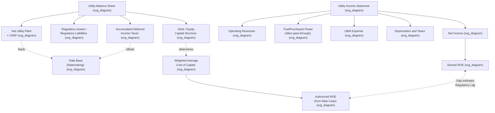

## Reading Utility Balance Sheets and Income Statements

### Why Utility Financial Statements Look Different

**[Inference]** A regulated utility's balance sheet and income statement differ structurally from those of a typical unregulated company in several fundamental ways, since rate-of-service regulation and the ASC 980 regulatory accounting framework (discussed in connection with Regulatory Accounting vs. GAAP Differences) introduce line items and structural conventions that have no direct counterpart in most other industries. A financial statement reader trained primarily on general commercial company analysis will encounter several unfamiliar features: extremely high capital intensity relative to revenue, extensive use of regulatory assets and liabilities, unusually large deferred tax balances, and a capital structure conversation inseparable from a specific authorized rate of return.

### The Utility Balance Sheet: Key Sections

A typical utility balance sheet, whether prepared on a GAAP or FERC Form 1 (USoA) basis, is organized around several major sections that map closely onto rate base components discussed in ratemaking analysis:

**Assets:**

- **Utility Plant** — by far the largest asset category for most utilities, comprising:
  - **Plant in service** (gross), at original cost
  - **Less: accumulated depreciation** — netted against gross plant to arrive at net plant in service
  - **Construction work in progress (CWIP)** — capital projects not yet placed in service
  - **Plant held for future use** — land or facilities acquired but not yet needed for current service
- **Current Assets** — cash, accounts receivable (including unbilled revenue, a utility-specific item reflecting service provided but not yet billed as of the balance sheet date), materials and supplies inventory, and prepayments
- **Regulatory Assets** (discussed further below) — deferred costs expected to be recovered in future rates
- **Deferred Charges and Other Assets** — goodwill (for utilities that have undergone acquisitions), deferred pension assets, and other long-term items

**Liabilities and Equity:**

- **Common and Preferred Equity** — including common stock, additional paid-in capital, and retained earnings
- **Long-Term Debt** — first mortgage bonds, unsecured notes, and other long-term financing instruments, typically a large balance sheet component given utilities' capital-intensive nature and reliance on debt financing
- **Current Liabilities** — accounts payable, current portion of long-term debt, accrued taxes and interest
- **Deferred Income Taxes (Accumulated Deferred Income Taxes, or ADIT)** — often one of the largest liability items on a utility balance sheet, arising from the difference between accelerated tax depreciation and straight-line book/regulatory depreciation
- **Regulatory Liabilities** — amounts owed back to customers or collected in advance of costs being incurred
- **Asset Retirement Obligations (AROs)** — estimated future costs of retiring or decommissioning long-lived assets (particularly significant for nuclear generating utilities)

### Illustrative Simplified Balance Sheet Structure

**Example**: A simplified representation of how a utility balance sheet might be organized (illustrative figures only, not representative of any specific company):

| Assets |  | Liabilities and Equity |  |
| --- | --- | --- | --- |
| Gross Plant in Service | $8,000M | Common Equity | $3,200M |
| Less: Accumulated Depreciation | ($2,500M) | Long-Term Debt | $3,800M |
| **Net Plant in Service** | **$5,500M** | Accumulated Deferred Income Taxes | $900M |
| Construction Work in Progress | $600M | Regulatory Liabilities | $150M |
| Current Assets | $700M | Current Liabilities | $500M |
| Regulatory Assets | $450M | Asset Retirement Obligations | $200M |
| **Total Assets** | **$7,250M** | **Total Liabilities and Equity** | **$7,250M** |

**[Inference]** Notice that net plant in service typically dominates the asset side, and that the debt-to-equity mix on the liability side directly corresponds to the capital structure used in the utility's weighted average cost of capital (WACC) calculation for ratemaking purposes, illustrating the tight linkage between the balance sheet and the rate-of-return determination discussed in cost of capital analysis.

### The Utility Income Statement: Key Sections

A utility income statement generally follows this structure, moving from top-line revenue down to net income:

1. **Operating Revenues** — typically broken out by customer class (residential, commercial, industrial) and sometimes by rate schedule, plus other operating revenues (late fees, miscellaneous service charges).
2. **Operating Expenses**:
   - **Fuel and Purchased Power** (for electric utilities) or **Cost of Gas** (for gas utilities) — often the single largest expense category, frequently subject to a separate fuel/purchased gas adjustment clause that passes costs through to customers largely dollar-for-dollar, somewhat insulating this line from the base rate case process.
   - **Operation and Maintenance (O&M) Expense** — labor, materials, and contractor costs to operate and maintain the utility system, excluding fuel/purchased power.
   - **Depreciation and Amortization** — the periodic allocation of plant cost to expense over useful life.
   - **Taxes Other Than Income Taxes** — property taxes, payroll taxes, gross receipts taxes.
3. **Operating Income** — revenues less operating expenses (the key subtotal most directly tied to the rate case revenue requirement).
4. **Other Income and Deductions** — items such as AFUDC (equity component often shown as non-operating income), interest income, and other non-operating items.
5. **Interest Expense** — interest on long-term debt and short-term borrowings.
6. **Income Tax Expense** — federal and state income taxes, itself often affected by regulatory tax normalization conventions.
7. **Net Income** — the bottom line, from which earnings per share and return on equity are calculated.

### Distinguishing Regulated vs. Non-Regulated Segments

**[Inference]** Many utility holding companies operate a mix of regulated (cost-of-service, rate-of-return) and non-regulated or competitive businesses (unregulated generation, energy trading, or other diversified ventures), and a careful financial statement reader must distinguish between segments, since the ratemaking analysis (fair-return standards, USoA accounting, ASC 980 regulatory asset treatment) applies specifically to the regulated segment and generally does not apply to non-regulated affiliates or business lines, even when they are consolidated into the same GAAP financial statements. SEC filings and FERC Form 1 filings typically include segment reporting or separate schedules distinguishing regulated utility operations from other business activities for this reason.

### Key Ratios and Analytical Metrics

**[Inference]** Financial statement analysis of a rate-regulated utility typically emphasizes several metrics that carry particular significance given the regulatory context, though the specific analytical approach varies by analyst and purpose:

- **Return on Equity (ROE), Earned vs. Authorized** — comparing the utility's actual earned ROE (net income divided by average common equity) to the ROE authorized by the commission in its most recent rate case, since a material and sustained gap between earned and authorized ROE (in either direction) often signals regulatory lag, an outdated rate case, or the effects of intervening riders and trackers.
- **Funds From Operations (FFO) to Debt** — a key credit-rating-agency metric assessing cash flow coverage of debt obligations, heavily influenced by regulatory cash flow timing (e.g., the pace of rider/tracker cost recovery, deferred tax normalization conventions, and bonus depreciation effects).
- **Rate Base Growth** — the year-over-year change in the utility's rate base, a primary driver of future earnings growth potential for a cost-of-service regulated utility, since (absent an intervening rate case that resets rates) rate base growth combined with the authorized ROE largely determines the trajectory of the utility's regulated earnings opportunity.
- **Regulatory Lag Indicators** — the gap between when costs are incurred and when they are reflected in rates, often assessed by comparing test year assumptions to actual subsequent-period results.

### Interpreting the Interaction of Statements: A Worked Example

**Example**: Suppose an electric utility's most recent rate case authorized a 9.5% ROE on a 50% equity capital structure, based on a rate base of $5.0 billion. In the year following the rate case, the utility's rate base grows to $5.3 billion due to continued capital investment (reflected on the balance sheet as increased net plant), but the utility has not filed a new rate case, so rates remain based on the original $5.0 billion rate base.

**[Inference]** In this scenario, the utility's *earned* ROE, calculated from its actual income statement net income divided by actual average equity, would likely be below the *authorized* 9.5% ROE, since the incremental $300 million of rate base growth is not yet reflected in rates and is therefore not earning a return, even though the utility is bearing the associated financing costs — a common illustration of "regulatory lag" as it appears directly in the interaction between balance sheet growth and income statement performance; the utility might then use this earned-versus-authorized ROE gap as part of its justification for filing a new rate case or seeking an interim rate mechanism, though the specific magnitude of any earned ROE shortfall would depend on additional factors (expense levels, sales volumes, weather, riders in effect) not specified in this simplified example.

### Key Points

- Utility balance sheets are dominated by net utility plant and financed by a debt/equity capital structure directly tied to the ratemaking cost of capital determination.
- Regulatory assets and liabilities, and large accumulated deferred income tax balances, are structurally significant balance sheet features specific to rate-regulated entities under ASC 980.
- Utility income statements separate fuel/purchased power (often subject to pass-through cost recovery mechanisms) from O&M expense, with operating income serving as the key subtotal most directly connected to the rate case revenue requirement.
- Financial statement analysis of regulated utilities emphasizes earned-versus-authorized ROE, FFO-to-debt credit metrics, and rate base growth as primary interpretive lenses, reflecting the centrality of the ratemaking relationship to the company's financial performance.
- Regulatory lag — the gap between rate base growth (or cost increases) and the rates actually in effect — is directly visible in the divergence between authorized and earned ROE.

### Diagram: Utility Financial Statement Structure and Ratemaking Linkage (svg_diagram)

### Related Topics

- **Regulatory Accounting vs. GAAP Differences** — ASC 980 basis for regulatory assets and liabilities
- **The FERC Uniform System of Accounts (USoA)** — underlying account structure for FERC Form 1 statements
- **Rate Base Determination** — components and offsets (including ADIT)
- **Weighted Average Cost of Capital and Capital Structure in Ratemaking**
- **Regulatory Lag and Attrition** — earned vs. authorized ROE analysis
- **Credit Rating Agency Metrics** (FFO/Debt) for regulated utilities
- **Fuel and Purchased Power Adjustment Clauses**