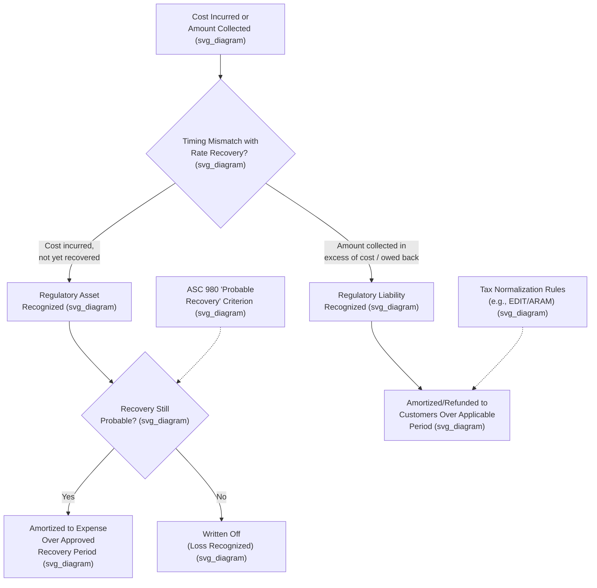

## Regulatory Assets, Liabilities, and Deferred Accounts

### Conceptual Foundation

Regulatory assets and regulatory liabilities are balance sheet items unique to rate-regulated accounting, arising under **ASC 980, Regulated Operations** (formerly SFAS 71). They exist because cost-of-service ratemaking frequently creates timing differences between when a cost is incurred (or a benefit is received) and when that cost or benefit is reflected in customer rates. Where general GAAP would typically require immediate expense or revenue recognition, ASC 980 permits — indeed, in many cases requires — a rate-regulated entity to defer the item to the balance sheet, matching income statement recognition to the pattern of actual rate recovery rather than to the pattern of cost incurrence, provided the applicable recognition criteria are satisfied.

### Regulatory Assets: Definition and Recognition Criteria

A **regulatory asset** represents a cost that a utility has incurred (or accrued) but has not yet recovered through rates, which it expects to recover in the future because it is probable that the regulator's actions will permit inclusion of that cost in future rates. Recognition of a regulatory asset generally requires:

1. **The cost is incurred** and would otherwise be expensed under general GAAP.
2. **A separate identifiable regulatory mechanism, order, or track record** makes it probable that the cost will be recovered from customers in future rates — this could be an explicit regulatory order authorizing deferral and recovery, a settled and consistent commission practice, or another sufficiently reliable indicator of future recovery.
3. **The recovery period and mechanism are reasonably determinable**, though the exact rate or timing need not be fixed with certainty.

### Common Categories of Regulatory Assets

- **Deferred fuel and purchased power costs** — under-recovered fuel or purchased power costs relative to what has been collected through a fuel adjustment clause, expected to be recovered through future fuel clause true-ups.
- **Storm restoration costs** — costs of major storm damage repair in excess of normal budgeted levels, often deferred pending commission authorization of a specific recovery mechanism (amortization period, securitization, or rider).
- **Deferred pension and other postretirement benefit costs** — the portion of pension/OPEB expense recognized under GAAP (e.g., under ASC 715) that a commission has not yet allowed in rates, or conversely, amounts allowed in rates in excess of GAAP expense, deferred to match the ratemaking treatment.
- **Unamortized loss on reacquired debt** — costs associated with early retirement or refinancing of long-term debt, which many jurisdictions allow utilities to amortize over the remaining life of the original debt or the new debt, rather than expensing immediately.
- **Deferred income taxes (regulatory tax-related assets)** — certain tax-related timing differences that produce a net regulatory asset rather than liability, depending on the specific tax provision and ratemaking convention applied.
- **Rate case expense** — the utility's own costs of prosecuting a rate case (legal fees, expert witness costs, consulting fees), often deferred and amortized over a period (commonly matching the expected interval until the next rate case) rather than expensed entirely in the year incurred.
- **Costs of canceled plant** (where recovery, though not rate-base treatment, is authorized) — as illustrated in the fact pattern underlying *Duquesne Light Co. v. Barasch*, 488 U.S. 299 (1989), where Pennsylvania's statutory scheme allowed amortized recovery of prudently incurred cancellation costs outside rate base, a treatment that in accounting terms corresponds to regulatory asset recognition and amortization rather than immediate expensing or rate-base capitalization.

### Regulatory Liabilities: Definition and Recognition Criteria

A **regulatory liability** represents an amount that a utility has collected from customers (or is obligated to credit to customers) in excess of the costs actually incurred, or that regulatory action requires the utility to return, refund, or apply to reduce future rates. Regulatory liabilities arise from the mirror-image timing mismatch to regulatory assets: money has flowed in from ratepayers ahead of, or independent of, the corresponding cost or obligation being satisfied.

### Common Categories of Regulatory Liabilities

- **Over-recovered fuel or purchased power costs** — amounts collected through a fuel adjustment clause in excess of actual fuel costs incurred, owed back to customers through future clause adjustments.
- **Excess deferred income taxes (EDIT)** — arising when a change in statutory tax rates (such as the U.S. corporate tax rate reduction enacted in 2017) creates a difference between previously recorded deferred tax liabilities (calculated at the old, higher rate) and the amount that will actually be owed at the new, lower rate; the excess is treated as a regulatory liability owed back to customers, typically amortized over a period determined by the applicable tax normalization rules and commission order.
- **Asset retirement obligation (ARO) related regulatory liabilities** — amounts collected from customers for future decommissioning or removal costs (particularly significant for nuclear generating facilities) in advance of the actual retirement expenditure.
- **Deferred gain on sale-leaseback or other transactions** — gains that GAAP would otherwise recognize currently but that a commission requires to be deferred and returned to customers over time.
- **Refunds pending distribution** — amounts a commission has ordered refunded to customers (for example, following a successful complaint under FPA Section 206 or a similar state-law challenge) that have not yet been physically credited or paid out.

### Deferred Accounts: The Broader Category

**[Inference]** "Deferred accounts" is a broader descriptive term sometimes used to encompass both regulatory assets and regulatory liabilities collectively, as well as related concepts such as deferred debits and deferred credits recorded under specific USoA account numbers (for example, various accounts in the 180s range for deferred debits and corresponding accounts for deferred credits), reflecting the FERC Uniform System of Accounts' own terminology, which predates and operates alongside the GAAP-level ASC 980 framework.

### Illustrative Example: Excess Deferred Income Tax Treatment

**Example**: A utility's accumulated deferred income tax liability was recorded assuming a 35% federal corporate tax rate. Following a federal tax rate reduction to 21%, the utility recognizes that a portion of the previously recorded deferred tax liability now represents an amount collected from customers (through rates that assumed the higher future tax rate) in excess of what will actually be owed to the government. This excess amount is reclassified as a regulatory liability — specifically, "excess deferred income taxes" — and is generally required, under federal tax normalization rules applicable to accelerated depreciation-related timing differences, to be returned to customers over a specific period (often tied to the average remaining regulatory life of the underlying assets, sometimes called the "ARAM" method — Average Rate Assumption Method) rather than all at once, to comply with tax normalization requirements under the Internal Revenue Code.

**[Inference]** This example illustrates a broader point: the specific mechanics and amortization period for a given regulatory asset or liability are frequently governed not only by GAAP (ASC 980) and general ratemaking principles, but also by specific external constraints — in this case, federal tax normalization rules — that interact with, and can override, a commission's or utility's general discretion over deferral period selection.

### Balance Sheet Presentation and Rate Base Interaction

**[Inference]** Regulatory assets and liabilities are typically presented as separate line items (or grouped categories) on a utility's balance sheet, distinct from ordinary current and long-term asset/liability classifications, and are commonly further disaggregated in footnote disclosures by specific type (fuel, pension, storm costs, tax-related, etc.) given their materiality and the analytical interest of investors and regulators in understanding their composition. Whether a specific regulatory asset or liability is included in, or as an offset to, rate base for ratemaking purposes is a separate ratemaking policy question distinct from the GAAP recognition question — some regulatory assets earn a return (are included in rate base) while others are recovered only at cost with no return, depending on the specific type of deferral and the applicable jurisdiction's ratemaking treatment.

### Discontinuation of Regulatory Accounting: The Risk Side

**[Inference]** Because regulatory asset recognition depends on the "probable" recovery criterion under ASC 980, a change in regulatory environment — a commission's denial of an expected recovery, a jurisdiction's shift toward a form of ratemaking sufficiently decoupled from individual cost recovery, or restructuring/deregulation of a portion of a utility's business — can require an entity to write off some or all of its previously recognized regulatory assets, since the underlying recovery probability that justified their recognition no longer holds. Such write-offs can be financially significant, and are a recurring subject of disclosure and analysis in utility financial reporting, particularly during periods of significant regulatory or market restructuring (as occurred, for example, during electric industry restructuring in various states in the late 1990s and 2000s, discussed further in connection with stranded cost recovery).

### Comparative Summary Table

| Feature | Regulatory Asset | Regulatory Liability |
| --- | --- | --- |
| Nature | Cost incurred, not yet recovered from customers | Amount collected from or owed to customers, in excess of costs incurred |
| Recognition trigger | Probable future rate recovery | Regulatory or contractual obligation to return/credit amount |
| Balance sheet placement | Asset | Liability |
| Common examples | Deferred fuel costs, storm costs, rate case expense, unamortized reacquired debt costs | Over-recovered fuel costs, excess deferred income taxes, ARO-related collections |
| Risk if regulatory support weakens | Write-off (loss) if recovery becomes improbable | Generally still owed regardless of regulatory environment changes (it is a payable-like obligation) |

### Key Points

- Regulatory assets and liabilities exist under ASC 980 specifically to match income statement recognition to the timing of rate recovery rather than to the timing of cost incurrence or cash collection.
- Regulatory asset recognition requires that future recovery be probable, based on regulatory orders, mechanisms, or a sufficiently reliable track record; this probability can change, potentially triggering write-offs.
- Regulatory liabilities frequently arise from fuel clause over-collections, excess deferred income taxes following statutory tax rate changes, and ARO-related customer collections.
- Whether a given regulatory asset or liability earns a return (is treated as part of rate base) is a separate ratemaking policy question from its GAAP recognition.
- Excess deferred income tax treatment illustrates how external constraints, such as federal tax normalization rules, can govern the specific amortization mechanics of a regulatory account beyond ordinary commission or GAAP discretion.

### Diagram: Regulatory Asset and Liability Lifecycle (svg_diagram)

### Related Topics

- **Regulatory Accounting vs. GAAP Differences** — the ASC 980 framework underlying regulatory asset/liability recognition
- **The FERC Uniform System of Accounts (USoA)** — deferred debit/credit account structure
- **Excess Deferred Income Taxes and Tax Normalization Rules**
- **Storm Cost Recovery Mechanisms and Securitization**
- **Stranded Cost Recovery** — regulatory asset write-offs during industry restructuring
- **Rate Case Expense Amortization**
- **Asset Retirement Obligations (ARO) in Utility Accounting**