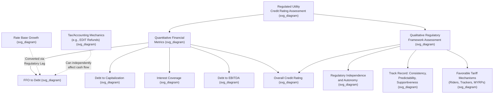

## Credit Metrics and Rating Agency Treatment of Rate Base

### Why Credit Ratings Matter to Ratemaking

Utility credit ratings, assigned primarily by Moody's Investors Service and S&P Global Ratings, are directly relevant to ratemaking because the **Bluefield fair-return standard** — established in *Bluefield Waterworks & Improvement Co. v. Public Service Commission*, 262 U.S. 679 (1923), and reaffirmed in *FPC v. Hope Natural Gas Co.*, 320 U.S. 591 (1944) — explicitly requires that authorized returns be adequate to maintain the utility's financial integrity and credit standing. Credit rating agency methodologies and metrics therefore serve as an important, semi-independent external validation point for assessing whether a commission's rate order satisfies this constitutional and regulatory standard, and utility witnesses frequently introduce credit metric analysis directly into rate case testimony to support ROE and capital structure requests.

### Rating Methodology Structure: Quantitative and Qualitative Blend

**[Inference]** Both major rating agencies combine quantitative financial metrics with qualitative assessment of the regulatory environment, though the specific weighting differs by agency and has evolved over time. Moody's regulated utilities rating methodology allocates a portion of the analysis to credit metrics, with a comparable or larger portion based on the agency's view of the utility's regulatory framework and its ability to recover costs and earn returns. In assessing these qualitative factors, Moody's considers the track record of regulatory decisions in terms of consistency, predictability, and supportiveness, along with the protections that assure full cost recovery and a reasonable return for the utility on its investments. S&P's rating methodology similarly includes a qualitative regulatory assessment, and according to a primary credit analyst at S&P Global Ratings, regulatory advantage is the most heavily weighted factor when S&P analyzes a regulated utility's business risk profile, with regulatory changes able to boost or lessen risk based on the perceived impact on the regulatory process.

### Key Quantitative Credit Metrics

**Funds From Operations to Debt (FFO/Debt)** is the single most frequently cited quantitative credit metric for regulated utilities across both major agencies. It measures the utility's operating cash flow generation (funds from operations, roughly net income plus non-cash charges such as depreciation and deferred taxes) relative to its total debt obligations, serving as a proxy for the utility's capacity to service and repay debt from ongoing operations. Both agencies publish specific FFO/Debt thresholds associated with different rating levels; for example, in specific published guidance, S&P has indicated it could raise ratings on a particular utility holding company if FFO to debt is maintained consistently above certain thresholds, while Moody's has referenced improvement in cash flow from operations before working capital changes (CFO pre-WC) to debt above specified levels as a factor supporting rating upgrades.

Other commonly referenced quantitative metrics include:

- **Debt-to-Capitalization Ratio** — the proportion of total capitalization represented by debt, often subject to specific thresholds negotiated in financing covenants (for example, specific utility holding companies have referenced covenant thresholds such as a 65% debt-to-capitalization ratio for utility and transmission operating subsidiaries).
- **Interest Coverage Ratio** — earnings or cash flow relative to interest expense obligations.
- **Debt-to-EBITDA** — total debt relative to earnings before interest, taxes, depreciation, and amortization, a leverage metric commonly tracked at the consolidated holding company level.
- **Retained Cash Flow to Debt** — a metric similar to FFO/Debt but net of dividend payments, reflecting cash actually retained within the business.

### The Deferred Tax / Tax Reform Illustration

**[Inference]** A well-documented historical episode illustrating the sensitivity of utility credit metrics to regulatory and tax-related cash flow timing occurred following the U.S. federal corporate tax rate reduction from 35% to 21% enacted in the Tax Cuts and Jobs Act of 2017. Utilities have typically set aside payments from customers to pay for future taxes, and these deferred tax payments had historically boosted utility cash flow, accounting for a meaningful share of aggregate utility sector FFO. Following the tax rate cut, utilities were required to collect less cash from customers for deferred taxes going forward and were also required to refund previously over-collected deferred tax amounts (the excess deferred income tax, or EDIT, regulatory liability discussed in the context of regulatory liabilities) back to customers over time, both effects reducing utility cash flow. Moody's specifically projected that FFO-to-debt levels for regulated utilities would decline as a direct result of this dynamic, and the agency changed its outlook on the U.S. regulated utility sector from stable to negative for the first time since it began conducting sector outlooks, citing increased financial risk from lower cash flow and elevated holding company leverage.

**[Inference]** This episode is instructive because it illustrates that credit metrics can deteriorate for reasons entirely disconnected from a utility's operational performance or the adequacy of its authorized ROE — here, a change in federal tax law directly reduced cash flow through mandated regulatory liability treatment of EDIT — meaning credit analysts, and commissions responding to credit concerns, must distinguish cash flow effects attributable to tax or accounting mechanics from those attributable to genuinely inadequate rate of return.

### Rating Agency Treatment of Rate Base and Regulatory Assets

**[Inference]** Because rate base itself is a regulatory construct rather than a GAAP balance sheet line item, rating agencies generally do not treat "rate base" as a distinct credit metric input on its own, but instead focus on how rate base growth translates into the cash flow and earnings metrics (FFO/Debt, interest coverage) that do factor directly into their scorecards. Rating agencies do, however, scrutinize:

- **The composition and quality of rate base** — whether rate base is composed of assets earning a full cash return currently, versus deferred regulatory assets earning a lower or no immediate cash return (even if they earn an accounting return), since the cash flow timing differs materially between these categories.
- **Regulatory lag exposure** — the gap between when capital is invested (added to rate base) and when that investment begins generating cash returns through approved rates, since prolonged regulatory lag can suppress cash flow metrics even where a utility's authorized ROE is nominally adequate.
- **Rate case outcome track record** — whether a jurisdiction has a history of authorizing rate base growth and ROE levels consistent with the utility's actual capital investment plans, feeding into the qualitative "regulatory framework" assessment described above.

### Regulatory Mechanisms Favorable to Credit Quality

**[Inference]** Rating agencies generally view certain ratemaking mechanisms as credit-supportive because they reduce regulatory lag and cash flow volatility, including:

- **Formula rate plans and multi-year rate plans** — reducing the frequency of full, contested base rate cases and providing more predictable, timely cost recovery.
- **Riders and trackers** — allowing near-real-time recovery of specific cost categories (fuel, storm costs, infrastructure replacement programs) outside the full base rate case cycle.
- **Construction Work in Progress (CWIP) in rate base, or CWIP-related mechanisms** — allowing some current cash recovery of financing costs on major construction projects, as an alternative or supplement to AFUDC accrual, reducing the cash flow lag associated with large capital programs.
- **Automatic fuel clause adjustments** — minimizing under/over-recovery cash flow timing mismatches for the largest single utility expense category.

This is reflected in published guidance identifying favorable tariff-setting procedures — policies and procedures in place to minimize the administrative burden and financial costs associated with setting rates, such as multi-year rate cases, use of riders to adjust rates outside of the formal ratemaking process, and automatic fuel clause adjustments — alongside the independence and autonomy of regulators (the level at which regulators are insulated from political and legislative interference) as specific components of the regulatory framework assessment.

### Illustrative Example: Aggregate vs. Line-Item Credit Impact

**Example**: A state commission is considering whether to deny recovery of a specific, relatively modest cost category — for instance, a demand-side management (DSM) program investment — reasoning that any single disallowed cost item, viewed in isolation, would have limited impact on the utility's overall credit profile. **[Inference]** This reasoning reflects a documented industry position that any specific cost looked at by itself may have little impact on a utility's overall earnings and key credit metrics, but that it is the aggregate of all of a utility's costs and recovery mechanisms that determines the company's total earnings and credit profile — meaning that minimizing the importance of full cost recovery for any single program based on its individual magnitude is not necessarily an appropriate framework, since credit rating agencies and financial analysts evaluate cumulative regulatory treatment across all cost categories and mechanisms rather than assessing each disallowance purely in isolation.

### Key Points

- Credit rating agency assessment of regulated utilities blends quantitative financial metrics (chiefly FFO/Debt, along with leverage and coverage ratios) with a qualitative assessment of the regulatory framework, with the qualitative regulatory component often weighted as heavily as or more heavily than the quantitative metrics.
- FFO/Debt is the most frequently cited quantitative credit metric, and both Moody's and S&P publish threshold levels associated with specific rating actions for individual issuers.
- The 2017 U.S. corporate tax rate reduction is a well-documented illustration of how tax and regulatory accounting mechanics (deferred tax cash flow contribution, EDIT refund obligations) can materially affect utility credit metrics independent of operational performance or ROE adequacy.
- Rating agencies do not treat rate base as a standalone credit metric but assess its composition, cash-return timing, and the regulatory lag associated with converting rate base growth into realized cash flow.
- Ratemaking mechanisms that reduce regulatory lag (formula rates, riders, trackers, CWIP mechanisms) are generally viewed as credit-supportive, and regulatory independence and predictability are explicitly weighted factors in rating agency methodology.
- Commissions and analysts should evaluate cost recovery decisions in aggregate across all cost categories and mechanisms, since a single disallowance's credit impact cannot be fully assessed in isolation from the utility's overall regulatory and financial picture.

### Diagram: Rating Agency Assessment Framework (svg_diagram)

### Related Topics

- **Bluefield Waterworks v. Public Service Commission** — financial integrity as a constitutional fair-return criterion
- **Regulatory Assets, Liabilities, and Deferred Accounts** — EDIT and cash flow timing mechanics
- **Regulatory Lag and Attrition** — the gap between investment and cash recovery
- **Formula Rate Plans and Multi-Year Rate Plans** — credit-supportive ratemaking mechanisms
- **Reading Utility Balance Sheets and Income Statements** — FFO calculation from reported financials
- **Cost of Capital and Weighted Average Cost of Capital in Ratemaking**
- **Excess Deferred Income Taxes and Tax Normalization Rules**