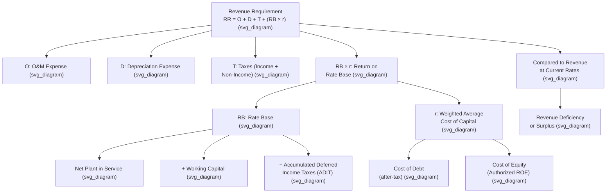

## The Revenue Requirement Formula and Its Components

### Definition and Purpose

The **revenue requirement** is the total amount of revenue a regulated utility must collect from ratepayers to recover its prudently incurred operating costs and to earn a fair return on its invested capital, as determined under the cost-of-service ratemaking methodology used by most U.S. state commissions and by FERC for jurisdictional wholesale and transmission rates. The revenue requirement is the central analytical output of a rate case: once determined, it is translated (through the rate design and cost allocation process) into the specific rate schedules charged to each customer class.

### The Basic Revenue Requirement Formula

The canonical cost-of-service revenue requirement formula is typically expressed as:

$$RR = O + D + T + (RB \times r)$$

Where:

- $RR$ = Total Revenue Requirement
- $O$ = Operating and Maintenance (O&M) Expenses
- $D$ = Depreciation Expense
- $T$ = Taxes (income taxes and taxes other than income taxes)
- $RB$ = Rate Base
- $r$ = Authorized Rate of Return (weighted average cost of capital)

This formula reflects the structural logic established by the Bluefield/Hope line of ratemaking doctrine: the utility recovers its actual cost of providing service ($O + D + T$) plus a fair return ($RB \times r$) on the capital it has prudently invested to provide that service, consistent with the substantive fair-return criteria (comparable earnings, capital attraction, financial integrity) articulated in *Bluefield Waterworks & Improvement Co. v. Public Service Commission*, 262 U.S. 679 (1923).

### Component 1: Operating and Maintenance (O&M) Expenses

O&M expense represents the utility's day-to-day cost of operating and maintaining its system, excluding depreciation, taxes, and capital costs. Major O&M subcategories typically include:

- **Fuel and purchased power costs** (electric) or **cost of gas** (natural gas) — often the single largest O&M category, frequently addressed through a separate fuel or purchased gas adjustment clause outside the base rate case.
- **Production, transmission, and distribution O&M** — labor, materials, and contractor costs to operate and maintain generation, transmission, and distribution facilities, organized under corresponding FERC Uniform System of Accounts categories.
- **Customer service and accounts expense** — billing, metering, customer service call centers, and collections.
- **Administrative and general (A&G) expenses** — corporate overhead, executive compensation, legal, and regulatory expenses, including rate case expense itself (often amortized rather than expensed in full, as discussed in connection with regulatory assets).

**[Inference]** O&M expense is subject to extensive prudence review in contested rate cases, since commissions and intervenors routinely scrutinize whether specific O&M categories (executive compensation, lobbying and advertising costs, charitable contributions, certain affiliate transaction charges) are properly includable in cost of service, as opposed to being borne by shareholders rather than ratepayers.

### Component 2: Depreciation Expense

Depreciation expense represents the systematic allocation of the original cost of utility plant to expense over the asset's estimated useful life, reflecting the using-up of the asset's service potential. Depreciation expense in the revenue requirement is typically:

- **Based on depreciation studies** — periodic engineering and actuarial analyses estimating remaining useful lives and net salvage values for major plant categories, used to derive depreciation rates.
- **Calculated using regulatory (ratemaking) depreciation conventions** — which may differ from GAAP book depreciation and will almost certainly differ from accelerated tax depreciation, as discussed in connection with regulatory accounting differences.
- **A mechanism for capital recovery** — depreciation expense is the vehicle through which the utility's original capital investment is returned to it over time (as distinct from the separate return *on* that investment, represented by the rate base times rate of return component).

### Component 3: Taxes

The tax component of the revenue requirement includes two distinct categories:

- **Taxes other than income taxes** — property taxes, payroll taxes, gross receipts taxes, and other non-income levies, generally treated as a straightforward pass-through operating cost.
- **Income tax expense** — federal and state income taxes calculated on the utility's regulatory taxable income, a considerably more complex component due to the interaction between accelerated tax depreciation and straight-line book/regulatory depreciation, which generates the deferred income tax balances discussed in connection with rate base treatment below. Utilities generally use **normalization** accounting for these timing differences (required by federal tax law for certain accelerated depreciation benefits), spreading the tax benefit of accelerated depreciation over the life of the asset for ratemaking purposes rather than passing the full current-year tax savings through to ratepayers immediately (the alternative "flow-through" method).

### Component 4: Rate Base

**Rate base** represents the value of the utility's invested capital devoted to providing regulated service, upon which the utility is entitled to earn its authorized rate of return. Rate base is typically calculated as:

$$RB = \text{Gross Plant in Service} - \text{Accumulated Depreciation} + \text{Working Capital} - \text{Accumulated Deferred Income Taxes (ADIT)} \pm \text{Other Additions/Deductions}$$

Key rate base components include:

- **Net Plant in Service** — gross utility plant at original cost, less accumulated depreciation, representing the largest single rate base component for most utilities.
- **Construction Work in Progress (CWIP)** — generally excluded from rate base until the associated plant is "used and useful" (placed in service), per the doctrine discussed in *Duquesne Light Co. v. Barasch*, 488 U.S. 299 (1989), though some jurisdictions allow limited CWIP inclusion for specific categories of investment.
- **Working Capital Allowance** — funds needed to cover the lag between when the utility pays its operating expenses and when it collects corresponding revenue from customers, often calculated via a formula-based lead-lag study or a simplified percentage-of-O&M convention.
- **Materials and Supplies Inventory** — the value of inventory held to support ongoing operations.
- **Less: Accumulated Deferred Income Taxes (ADIT)** — a rate base *reduction*, reflecting the principle that the deferred tax liability arising from accelerated tax depreciation represents a cost-free source of capital effectively provided by the government (via deferred tax payments) rather than by investors, and should not itself earn a return.
- **Less: Customer Deposits and Contributions in Aid of Construction** — other cost-free capital sources similarly excluded from the earning rate base.

### Component 5: Rate of Return

The authorized **rate of return** ($r$) applied to rate base is the utility's weighted average cost of capital (WACC), blending the cost of debt and the cost of equity according to the utility's authorized capital structure:

$$r = (w_d \times k_d \times (1-t)) + (w_e \times k_e)$$

Where $w_d$ and $w_e$ are the weighted proportions of debt and equity in the capital structure, $k_d$ is the embedded cost of debt, $t$ is the effective tax rate (applied to debt cost since interest is tax-deductible), and $k_e$ is the authorized cost of equity (ROE), determined via DCF, CAPM, comparable earnings, and risk premium analyses consistent with the Bluefield/Hope fair-return criteria.

### Illustrative Numerical Example

**Example**: A utility's rate case filing includes the following components:

| Component | Amount |
| --- | --- |
| O&M Expense | $180 million |
| Depreciation Expense | $95 million |
| Taxes Other Than Income Taxes | $25 million |
| Income Tax Expense | $40 million |
| **Total Cost of Service (excl. return)** | **$340 million** |
| Rate Base | $2,000 million |
| Authorized Rate of Return (WACC) | 7.5% |
| **Return Component (RB × r)** | **$150 million** |
| **Total Revenue Requirement** | **$490 million** |

If the utility's current rates are generating $460 million in test-year revenue at existing rate levels, the calculated **revenue deficiency** would be $30 million ($490 million required minus $460 million currently collected), representing the size of the rate increase the utility would need to justify in its filing, subject to the full contested rate case review process described elsewhere (commission staff review, intervenor testimony, evidentiary hearing, and final order).

### Interaction with Test Year Methodology

**[Inference]** The specific numerical values plugged into each component of the revenue requirement formula depend heavily on the test year methodology used — historical, fully forecasted/future, or a hybrid — since the formula's components (O&M, depreciation, rate base, capital structure) are all measured as of, or projected for, the applicable test year period, with known and measurable adjustments applied to historical test years to reflect changes expected to occur before new rates take effect.

### Key Points

- The revenue requirement formula, $RR = O + D + T + (RB \times r)$, is the foundational cost-of-service ratemaking equation used across most U.S. state and federal utility rate proceedings.
- O&M expense and depreciation expense represent recovery of the utility's actual operating costs and capital cost allocation, respectively, while the rate base times rate of return component represents the fair-return element required by Bluefield/Hope doctrine.
- Rate base is derived from net plant in service plus working capital and other additions, less accumulated deferred income taxes and other cost-free capital sources, reflecting the principle that only investor-supplied capital should earn a return.
- The rate of return applied is the utility's weighted average cost of capital, blending after-tax cost of debt and authorized cost of equity according to the approved capital structure.
- The difference between the calculated revenue requirement and revenue at current rates determines the revenue deficiency (or surplus) that drives the utility's requested rate change.

### Diagram: Revenue Requirement Formula Structure (svg_diagram)

### Related Topics

- **Bluefield Waterworks v. Public Service Commission** — doctrinal basis for the fair-return component
- **Duquesne Light Co. v. Barasch** — used-and-useful limits on rate base inclusion (CWIP treatment)
- **Rate Base Determination and Components** — detailed treatment of ADIT and working capital
- **Cost of Capital: DCF, CAPM, and Comparable Earnings Methods**
- **Test Year Methodology** — historical, future, and hybrid approaches
- **Capitalization Policy: Capital vs. Expense** — determining what enters O&M versus rate base
- **Tax Normalization and Accumulated Deferred Income Taxes**