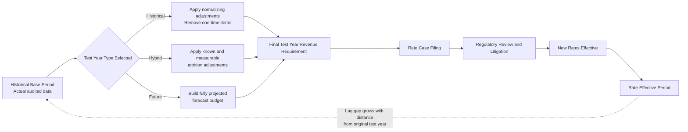

## Test Year Selection: Historical, Future, and Hybrid

### Definition and Purpose

A test year is the twelve-month period whose revenues, expenses, and rate base a regulator uses to calculate a utility's revenue requirement in a rate case. Because rates set in a proceeding will apply prospectively for months or years after the case concludes, the test year functions as a representative snapshot intended to approximate the cost and revenue conditions the utility will actually experience while the new rates are in effect. The selection of test year methodology materially affects the revenue requirement outcome, the burden of proof on the utility, and the degree of regulatory lag experienced by the company.

### The Regulatory Lag Problem

Test year selection exists primarily to manage regulatory lag: the time gap between when a utility incurs a cost (or makes an investment) and when that cost is reflected in rates paid by customers. A rate case using data from a period too far in the past risks setting rates that under-recover a utility's actual current costs, especially during periods of inflation, rising capital costs, or rapid infrastructure investment. Conversely, using highly speculative future data risks over-recovery if projections do not materialize, shifting the risk of forecast error onto ratepayers. Each test year type below represents a different point on the spectrum between historical certainty and forward-looking relevance.

### Historical Test Year

**Key Points**

- Uses actual, audited financial and operating data from a completed twelve-month period, typically the most recently ended fiscal year before the case filing
- May be used on an unadjusted ("as-is") basis or, more commonly, a normalized/adjusted basis
- Considered the most conservative and verifiable approach because all data points are known, actual, and auditable

**Adjusted Historical Test Year**

Regulators rarely rely on raw historical data without modification. Two categories of adjustments are standard:

- **Normalizing adjustments**: Remove the effects of unusual, non-recurring, or distorting events from the historical period (e.g., an unusually mild winter reducing heating revenue, a one-time storm restoration expense, an extraordinary litigation settlement) so the test year reflects a "normal" operating year.
- **Known and measurable (pro forma) adjustments**: Update historical data for changes that occurred, or are certain to occur, within a defined window after the historical period ends but are objectively verifiable (e.g., a wage increase already contractually obligated, a new facility placed in service, a debt refinancing at a known rate). This is sometimes called a historical test year with a "known and measurable" or "attrition" adjustment period.

**Example**

A utility files a case in early 2027 using calendar year 2026 as its historical test year. During 2026, an unusually severe ice storm caused $4 million in unbudgeted restoration expense. The regulator normalizes this out, replacing it with a multi-year rolling average storm expense of $1.2 million, on the theory that storms recur but any single year's magnitude is not representative.

**Advantages**

- Data is fully auditable; no dispute over whether the underlying numbers actually occurred
- Reduces incentive for utilities to inflate forecasts, since there is no forecast to inflate
- Lower administrative and litigation burden, since parties are arguing over adjustments to known facts rather than the accuracy of a projection

**Disadvantages**

- In inflationary or high-growth environments, historical costs may be materially lower than costs actually incurred once new rates take effect, extending the regulatory lag utilities experience
- Provides limited incentive for capital investment if a utility cannot recover costs on new plant until a future case incorporates that plant into a new historical base

### Future (Fully Projected/Forecasted) Test Year

**Key Points**

- Uses forecasted or budgeted data for a twelve-month period that has not yet occurred, typically beginning some months after the case is filed and running through the period when new rates will be in effect
- Sometimes called a "fully projected future test year" (FPFTY) or "forecast test year"
- Requires the utility to build detailed forward-looking budgets for revenues, O&M expense, rate base additions, and capital structure, generally supported by expert testimony and workpapers

**Example**

A utility files a case in mid-2026 proposing rates effective January 2028, using calendar year 2028 as the future test year. The utility's forecast includes a specific substation upgrade planned for completion in Q3 2027, projected fuel costs based on forward market curves, and a projected customer count growth rate of 1.8% derived from service territory demographic studies.

**Advantages**

- Better matches the cost and revenue conditions actually in effect during the rate-effective period, reducing regulatory lag
- Allows recovery of costs associated with known, planned capital investment before it is fully in service, which can be important for capital-intensive utilities undertaking large infrastructure programs
- May improve a utility's financial metrics and credit profile by reducing the lag between investment and recovery, which can lower the utility's cost of capital

**Disadvantages**

- Shifts forecast risk onto ratepayers if projections prove too high, since a utility recovers the forecast amount regardless of what it actually spends or earns
- Requires intensive regulatory scrutiny of assumptions, growth rates, and cost projections, increasing litigation cost and case duration
- Creates asymmetric incentive concerns: a utility may have incentive to forecast generously since typically no automatic true-up occurs (absent a specific reconciliation mechanism)
- Some jurisdictions prohibit or restrict use of a future test year by statute, viewing speculative rate-setting as inconsistent with cost-of-service ratemaking principles

**[Inference]** Because acceptance of future test years varies significantly by jurisdiction and is often set by statute or long-standing commission precedent rather than uniform practice, any claim about which regulators permit or favor a fully projected future test year should be verified against the specific jurisdiction's current rules, as this is a matter of state-specific law subject to legislative change.

### Hybrid Test Year (Historical Base Year Plus Adjustment/Attrition Period)

**Key Points**

- Combines an actual historical base period with a forward adjustment (or "attrition") period, projecting forward from known historical data using specific, documented changes rather than an entirely re-forecast budget
- Sometimes structured as a historical base year plus a partially projected year, or historical year plus a stated number of pro forma adjustment months
- Represents a middle ground: it retains the auditability of historical data as its foundation while updating for changes that are reasonably certain

**Structural Variants**

- **Base year + attrition year**: Historical base year data is trended forward one additional year using specific, itemized adjustments (known capital additions, contracted wage increases, tax law changes) rather than a full re-forecast of every line item.
- **Partially projected test year**: A test year that begins partway through the historical record and extends into a partially forecasted period, blending actual months with projected months within the same twelve-month test year.
- **Multiple known and measurable adjustment layers**: Some jurisdictions permit successive layers of adjustments (Year 0 actual, Year 1 known and measurable, sometimes Year 2 known and measurable) creating a de facto hybrid without formally naming it a "future test year."

**Example**

A utility uses 2026 actual data as its base year. It then applies a documented attrition adjustment reflecting a new water treatment plant scheduled to enter service in March 2027 (with a known, contracted construction cost and in-service date), a union wage increase effective January 2027 under an existing collective bargaining agreement, and updated property tax assessments already issued by the local assessor. Each adjustment is tied to a specific, verifiable, dated event rather than a generalized growth trend.

**Advantages**

- Balances lag reduction against forecast risk more evenly than a pure historical or pure future test year
- Adjustments are narrower and more targeted, making them easier for a regulator or intervenor to verify against source documents (contracts, tariff filings, capital budgets) than a full re-forecast
- Often the default or statutorily preferred approach in jurisdictions wary of open-ended future test years but seeking to address lag

**Disadvantages**

- Still requires litigation over what counts as sufficiently "known and measurable" to qualify for inclusion, which can itself become a significant point of contention
- Selective application of adjustments (only adding cost increases without corresponding revenue or efficiency offsets, sometimes called "single issue" or "one-way" attrition) can be criticized by intervenors as asymmetric and unfairly weighted toward the utility

### Comparison of Approaches

| Dimension | Historical | Future | Hybrid |
| --- | --- | --- | --- |
| Data source | Actual, audited | Forecasted | Actual base + specific projected adjustments |
| Regulatory lag | Highest | Lowest | Moderate |
| Forecast risk borne by ratepayers | Minimal | Highest | Moderate, limited to itemized adjustments |
| Verifiability / audit burden | High | Low (relies on assumption review) | Moderate |
| Typical use case | Jurisdictions with statutory restriction on forecasts; stable-cost utilities | Capital-intensive utilities in high-growth or high-inflation conditions, where permitted | Common default compromise across many U.S. state commissions |

### Test Year Selection in the Broader Rate Case Timeline

### Relationship to Rate Base and Known-and-Measurable Standards

Test year selection interacts directly with rate base determination, since the test year defines which plant-in-service, accumulated depreciation, and working capital balances are used in the rate base calculation. A future or hybrid test year that includes projected capital additions requires the utility to demonstrate that such plant will, in fact, be "used and useful" in serving customers by the time rates take effect; regulators applying a strict used-and-useful standard may disallow projected plant that is not sufficiently certain to be in service, regardless of which test year methodology is nominally chosen. The "known and measurable" standard applied in hybrid test years is not a fixed statutory formula in most jurisdictions but a body of commission precedent, and its application can vary case by case based on the specificity and reliability of supporting evidence.

**[Inference]** Because "known and measurable" is generally a standard developed through commission orders and case law rather than a uniformly codified test, the precise threshold of evidentiary certainty required will vary by jurisdiction and by commission, and utilities should confirm the applicable standard through current commission precedent rather than assuming uniformity across states.

### Practical Considerations in Test Year Litigation

- **Burden of proof**: In most jurisdictions, the utility bears the burden of demonstrating that its proposed test year and associated adjustments are just and reasonable; a future test year generally invites more intense discovery into underlying assumptions than a historical test year.
- **Update periods and rebuttal test years**: Intervenors (consumer advocates, industrial customer groups) may propose an alternative test year or challenge specific adjustments, sometimes offering a competing "rebuttal" test year with different normalization assumptions.
- **True-up and reconciliation mechanisms**: Some jurisdictions pair a future or hybrid test year with a subsequent reconciliation proceeding that compares actual results to forecast and adjusts a future period's rates to correct for over- or under-recovery, mitigating the forecast risk concern associated with future test years.
- **Multi-year rate plans**: Test year selection also interacts with multi-year rate plans (MYRPs) or formula rate plans, where a single test year's revenue requirement is used as a starting point that then escalates via an index or pre-approved formula for subsequent years, reducing the need to select a fresh test year in every annual filing.

### Related Topics

- Known and Measurable Adjustments and Pro Forma Ratemaking
- Attrition Relief and Attrition Adjustments
- Used and Useful Standard for Rate Base Inclusion
- Multi-Year Rate Plans and Formula Rate Mechanisms
- Regulatory Lag and Its Effect on Utility Cost of Capital
- Normalization Adjustments (Weather, Non-Recurring Items)
- Reconciliation and True-Up Mechanisms
- Construction Work in Progress (CWIP) and AFUDC Treatment