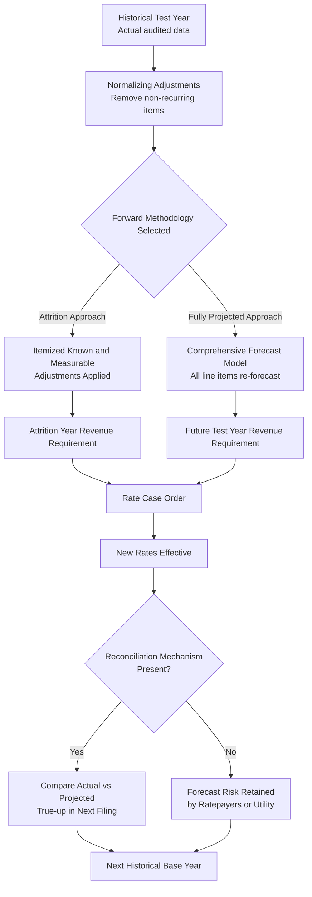

## Attrition Years and Forecasted Test Years

### Definition and Purpose

Attrition years and forecasted test years are mechanisms regulators and utilities use to project a revenue requirement forward beyond the last period of actual, audited data. Both address the same underlying problem — regulatory lag caused by rising costs, growing rate base, or declining sales density — but they differ in methodology, evidentiary standard, and the degree of forecast risk transferred to ratepayers. This item builds directly on test year selection by examining, in depth, the mechanics of the forward-looking adjustment period (attrition) and the fully projected forecast approach, including how each is calculated, litigated, and reconciled.

### The Attrition Concept

"Attrition" in ratemaking refers to the tendency of a utility's earned rate of return to erode over time between rate cases, even when authorized rates were originally set to produce an adequate return. This erosion typically occurs because:

- Rate base (plant in service) grows faster than revenues, particularly for utilities in a heavy capital investment cycle (e.g., grid modernization, water main replacement, generation retirement and replacement)
- O&M expenses rise with inflation and labor costs while sales volumes remain flat or decline due to conservation, efficiency programs, or economic conditions
- Depreciation expense increases as new plant is added, without a corresponding rate increase to match
- Customer growth is slower than the rate of capital spending per existing customer

An **attrition year** (or attrition adjustment period) is a defined forward period — commonly one year beyond the historical test year — during which the utility applies documented, itemized adjustments to historical data to approximate the revenue requirement attrition will produce, without constructing an entirely new forecast budget from scratch.

### Mechanics of an Attrition Adjustment

**Key Points**

- Begins from an adjusted historical base year (post-normalization)
- Layers on specific, itemized, "known and measurable" changes expected to occur within the attrition period
- Does not re-forecast every revenue and expense line item; only identified changes are adjusted
- Commonly limited to a defined window (e.g., 6, 9, or 12 months beyond the test year end, or through the expected effective date of new rates)

**Typical categories of attrition adjustments**:

1. **Plant additions**: Specific capital projects with known in-service dates and cost estimates supported by capital budgets or board-approved spending authorizations
2. **Depreciation expense changes**: Recalculated depreciation reflecting the plant additions above, using currently approved depreciation rates
3. **Payroll and benefit cost changes**: Wage increases under existing labor contracts, scheduled benefit cost escalations, or known headcount changes
4. **Property tax and other ad valorem tax changes**: Based on actual assessments already issued or clearly scheduled statutory rate changes
5. **Debt cost changes**: Known refinancing, new debt issuances at contracted rates, or maturities already scheduled
6. **Customer growth adjustments**: Incremental revenue from a documented, historically consistent rate of new customer additions (more contested than the categories above, since it requires some degree of extrapolation)

**Example**

A water utility's historical base year (2026) showed a rate base of $180 million and net operating income of $9 million. In the attrition year adjustment (through mid-2027), the utility documents: a $12 million treatment plant expansion entering service in April 2027 (board-approved, under construction contract), a 3% wage increase effective January 2027 under its existing union agreement, and a property tax reassessment already issued by the county increasing ad valorem tax by $340,000. Each adjustment is supported by a contract, board resolution, or government notice — not a general trend line.

**Formula structure for an attrition adjustment to rate base**:

$$RB_{attrition} = RB_{base} + \sum_{i=1}^{n} PlantAddition_i - \sum_{i=1}^{n} Retirement_i - \Delta AccumulatedDepreciation$$

Where each $PlantAddition_i$ must independently satisfy the known-and-measurable standard (documented cost, documented in-service date) to be includable.

### Fully Projected Future Test Year (Contrast and Overlap)

Where an attrition year takes a historical base and adjusts it with itemized known changes, a **fully projected future test year** constructs an entire forward-looking budget — every revenue and expense line item is forecast, not just the ones tied to specific, documented events. This is a difference of degree and evidentiary standard rather than a difference in ultimate objective; both aim to reduce lag by moving the revenue requirement calculation closer to the rate-effective period.

**Key distinguishing characteristics of a fully projected test year**:

- Sales forecasts are built using econometric or statistical models (regression on weather-normalized historical sales, customer count projections, economic indicators, appliance saturation studies) rather than being held flat from history
- Expense budgets reflect the utility's internal operating budget for the forecast period, including escalation factors applied broadly across cost categories, not only to specific documented events
- Capital budgets reflect planned, but not necessarily contractually committed, capital programs
- Requires substantially more expert testimony (load forecasting experts, econometric modeling witnesses) and is subject to more extensive discovery into modeling assumptions

**Example**

A utility filing with a 2028 future test year builds its revenue forecast using a multivariate regression model incorporating historical weather-normalized usage, projected customer growth of 1.5% (derived from a demographic consulting study), and a price elasticity adjustment reflecting expected conservation from a new efficiency program. Its O&M budget applies a 3.2% general inflation escalator to all non-labor expense categories based on the company's approved corporate budget, distinct from the itemized, event-specific adjustments used in an attrition approach.

### Comparison: Attrition Adjustment vs. Fully Projected Test Year

| Dimension | Attrition Year | Fully Projected Future Test Year |
| --- | --- | --- |
| Starting point | Actual historical base year | No fixed actual base required (forecast can be built independently) |
| Adjustment method | Itemized, event-specific, documented | Comprehensive, model-driven, budget-based |
| Evidentiary standard | Known and measurable (higher certainty required) | Reasonable and reliable forecast (lower certainty threshold, more judgment-based) |
| Scope of adjustment | Limited to identified categories | All revenue and expense line items |
| Litigation focus | Whether each item is sufficiently certain/documented | Whether forecast methodology and assumptions are reasonable |
| Forecast risk to ratepayers | Lower (bounded to specific items) | Higher (embedded across entire budget) |

### Interaction with Multi-Year Rate Plans

Attrition mechanisms are frequently embedded within multi-year rate plans (MYRPs), where a base year revenue requirement is set in a full rate case and then escalated in subsequent "off years" using a simplified attrition-style formula rather than a full new rate case. This avoids the cost and administrative burden of annual full rate proceedings while still addressing lag.

**Common formulaic attrition escalators used in MYRPs**:

$$RevenueRequirement_{Year_t} = RevenueRequirement_{Year_{t-1}} \times (1 + Escalator_t) + PlantAdditionAdjustment_t$$

Where $Escalator_t$ may be tied to a published inflation index (e.g., a regional CPI or a utility-specific cost index), sometimes offset by a productivity factor (an "X-factor," conceptually similar to those used in price-cap regulation) intended to capture expected efficiency gains.

**[Inference]** The specific escalation index, productivity offset, and whether plant additions are trued up against actual spending varies significantly by jurisdiction and by the specific MYRP settlement or statute governing that utility, so any generic escalator formula should be treated as illustrative rather than as a description of a specific, currently governing mechanism.

### Reconciliation and True-Up Mechanisms

Because both attrition years and fully projected test years rely on forward estimates rather than fully realized actuals, many jurisdictions pair them with a reconciliation process:

- **Attrition true-up**: At the end of the attrition period, actual results are compared to the projected attrition adjustments; discrepancies may be addressed in the next rate case's historical base year or through a formal reconciliation filing
- **Revenue decoupling mechanisms**: Often used alongside attrition or forecasted test years to sever the link between a utility's revenue and its sales volume, addressing one of the root causes of attrition (declining usage per customer) independently of the test year mechanism itself
- **Earnings sharing mechanisms**: In some MYRPs, if actual earned return exceeds a specified band around the authorized return, a portion of the excess is shared with or refunded to customers, and if it falls below a band, a surcharge may be applied — this bounds the risk transferred by attrition-based escalation

### Process Flow: From Historical Base to Rate-Effective Revenue Requirement

### Litigation and Burden of Proof Considerations

- **Specificity requirement**: Commissions generally require attrition adjustments to be tied to a specific, identifiable event with documentary support (a signed contract, a capital authorization request, a government tax notice) rather than a generalized trend extrapolation; adjustments that merely project historical growth rates forward without a specific triggering event are more vulnerable to challenge and may be characterized as impermissible "trending" rather than a valid known-and-measurable adjustment.
- **Offsetting adjustments**: Intervenors frequently argue that if a utility proposes attrition adjustments increasing costs, symmetrical adjustments reducing costs or increasing revenue (e.g., customer growth revenue, cost efficiencies, or expiring costs) must also be included to avoid a one-sided, "single-issue" attrition adjustment.
- **Cutoff dates**: Regulatory procedural schedules typically impose a firm cutoff date after which no further known-and-measurable adjustments may be introduced into the record, to allow adequate time for discovery and rebuttal testimony before hearings.
- **Forecast reasonableness standard for future test years**: Commissions reviewing a fully projected test year generally apply a "best information reasonably available at the time" standard rather than requiring certainty, since a forecast test year by definition involves some degree of estimation; the degree of deference given to utility forecasts versus intervenor alternative forecasts varies by jurisdiction and by commission panel.

**[Inference]** Because standards for what qualifies as sufficiently "specific" or "documented" for attrition adjustments are established through individual commission orders and precedent rather than a single uniform national rule, practitioners should confirm current standards against the specific commission's recent orders rather than assuming consistency across jurisdictions.

### Related Topics

- Test Year Selection: Historical, Future, and Hybrid
- Multi-Year Rate Plans and Formula Rate Mechanisms
- Revenue Decoupling and Lost Revenue Adjustment Mechanisms
- Earnings Sharing Mechanisms and Return Bands
- Known and Measurable Standard in Pro Forma Ratemaking
- Load Forecasting Methodologies for Utility Ratemaking
- Regulatory Lag and Cost of Capital Implications
- Price-Cap Regulation and Productivity (X-Factor) Offsets