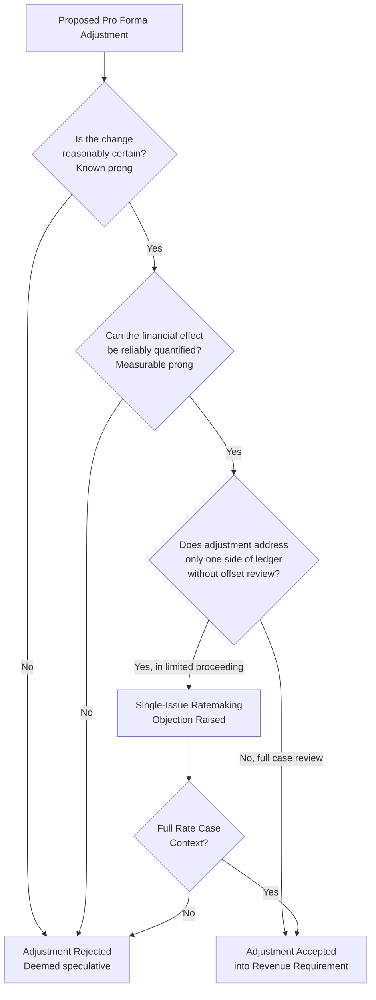

## Pro Forma and Known and Measurable Adjustments

### Definition and Purpose

Pro forma adjustments modify test year data to reflect changes that are known to have occurred or to be certain to occur, even though they fall outside the strict boundaries of the historical or forecast period as originally recorded. The "known and measurable" standard is the evidentiary threshold most U.S. jurisdictions apply to determine which adjustments are admissible: an adjustment must be both (1) reasonably certain to occur ("known") and (2) capable of reasonably precise quantification ("measurable"). This item examines the standard in depth as the connective mechanism underlying both historical test year normalization and attrition-year adjustments discussed elsewhere in this chapter.

### The Known and Measurable Standard

**Key Points**

- Developed primarily through commission orders and case precedent rather than a single uniform statutory text, though some states have codified versions of the standard
- Serves as a gatekeeping test: an adjustment that fails either prong (not sufficiently certain, or not capable of reliable quantification) is typically excluded from the revenue requirement calculation
- Applied symmetrically in principle to both cost-increasing and cost-decreasing (or revenue-increasing) adjustments, though in practice disputes often arise over whether the standard is being applied evenhandedly

**The two prongs, examined separately**:

1. **"Known" (certainty prong)**: The change must not be speculative. Evidence commonly accepted as satisfying this prong includes signed contracts, board-approved capital authorizations, executed labor agreements, government tax assessments already issued, regulatory or legislative changes already enacted, and completed transactions (e.g., a debt issuance that has already closed). Evidence commonly rejected as failing this prong includes general economic trend projections, budgeted-but-not-yet-approved capital projects, and management's subjective expectation of future events without documentary support.
2. **"Measurable" (quantification prong)**: The financial effect must be capable of calculation with reasonable precision, not merely order-of-magnitude estimation. A signed union contract with a specified percentage wage increase and effective date is measurable; a general statement that "labor costs are expected to rise" is not.

**[Inference]** Because the precise evidentiary bar for each prong is established case by case through commission orders rather than a single codified rule in most jurisdictions, the specific documents or level of certainty a given commission will accept should be confirmed against that commission's recent orders rather than assumed uniform across states.

### Categories of Pro Forma Adjustments

**Normalizing adjustments** (addressed in the test year selection item) remove distortions from the historical record — unusual weather, one-time events, non-recurring litigation costs — to reflect a "normal" operating year. These are, in effect, a special category of known-and-measurable adjustment applied retrospectively to historical data rather than prospectively to a future period.

**Annualizing adjustments** restate a partial-period event as if it had been in effect for the entire test year. This is distinct from a full pro forma projection because it does not extend beyond the test year's own boundaries — it corrects for timing distortion within the test year itself.

**Example (annualizing adjustment)**: A utility implemented a new billing system on July 1 of the historical test year, reducing customer service labor costs by $50,000/month going forward. Rather than reflecting only six months of savings ($300,000) in the test year as actually recorded, an annualizing adjustment restates the full test year as if the system had been operating for all twelve months, imputing the full $600,000 in annual savings.

**Post-test-year (pro forma) adjustments** extend beyond the test year's own end date into a defined future window, incorporating known and measurable changes not yet reflected in the historical record at all. This is the category most closely associated with attrition-year mechanics.

**Example (post-test-year adjustment)**: The same utility, filing with a calendar 2026 historical test year, includes a pro forma adjustment for a new substation with a signed construction contract and a guaranteed in-service date of March 2027, incorporating the associated capital cost, depreciation expense, and property tax into the test year revenue requirement even though the asset did not exist during 2026.

### Rate Base vs. Income Statement Pro Forma Adjustments

Pro forma adjustments apply to both sides of the revenue requirement calculation, and each side has characteristic adjustment types:

**Rate base adjustments**:

- Plant additions and retirements with known in-service/retirement dates
- Changes in accumulated depreciation resulting from the above
- Working capital adjustments (e.g., a documented change in required cash working capital from a lead-lag study)
- Construction work in progress (CWIP) inclusion or exclusion, depending on jurisdictional treatment

**Operating income statement adjustments**:

- Wage and benefit changes under executed labor agreements
- Depreciation expense changes tied to plant addition adjustments
- Property and other tax changes based on issued assessments or enacted rate changes
- Debt cost changes from completed refinancing or new issuances at contracted rates
- Fuel or purchased power cost changes where a specific, executed supply contract exists

### Illustrative Calculation

$$RevenueRequirement_{ProForma} = RevenueRequirement_{Historical} + \sum_{i=1}^{n} KMAdjustment_i$$

Where each $KMAdjustment_i$ independently satisfies both prongs of the known-and-measurable standard. A commission reviewing the case will typically evaluate each $KMAdjustment_i$ individually rather than accepting or rejecting the pro forma adjustment package as a whole, meaning a utility may prevail on some proposed adjustments while losing others within the same filing.

**Example (mixed outcome)**

A utility proposes three pro forma adjustments: (1) a wage increase under an executed union contract, effective and quantified; (2) a new IT system cost based on an internal budget estimate not yet under contract; (3) a property tax increase based on an assessment notice already received from the county. A commission may accept adjustments (1) and (3) as known and measurable while rejecting (2) as insufficiently certain, since the IT system lacks an executed contract and its cost estimate could change materially before implementation.

### Single-Issue Ratemaking Concerns

A recurring objection to pro forma adjustments, particularly outside a full base rate case, is that they constitute impermissible **single-issue ratemaking** — adjusting one component of the revenue requirement (typically a cost increase) without a comprehensive review of all other components that might offset it (such as declining costs elsewhere, revenue growth, or improved margins on other services). Many jurisdictions restrict pro forma or attrition-style adjustments to full rate case proceedings specifically to prevent this asymmetry, requiring that any accepted known-and-measurable increase be considered alongside a complete review of the utility's overall earnings position rather than in isolation.

### Documentary Evidence Hierarchy

The following reflects a generally accepted (though not universally codified) hierarchy of documentary support, from strongest to weakest, commonly relied upon in known-and-measurable determinations:

1. Fully executed contracts with fixed pricing and defined delivery/completion dates
2. Government-issued notices (tax assessments, enacted statutory rate changes, regulatory orders already issued)
3. Board-approved capital authorizations with detailed engineering cost estimates
4. Signed labor agreements with defined wage schedules
5. Company-internal budgets or forecasts without external contractual commitment
6. General trend extrapolations or industry benchmarking studies

Items 1 through 4 are typically treated as satisfying both prongs of the standard in most jurisdictions; items 5 and 6 are the most frequently challenged and rejected, particularly item 6, which is generally viewed as characteristic of a fully projected future test year forecast rather than a valid known-and-measurable pro forma adjustment.

### Adjustment Evaluation Process

### Procedural Considerations

- **Adjustment period cutoff**: Most jurisdictions establish a firm date after which no new known-and-measurable adjustments may be introduced, to preserve adequate time for intervenor discovery and rebuttal testimony before evidentiary hearings.
- **Burden of proof**: The utility proposing a pro forma adjustment generally bears the burden of demonstrating that it satisfies both prongs of the standard; failure to produce adequate documentary support typically results in exclusion of the adjustment rather than partial acceptance.
- **Updating through the proceeding**: Some jurisdictions permit updated known-and-measurable adjustments as new information becomes available during the case (e.g., an updated construction cost once a project is completed), while others hold adjustments to the values proposed at filing, subject to the adjustment period cutoff.
- **Interaction with settlement negotiations**: In practice, many pro forma adjustment disputes are resolved through negotiated settlements rather than full litigation and commission adjudication, particularly where the dollar amounts at issue are relatively small compared to the overall revenue requirement.

**[Inference]** Because settlement practices and procedural rules governing adjustment cutoffs vary by commission and by case, and are frequently updated through procedural orders specific to each docket, current procedural requirements should be confirmed against the specific jurisdiction's rules of practice and procedure rather than assumed to follow a universal pattern.

### Related Topics

- Test Year Selection: Historical, Future, and Hybrid
- Attrition Years and Forecasted Test Years
- Used and Useful Standard for Rate Base Inclusion
- Single-Issue Ratemaking and Full Rate Case Requirements
- Lead-Lag Studies and Cash Working Capital
- Construction Work in Progress (CWIP) and AFUDC Treatment
- Normalization of Weather and Non-Recurring Expenses
- Burden of Proof Standards in Utility Rate Proceedings