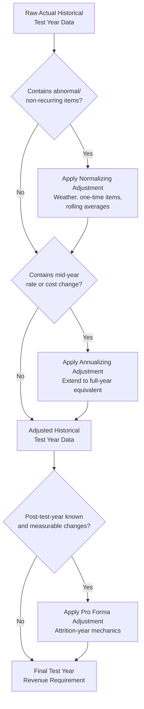

## Normalizing and Annualizing Test Year Data

### Definition and Purpose

Normalizing and annualizing are two distinct adjustment techniques applied to test year data to correct for distortions that would otherwise cause the revenue requirement to misrepresent the utility's ongoing, representative cost and revenue conditions. Both operate on the data already contained within the test year period itself, distinguishing them from post-test-year pro forma adjustments (covered elsewhere in this chapter), which extend the analysis beyond the test year's own boundaries. Normalizing addresses distortions caused by abnormal or non-recurring conditions; annualizing addresses distortions caused by the timing of a mid-period change.

### Normalizing Adjustments

**Key Points**

- Removes or adjusts the effect of unusual, abnormal, or non-recurring items that occurred during the test year, so the resulting data reflects a "normal" or "representative" operating year
- Applied to both revenue and expense line items
- Grounded in the principle that rates should be based on ongoing, recurring cost and revenue relationships, not on the idiosyncrasies of a single historical period

**Common categories requiring normalization**:

1. **Weather normalization**: Adjusts revenue and, where applicable, certain weather-sensitive expenses (e.g., fuel for heating-related generation) to reflect what would have occurred under long-term average ("normal") weather conditions rather than the actual weather experienced during the test year.
2. **Non-recurring expense normalization**: Removes one-time costs such as an unusual litigation settlement, a major storm restoration expense, or a one-time regulatory penalty, and may replace them with a normalized ongoing estimate (e.g., a multi-year rolling average).
3. **Non-recurring revenue normalization**: Removes unusual revenue spikes, such as a one-time large industrial customer contract, a one-time transmission service sale, or an unusual off-system sale, so recurring base revenues are not overstated.
4. **Vacancy and payroll normalization**: Adjusts payroll expense for unusually high or low staff vacancy rates during the test year, reflecting a normalized, ongoing staffing level.
5. **Rate case expense normalization**: Amortizes the utility's own costs of prosecuting the rate case (legal fees, expert witness fees, regulatory consulting) over a period of years rather than recognizing the full cost within the single test year in which it was incurred.

**Weather Normalization Methodology**

Weather normalization typically relies on statistical regression of historical usage against heating degree days (HDD) and cooling degree days (CDD), isolating the weather-sensitive portion of load from the weather-independent (base) portion.

$$Usage_{normalized} = Usage_{actual} - \beta \times (DD_{actual} - DD_{normal})$$

Where $\beta$ is the regression coefficient representing usage sensitivity per degree day, $DD_{actual}$ is the degree days actually experienced during the test year, and $DD_{normal}$ is the long-term average (commonly a 10-year or 20-year rolling average) degree days for the same period.

**Example**

A gas utility's test year was 8% colder than the 20-year average winter, producing actual heating revenue of $45 million. Regression analysis indicates a usage sensitivity of 1.2% additional therm sales per heating degree day above normal. The utility's normalization adjustment reduces test year revenue to $41.7 million, reflecting what revenue would have been under average weather, preventing rates from being set using an artificially high (or low) revenue base that would not recur in a typical year.

**Non-Recurring Item Normalization Example**

A utility's test year included a $6 million environmental remediation settlement related to a legacy facility issue, a one-time cost unlikely to recur. The normalizing adjustment removes the full $6 million from test year expense, since including it would embed a one-time cost into rates that customers would pay indefinitely under a cost-of-service framework, well beyond the period the actual cost was incurred.

**Rolling Average Approach for Volatile Recurring Costs**

Some costs are recurring in nature but highly volatile in magnitude from year to year (e.g., storm restoration expense, uncollectible accounts expense, vegetation management following major storm events). Rather than normalizing these to zero (since they do recur), regulators commonly normalize using a multi-year rolling average.

$$Expense_{normalized} = \frac{1}{n}\sum_{i=1}^{n} Expense_{Year_i}$$

**Example**

A utility's actual test year storm expense was $8 million due to an unusually active season, but the utility's five-year average storm expense is $3.5 million. The normalizing adjustment replaces the $8 million actual figure with the $3.5 million five-year average, on the basis that storms recur annually but any single year's severity is not representative of the ongoing average condition.

### Annualizing Adjustments

**Key Points**

- Restates a change that occurred partway through the test year as if it had been in effect for the entire twelve-month period
- Unlike normalization, annualizing does not remove or replace data — it extends an actual, known change to its full-year equivalent within the boundaries of the test year itself
- Most commonly applied to rate changes, cost structure changes, or customer count changes that took effect mid-year

**Common categories requiring annualization**:

1. **Rate changes taking effect mid-test-year**: If a prior rate change (e.g., a fuel cost adjustment, a previously authorized base rate increase, or a new tariff schedule) took effect partway through the test year, revenue is annualized to reflect what would have been collected had the new rate been in effect for the full twelve months.
2. **Wage or cost changes taking effect mid-test-year**: If a wage increase, new debt issuance, or facility closure occurred mid-year, the associated expense change is annualized to its full-year equivalent.
3. **Customer count changes**: If a significant block of new customers came onto the system mid-year (e.g., a new large industrial load, or completion of a service territory annexation), revenue is annualized to reflect a full year of that customer's usage.
4. **Plant in-service annualization**: If a major plant addition (and its associated depreciation and property tax) went into service mid-test-year, expense and rate base are annualized to reflect a full year at the post-addition level.

**Illustrative Calculation**

$$Revenue_{annualized} = Revenue_{actual} + \left(Rate_{new} - Rate_{old}\right) \times Volume_{pre\text{-}change\ period}$$

**Example**

A utility received a previously authorized 4% base rate increase that took effect on September 1 of the test year (four months before test year end). Actual test year revenue reflects only four months at the new rate and eight months at the old rate. The annualizing adjustment restates the full twelve months as if the new rate had been in effect throughout, adding the incremental revenue that would have been collected during the eight months still billed at the old rate.

**Distinguishing Annualizing from Pro Forma Adjustment**

The key distinction: annualizing extends a change that already occurred within the test year to its full-year equivalent, while a pro forma adjustment incorporates a change expected to occur after the test year has already ended. A depreciation expense increase from a plant addition that went into service in month 8 of a 12-month test year is annualized (bringing months 1-7 up to the same run rate as months 8-12); a depreciation expense increase from a plant addition expected to go into service in month 3 of the following year is a post-test-year pro forma adjustment.

### Comparative Summary

| Dimension | Normalizing | Annualizing |
| --- | --- | --- |
| What it corrects | Abnormal, unusual, or non-recurring conditions | Timing distortion from a mid-period change |
| Direction of adjustment | Can increase or decrease reported figures toward a representative level | Extends an actual partial-year change to a full-year equivalent |
| Data boundary | Operates within the test year, referencing external benchmarks (weather normals, multi-year averages) | Operates entirely within the test year's own actual data |
| Typical basis | Statistical/regression analysis, historical averages | Simple extrapolation of a known rate or cost change to the full period |
| Relationship to known-and-measurable standard | Often treated as a specialized category, since the "normal" baseline (e.g., 20-year weather average) is itself a defined, calculable figure | Generally treated as satisfying known-and-measurable, since the underlying change and its effective date are already known facts |

### Process Flow: Applying Adjustments to Raw Historical Data

### Litigation Considerations

- **Selection of the "normal" benchmark**: For weather normalization, the choice of averaging period (10-year vs. 20-year vs. 30-year rolling average) can itself become contested, since longer averaging periods smooth out recent climate trend shifts while shorter periods may embed recent anomalies as if they were the new normal.
- **Symmetry of application**: Parties frequently scrutinize whether normalizing and annualizing adjustments are applied evenhandedly to both revenue-increasing and revenue-decreasing (or expense-increasing and expense-decreasing) items, since selectively normalizing only unfavorable items while leaving favorable ones as-recorded raises single-issue and asymmetry concerns similar to those discussed regarding pro forma adjustments.
- **Regression model specification**: Weather normalization regression models are subject to dispute over model specification — choice of degree-day base temperature, treatment of non-weather-sensitive base load, and statistical significance of the weather coefficient are common areas of expert disagreement between utility and intervenor witnesses.
- **Documentation burden**: As with pro forma adjustments, the utility proposing a normalizing or annualizing adjustment generally bears the burden of demonstrating both the existence of the distortion and the reasonableness of the proposed correction methodology.

**[Inference]** Because the specific averaging conventions, regression methodologies, and evidentiary expectations for normalization studies are established through individual commission precedent and expert testimony rather than a single universally codified formula, the appropriate methodology for a given proceeding should be confirmed against that commission's accepted practice and any governing procedural rules rather than assumed to follow a single standard approach.

### Related Topics

- Test Year Selection: Historical, Future, and Hybrid
- Pro Forma and Known and Measurable Adjustments
- Attrition Years and Forecasted Test Years
- Weather Normalization Methodologies in Load Forecasting
- Rate Case Expense Amortization
- Revenue Decoupling Mechanisms
- Sales Forecasting and Degree-Day Regression Analysis
- Uncollectible Accounts Expense Normalization