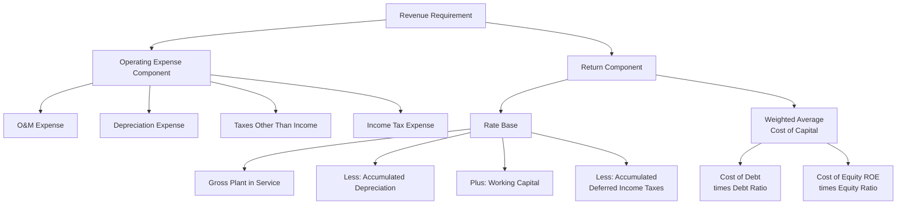

## Rate Base, Expenses, and Return Components Overview

### Definition and Purpose

The revenue requirement is the total amount a utility must be permitted to collect from ratepayers to cover its prudently incurred cost of providing service, including a fair return to investors. Every rate case, regardless of the test year methodology or adjustment technique used to select and refine the underlying data, ultimately expresses its output through a single foundational equation combining three core components: rate base, operating expenses, and the rate of return. This item provides the structural overview that ties together the mechanics discussed throughout this chapter.

### The Core Revenue Requirement Formula

$$RR = O + D + T + (RB \times r)$$

Where:

- $RR$ = Revenue Requirement (total dollars the utility is authorized to collect)
- $O$ = Operating and Maintenance (O&M) expenses
- $D$ = Depreciation expense
- $T$ = Taxes (income taxes and taxes other than income, such as property tax)
- $RB$ = Rate Base (net investment in plant and other assets used to provide service)
- $r$ = Authorized Rate of Return (weighted average cost of capital)

This is often written in condensed form as:

$$RR = OE + (RB \times r)$$

Where $OE$ (total operating expense) bundles O&M, depreciation, and taxes together, and the $(RB \times r)$ term is commonly called the **return component** or **capital cost component** of the revenue requirement.

### Component One: Rate Base

**Key Points**

- Represents the net investment the utility has made in property, plant, and equipment (and certain other assets) that is "used and useful" in providing regulated service
- The rate of return is applied to this base to determine the dollar amount of profit the utility is authorized to earn
- Calculated on a net basis: gross plant less accumulated depreciation, adjusted for other rate base components

**Standard rate base components**:

$$RB = GrossPlant - AccumulatedDepreciation + WorkingCapital + MaterialsAndSupplies - AccumulatedDeferredIncomeTaxes \pm OtherAdjustments$$

- **Gross plant in service**: The original cost of all utility plant used to provide service (generation, transmission, distribution, general plant)
- **Accumulated depreciation**: The cumulative depreciation recorded against that plant, subtracted because rate base reflects net, undepreciated investment
- **Working capital allowance**: Funds the utility must have on hand to cover the lag between paying its own expenses and collecting revenue from customers, typically quantified through a lead-lag study
- **Materials and supplies inventory**: Operating inventory necessary for utility operations
- **Accumulated Deferred Income Taxes (ADIT)**: Subtracted from rate base because ADIT represents a cost-free source of capital effectively provided by ratepayers (through timing differences between book and tax depreciation), so investors should not also earn a return on funds they did not themselves supply
- **Construction Work in Progress (CWIP)**: Treatment varies by jurisdiction; some include CWIP in rate base (earning a current return), while others exclude it and instead allow Allowance for Funds Used During Construction (AFUDC) to accrue, deferring the return until the asset is placed in service

**Example**

A utility reports gross plant in service of $500 million, accumulated depreciation of $180 million, a working capital allowance of $8 million, materials and supplies of $4 million, and accumulated deferred income taxes of $22 million.

$$RB = 500 - 180 + 8 + 4 - 22 = \$310\text{ million}$$

### Component Two: Operating Expenses

**Key Points**

- Represents the ongoing costs of running the utility, recovered dollar-for-dollar (subject to a prudence review) rather than earning a return
- Distinguished from rate base in that operating expenses are recovered as pass-through costs, while rate base earns a profit margin via the rate of return

**Standard operating expense components**:

1. **Operations and Maintenance (O&M) expense**: Fuel, purchased power, labor, materials, contracted services, administrative and general expense
2. **Depreciation expense**: The annual allocation of plant cost over its useful life, distinct from accumulated depreciation (a balance sheet concept used in rate base) — depreciation expense is an income statement flow, recognized annually
3. **Taxes other than income taxes**: Property tax, payroll tax, gross receipts tax, franchise tax
4. **Income tax expense**: Federal and state income tax calculated on the utility's regulated taxable income, reflecting the tax effect of the authorized return on equity (since equity returns, unlike interest on debt, are not tax-deductible to the utility)

**Prudence review**: Operating expenses are generally subject to a "used and useful" and "prudently incurred" standard — a commission may disallow expenses found to be imprudently incurred, excessive, or not used in providing regulated service, even if the expense was actually paid by the utility.

### Component Three: Rate of Return

**Key Points**

- Represents the weighted average cost of capital (WACC) the utility is authorized to earn on its rate base
- Blends the cost of debt and the cost of equity, weighted by their respective proportions in the utility's authorized capital structure
- The equity component (Return on Equity, or ROE) is the most heavily litigated element of most rate cases, since debt cost is generally verifiable from actual contractual interest rates while equity cost requires an estimation methodology (e.g., Discounted Cash Flow, Capital Asset Pricing Model, or Risk Premium analyses)

**Weighted Average Cost of Capital formula**:

$$WACC = \left(\frac{D}{V} \times r_d\right) + \left(\frac{E}{V} \times r_e\right)$$

Where $D$ = total debt, $E$ = total equity, $V = D + E$ (total capitalization), $r_d$ = cost of debt, and $r_e$ = cost of equity (ROE).

**Example**

A utility's authorized capital structure is 45% debt at a 5.0% embedded cost and 55% equity at a 9.5% authorized ROE.

$$WACC = (0.45 \times 0.05) + (0.55 \times 0.095) = 0.0225 + 0.05225 = 0.07475 = 7.475\%$$

Applying this to the $310 million rate base calculated above:

$$ReturnComponent = 310{,}000{,}000 \times 0.07475 = \$23{,}172{,}500$$

### Full Worked Example: Assembling the Revenue Requirement

Continuing the illustration above, assume the utility's test year (after normalizing, annualizing, and pro forma adjustments as covered elsewhere in this chapter) shows:

| Component | Amount |
| --- | --- |
| O&M Expense | $95,000,000 |
| Depreciation Expense | $28,000,000 |
| Taxes Other Than Income | $11,000,000 |
| Income Tax Expense | $14,500,000 |
| **Total Operating Expense** | **$148,500,000** |
| Rate Base | $310,000,000 |
| Authorized WACC | 7.475% |
| **Return Component** | **$23,172,500** |
| **Total Revenue Requirement** | **$171,672,500** |

$$RR = 148{,}500{,}000 + 23{,}172{,}500 = \$171{,}672{,}500$$

If the utility's current rates are projected to generate $160,000,000 under test year conditions, the case would support a proposed revenue increase of $11,672,500, before any subsequent rate design allocation across customer classes.

### Structural Relationship Diagram

### Why the Three-Component Structure Matters for This Chapter

Every mechanism examined elsewhere in this chapter operates by modifying one or more of these three components before the final formula is applied:

- **Test year selection** (historical, future, hybrid) determines which period's raw data populates $O$, $D$, $T$, and $RB$
- **Attrition and forecasted test years** extend $RB$ and $O$ forward to approximate conditions during the rate-effective period
- **Pro forma and known-and-measurable adjustments** insert specific, documented changes into $RB$, $O$, $D$, or $T$ that would not otherwise appear in raw historical data
- **Normalizing and annualizing adjustments** correct distortions within $O$ and revenue (which determines whether the existing $RR$ under current rates is adequate) so that the components reflect representative, ongoing conditions rather than anomalies

Disputes in a rate case are, at their core, almost always disputes over the correct value of one of these components — a lower proposed rate base, a disallowed operating expense, or a lower authorized ROE all reduce the revenue requirement relative to the utility's request, while the utility's filed case typically argues for the opposite on each.

### Common Points of Contention by Component

| Component | Typical Utility Position | Typical Intervenor/Staff Position |
| --- | --- | --- |
| Rate Base | Include CWIP, use forecasted/attrition-year plant additions | Exclude CWIP or unbuilt plant, apply strict used-and-useful test |
| O&M Expense | Include budgeted increases, executive compensation, affiliate charges | Disallow above-market affiliate charges, scrutinize incentive compensation |
| Depreciation | Shorter depreciable lives (faster cost recovery) | Longer depreciable lives (lower current expense, smoother rates) |
| Cost of Equity (ROE) | Higher ROE citing risk, comparable earnings of peer utilities | Lower ROE citing current capital market conditions and utility's low-risk profile |
| Capital Structure | Higher equity ratio (increases return component, since equity costs more than debt) | Lower equity ratio, closer to actual consolidated parent capital structure |

**[Inference]** Because acceptable ranges for capital structure, depreciation lives, and ROE methodology are determined by individual commission precedent, current capital market conditions, and jurisdiction-specific statutes, specific numeric benchmarks (such as a "typical" authorized ROE) change over time and by jurisdiction, and should be verified against current commission decisions rather than treated as fixed constants.

### Related Topics

- Test Year Selection: Historical, Future, and Hybrid
- Attrition Years and Forecasted Test Years
- Pro Forma and Known and Measurable Adjustments
- Normalizing and Annualizing Test Year Data
- Cost of Capital: Debt, Equity, and Capital Structure
- Used and Useful Standard for Rate Base Inclusion
- Lead-Lag Studies and Working Capital Allowance
- Depreciation Methodologies and Useful Life Determination
- Rate Design and Cost Allocation Across Customer Classes