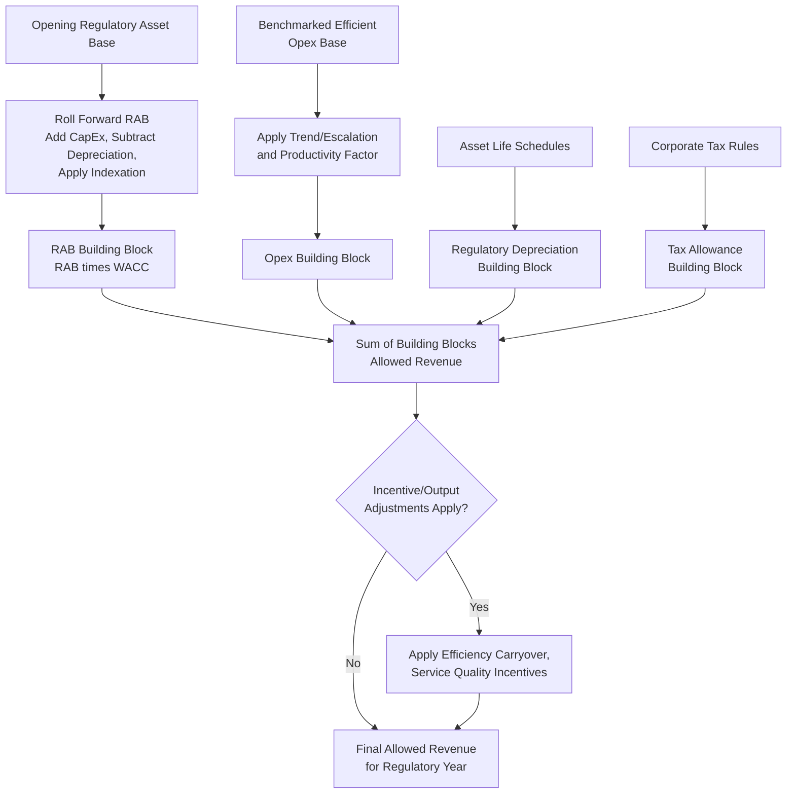

## Building Block Methodology Across Jurisdictions

### Definition and Purpose

The building block methodology is a term most closely associated with regulatory regimes outside the United States (notably the United Kingdom, Australia, and jurisdictions that modeled their frameworks on UK-style utility regulation) that construct the allowed revenue for a regulated network utility from a defined set of discrete cost and return components, assembled ("built up") into a total revenue allowance for a multi-year regulatory control period. Although the terminology differs from the "revenue requirement" formula used in traditional U.S. cost-of-service ratemaking, the underlying components are structurally analogous, making this item a useful comparative complement to the rate base, expense, and return components already covered in this chapter.

### Structural Comparison: U.S. Revenue Requirement vs. Building Block Approach

The traditional U.S. cost-of-service formula, as established earlier in this chapter, is:

$$RR = O + D + T + (RB \times r)$$

The building block approach, used in frameworks such as the UK's RIIO (Revenue = Incentives + Innovation + Outputs) price controls and Australia's National Electricity Rules building block methodology administered by the Australian Energy Regulator (AER), constructs total allowed revenue for each year of a multi-year regulatory period as the sum of discrete, separately determined building blocks:

$$AR_t = RAB_t \times WACC + Depreciation_t + Opex_t \pm IncentiveAdjustments_t \pm TaxAllowance_t$$

Where:

- $AR_t$ = Allowed Revenue for regulatory year $t$
- $RAB_t$ = Regulatory Asset Base (the direct analog to U.S. rate base) for year $t$
- $WACC$ = Weighted Average Cost of Capital, generally set for the entire regulatory control period rather than re-litigated annually
- $Depreciation_t$ = Regulatory depreciation (return *of* capital) for year $t$
- $Opex_t$ = Efficient operating expenditure allowance for year $t$
- $IncentiveAdjustments_t$ = Adjustments arising from incentive mechanisms (efficiency carryover, service quality incentives, innovation allowances)
- $TaxAllowance_t$ = Allowance for corporate tax liability

**Key Points**

- The RAB (Regulatory Asset Base) is the direct conceptual counterpart to U.S. rate base: net accumulated regulatory investment, rolled forward each year for new capital expenditure and reduced for regulatory depreciation
- The building block approach is typically set prospectively for an entire multi-year control period (commonly 5 years in UK and Australian frameworks) rather than through a single-year test year exercise, making it structurally similar to a fully projected future test year applied across multiple years simultaneously
- Building block frameworks generally incorporate explicit incentive mechanisms as a discrete additional block, rather than relying solely on regulatory lag between rate cases to create efficiency incentives (as is more common, though not universal, in traditional U.S. rate-of-return regulation)

### The Regulatory Asset Base (RAB) Roll-Forward

Unlike a U.S. rate base recalculated largely from scratch (or from a fresh historical/attrition base) at each rate case, the RAB in building block jurisdictions is typically rolled forward mechanically from one regulatory period to the next using an indexed formula:

$$RAB_t = RAB_{t-1} \times (1 + Inflation_t) + CapEx_t - Depreciation_t - Disposals_t$$

**Example**

A network utility's opening RAB for a regulatory year is AUD 2,000 million. During the year, it incurs approved capital expenditure of AUD 150 million, regulatory depreciation of AUD 120 million, and inflation of 2.5% is applied to the opening balance to preserve the real value of the asset base (a feature distinctive to many building block frameworks, which often index the RAB to inflation rather than holding it in nominal terms as most U.S. rate base calculations do).

$$RAB_t = 2000 \times 1.025 + 150 - 120 = 2050 + 150 - 120 = AUD\ 2080\text{ million}$$

**[Inference]** Whether a given building block framework indexes the RAB to inflation (a "real" WACC and indexed asset base approach) or maintains it in nominal terms varies by jurisdiction and by the specific regulator's methodology; because this is a matter of active regulatory design that can be revised between control periods, the specific indexation convention in effect for a given framework should be verified against that regulator's current binding rules rather than assumed.

### The Opex Building Block and Efficiency Incentives

A defining structural feature distinguishing building block regulation from traditional U.S. cost-of-service ratemaking is the explicit "efficient cost" framing of the operating expenditure block. Rather than a prudence review applied after costs are incurred (as in U.S. practice), building block regulators typically set an ex-ante operating expenditure allowance based on benchmarking, econometric modeling of comparable networks, or a base-step-trend methodology, and the utility retains any efficiency gains achieved below that allowance for a defined period (an efficiency carryover mechanism) before the allowance is reset at the next control period based on updated actual costs.

**Base-Step-Trend Opex Methodology** (a commonly used approach in Australian and comparable frameworks):

$$Opex_t = Opex_{base} \times (1 + CPI_t)^t \times \left(1 - X_t\right) + Step_t$$

Where $Opex_{base}$ is a benchmarked efficient base year cost, $CPI_t$ is an inflation escalator, $X_t$ is a productivity (efficiency) factor analogous conceptually to the X-factor used in price-cap regulation, and $Step_t$ captures discrete, one-off cost changes (comparable in concept to a known-and-measurable adjustment) such as new regulatory obligations.

### Comparative Table: U.S. Cost-of-Service vs. Building Block Frameworks

| Dimension | U.S. Cost-of-Service (Traditional) | Building Block (UK/Australia-style) |
| --- | --- | --- |
| Regulatory period | Typically single test year, rates in effect until next case | Multi-year regulatory control period (commonly 5 years) |
| Asset base terminology | Rate Base | Regulatory Asset Base (RAB) |
| Asset base treatment | Generally nominal, revalued each rate case | Often inflation-indexed, mechanically rolled forward |
| Opex treatment | Prudence review of actual/forecast costs each case | Ex-ante efficient cost benchmark with incentive carryover |
| Efficiency incentive mechanism | Primarily implicit, via regulatory lag between cases | Explicit incentive blocks (efficiency carryover, service quality incentives) |
| Return determination | WACC re-litigated (fully or partially) most cases | WACC typically fixed for entire multi-year control period |
| Depreciation | Book/regulatory depreciation, often straight-line over asset life | Regulatory depreciation, sometimes using different asset life conventions than accounting depreciation |

### Incentive and Output-Based Overlays

Many building block frameworks layer performance-based elements on top of the core building blocks, most prominently associated with the UK's RIIO framework:

- **Totex (total expenditure) approach**: Some frameworks (notably RIIO) combine capital and operating expenditure into a single "totex" allowance rather than treating them as fully separate building blocks, intended to reduce a network's incentive to favor capital solutions over operating solutions purely because capital spending enters the RAB and earns a return while opex does not.
- **Output-based incentives**: Financial rewards or penalties tied to defined service quality, reliability, or environmental outputs, layered on top of the core allowed revenue calculation.
- **Innovation funding mechanisms**: Discrete allowances or competitive funding pools for network innovation projects, separate from the core building blocks.

**[Inference]** Because the specific design of incentive and output mechanisms (including whether a totex or traditional capex/opex split is used) is a matter of active regulatory policy that is periodically revised between control periods and can differ substantially between the UK, Australian, and other adopting jurisdictions, the current mechanism design for any specific framework should be verified against that regulator's current binding methodology documents rather than assumed to follow a single common template.

### Building Block Assembly Flow

### Relevance to Jurisdictions Using Hybrid or Multi-Year Approaches

The building block methodology's core structural insight — separating the return *on* capital, the return *of* capital (depreciation), and operating costs into distinct, individually justified blocks, then assembling them into a total allowance for a defined future period — is conceptually the same operation performed by the U.S. revenue requirement formula, but building block frameworks typically extend the exercise across multiple years using indexed formulas rather than requiring a fresh calculation and full evidentiary case at each cost recovery point. This makes building block methodology closely comparable, in function, to the multi-year rate plans and attrition-based escalation mechanisms discussed elsewhere in this chapter, and it is common for observers and practitioners moving between jurisdictions to translate between the two vocabularies (RAB ≈ rate base; allowed revenue ≈ revenue requirement; totex/opex allowance ≈ operating expense component).

### Related Topics

- Rate Base, Expenses, and Return Components Overview
- Attrition Years and Forecasted Test Years
- Multi-Year Rate Plans and Formula Rate Mechanisms
- Price-Cap Regulation and Productivity (X-Factor) Offsets
- Incentive Regulation and Performance-Based Ratemaking
- Cost of Capital: Debt, Equity, and Capital Structure
- International Comparative Utility Regulation Frameworks
- Depreciation Methodologies and Regulatory Asset Life Conventions