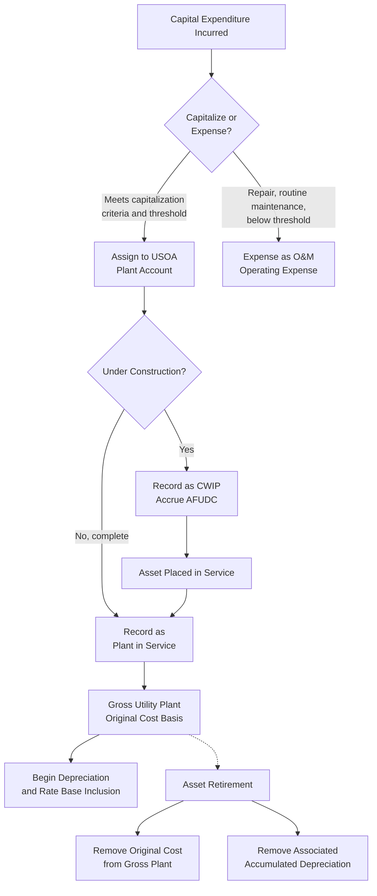

## Plant in Service and Gross Utility Plant

### Definition and Purpose

Plant in Service, also referred to as Gross Utility Plant, is the foundational rate base component representing the original cost of all tangible and intangible property a utility has installed and placed into operation to provide regulated service. It is the starting, undepreciated figure from which net rate base is ultimately derived, and its correct classification and valuation is the single most consequential input into the rate base calculation covered generally elsewhere in this chapter.

### Original Cost Standard

**Key Points**

- Gross Utility Plant is recorded at **original cost**: the cost incurred by the entity that first devoted the asset to public utility service, not current replacement cost, market value, or the price paid if the asset was later acquired from another owner
- This standard, sometimes called "historical cost" or "original cost less depreciation" ratemaking, is the dominant valuation methodology in U.S. utility regulation, in contrast to "fair value" or "reproduction cost" approaches used in earlier eras of U.S. regulation and in some other valuation contexts
- When utility property changes ownership (e.g., through acquisition of one utility by another), the original cost to the entity that first dedicated the asset to public service generally continues to apply for ratemaking purposes, rather than resetting to the acquisition price — a principle intended to prevent rate base inflation through corporate transactions

**Original cost components typically capitalized**:

- Purchase price or construction cost of the asset itself
- Freight and transportation to the installation site
- Installation labor and contractor costs
- Engineering and design costs directly attributable to the asset
- Allowance for Funds Used During Construction (AFUDC), representing the financing cost incurred during the construction period
- Sales and use taxes paid on the acquisition or construction

### The Uniform System of Accounts (USOA) Framework

**Key Points**

- In the United States, utility plant accounts are governed by the Uniform System of Accounts, a standardized chart of accounts prescribed by the Federal Energy Regulatory Commission (FERC) for electric and gas utilities, and by state commissions (often adopting or closely mirroring FERC's USOA) for other jurisdictional utilities
- The USOA prescribes specific account numbers and definitions for each category of plant, ensuring comparability across utilities and across time within the same utility
- Provides the accounting foundation from which rate base, depreciation expense, and property tax calculations are all derived

**Major USOA electric plant functional classifications** (illustrative, FERC electric plant accounts):

1. **Intangible Plant** (Accounts 301-303): Organization costs, franchises, and licenses, and other intangible plant
2. **Production Plant**: Steam production, nuclear production, hydraulic production, other production (further subdivided by generation type)
3. **Transmission Plant** (Accounts 350-359): Land and land rights, structures, station equipment, towers and fixtures, poles and fixtures, overhead conductors and devices, underground conduit, underground conductors and devices
4. **Distribution Plant** (Accounts 360-374): Land, structures, station equipment, poles/towers/fixtures, overhead and underground conductors, line transformers, services, meters, street lighting equipment
5. **General Plant** (Accounts 389-399): Land, structures, office furniture and equipment, transportation equipment, tools and shop equipment, communication equipment

**[Inference]** Because specific account numbering, thresholds, and classification rules within the USOA are subject to periodic amendment by FERC and by individual state commissions, and because gas, water, and telecommunications utilities operate under separate (though structurally similar) USOA frameworks, the precise account structure applicable to a given utility type and jurisdiction should be confirmed against the currently effective USOA rules for that specific utility category rather than assumed to be identical across all utility types.

### Capitalization vs. Expensing Determination

A central and frequently litigated accounting question is whether a given cost should be **capitalized** (added to gross plant, then recovered over time through depreciation and earning a return via rate base) or **expensed** (recovered dollar-for-dollar in the test year as an operating expense, with no return component).

**General capitalization criteria**:

- The expenditure creates or extends the useful life of a distinct, identifiable asset
- The cost provides economic benefit extending substantially beyond the current accounting period
- The expenditure meets or exceeds the utility's capitalization threshold policy (a minimum dollar amount below which items are expensed regardless of asset nature, for administrative simplicity)

**Example (capitalize vs. expense distinction)**

A utility replaces a failed transformer with a new unit of substantially the same capacity and specification. The replacement cost is capitalized as plant in service (a capital asset with a multi-year useful life), and the retired transformer's original cost is removed from gross plant and its associated accumulated depreciation is reversed. By contrast, routine transformer oil testing and minor repairs performed on functioning transformers are expensed as O&M maintenance costs, since they do not create a new distinct asset or materially extend the transformer's originally expected useful life.

**Repairs vs. capital improvements distinction**: A repair that restores an asset to its previous operating condition without extending its useful life or increasing its capacity is generally expensed; a betterment or improvement that extends useful life, increases capacity, or improves efficiency beyond the original design is generally capitalized. This distinction is a recurring source of dispute in rate cases, particularly for large maintenance programs (e.g., major generating unit overhauls, pipeline integrity programs) that combine elements of both repair and improvement.

### Allowance for Funds Used During Construction (AFUDC)

**Key Points**

- AFUDC represents the capitalized financing cost (both debt and equity components) incurred by a utility while an asset is under construction and not yet earning a cash return through rates
- Added to the cost of the asset (increasing gross plant) rather than being expensed currently, on the theory that the utility should not bear the full financing burden of construction without compensation, but customers should not pay a current cash return on plant not yet providing service
- Calculated using a rate similar to the utility's authorized WACC, applied to eligible Construction Work in Progress (CWIP) balances

$$AFUDC_t = CWIP_t \times AFUDC\ Rate$$

**Example**

A utility has an average CWIP balance of $40 million for a transmission line under construction during the year, and its AFUDC rate (approximating its overall cost of capital) is 7.2%. The AFUDC accrued and capitalized to the project's eventual gross plant cost is:

$$AFUDC = 40{,}000{,}000 \times 0.072 = \$2{,}880{,}000$$

Once the transmission line is placed in service, its total gross plant addition includes both the direct construction costs and the accumulated AFUDC, and the asset (including its AFUDC component) begins earning a cash return through rate base and being depreciated, at which point AFUDC accrual on that asset ceases.

### Retirements and Plant Accounting

**Key Points**

- When an asset is retired (removed from service, whether through replacement, abandonment, or obsolescence), its original cost is removed from gross plant in service
- The associated accumulated depreciation for that asset is simultaneously removed from the accumulated depreciation reserve
- Any net salvage value (proceeds from sale of the retired asset, less the cost of removal) is generally recorded through the depreciation reserve rather than as a separate current gain or loss, under the "group" or "mass" depreciation methodology commonly used for utility plant

**Example**

A distribution pole with an original cost of $3,000 and accumulated depreciation of $2,600 is retired and removed from service. Removal cost is $400, and no salvage value is recovered. The gross plant account is reduced by $3,000, and the accumulated depreciation reserve is adjusted to reflect both the reversal of the pole's accumulated depreciation and the net removal cost, consistent with the utility's approved depreciation and net salvage accounting methodology.

### Gross Plant Roll-Forward Mechanics

Gross Utility Plant at any point in time reflects a cumulative roll-forward of additions and retirements:

$$GrossPlant_{end} = GrossPlant_{beginning} + Additions - Retirements$$

This roll-forward is the mechanical link between the annual capital budget (and associated pro forma or attrition-year adjustments discussed elsewhere in this chapter) and the gross plant balance used to calculate rate base in a given test year.

### Plant Classification and Rate Base Flow

### Prudence and Used-and-Useful Review of Plant Additions

Even though plant is recorded at original cost for accounting purposes, inclusion of that plant in rate base for ratemaking purposes is separately subject to prudence review (was the expenditure a reasonable decision at the time it was made, judged by what was known or should have been known then) and a used-and-useful determination (is the asset actually serving customers in providing regulated service). A commission may disallow recovery of plant cost found to be imprudently incurred (e.g., significant, unjustified construction cost overruns, or a plant that was never needed) even though the utility actually spent the funds and the asset is properly recorded in its books at original cost.

**[Inference]** Because prudence review standards, the burden of proof allocation for demonstrating prudence, and the specific treatment of disallowed plant costs (full disallowance versus amortized disallowance over time) are established through commission precedent and vary by jurisdiction, the applicable prudence standard for a specific proceeding should be confirmed against that commission's governing case law rather than assumed uniform.

### Related Topics

- Rate Base, Expenses, and Return Components Overview
- Accumulated Depreciation and Net Plant Calculation
- Construction Work in Progress and AFUDC Treatment
- Used and Useful Standard for Rate Base Inclusion
- Depreciation Methodologies and Useful Life Determination
- Prudence Review and Disallowance Standards
- Uniform System of Accounts (USOA) Classification
- Working Capital Allowance and Lead-Lag Studies