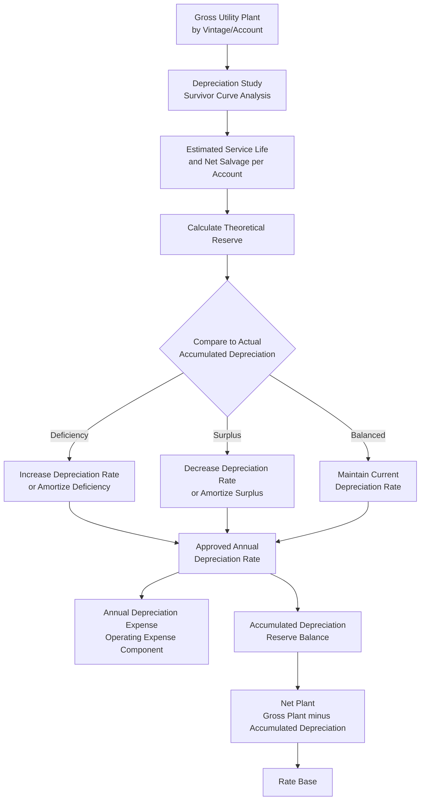

## Accumulated Depreciation and Net Plant

### Definition and Purpose

Accumulated Depreciation is the cumulative balance-sheet reserve representing the total depreciation expense recognized against utility plant since each asset was placed into service. Subtracting this reserve from Gross Utility Plant yields **Net Plant**, the depreciated investment figure that forms the largest single component of rate base. This item examines depreciation accounting mechanics in depth, building on the gross plant foundation established elsewhere in this chapter and preceding the working capital and other rate base adjustments covered later.

### Net Plant as the Core Rate Base Building Block

**Key Points**

- Net Plant = Gross Utility Plant − Accumulated Depreciation
- Represents the utility's remaining, undepreciated investment in plant still providing service
- Serves as the principal component of rate base to which the authorized rate of return is applied, since it reflects the capital investors have not yet recovered through depreciation charges

$$NetPlant = GrossPlant - AccumulatedDepreciation$$

**Example**

Using the gross plant figures introduced elsewhere in this chapter — gross plant of $500 million and accumulated depreciation of $180 million:

$$NetPlant = 500{,}000{,}000 - 180{,}000{,}000 = \$320{,}000{,}000$$

This net plant figure, before further adjustment for working capital, materials and supplies, and accumulated deferred income taxes, forms the anchor of the rate base calculation.

### Depreciation Expense vs. Accumulated Depreciation

A frequently confused but essential distinction:

- **Depreciation expense** is a flow concept: the amount charged to the income statement in a single period (the test year), recovered as part of operating expense in the revenue requirement formula covered elsewhere in this chapter
- **Accumulated depreciation** is a stock (balance) concept: the cumulative total of all depreciation expense recognized since each asset's in-service date, net of any depreciation removed upon retirement

$$AccumulatedDepreciation_t = AccumulatedDepreciation_{t-1} + DepreciationExpense_t - DepreciationRemovedOnRetirements_t$$

### Depreciation Methodologies

**Key Points**

- Regulatory depreciation is generally calculated on a **straight-line** basis over an asset's estimated useful life, in contrast to accelerated depreciation methods sometimes used for income tax purposes
- Utility depreciation is calculated using **group** (or "mass") depreciation, applying an average rate to a class or vintage group of similar assets, rather than tracking each individual asset's depreciation separately (unlike typical unregulated industrial accounting, which more often depreciates individual assets)

**Straight-line depreciation rate formula**:

$$AnnualDepreciationRate = \frac{100\% - NetSalvagePercent}{AverageServiceLife}$$

$$AnnualDepreciationExpense = GrossPlantBalance \times AnnualDepreciationRate$$

**Example**

A distribution pole account has an average service life of 40 years and an estimated net salvage value of -15% (negative salvage, reflecting that removal costs exceed any scrap value recovered — common for distribution assets).

$$AnnualDepreciationRate = \frac{100\% - (-15\%)}{40} = \frac{115\%}{40} = 2.875\%$$

If the gross plant balance in that account is $60 million, annual depreciation expense for that vintage group is:

$$60{,}000{,}000 \times 0.02875 = \$1{,}725{,}000$$

### Depreciation Studies

**Key Points**

- Utilities periodically commission a formal **depreciation study**, typically performed by a specialized depreciation consultant, to review and propose updated service lives, retirement dispersion patterns, and net salvage estimates for each plant account
- Depreciation studies rely on actuarial and statistical analysis of historical retirement data (survivor curve analysis) to estimate how long, on average, assets within an account remain in service before retirement
- Commissions typically must approve updated depreciation rates before a utility can implement them in its books and in rates; depreciation rate changes are frequently, though not always, addressed within the context of a general rate case

**Survivor curve analysis**: Depreciation consultants commonly use Iowa-type survivor curves (a family of standardized curves developed at Iowa State University, denoted by shape and average life, e.g., "R3" or "L2" curves) to statistically model the dispersion of retirement ages around an account's average service life, rather than assuming all assets in a vintage group retire simultaneously at the exact average life.

**Net salvage value**: The estimated proceeds from disposing of a retired asset (scrap value, resale value) less the estimated cost of removing and disposing of it. For many utility asset classes — particularly buried or elevated distribution infrastructure such as poles, underground cable, and pipe — removal costs frequently exceed salvage proceeds, producing a **negative net salvage** value, which increases the effective depreciation rate (since more than 100% of original cost must be recovered through depreciation to fund the anticipated net removal cost).

### The Depreciation Reserve Imbalance Issue

**Key Points**

- A depreciation study may reveal that the actual accumulated depreciation reserve recorded in a utility's books differs from the "theoretical reserve" that would exist if current, updated service life and salvage assumptions had been used throughout an asset's life
- This difference is called a **reserve imbalance** (or reserve deficiency/surplus) and is a common and often contentious element of depreciation rate proceedings

$$ReserveImbalance = ActualAccumulatedDepreciation - TheoreticalReserve$$

- A **reserve deficiency** (actual reserve less than theoretical) indicates that historical depreciation rates were too low relative to actual asset retirement experience, requiring either an increased ongoing depreciation rate, a direct amortization of the deficiency, or both
- A **reserve surplus** (actual reserve greater than theoretical) indicates the opposite, and may support a reduced depreciation rate or an amortization crediting the surplus back over time

**Example**

A depreciation study determines that, based on updated survivor curve analysis, an underground cable account's theoretical reserve should be $45 million, but the actual recorded accumulated depreciation for that account is $38 million. This $7 million reserve deficiency indicates historical depreciation rates undercollected relative to the assets' actual retirement pattern, and the depreciation consultant will typically propose either a remaining-life depreciation rate calculation (which inherently amortizes the deficiency over the remaining life of the surviving assets) or a separate, explicit amortization of the deficiency.

### Remaining Life vs. Whole Life Depreciation Rate Calculation

Two principal methodologies exist for translating a depreciation study's findings into a going-forward depreciation rate:

1. **Whole life method**: Calculates a single rate intended to depreciate an asset's full original cost (adjusted for net salvage) evenly over its total estimated service life, without separately correcting for any existing reserve imbalance; imbalances, if addressed at all, are typically handled through a separate mechanism
2. **Remaining life method**: Explicitly incorporates the current reserve imbalance into the rate calculation, spreading recovery (or return) of that imbalance over the remaining estimated life of the surviving plant, so that the reserve is projected to exactly equal 100% of net original cost (adjusted for net salvage) by the end of the asset group's estimated retirement

$$RemainingLifeRate = \frac{NetPlantBalance - FutureNetSalvage}{RemainingLife}$$

**[Inference]** Because the choice between whole life and remaining life methodology, and the specific survivor curve fitting techniques applied, are matters of accepted actuarial practice that can differ by commission preference and by depreciation consultant methodology, the specific approach applicable to a given utility and jurisdiction should be confirmed against that commission's currently accepted depreciation practice rather than assumed to follow a single universal convention.

### Depreciation Roll-Forward and Rate Base Flow

### Retirement Accounting and the Reserve

As introduced elsewhere in this chapter regarding gross plant retirements, when an asset is retired, its original cost is removed from gross plant and a corresponding amount is removed from the accumulated depreciation reserve, along with recognition of any actual net salvage realized. Under group depreciation accounting, no gain or loss is typically recognized on ordinary retirements occurring within the normal expected life pattern of the asset group — the reserve mechanism is designed to absorb normal retirement timing variance across the vintage group as a whole. Extraordinary retirements (e.g., a major generating unit retired substantially before the end of its estimated life due to a policy change or unexpected obsolescence) may instead be addressed through a separate regulatory accounting mechanism, such as a regulatory asset for unrecovered net book value, rather than being absorbed through ordinary group depreciation reserve accounting.

### Depreciation's Interaction with Other Chapter Topics

- **Rate base determination**: Net plant, derived from gross plant less accumulated depreciation, is the largest single component of rate base as introduced in the overview item earlier in this chapter
- **Operating expense**: Annual depreciation expense is a distinct line item in the operating expense component of the revenue requirement formula, calculated using the approved rate discussed in this item
- **Attrition and pro forma adjustments**: Depreciation expense on pro forma plant additions (assets expected to be placed in service after the historical test year) is a standard, well-documented category of known-and-measurable adjustment, since the depreciation rate is typically already commission-approved and the asset's projected cost and in-service date are the primary variables requiring evidentiary support
- **Annualizing adjustments**: When a plant addition entered service mid-test-year, its depreciation expense is annualized to reflect a full year at the post-addition depreciation level, consistent with the annualizing methodology covered elsewhere in this chapter

### Related Topics

- Plant in Service and Gross Utility Plant
- Rate Base, Expenses, and Return Components Overview
- Pro Forma and Known and Measurable Adjustments
- Depreciation Studies and Survivor Curve Analysis
- Net Salvage Value Estimation
- Construction Work in Progress and AFUDC Treatment
- Regulatory Assets and Extraordinary Retirement Accounting
- Working Capital Allowance and Lead-Lag Studies