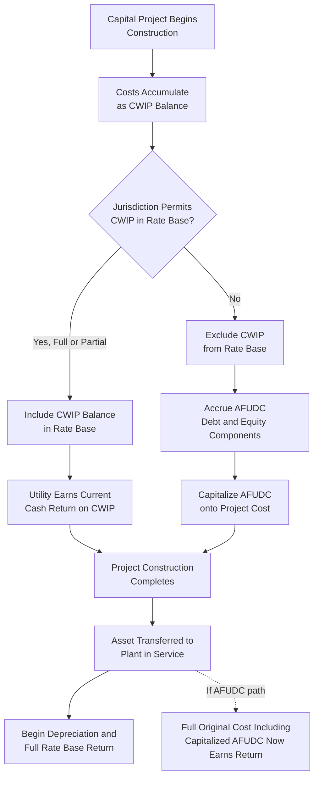

## Construction Work in Progress (CWIP)

### Definition and Purpose

Construction Work in Progress (CWIP) represents the accumulated costs of utility plant that is under construction but not yet complete and placed into service. Because CWIP has not yet begun providing service to customers, its treatment for ratemaking purposes — whether it earns a current cash return through inclusion in rate base, or is instead compensated through a non-cash accrual mechanism deferred until the asset is completed — is one of the more consequential and jurisdiction-dependent determinations in rate base construction, directly connecting the plant accounting concepts covered elsewhere in this chapter to the utility's cash flow and financing needs during major capital programs.

### The Core Regulatory Choice: CWIP-in-Rate-Base vs. AFUDC

**Key Points**

- A regulator has two principal (and largely mutually exclusive, per project) mechanisms to compensate a utility for capital tied up in ongoing construction: including CWIP directly in rate base (earning a current cash return), or excluding CWIP from rate base and instead allowing Allowance for Funds Used During Construction (AFUDC) to accrue and capitalize onto the eventual completed asset's cost
- The two approaches shift financial risk and cash flow timing differently between the utility and its ratepayers, and represent one of the more consistently debated policy questions in utility rate base determination

**CWIP-in-rate-base approach**:

- Construction costs are included in rate base as incurred, before the asset is complete
- The utility earns a current cash return on that CWIP balance immediately, improving current cash flow and financial metrics during long construction programs
- Ratepayers begin paying for the return on an asset before it provides them any service, which is the central objection to this approach

**AFUDC/deferred approach**:

- Construction costs are excluded from rate base while the project is under construction
- Instead, an accrual (AFUDC) representing the estimated financing cost of the capital tied up in construction is calculated and capitalized onto the project's total cost, as covered in the plant-in-service item elsewhere in this chapter
- The utility does not receive current cash compensation for the capital cost during construction; instead, it recovers that deferred cost gradually over the depreciable life of the completed asset, once in service
- Ratepayers do not pay a current cash return on an asset not yet serving them, but the utility bears financing cost and cash flow strain during construction, particularly significant for long-duration projects (e.g., large baseload generation, major transmission expansions)

### Comparative Cash Flow Illustration

**Example**

A utility begins a three-year, $300 million generation project. Under a CWIP-in-rate-base approach, the utility includes the growing CWIP balance in rate base each year and earns its authorized WACC (assume 7.5%) as current cash revenue throughout construction. In Year 2, with an average CWIP balance of $180 million, the utility collects approximately $13.5 million in current cash return from ratepayers, even though the plant will not enter service until Year 3.

Under an AFUDC approach for the same project, that same $13.5 million financing cost is instead calculated as AFUDC and capitalized onto the project's total cost rather than collected in cash during Year 2. The project's final gross plant cost, once complete, is correspondingly higher (reflecting three years of accumulated AFUDC), and the utility begins earning a cash return and depreciating that full cost — including the capitalized AFUDC — only once the plant is placed in service.

### Comparative Table: CWIP-in-Rate-Base vs. AFUDC

| Dimension | CWIP in Rate Base | AFUDC / Deferred Recovery |
| --- | --- | --- |
| Timing of utility cash recovery | Immediate, during construction | Deferred until asset placed in service |
| Ratepayer impact during construction | Pay current return on incomplete asset | No current payment for incomplete asset |
| Utility cash flow during construction | Stronger (current cash return) | Weaker (financing cost deferred, not cash-funded) |
| Utility financial metrics impact | Improved interest coverage, cash flow ratios during construction | Can pressure credit metrics during long construction programs |
| Rate impact once asset completes service | Smaller "rate shock" (return already being collected) | Larger single-step rate base increase and full return commencement upon completion |
| Intergenerational equity consideration | Current ratepayers pay for future ratepayers' asset | Future ratepayers bear the deferred (and compounded) cost via higher depreciable base |

### Partial and Hybrid CWIP Treatments

**Key Points**

- Many jurisdictions do not apply a single blanket policy but instead permit CWIP inclusion selectively, based on project characteristics
- Common partial approaches include limiting CWIP-in-rate-base treatment to short-duration projects, to a capped percentage of total rate base, or to specific project types deemed to warrant special treatment (e.g., environmental compliance projects, storm hardening programs, or projects the legislature has specifically authorized for accelerated cost recovery)

**Common categories where CWIP-in-rate-base treatment is more frequently authorized**:

- Environmental compliance projects mandated by federal or state law, where policy objectives favor accelerating cost recovery to encourage timely compliance
- Storm hardening, grid modernization, or infrastructure replacement programs where legislatures have enacted specific cost-recovery statutes to encourage accelerated investment
- Nuclear plant construction, historically a focus of significant CWIP policy debate in the U.S. following large cost overruns and cancellations in past decades, leading some jurisdictions to adopt specific statutory frameworks (sometimes involving current cost recovery mechanisms distinct from a traditional base rate case) for nuclear construction costs

**[Inference]** Because CWIP treatment is frequently governed by specific state statutes, commission rules, or negotiated settlements that vary considerably and are subject to legislative and regulatory change, the applicable treatment for a given utility, project type, and jurisdiction should be confirmed against that jurisdiction's currently effective statutes and commission rules rather than assumed to follow a general national pattern.

### CWIP and Its Relationship to Rate Base and Test Year Mechanics

CWIP treatment interacts directly with several concepts covered elsewhere in this chapter and the prior chapter:

- **Test year selection**: A future or hybrid test year (discussed in the prior chapter) is more likely to directly incorporate large CWIP balances or newly completed projects into a forward-looking rate base than a purely historical test year, since the test year period is chosen specifically to align with completion dates of major capital projects
- **Pro forma and known-and-measurable adjustments**: Where a project is expected to complete and transition from CWIP to plant-in-service shortly after the historical test year, this transition is a classic subject of a post-test-year pro forma adjustment, since the in-service date and cost are typically well-documented by the time of filing
- **Used and useful standard**: CWIP, by definition, is not yet used and useful in providing service, which is the core rationale underlying jurisdictions that exclude CWIP from rate base as a matter of general ratemaking principle; jurisdictions permitting CWIP inclusion generally do so as an explicit policy exception to (or reinterpretation of) the used-and-useful principle, often justified by construction-financing or investment-incentive policy goals

### CWIP Treatment Decision Flow

### Litigation and Policy Considerations

- **Rate shock mitigation**: A key policy argument for CWIP-in-rate-base treatment, particularly for very large single projects, is mitigating "rate shock" — the sudden, large rate increase that can otherwise occur when a major asset transitions from AFUDC accrual to full rate base inclusion and depreciation all at once upon completion
- **Investment incentive and financeability**: Utilities and their investors generally favor CWIP-in-rate-base treatment for large, long-duration projects because it improves current cash flow and credit metrics during construction, which can lower the utility's overall cost of capital and make large capital programs more financeable
- **Intergenerational equity objections**: Consumer advocates typically object to CWIP-in-rate-base treatment on the principle that current customers should not subsidize the cost of an asset that will primarily benefit future customers, and that this treatment also weakens the utility's incentive to control construction costs and timelines, since cost recovery begins regardless of whether the project experiences delays or overruns
- **Prudence review timing**: Because CWIP-in-rate-base treatment provides current cost recovery before a project is complete, some jurisdictions pair it with periodic prudence review checkpoints during construction (rather than waiting until project completion) to identify and address cost overruns or delays earlier in the process

### Related Topics

- Plant in Service and Gross Utility Plant
- Accumulated Depreciation and Net Plant
- Rate Base, Expenses, and Return Components Overview
- Used and Useful Standard for Rate Base Inclusion
- Test Year Selection: Historical, Future, and Hybrid
- Pro Forma and Known and Measurable Adjustments
- Prudence Review and Disallowance Standards
- Cost of Capital: Debt, Equity, and Capital Structure