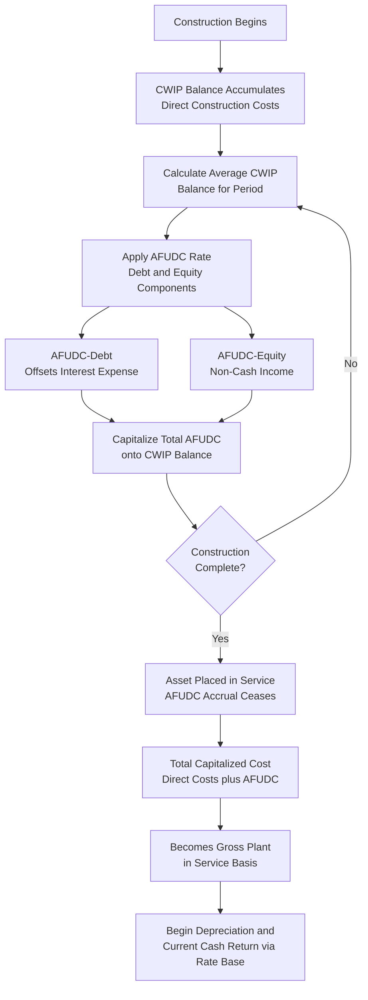

## Allowance for Funds Used During Construction (AFUDC)

### Definition and Purpose

Allowance for Funds Used During Construction (AFUDC) is the capitalized cost of financing — both debt and equity — that a utility incurs while a plant asset is under construction and not yet in service. Rather than expensing this financing cost currently or leaving it unrecovered, regulatory accounting capitalizes AFUDC onto the cost of the asset itself, deferring its recovery until the asset is placed in service and begins depreciating and earning a cash return through rate base. AFUDC is the principal mechanism used in jurisdictions that exclude Construction Work in Progress (CWIP) from rate base, as introduced elsewhere in this chapter, and understanding its calculation mechanics is essential to understanding gross plant valuation.

### Conceptual Basis

**Key Points**

- During construction, a utility must finance its ongoing capital expenditures using a mix of debt and equity capital, the same sources that finance its permanently in-service rate base
- Because CWIP (when excluded from rate base) earns no current cash return, the utility would otherwise bear the full financing cost of construction capital without compensation, effectively subsidizing ratepayers with the cost of assets not yet serving them
- AFUDC compensates for this by accruing a non-cash return during construction and adding it to the asset's capitalized cost, so that once the asset enters service, the utility recovers that deferred financing cost over the asset's depreciable life, along with the originally incurred direct construction costs

### Components of the AFUDC Rate

**Key Points**

- AFUDC is calculated using a rate composed of two components mirroring the utility's overall capital structure: a debt component and an equity component, applied to the portions of average CWIP balances deemed financed by each capital source
- The debt component (AFUDC-debt) is generally based on the utility's actual short-term and long-term borrowing costs
- The equity component (AFUDC-equity) is generally based on the utility's authorized return on equity

**FERC's prescribed AFUDC formula (as applied by U.S. electric and gas utilities under the Uniform System of Accounts)** conceptually allocates CWIP between capital sources as follows:

$$AFUDC\ Rate = \left(\frac{S}{S+D+E}\right) \times s + \left(\frac{D}{S+D+E}\right) \times \left(\frac{D}{D+E}\right) \times r_d + \left(\frac{E}{S+D+E}\right) \times \left(\frac{E}{D+E}\right) \times r_e$$

Where $S$ = short-term debt used to finance construction, $D$ = long-term debt, $E$ = equity, $s$ = short-term debt cost, $r_d$ = long-term debt cost, and $r_e$ = cost of equity. In practice, many utilities and commissions apply a simplified version of this formula, effectively approximating the AFUDC rate to the utility's overall authorized weighted average cost of capital (WACC).

**Simplified illustrative formula**:

$$AFUDC_t = AverageCWIP_t \times WACC$$

### Worked Calculation Example

**Example**

A utility is constructing a new substation with the following average CWIP balances over a two-year construction period, and an authorized WACC of 7.2%:

| Period | Average CWIP Balance | AFUDC Rate | AFUDC Accrued |
| --- | --- | --- | --- |
| Year 1 | $25,000,000 | 7.2% | $1,800,000 |
| Year 2 | $45,000,000 | 7.2% | $3,240,000 |
| **Total AFUDC Capitalized** |  |  | **$5,040,000** |

If the direct construction costs (materials, labor, engineering) over the two years totaled $70,000,000, the substation's total capitalized gross plant cost upon completion is:

$$TotalCapitalizedCost = 70{,}000{,}000 + 5{,}040{,}000 = \$75{,}040{,}000$$

This full $75,040,000 — including the capitalized AFUDC — becomes the asset's original cost basis for depreciation and rate base purposes going forward, consistent with the original cost standard for plant in service discussed elsewhere in this chapter.

### AFUDC-Equity and Non-Cash Income Recognition

**Key Points**

- The equity component of AFUDC (AFUDC-equity) is recorded as non-cash income on the utility's income statement during the construction period, even though no cash is actually received from ratepayers for it at that time
- This non-cash income, while it improves reported net income during construction, does not directly improve the utility's actual cash flow, which can create financial statement and credit-rating analysis complexity for utilities undertaking large, long-duration construction programs
- Because AFUDC-equity is non-cash, credit rating agencies and financial analysts typically adjust reported earnings to assess the quality of a utility's earnings during periods of significant construction activity, treating a high proportion of AFUDC-equity in reported net income as a lower-quality earnings signal than cash-generating operating income

**AFUDC-debt**, by contrast, is generally viewed as a more straightforward accounting offset, since it corresponds to actual interest expense the utility is incurring and paying in cash on its debt financing during construction, with AFUDC-debt serving to properly match that financing cost to the asset being constructed rather than expensing it as current period interest expense.

### AFUDC Termination and Transition to Plant in Service

**Key Points**

- AFUDC accrual on a given construction project ceases once the asset is placed in service, since at that point the completed asset transitions to plant in service, begins earning a current cash return through rate base inclusion (subject to the test year and rate case timing discussed elsewhere in this chapter), and begins depreciating
- The precise in-service date is therefore a critical and sometimes disputed factual and accounting determination, since it marks a hard cutoff both for AFUDC accrual (which stops) and for depreciation and rate base earnings (which begin)
- A dispute may arise over whether a component of a larger project (e.g., one generating unit of a multi-unit plant, or a completed phase of a multi-phase transmission project) can be deemed placed in service independently, allowing partial cessation of AFUDC and partial commencement of rate base treatment before the entire project is complete

### AFUDC Lifecycle and Accounting Treatment

### Interaction with Other Rate Base Concepts

- **CWIP treatment**: AFUDC is the primary compensating mechanism used precisely in jurisdictions that exclude CWIP from rate base, as discussed in the CWIP item elsewhere in this chapter; a project cannot simultaneously earn a full current cash return via CWIP-in-rate-base treatment and continue accruing AFUDC on the same balance, since that would represent double recovery of the same financing cost
- **Plant in service and original cost**: AFUDC capitalized during construction becomes a permanent component of the asset's original cost basis once placed in service, as discussed in the plant-in-service item elsewhere in this chapter, and is therefore also subject to prudence review alongside the direct construction costs
- **Rate shock considerations**: Because AFUDC defers cash recovery until project completion, very large, long-duration projects financed primarily through AFUDC can produce a substantial, discrete "step" increase in rate base and depreciation expense upon completion, which is a key policy consideration in the CWIP-versus-AFUDC debate covered in the preceding item
- **Prudence review**: Excessive construction delays (whether due to permitting issues, contractor performance problems, or utility management decisions) increase the AFUDC accrual period and therefore the total capitalized cost of a project; a commission conducting a prudence review may disallow recovery of AFUDC attributable to periods of imprudent or unreasonable delay, distinguishing it from AFUDC attributable to ordinary, reasonably managed construction schedules

**[Inference]** Because the specific AFUDC rate formula (including whether a jurisdiction follows the FERC-prescribed formula precisely, uses a simplified WACC-based approximation, or applies its own state-specific formula) and the treatment of partial in-service determinations vary by jurisdiction and utility type, the applicable AFUDC calculation methodology for a specific utility should be confirmed against that utility's currently effective USOA-based accounting rules and commission orders rather than assumed to follow a single universal formula.

### Related Topics

- Construction Work in Progress (CWIP)
- Plant in Service and Gross Utility Plant
- Accumulated Depreciation and Net Plant
- Rate Base, Expenses, and Return Components Overview
- Prudence Review and Disallowance Standards
- Cost of Capital: Debt, Equity, and Capital Structure
- Used and Useful Standard for Rate Base Inclusion
- Credit Rating Agency Treatment of Utility Earnings Quality