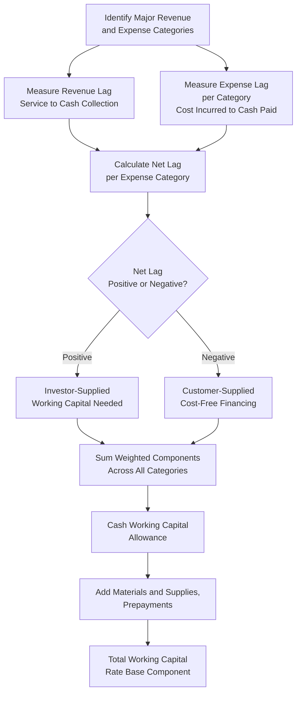

## Working Capital Allowance and Lead Lag Studies

### Definition and Purpose

The Working Capital Allowance is a rate base component representing the funds a utility must have available, on average, to bridge the timing gap between when it pays its own operating costs and when it collects corresponding revenue from customers. Unlike Plant in Service or Accumulated Depreciation, which are derived from fixed asset accounting records, the working capital allowance is typically derived from a specialized analytical exercise called a **lead-lag study**, examined in depth in this item as the concluding rate base component of this chapter.

### The Cash Flow Timing Problem

**Key Points**

- A utility incurs costs (paying employees, purchasing fuel, remitting taxes) on an ongoing basis according to its own payment cycle
- The utility collects revenue from customers according to a separate billing and collection cycle, which does not necessarily align with its expense payment cycle
- If a utility must pay its expenses before it collects the corresponding revenue, it must finance that gap using investor-supplied capital (debt or equity), which is entitled to a return, just as capital invested in plant is entitled to a return
- If, conversely, a utility collects revenue before it must pay the corresponding expenses, customers are effectively providing the utility with cost-free financing, which should reduce (or even produce a negative) working capital allowance

### The Lead-Lag Study Methodology

**Key Points**

- A lead-lag study is the standard analytical tool used to quantify the working capital allowance, examining the average number of days between the provision of service (or incurrence of a cost) and the corresponding cash receipt (or cash payment)
- The study calculates a **revenue lag** (days between service provided and cash collected from customers) and an **expense lag** (days between service/cost incurred and cash paid out by the utility) for each major category of revenue and expense
- The **net lag** (revenue lag minus expense lag, appropriately weighted) determines whether the utility needs positive working capital (investor-supplied) or has negative working capital (customer-supplied, cost-free financing)

**Revenue lag components typically measured**:

- Service period (average time between when service is rendered and when the meter is read/billing period ends)
- Billing lag (time between meter reading and bill issuance)
- Collection lag (time between bill issuance and actual cash receipt, incorporating the utility's typical payment terms and collection experience)

**Expense lag components typically measured**, calculated separately for each major expense category (labor, fuel, purchased power, taxes, interest, etc.):

- Time between when the cost is incurred (service/goods received) and when the utility actually disburses cash payment, based on the utility's actual payment practices and vendor/contractual payment terms

### Core Working Capital Formula

$$WorkingCapital = \frac{AnnualExpense}{365} \times NetLagDays$$

Where $NetLagDays$ for a given expense category equals the revenue lag minus that category's expense lag, and the calculation is typically performed separately for each expense category then summed, since different cost categories often have materially different lag characteristics.

$$NetLag_{category} = RevenueLag - ExpenseLag_{category}$$

### Worked Example

**Example**

A utility's lead-lag study determines an overall revenue lag of 45 days (the average time between service provision and cash collection from customers, incorporating billing cycle and collection experience). The study separately examines several major expense categories:

| Expense Category | Annual Amount | Expense Lag (days) | Net Lag (Revenue Lag − Expense Lag) | Working Capital Component |
| --- | --- | --- | --- | --- |
| Labor | $40,000,000 | 5 | 40 | $4,383,562 |
| Fuel/Purchased Power | $60,000,000 | 30 | 15 | $2,465,753 |
| Property Tax | $8,000,000 | 90 | -45 | -$986,301 |
| Federal Income Tax | $12,000,000 | 60 | -15 | -$493,151 |
| Other O&M | $15,000,000 | 20 | 25 | $1,027,397 |
| **Total Working Capital Allowance** |  |  |  | **$6,397,260** |

Calculation for the Labor row, illustrating the formula:

$$\frac{40{,}000{,}000}{365} \times 40 = \$4{,}383{,}562$$

Note that property tax and federal income tax categories, where the utility's payment lag (90 and 60 days respectively) substantially exceeds the 45-day revenue lag, produce a *negative* net lag — meaning the utility collects revenue from customers well before it must actually remit these taxes, functioning as a source of cost-free, customer-supplied working capital that reduces the overall working capital allowance.

### Cash Working Capital vs. Non-Cash Working Capital Items

**Key Points**

- The lead-lag study methodology described above calculates **cash working capital**, focused purely on the timing of cash flows for operating expenses
- Certain other balance sheet items are sometimes included as separate, distinct rate base working capital components rather than through lead-lag analysis, most notably **materials and supplies inventory** (operating inventory necessary for day-to-day utility functions, such as spare parts, meters awaiting installation, and maintenance supplies) and **prepayments** (amounts the utility has paid in advance for future goods or services, such as prepaid insurance)
- These non-cash-working-capital rate base items are generally valued based on average recorded balance sheet amounts during the test year, rather than through lead-lag timing analysis

### Simplified (Formula-Based) Working Capital Approaches

**Key Points**

- Full lead-lag studies are detailed, resource-intensive analyses, and some jurisdictions permit or default to simplified formula-based approaches for smaller utilities or in circumstances where a full lead-lag study is not required or has not been recently updated
- A common simplified convention is the "one-eighth of O&M expense" rule of thumb (representing an assumed average 45-day net lag, since 45/365 ≈ 1/8), though this is a rough approximation rather than a substitute for an actual lead-lag analysis where one is available or required

$$WorkingCapital_{simplified} \approx \frac{O\&M\ Expense}{8}$$

**[Inference]** Because the specific circumstances under which a simplified formula approach is permitted (versus a full lead-lag study being required) vary by jurisdiction, utility size, and commission rule, and because these thresholds and conventions are subject to change through commission rulemaking, the applicable requirement for a specific utility and jurisdiction should be confirmed against that commission's current rules of practice rather than assumed to apply universally.

### Lead-Lag Study Process Flow

### Common Points of Contention in Lead-Lag Studies

- **Sample period and data currency**: Lead-lag studies are typically based on a sample of actual billing and payment transactions during a defined period; disputes often arise over whether the sample period is sufficiently recent and representative of ongoing conditions, particularly if billing practices, payment terms, or collection performance have changed since the study was performed
- **Treatment of income taxes in the lag calculation**: Because income tax payments (particularly quarterly estimated payments) often lag revenue collection substantially, and because deferred taxes are separately addressed through the Accumulated Deferred Income Tax (ADIT) rate base deduction discussed elsewhere in this chapter, care must be taken to avoid double-counting the working capital benefit of tax payment timing both in the lead-lag study and in the ADIT calculation
- **Treatment of interest expense**: Some jurisdictions exclude interest expense from the lead-lag calculation entirely, on the theory that interest is already directly and separately compensated through the cost of debt component of the rate of return, and including it in working capital could produce a form of double recovery
- **Affiliate or centralized cash management arrangements**: For utilities that are part of a larger corporate holding company structure with centralized treasury or cash management functions, determining the utility-specific lead-lag experience (as opposed to parent-company-level cash management practices) can be a source of analytical and evidentiary dispute

### Working Capital's Place in the Rate Base Formula

As introduced in the rate base overview elsewhere in this chapter, working capital is one of several additive and subtractive components that, together with net plant, comprise total rate base:

$$RB = NetPlant + WorkingCapital + MaterialsAndSupplies - AccumulatedDeferredIncomeTaxes \pm OtherAdjustments$$

While typically smaller in magnitude than net plant, the working capital allowance can represent a material rate base component for utilities with significant fuel, purchased power, or tax payment timing characteristics, and is subject to the same general prudence and reasonableness review standards applied to other rate base components discussed throughout this chapter.

### Related Topics

- Rate Base, Expenses, and Return Components Overview
- Plant in Service and Gross Utility Plant
- Accumulated Depreciation and Net Plant
- Construction Work in Progress (CWIP)
- Allowance for Funds Used During Construction (AFUDC)
- Accumulated Deferred Income Taxes (ADIT) in Rate Base
- Materials and Supplies Inventory Valuation
- Test Year Selection: Historical, Future, and Hybrid