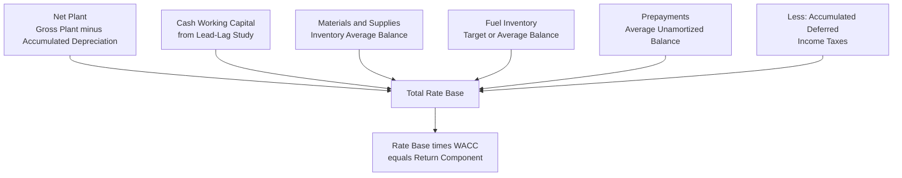

## Materials, Supplies, and Prepayments

### Definition and Purpose

Materials, Supplies, and Prepayments are secondary but recurring rate base components representing operating inventory and advance payments a utility must maintain to conduct ongoing operations. While smaller in magnitude than Net Plant, these items are conceptually similar to the Working Capital Allowance discussed elsewhere in this chapter, in that they represent investor-supplied capital tied up in the routine operation of the utility rather than in long-lived, depreciable infrastructure. This item completes the rate base component chapter by examining these balance-sheet-based additions in detail.

### Materials and Supplies Inventory

**Key Points**

- Represents the value of operating inventory a utility holds on hand to support day-to-day operations and maintenance activities, distinct from Construction Work in Progress (CWIP) inventory intended for specific capital projects
- Valued at original cost, consistent with the original cost standard applied to plant in service elsewhere in this chapter
- Typically measured using an average balance during the test year (e.g., a 13-month average of month-end balances) rather than a single point-in-time snapshot, to smooth out seasonal fluctuations in inventory levels

**Typical categories of materials and supplies inventory**:

1. **Maintenance spare parts**: Transformers, meters, relays, circuit breakers, and other components kept on hand for replacement of failed or aging equipment
2. **Line materials**: Poles, conductor, insulators, fuses, and other distribution and transmission hardware inventory
3. **Fuel inventory**: For generation utilities, on-site fuel stocks (coal piles, fuel oil, in some cases natural gas storage) necessary to ensure continuous generation availability
4. **General operating supplies**: Vehicle parts, tools, safety equipment, and other consumable operational supplies
5. **Meters awaiting installation**: New or refurbished meters held in inventory pending deployment to customer premises

**Example**

A utility's month-end materials and supplies balances over a 13-month period (December of the prior year through December of the test year) average $14.2 million, reflecting normal seasonal fluctuation as maintenance crews draw down and replenish inventory throughout the year. This 13-month average, rather than the test-year-end balance alone, is included in rate base as the utility's ongoing materials and supplies component.

$$MaterialsAndSupplies_{RateBase} = \frac{1}{13}\sum_{i=1}^{13} MonthEndBalance_i$$

### Fuel Inventory as a Distinct Sub-Category

**Key Points**

- Fuel inventory (particularly coal and, in some jurisdictions, fuel oil reserves) is often analyzed separately from general materials and supplies, given its potentially larger dollar magnitude and its direct relationship to generation reliability planning
- Utilities and commissions frequently establish or review a target inventory level (e.g., a target number of days' burn supply for coal-fired generation) as the basis for the rate base allowance, rather than relying solely on the historical average balance, particularly where fuel procurement strategy or generation fleet composition has changed
- Excessive fuel inventory beyond a reasonable operational reserve may be challenged as imprudent or unnecessary, since it ties up ratepayer-supported capital without a corresponding operational benefit

**Example**

A coal-fired utility maintains a target coal inventory equivalent to 45 days of burn at expected generation output, based on supply chain reliability considerations (rail delivery risk, historical strike or weather-related delivery disruption). If the utility's test year average inventory reflects 70 days of burn due to a temporary reduction in generation output, a commission or intervenor may scrutinize whether the excess inventory above the established 45-day target should be excluded from rate base as not reasonably necessary for operations.

### Prepayments

**Key Points**

- Prepayments represent amounts the utility has paid in advance of receiving the corresponding goods or services, and are included in rate base because they represent investor-supplied capital advanced before the corresponding benefit is realized, analogous in principle (though opposite in direction) to the deferred tax and lag concepts discussed in the working capital item elsewhere in this chapter
- Common prepayment categories include prepaid insurance premiums, prepaid rent or lease payments, prepaid maintenance contracts, and prepaid property taxes in jurisdictions where tax payment timing precedes the corresponding service period

**Example**

A utility pays its annual general liability and property insurance premiums, totaling $3.6 million, in a lump sum at the start of its policy year rather than in monthly installments. At any point during that policy year, a portion of that payment represents coverage for future months not yet elapsed — this unamortized prepaid balance, averaged over the test year, is included in rate base as a prepayment, reflecting the capital the utility has advanced ahead of receiving the full benefit of the insurance coverage period.

$$PrepaidBalance_t = TotalPrepayment \times \frac{RemainingCoverageMonths}{TotalCoverageMonths}$$

### Interaction with the Lead-Lag Study

**Key Points**

- Materials, supplies, and prepayments are generally treated as separate, distinct rate base additions valued at average recorded balance, rather than being folded into the cash working capital calculation derived from the lead-lag study discussed in the preceding item
- Care must be taken to avoid double-counting: if a lead-lag study's expense lag calculation for a particular cost category already incorporates the effect of advance payment timing (as may occur with certain prepaid categories), including that same item separately as a prepayment rate base addition could overstate the total working-capital-related rate base

**[Inference]** Because the specific boundary between what is captured through lead-lag cash working capital analysis versus treated as a separate prepayment or inventory rate base addition can differ based on a given utility's accounting practices and a commission's established methodology, the correct categorization for a specific cost item should be confirmed against that utility's approved cost of service study methodology rather than assumed to follow a single universal convention.

### Rate Base Component Assembly

### Prudence and Reasonableness Review

As with other rate base components discussed throughout this chapter, materials, supplies, and prepayment balances are subject to prudence and reasonableness review rather than automatic inclusion at whatever balance the utility happens to record. Common review considerations include:

- Whether inventory levels are consistent with the utility's own internal inventory management policies and historical practice, or reflect an unexplained recent increase
- Whether a specific inventory category (such as fuel stock) is maintained at a level demonstrably tied to an operational or reliability justification, rather than at an arbitrary or excessive level
- Whether obsolete or unusable inventory (e.g., spare parts for retired equipment no longer in service) remains improperly included in the rate base balance
- Whether prepayment balances reflect ordinary, recurring business practices rather than an unusual advance payment arrangement that shifts working capital burden onto ratepayers without operational justification

### Materials, Supplies, and Prepayments' Place in the Broader Rate Base Framework

Taken together with Net Plant (covered in the plant-in-service and accumulated depreciation items), Construction Work in Progress and AFUDC (covered in the preceding items), and the Working Capital Allowance derived from lead-lag analysis (covered in the immediately preceding item), Materials, Supplies, and Prepayments complete the standard set of rate base components introduced in this chapter's overview:

$$RB = NetPlant + CWIP_{(if\ included)} + WorkingCapital + MaterialsAndSupplies + Prepayments - AccumulatedDeferredIncomeTaxes \pm OtherAdjustments$$

Each component reflects a distinct category of investor-supplied capital devoted to utility operations, and each is independently subject to the original cost, used-and-useful, and prudence standards examined throughout this chapter, before the composite rate base figure is carried forward into the overall revenue requirement calculation.

### Related Topics

- Rate Base, Expenses, and Return Components Overview
- Plant in Service and Gross Utility Plant
- Accumulated Depreciation and Net Plant
- Construction Work in Progress (CWIP)
- Allowance for Funds Used During Construction (AFUDC)
- Working Capital Allowance and Lead-Lag Studies
- Accumulated Deferred Income Taxes (ADIT) in Rate Base
- Prudence Review and Disallowance Standards